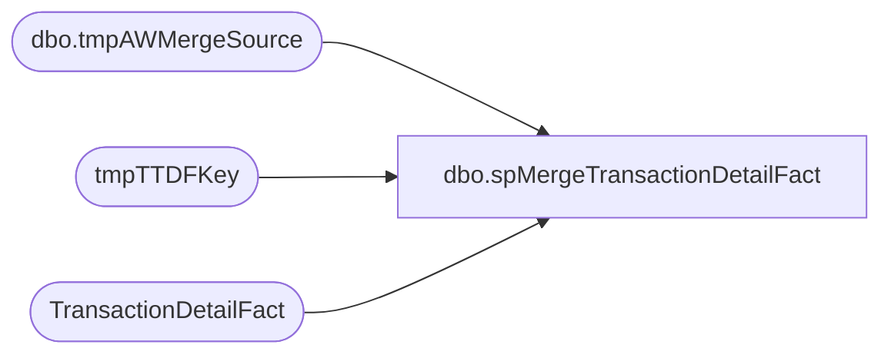

# dbo.spMergeTransactionDetailFact

**Database:** dw  
**Server:** papamart  

## Architecture Diagram



## Table Dependencies

| Referenced Table |
|---|
| dbo.tmpAWMergeSource |
| tmpTTDFKey |
| TransactionDetailFact |

## Stored Procedure Code

```sql
CREATE proc [dbo].[spMergeTransactionDetailFact]
@DaysToGoBack int--not used presently

--============================================================================================================================================================
--	Dan Tweedie 2021-02-22 Create proc to a keep new TransactionDetailFact table in sync with transaction_detail_facts, holds data only from 2018 to present
--							Piggybacks off dwstaging..spMergeTransaction_Detail_Facts
--============================================================================================================================================================

as

set nocount on


--Data is already staged in dwstaging.dbo.tmpAWMergeSource from spMergeTransaction_Detail_Facts
--so we skip that step and get right to the delete and merge

---=========================
-- BEGIN DELETE PROCEDURE --
---=========================
--stage the tdf_key for transactions in DW that are within the same date range as the merge source, but transactions are not in the merge source
--these transactions will be deleted from TransactionDetailFact
IF (Object_ID('dw..tmpTTDFKey') IS NOT NULL) DROP TABLE tmpTTDFKey;
with MinDate as
	(
		select --:
			min(date_key) MinDate,
			max(date_key) MaxDate
		from dwstaging.dbo.tmpAWMergeSource
	)
select tdf.tdf_key --:08 -- 0 rows -- this is good, but it is possible that transactions are removed from sales audit so we will removed from dw..
into tmpTTDFKey
from MinDate md 
join TransactionDetailFact tdf with (nolock) on tdf.date_key between md.MinDate and md.MaxDate
left join dwstaging.dbo.tmpAWMergeSource ms on
	tdf.transaction_id=ms.transaction_id
	and
	tdf.transaction_line_seq=ms.transaction_line_seq
where ms.transaction_id is null
group by tdf.tdf_key

--if there are transaction in TransactionDetailFact which are not in the stage data, but are for the same date range, delete from TransactionDetailFact
if (select count(*) from tmpTTDFKey) > 0
begin
	delete tdf
	from TransactionDetailFact tdf
	join tmpTTDFKey tdfk on tdf.tdf_key=tdfk.tdf_key
end
---=========================
-- END DELETE PROCEDURE --
---=========================
;
---======================================
-- BEGIN MERGE FOR INSERTS AND UPDATES --
---======================================
merge into TransactionDetailFact as target
using dwstaging.dbo.tmpAWMergeSource as source
on
	target.transaction_id=source.transaction_id
	and
	target.transaction_line_seq=source.transaction_line_seq
when matched 
	--and 
	--(
	--	isnull(target.store_key,0)<>isnull(source.store_key,0) or					
	--	isnull(target.date_key,0)<>isnull(source.date_key,0) or
	--	isnull(target.time_key,0)<>isnull(source.time_key,0) or
	--	isnull(target.product_key,0)<>isnull(source.product_key,0) or
	--	isnull(target.line_object_key,0)<>isnull(source.line_object_key,0) or
	--	isnull(target.unit_gross_amount,0)<>isnull(source.unit_gross_amount,0) or
	--	isnull(target.unit_disc_amount,0)<>isnull(source.unit_disc_amount,0) or
	--	isnull(target.vat_tax_amount,0)<>isnull(source.vat_tax_amount,0) or
	--	isnull(target.units,0)<>isnull(source.units,0) or
	--	isnull(target.currency_key,0)<>isnull(source.currency_key,0) or
	--	isnull(target.register_num,0)<>isnull(source.register_num,0) or
	--	isnull(target.party_y_n,0)<>isnull(source.party_y_n,0) or
	--	isnull(target.transaction_type_key,0)<>isnull(source.transaction_type_key,0) or
	--	isnull(target.transaction_no,0)<>isnull(source.transaction_no,0) or
	--	isnull(target.reference_no,0)<>isnull(source.reference_no,0) or
	--	isnull(target.upsell_disc_allocated,0)<>isnull(source.upsell_disc_allocated,0) or
	--	isnull(target.cashier_id,0)<>isnull(source.cashier_id,0) or
	--	isnull(target.ext_cost,0)<>isnull(source.ext_cost,0) or
	--	isnull(target.line_action_key,0)<>isnull(source.line_action_key,0)
	--)
then update
	set
		target.store_key=source.store_key,					
		target.date_key=source.date_key,
		target.time_key=source.time_key,
		target.product_key=source.product_key,
		target.line_object_key=source.line_object_key,
		target.unit_gross_amount=source.unit_gross_amount,
		target.unit_disc_amount=source.unit_disc_amount,
		target.vat_tax_amount=source.vat_tax_amount,
		target.units=source.units,
		target.currency_key=source.currency_key,
		target.register_num=source.register_num,
		target.party_y_n=source.party_y_n,
		target.transaction_type_key=source.transaction_type_key,
		target.transaction_no=source.transaction_no,
		target.reference_no=source.reference_no,
		target.upsell_disc_allocated=source.upsell_disc_allocated,
		target.cashier_id=source.cashier_id,
		target.ext_cost=source.ext_cost,
		target.line_action_key=source.line_action_key,
		target.updt_dt=getdate()
when not matched by target
then insert
	(
		transaction_id,
		transaction_line_seq,
		store_key,
		date_key,
		time_key,
		product_key,
		line_object_key,
		unit_gross_amount,
		unit_disc_amount,
		vat_tax_amount,
		units,
		currency_key,
		register_num,
		party_y_n,
		transaction_type_key,
		transaction_no,
		reference_no,
		upsell_disc_allocated,
		cashier_id,
		ext_cost,
		line_action_key,
		ins_dt
	)
values
	(
		source.transaction_id,
		source.transaction_line_seq,
		source.store_key,
		source.date_key,
		source.time_key,
		source.product_key,
		source.line_object_key,
		source.unit_gross_amount,
		source.unit_disc_amount,
		source.vat_tax_amount,
		source.units,
		source.currency_key,
		source.register_num,
		source.party_y_n,
		source.transaction_type_key,
		source.transaction_no,
		source.reference_no,
		source.upsell_disc_allocated,
		source.cashier_id,
		source.ext_cost,
		source.line_action_key,
		getdate()
	)
;
---======================================
-- END MERGE FOR INSERTS AND UPDATES --
---======================================
```

