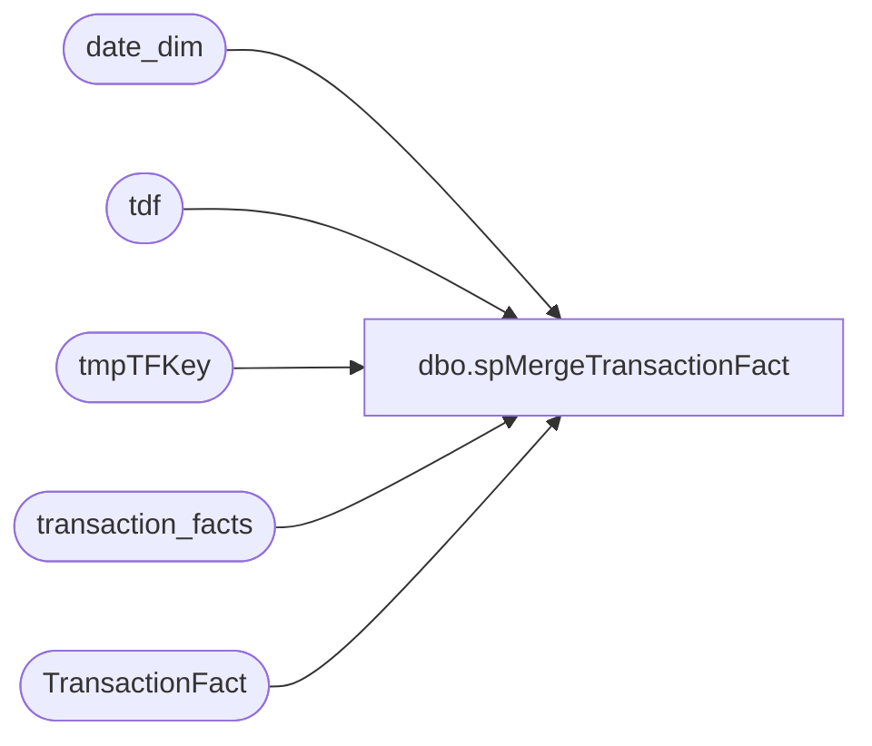

# dbo.spMergeTransactionFact

**Database:** dw  
**Server:** papamart  

## Architecture Diagram



## Table Dependencies

| Referenced Table |
|---|
| date_dim |
| tdf |
| tmpTFKey |
| transaction_facts |
| TransactionFact |

## Stored Procedure Code

```sql
CREATE proc [dbo].[spMergeTransactionFact] 
@DaysToGoBack int

--===============================================================================================================================================
--	Dan Tweedie 2021-02-22 Create proc to a keep new TransactionFact table in sync with transaction_facts, holds data only from 2018 to present--
--===============================================================================================================================================

as

set nocount on

IF (Object_ID('tempdb..#TFStage') IS NOT NULL) DROP TABLE #TFStage;
with MinDate as
	(
		select --:
			min(date_key) MinDate,
			max(date_key) MaxDate
		from date_dim
		where actual_date between getdate()-@DaysToGoBack and getdate()
	) 
select tf.*
into #TFStage
from transaction_facts tf with (nolock)
join MinDate md on tf.date_key between md.MinDate and md.MaxDate


---=========================
-- BEGIN DELETE PROCEDURE --
---=========================
--stage the tdf_key for transactions in DW that are within the same date range as the merge source, but transactions are not in the merge source
--these transactions will be deleted from TransactionDetailFact
IF (Object_ID('dw..tmpTFKey') IS NOT NULL) DROP TABLE tmpTFKey;
with MinDate as
	(
		select --:
			min(date_key) MinDate,
			max(date_key) MaxDate
		from date_dim
		where actual_date between getdate()-@DaysToGoBack and getdate()
	) 
select tdf.transaction_id
into tmpTFKey
from MinDate md 
join TransactionFact tdf with (nolock) on tdf.date_key between md.MinDate and md.MaxDate
left join #TFStage ms on
	tdf.transaction_id=ms.transaction_id
where ms.transaction_id is null
group by tdf.transaction_id

--if there are transaction in TransactionDetailFact which are not in the stage data, but are for the same date range, delete from TransactionDetailFact
if (select count(*) from tmpTFKey) > 0
begin
	delete tdf
	from TransactionFact tdf
	join tmpTFKey tdfk on tdf.transaction_id=tdfk.transaction_id
end
---=========================
-- END DELETE PROCEDURE --
---=========================
;

merge into TransactionFact as target
using #TFStage as source 
	on target.transaction_id=source.transaction_id
when matched 
	then update
		set
			target.store_key=source.store_key,
			target.date_key=source.date_key,
			target.time_key=source.time_key,
			target.transaction_type_key=source.transaction_type_key,
			target.currency_key=source.currency_key,
			target.transaction_key=source.transaction_key,
			target.transaction_no=source.transaction_no,
			target.register_no=source.register_no,
			target.line_count=source.line_count,
			target.party_flag=source.party_flag,
			target.GAAP_transaction_flag=source.GAAP_transaction_flag,
			target.donation_only_flag=source.donation_only_flag,
			target.giftcard_only_flag=source.giftcard_only_flag,
			target.party_deposit_only_flag=source.party_deposit_only_flag,
			target.GAAP_sales_amount=source.GAAP_sales_amount,
			target.net_sales_amount=source.net_sales_amount,
			target.total_units=source.total_units,
			target.unit_net_amount=source.unit_net_amount,
			target.unit_gross_amount=source.unit_gross_amount,
			target.reward_certificate_amount=source.reward_certificate_amount,
			target.buy_stuff_amount=source.buy_stuff_amount,
			target.tax_amount=source.tax_amount,
			target.redemption_amount=source.redemption_amount,
			target.unit_discount_amount=source.unit_discount_amount,
			target.coupon_discount_amount=source.coupon_discount_amount,
			target.coupon_discount_units=source.coupon_discount_units,
			target.giftcard_discount_amount=source.giftcard_discount_amount,
			target.total_discount_amount=source.total_discount_amount,
			target.receipt_total_amount=source.receipt_total_amount,
			target.merchandise_UGA=source.merchandise_UGA,
			target.merchandise_units=source.merchandise_units,
			target.donations_UGA=source.donations_UGA,
			target.donations_units=source.donations_units,
			target.party_deposit_UGA=source.party_deposit_UGA,
			target.party_deposit_units=source.party_deposit_units,
			target.giftcard_UGA=source.giftcard_UGA,
			target.giftcard_units=source.giftcard_units,
			target.animal_UGA=source.animal_UGA,
			target.animal_units=source.animal_units,
			target.non_animal_UGA=source.non_animal_UGA,
			target.non_animal_units=source.non_animal_units,
			target.footwear_UGA=source.footwear_UGA,
			target.footwear_units=source.footwear_units,
			target.accessories_UGA=source.accessories_UGA,
			target.accessories_units=source.accessories_units,
			target.sounds_UGA=source.sounds_UGA,
			target.sounds_units=source.sounds_units,
			target.clothing_UGA=source.clothing_UGA,
			target.clothing_units=source.clothing_units,
			target.other_UGA=source.other_UGA,
			target.other_units=source.other_units,
			target.shipping_UGA=source.shipping_UGA,
			target.shipping_units=source.shipping_units,
			target.other_fees_UGA=source.other_fees_UGA,
			target.other_fees_units=source.other_fees_units,
			target.cub_cash_UGA=source.cub_cash_UGA,
			target.cub_cash_units=source.cub_cash_units,
			target.paid_outs_UGA=source.paid_outs_UGA,
			target.paid_outs_units=source.paid_outs_units,
			target.stuffing_supplies_UGA=source.stuffing_supplies_UGA,
			target.stuffing_supplies_units=source.stuffing_supplies_units,
			target.sports_UGA=source.sports_UGA,
			target.sports_units=source.sports_units,
			target.prestuffed_UGA=source.prestuffed_UGA,
			target.prestuffed_units=source.prestuffed_units,
			target.fin_GAAP_sales_amount=source.fin_GAAP_sales_amount,
			target.upsell_discount_amount=source.upsell_discount_amount,
			target.cashier_key=source.cashier_key,
			target.merchandise_cost=source.merchandise_cost,
			target.animal_cost=source.animal_cost,
			target.non_animal_cost=source.non_animal_cost,
			target.footwear_cost=source.footwear_cost,
			target.accessories_cost=source.accessories_cost,
			target.sounds_cost=source.sounds_cost,
			target.clothing_cost=source.clothing_cost,
			target.other_cost=source.other_cost,
			target.sports_cost=source.sports_cost,
			target.prestuffed_cost=source.prestuffed_cost,
			target.Scents_UGA=source.Scents_UGA,
			target.Scents_units=source.Scents_units,
			target.Scents_cost=source.Scents_cost,
			target.Store_transaction_flag=source.Store_transaction_flag,
			target.Store_Sales_Amount=source.Store_Sales_Amount,
			target.Store_Units=source.Store_Units,
			target.fin_Store_Sales_Amount=source.fin_Store_Sales_Amount,
			target.Enterprise_Selling_Amount=source.Enterprise_Selling_Amount,
			target.Enterprise_Selling_Only_Flag=source.Enterprise_Selling_Only_Flag,
			target.Gaap_Units=source.Gaap_Units,
			target.Enterprise_Selling_Units=source.Enterprise_Selling_Units,
			target.party_master=source.party_master,
			target.EmployeeDiscountUGA=source.EmployeeDiscountUGA,
			target.ReturnUGA=source.ReturnUGA,
			target.ReturnUnits=source.ReturnUnits,
			target.party_key=source.party_key,
			target.isShipFromStore=source.isShipFromStore,
			target.isPickupFromStore=source.isPickupFromStore,
			target.isCurbside=source.isCurbside,
			target.isSameDayShipt=source.isSameDayShipt,
			target.webOrderNumber=source.webOrderNumber
when not matched by target
	then insert
		(
			transaction_id,	
			store_key,	
			date_key,	
			time_key,	
			transaction_type_key,	
			currency_key,	
			transaction_key,	
			transaction_no,	
			register_no,	
			line_count,	
			party_flag,	
			GAAP_transaction_flag,	
			donation_only_flag,	
			giftcard_only_flag,	
			party_deposit_only_flag,	
			GAAP_sales_amount,	
			net_sales_amount,	
			total_units,	
			unit_net_amount,
			unit_gross_amount,	
			reward_certificate_amount,	
			buy_stuff_amount,	
			tax_amount,	
			redemption_amount,	
			unit_discount_amount,	
			coupon_discount_amount,	
			coupon_discount_units,	
			giftcard_discount_amount,	
			total_discount_amount,	
			receipt_total_amount,	
			merchandise_UGA,	
			merchandise_units,	
			donations_UGA,	
			donations_units,	
			party_deposit_UGA,	
			party_deposit_units,	
			giftcard_UGA,	
			giftcard_units,	
			animal_UGA,	
			animal_units,	
			non_animal_UGA,	
			non_animal_units,	
			footwear_UGA,	
			footwear_units,	
			accessories_UGA,	
			accessories_units,	
			sounds_UGA,	
			sounds_units,	
			clothing_UGA,	
			clothing_units,	
			other_UGA,	
			other_units,	
			shipping_UGA,	
			shipping_units,	
			other_fees_UGA,	
			other_fees_units,	
			cub_cash_UGA,	
			cub_cash_units,	
			paid_outs_UGA,	
			paid_outs_units,	
			stuffing_supplies_UGA,	
			stuffing_supplies_units,	
			sports_UGA,	
			sports_units,	
			prestuffed_UGA,	
			prestuffed_units,	
			fin_GAAP_sales_amount,	
			upsell_discount_amount,	
			cashier_key,	
			merchandise_cost,	
			animal_cost,	
			non_animal_cost,	
			footwear_cost,	
			accessories_cost,	
			sounds_cost,	
			clothing_cost,	
			other_cost,	
			sports_cost,	
			prestuffed_cost,	
			Scents_UGA,	
			Scents_units,	
			Scents_cost,	
			Store_transaction_flag,	
			Store_Sales_Amount,	
			Store_Units,	
			fin_Store_Sales_Amount,	
			Enterprise_Selling_Amount,	
			Enterprise_Selling_Only_Flag,	
			Gaap_Units,	
			Enterprise_Selling_Units,	
			party_master,	
			EmployeeDiscountUGA,	
			ReturnUGA,	
			ReturnUnits,	
			party_key,	
			isShipFromStore,	
			isPickupFromStore,	
			isCurbside,	
			isSameDayShipt,	
			webOrderNumber
		)
	values
		(
			source.transaction_id,	
			source.store_key,	
			source.date_key,	
			source.time_key,	
			source.transaction_type_key,	
			source.currency_key,	
			source.transaction_key,	
			source.transaction_no,	
			source.register_no,	
			source.line_count,	
			source.party_flag,	
			source.GAAP_transaction_flag,	
			source.donation_only_flag,	
			source.giftcard_only_flag,	
			source.party_deposit_only_flag,	
			source.GAAP_sales_amount,	
			source.net_sales_amount,	
			source.total_units,	
			source.unit_net_amount,
			source.unit_gross_amount,	
			source.reward_certificate_amount,	
			source.buy_stuff_amount,	
			source.tax_amount,	
			source.redemption_amount,	
			source.unit_discount_amount,	
			source.coupon_discount_amount,	
			source.coupon_discount_units,	
			source.giftcard_discount_amount,	
			source.total_discount_amount,	
			source.receipt_total_amount,	
			source.merchandise_UGA,	
			source.merchandise_units,	
			source.donations_UGA,	
			source.donations_units,	
			source.party_deposit_UGA,	
			source.party_deposit_units,	
			source.giftcard_UGA,	
			source.giftcard_units,	
			source.animal_UGA,	
			source.animal_units,	
			source.non_animal_UGA,	
			source.non_animal_units,	
			source.footwear_UGA,	
			source.footwear_units,	
			source.accessories_UGA,	
			source.accessories_units,	
			source.sounds_UGA,	
			source.sounds_units,	
			source.clothing_UGA,	
			source.clothing_units,	
			source.other_UGA,	
			source.other_units,	
			source.shipping_UGA,	
			source.shipping_units,	
			source.other_fees_UGA,	
			source.other_fees_units,	
			source.cub_cash_UGA,	
			source.cub_cash_units,	
			source.paid_outs_UGA,	
			source.paid_outs_units,	
			source.stuffing_supplies_UGA,	
			source.stuffing_supplies_units,	
			source.sports_UGA,	
			source.sports_units,	
			source.prestuffed_UGA,	
			source.prestuffed_units,	
			source.fin_GAAP_sales_amount,	
			source.upsell_discount_amount,	
			source.cashier_key,	
			source.merchandise_cost,	
			source.animal_cost,	
			source.non_animal_cost,	
			source.footwear_cost,	
			source.accessories_cost,	
			source.sounds_cost,	
			source.clothing_cost,	
			source.other_cost,	
			source.sports_cost,	
			source.prestuffed_cost,	
			source.Scents_UGA,	
			source.Scents_units,	
			source.Scents_cost,	
			source.Store_transaction_flag,	
			source.Store_Sales_Amount,	
			source.Store_Units,	
			source.fin_Store_Sales_Amount,	
			source.Enterprise_Selling_Amount,	
			source.Enterprise_Selling_Only_Flag,	
			source.Gaap_Units,	
			source.Enterprise_Selling_Units,	
			source.party_master,	
			source.EmployeeDiscountUGA,	
			source.ReturnUGA,	
			source.ReturnUnits,	
			source.party_key,	
			source.isShipFromStore,	
			source.isPickupFromStore,	
			source.isCurbside,	
			source.isSameDayShipt,	
			source.webOrderNumber
		)
;

/*
declare 
	@MinDate int,
	@MaxDate int

select	
	@MinDate=min(date_key),
	@MaxDate=max(date_key)
from date_dim 
where cast(actual_date as date) between cast(getdate()-@DaysToGoBack as date) and cast(getdate() as date)

delete from TransactionFact
where date_key between @MinDate and @MaxDate

if (object_id('tempdb..#Stage') is not null) drop table #Stage
select *
into #Stage
from transaction_facts t with (nolock)
where date_key = @MinDate

select @MinDate=@MinDate+1

while @MinDate<@MaxDate
begin ---I FOUND IT MUCH FASTER TO LOOP BY DAY THAN TO INSERT WHERE DATE_KEY>= @MinDate (25 SECONDS VS 10+ MINUTES)
	insert #Stage
	select *
	from transaction_facts
	where date_key = @MinDate

	select @MinDate=@MinDate+1

	if @MinDate=@MaxDate
		break
	else
		continue
end

Insert TransactionFact
select * from #Stage

*/
```

