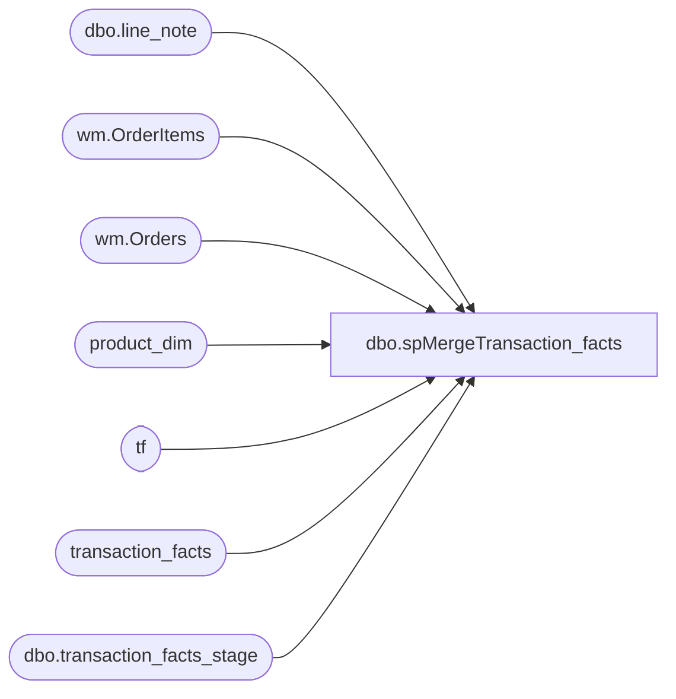

# dbo.spMergeTransaction_facts

**Database:** dw  
**Server:** papamart  

## Architecture Diagram



## Table Dependencies

| Referenced Table |
|---|
| dbo.line_note |
| wm.OrderItems |
| wm.Orders |
| product_dim |
| tf |
| transaction_facts |
| dbo.transaction_facts_stage |

## Stored Procedure Code

```sql
CREATE proc [dbo].[spMergeTransaction_facts]


--=================================================================================================================================================
--	Dan Tweedie	2021-10-05	Created proc to break from spDW_Build_Transaction_Facts, which stages the data to dwStaging..transaction_facts_stage
--==================================================================================================================================================
as 

set nocount on

; --deletes are already handled in proc spAWImport_150_Delete_OldTransactions
Merge into transaction_facts as target
using dwstaging.dbo.transaction_facts_stage as source
on 
	target.transaction_id=source.transaction_id
when not matched by target
then 
	INSERT 
		(	
			transaction_id,
			store_key,
			date_key,
			time_key,
			transaction_type_key,
			currency_key,
			transaction_key,
			transaction_no,
			register_no,
			line_count,
			Party_Flag,
			GAAP_transaction_flag,
			Store_transaction_flag,
			Enterprise_selling_only_flag,
			donation_only_flag,
			giftcard_only_flag,
			party_deposit_only_flag,
			GAAP_sales_amount,
			Store_sales_amount,
			Enterprise_selling_amount,	
			net_sales_amount,
			total_units,
			unit_net_amount,
			unit_gross_amount,
			reward_certificate_amount,
			buy_stuff_amount,
			tax_amount,
			redemption_amount,
			unit_discount_amount,
			coupon_discount_amount,
			coupon_discount_units,
			giftcard_discount_amount,
			total_discount_amount,
			receipt_total_amount,
			Merchandise_UGA,
			merchandise_units,
			Store_units,
			Gaap_units,
			Enterprise_selling_units,
			Donations_UGA,
			donations_units,
			Party_Deposit_UGA,
			party_deposit_units,
			giftcard_UGA,
			giftcard_units,
			animal_UGA,
			animal_units,
			non_animal_UGA,
			non_animal_units,
			Footwear_UGA,
			footwear_units,
			accessories_UGA,
			accessories_units,
			sounds_UGA,
			sounds_units,
			Scents_UGA,
			Scents_units,
			Clothing_UGA,
			clothing_units,
			Other_UGA,
			other_units,
			Shipping_UGA,
			shipping_units,
			Other_Fees_UGA,
			other_fees_units,
			Cub_Cash_UGA,
			cub_cash_units,
			paid_outs_UGA,
			paid_outs_units,
			stuffing_supplies_UGA,
			stuffing_supplies_units,
			sports_UGA,
			sports_units,
			Prestuffed_UGA,
			prestuffed_units,
			upsell_discount_amount,	
			fin_GAAP_sales_amount,
			fin_Store_Sales_amount,		
			cashier_key,
			merchandise_cost,
			animal_cost,
			non_animal_cost,
			footwear_cost,
			accessories_cost,
			sounds_cost,
			Scents_cost,
			clothing_cost,
			other_cost,
			sports_cost,
			prestuffed_cost,
			party_master,
			EmployeeDiscountUGA,
			ReturnUGA,
			ReturnUnits,
			party_key,
			WebOrderNumber,
			isPickupFromStore,
			isShipfromStore,
			isCurbside,
			isSameDayShipt
		)
	values
		(	
			source.transaction_id,
			source.store_key,
			source.date_key,
			source.time_key,
			source.transaction_type_key,
			source.currency_key,
			source.transaction_key,
			source.transaction_no,
			source.register_no,
			source.line_count,
			source.Party_Flag,
			source.GAAP_transaction_flag,
			source.Store_transaction_flag,
			source.Enterprise_selling_only_flag,
			source.donation_only_flag,
			source.giftcard_only_flag,
			source.party_deposit_only_flag,
			source.GAAP_sales_amount,
			source.Store_sales_amount,
			source.Enterprise_selling_amount,	
			source.net_sales_amount,
			source.total_units,
			source.unit_net_amount,
			source.unit_gross_amount,
			source.reward_certificate_amount,
			source.buy_stuff_amount,
			source.tax_amount,
			source.redemption_amount,
			source.unit_discount_amount,
			source.coupon_discount_amount,
			source.coupon_discount_units,
			source.giftcard_discount_amount,
			source.total_discount_amount,
			source.receipt_total_amount,
			source.Merchandise_UGA,
			source.merchandise_units,
			source.Store_units,
			source.Gaap_units,
			source.Enterprise_selling_units,
			source.Donations_UGA,
			source.donations_units,
			source.Party_Deposit_UGA,
			source.party_deposit_units,
			source.giftcard_UGA,
			source.giftcard_units,
			source.animal_UGA,
			source.animal_units,
			source.non_animal_UGA,
			source.non_animal_units,
			source.Footwear_UGA,
			source.footwear_units,
			source.accessories_UGA,
			source.accessories_units,
			source.sounds_UGA,
			source.sounds_units,
			source.Scents_UGA,
			source.Scents_units,
			source.Clothing_UGA,
			source.clothing_units,
			source.Other_UGA,
			source.other_units,
			source.Shipping_UGA,
			source.shipping_units,
			source.Other_Fees_UGA,
			source.other_fees_units,
			source.Cub_Cash_UGA,
			source.cub_cash_units,
			source.paid_outs_UGA,
			source.paid_outs_units,
			source.stuffing_supplies_UGA,
			source.stuffing_supplies_units,
			source.sports_UGA,
			source.sports_units,
			source.Prestuffed_UGA,
			source.prestuffed_units,
			source.upsell_discount_amount,	
			source.fin_GAAP_sales_amount,
			source.fin_Store_Sales_amount,		
			source.cashier_key,
			source.merchandise_cost,
			source.animal_cost,
			source.non_animal_cost,
			source.footwear_cost,
			source.accessories_cost,
			source.sounds_cost,
			source.Scents_cost,
			source.clothing_cost,
			source.other_cost,
			source.sports_cost,
			source.prestuffed_cost,
			source.party_master,
			source.EmployeeDiscountUGA,
			source.ReturnUGA,
			source.ReturnUnits,
			source.party_key,
			source.WebOrderNumber,
			source.isPickupFromStore,
			source.isShipfromStore,
			source.isCurbside,
			source.isSameDayShipt
		)
when matched 
	then update
		set
			target.store_key=source.store_key,
			target.date_key=source.date_key,
			target.time_key=source.time_key,
			target.transaction_type_key=source.transaction_type_key,
			target.currency_key=source.currency_key,
			target.transaction_key=source.transaction_key,
			target.transaction_no=source.transaction_no,
			target.register_no=source.register_no,
			target.line_count=source.line_count,
			target.party_flag=source.party_flag,
			target.GAAP_transaction_flag=source.GAAP_transaction_flag,
			target.donation_only_flag=source.donation_only_flag,
			target.giftcard_only_flag=source.giftcard_only_flag,
			target.party_deposit_only_flag=source.party_deposit_only_flag,
			target.GAAP_sales_amount=source.GAAP_sales_amount,
			target.net_sales_amount=source.net_sales_amount,
			target.total_units=source.total_units,
			target.unit_net_amount=source.unit_net_amount,
			target.unit_gross_amount=source.unit_gross_amount,
			target.reward_certificate_amount=source.reward_certificate_amount,
			target.buy_stuff_amount=source.buy_stuff_amount,
			target.tax_amount=source.tax_amount,
			target.redemption_amount=source.redemption_amount,
			target.unit_discount_amount=source.unit_discount_amount,
			target.coupon_discount_amount=source.coupon_discount_amount,
			target.coupon_discount_units=source.coupon_discount_units,
			target.giftcard_discount_amount=source.giftcard_discount_amount,
			target.total_discount_amount=source.total_discount_amount,
			target.receipt_total_amount=source.receipt_total_amount,
			target.merchandise_UGA=source.merchandise_UGA,
			target.merchandise_units=source.merchandise_units,
			target.donations_UGA=source.donations_UGA,
			target.donations_units=source.donations_units,
			target.party_deposit_UGA=source.party_deposit_UGA,
			target.party_deposit_units=source.party_deposit_units,
			target.giftcard_UGA=source.giftcard_UGA,
			target.giftcard_units=source.giftcard_units,
			target.animal_UGA=source.animal_UGA,
			target.animal_units=source.animal_units,
			target.non_animal_UGA=source.non_animal_UGA,
			target.non_animal_units=source.non_animal_units,
			target.footwear_UGA=source.footwear_UGA,
			target.footwear_units=source.footwear_units,
			target.accessories_UGA=source.accessories_UGA,
			target.accessories_units=source.accessories_units,
			target.sounds_UGA=source.sounds_UGA,
			target.sounds_units=source.sounds_units,
			target.clothing_UGA=source.clothing_UGA,
			target.clothing_units=source.clothing_units,
			target.other_UGA=source.other_UGA,
			target.other_units=source.other_units,
			target.shipping_UGA=source.shipping_UGA,
			target.shipping_units=source.shipping_units,
			target.other_fees_UGA=source.other_fees_UGA,
			target.other_fees_units=source.other_fees_units,
			target.cub_cash_UGA=source.cub_cash_UGA,
			target.cub_cash_units=source.cub_cash_units,
			target.paid_outs_UGA=source.paid_outs_UGA,
			target.paid_outs_units=source.paid_outs_units,
			target.stuffing_supplies_UGA=source.stuffing_supplies_UGA,
			target.stuffing_supplies_units=source.stuffing_supplies_units,
			target.sports_UGA=source.sports_UGA,
			target.sports_units=source.sports_units,
			target.prestuffed_UGA=source.prestuffed_UGA,
			target.prestuffed_units=source.prestuffed_units,
			target.fin_GAAP_sales_amount=source.fin_GAAP_sales_amount,
			target.upsell_discount_amount=source.upsell_discount_amount,
			target.cashier_key=source.cashier_key,
			target.merchandise_cost=source.merchandise_cost,
			target.animal_cost=source.animal_cost,
			target.non_animal_cost=source.non_animal_cost,
			target.footwear_cost=source.footwear_cost,
			target.accessories_cost=source.accessories_cost,
			target.sounds_cost=source.sounds_cost,
			target.clothing_cost=source.clothing_cost,
			target.other_cost=source.other_cost,
			target.sports_cost=source.sports_cost,
			target.prestuffed_cost=source.prestuffed_cost,
			target.Scents_UGA=source.Scents_UGA,
			target.Scents_units=source.Scents_units,
			target.Scents_cost=source.Scents_cost,
			target.Store_transaction_flag=source.Store_transaction_flag,
			target.Store_Sales_Amount=source.Store_Sales_Amount,
			target.Store_Units=source.Store_Units,
			target.fin_Store_Sales_Amount=source.fin_Store_Sales_Amount,
			target.Enterprise_Selling_Amount=source.Enterprise_Selling_Amount,
			target.Enterprise_Selling_Only_Flag=source.Enterprise_Selling_Only_Flag,
			target.Gaap_Units=source.Gaap_Units,
			target.Enterprise_Selling_Units=source.Enterprise_Selling_Units,
			target.party_master=source.party_master,
			target.EmployeeDiscountUGA=source.EmployeeDiscountUGA,
			target.ReturnUGA=source.ReturnUGA,
			target.ReturnUnits=source.ReturnUnits,
			target.party_key=source.party_key,
			target.isShipFromStore=source.isShipFromStore,
			target.isPickupFromStore=source.isPickupFromStore,
			target.isCurbside=source.isCurbside,
			target.isSameDayShipt=source.isSameDayShipt,
			target.webOrderNumber=source.webOrderNumber
;


---NOW SET ISWEBGIFT


	select o.OrderNumber
	into #isGift
	from [bearcluster01.sql.buildabear.com].WebOrderProcessing.wm.Orders o with (nolock)
	join [bearcluster01.sql.buildabear.com].WebOrderProcessing.wm.OrderItems oi with (nolock) on o.OrderId=oi.OrderID 
	where 
		(
			o.GiftSender is not NULL
			or 
			(o.GiftMessage is not NULL and o.GiftMessage not like 'We''re excited to party with you! %') --is not party message
			or
			o.BillToPostalCode<>o.ShipToPostalCode
			or
			oi.sku in ('027433','427433','027432','427432','028293','428293','028429','428429') --giftbox skus
			or
			oi.sku in (select style_code from product_dim where product_desc like '%cub%condo%')
		)
	and datepart(yyyy, OrderDate) in (2023,2024,2025,2026)
	group by o.OrderNumber


	select 
		ln.transaction_id
	into #G
	from bedrockdb01.auditworks.dbo.line_note ln with (nolock)
	join #isGift ig on substring(ln.line_note,12,8) collate SQL_Latin1_General_CP1_CI_AS = ig.OrderNumber
	group by 
		ln.transaction_id
	--union
	--select 
	--	ln.av_transaction_id
	--from bedrockdb01.auditworks.dbo.av_line_note ln with (nolock)
	--join #isGift ig on substring(ln.line_note,12,8) collate SQL_Latin1_General_CP1_CI_AS = ig.OrderNumber
	--group by 
	--	ln.av_transaction_id


	update tf
	set tf.isWebGift=1
	from transaction_facts tf
	join #G g on tf.transaction_id=g.transaction_id
	where isnull(tf.isWebGift,0)=0

dbo,spAuditWebCart_SettleDateNotSameAsShipDate,--exec spAuditWebCart_SettleDateNotSameAsShipDate '11/6/06', '''AWL.12070834.IP'',''AWL.12070826.IP'',''AWL.12070825.IP'',''AWL.12070819.IP'',''AWL.12070815.IP'',''AWL.12070811.IP'',''AWL.12070806.IP'',''AWL.12070801.IP'',''AWL.12070756.IP'',''AWL.12070752.IP'',''AWL.12070748.IP'''

create procedure spAuditWebCart_SettleDateNotSameAsShipDate
(@firstDate as smalldatetime
,@batchIDs as varchar(500))

as

-- declare @firstDate as smalldatetime, @batchIDs as varchar(500)
-- select @firstDate='11/6/06', @batchIDs='''AWL.12070834.IP'',''AWL.12070826.IP'',''AWL.12070825.IP'',''AWL.12070819.IP'',''AWL.12070815.IP'',''AWL.12070811.IP'',''AWL.12070806.IP'',''AWL.12070801.IP'',''AWL.12070756.IP'',''AWL.12070752.IP'',''AWL.12070748.IP'''

--set @lastDate = Dateadd(day, 1, @lastDate)

--Not sure to handle babw_uk.  
--I would probably use the released date because they should have shipped them once they were printed
--	David R.

IF EXISTS (SELECT * FROM tempdb..sysobjects WHERE id = object_id(N'[tempdb]..[#WebCartSalesDates]')) BEGIN
	drop table #WebCartSalesDates
END

create table #WebCartSalesDates(
	DateCreated datetime null
	,DateShipped datetime null
	,OrderNumber varchar(20) 
	,SiteCode varchar(20) null
	,Status varchar(20) null
)

insert into #WebCartSalesDates
(DateCreated, DateShipped ,OrderNumber, SiteCode, Status)
select productionstatusdatetimecreated as DateCreated
, ProductionOrderDateTimeShipped as DateShipped
, po.productionordernumber as OrderNumber
, productionordercatalogname as SiteCode
, productionstatuscode as Status
from Kodiak.BABWPMS.dbo.productionorder po
             join Kodiak.BABWPMS.dbo.productionstatus ps
             on ps.productionorderid = po.productionorderid
where productionstatusdatetimecreated > @firstDate --and @lastDate
             and productionstatuscode = 'completed'
             and productionordercatalogname != 'BABW_UK'
order by productionordercatalogname, productionordernumber
 
-- babw_uk only
insert into #WebCartSalesDates
(DateCreated, DateShipped ,OrderNumber, SiteCode, Status)
select productionstatusdatetimecreated as DateCreated
, ProductionOrderDateTimeShipped as DateShipped
, po.productionordernumber as OrderNumber
, productionordercatalogname as SiteCode
, productionstatuscode as Status
from Kodiak.BABWPMS.dbo.productionorder po
             join Kodiak.BABWPMS.dbo.productionstatus ps
             on ps.productionorderid = po.productionorderid
where productionstatusdatetimecreated > @firstDate --and @lastDate
             and productionstatuscode = 'released'
             and productionordercatalogname = 'BABW_UK'
order by productionordercatalogname, productionordernumber


IF EXISTS (SELECT * FROM tempdb..sysobjects WHERE id = object_id(N'[tempdb]..[#NsbTrans]')) BEGIN
	drop table #NsbTrans
END

select lt.iAWTransID, lt.sBatchID, lt.sOrderNumber, lt.dTimeStamp, lt.iStoreID
into #NsbTrans
from BearWebDB.WebCart_Commerce.dbo.NSBTranslate_LogTrans lt
where lt.sOrderNumber in (select orderNumber from #WebCartSalesDates)
	and lt.dTimeStamp > @firstDate --and @lastDate


IF EXISTS (SELECT * FROM tempdb..sysobjects WHERE id = object_id(N'[tempdb]..[#OrderGroup]')) BEGIN
	drop table #OrderGroup
END

select Order_Number, DateSentToSettlement, DateSentToSalesExport
into #OrderGroup
from BearWebDB.WebCart_Commerce.dbo.OrderGroup
where Order_Number in (select orderNumber from #WebCartSalesDates)
	and order_create_date > @firstDate --and @lastDate


-- select count(*) from #WebCartSalesDates
-- select count(*) from #NsbTrans
-- select count(*) from #OrderGroup

-- declare @firstDate as smalldatetime, @batchIDs as varchar(500)
-- select @firstDate='11/6/06', @batchIDs='''AWL.12070834.IP'',''AWL.12070826.IP'',''AWL.12070825.IP'',''AWL.12070819.IP'',''AWL.12070815.IP'',''AWL.12070811.IP'',''AWL.12070806.IP'',''AWL.12070801.IP'',''AWL.12070756.IP'',''AWL.12070752.IP'',''AWL.12070748.IP'''

declare @sql as nvarchar(4000)

set @sql = 'select distinct SiteCode, iStoreID, iAWTransID, sBatchID, OrderNumber, DateShipped, DateSentToSettlement, DateSentToSalesExport
	,case when Cast(Convert(varchar(20), DateSentToSettlement, 1) as smalldatetime) > Cast(Convert(varchar(20), DateShipped, 1) as smalldatetime) then 1 else 0 end as SettleDateWrong
	into ##fullResult
from #NsbTrans lt join #WebCartSalesDates sd on lt.sOrderNumber = sd.OrderNumber join #OrderGroup og on og.Order_Number = lt.sOrderNumber
where sBatchID in (' + @batchIDs + ')
	--and Cast(Convert(varchar(20), DateSentToSettlement, 1) as smalldatetime) > Cast(Convert(varchar(20), DateShipped, 1) as smalldatetime)
order by sBatchID, iAWTransID'

IF EXISTS (SELECT * FROM tempdb..sysobjects WHERE id = object_id(N'[tempdb]..[##fullResult]')) BEGIN
	drop table ##fullResult
END

exec (@sql)


select sBatchID from ##fullResult where SettleDateWrong=1 group by sBatchID order by sBatchID
select * from ##fullResult where SettleDateWrong=1
select * from ##fullResult where SettleDateWrong=0
```

