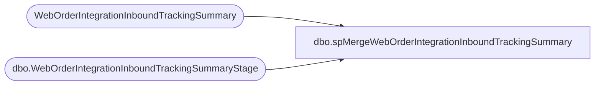

# dbo.spMergeWebOrderIntegrationInboundTrackingSummary

**Database:** dw  
**Server:** papamart  

## Architecture Diagram



## Table Dependencies

| Referenced Table |
|---|
| WebOrderIntegrationInboundTrackingSummary |
| dbo.WebOrderIntegrationInboundTrackingSummaryStage |

## Stored Procedure Code

```sql
CREATE proc [dbo].[spMergeWebOrderIntegrationInboundTrackingSummary] 

as

set nocount on

merge into WebOrderIntegrationInboundTrackingSummary as target 
using dwstaging.dbo.WebOrderIntegrationInboundTrackingSummaryStage as source
on 
	(
		target.ActualDate=source.ActualDate
	)
when matched 
	and 
		(
			ISNULL(target.DeckOrdersCreated,0)<>ISNULL(source.DeckOrdersCreated,0) 
			or
			ISNULL(target.ImportedOrders,0)<>ISNULL(source.ImportedOrders,0)
			or
			ISNULL(target.US_WebOrders,0)<>ISNULL(source.US_WebOrders,0)	
			or
			ISNULL(target.US_StoreOrders,0)<>ISNULL(source.US_StoreOrders,0)	
			or
			ISNULL(target.UK_WebOrders,0)<>ISNULL(source.UK_WebOrders,0)	
			or
			ISNULL(target.UK_StoreOrders,0)<>ISNULL(source.UK_StoreOrders,0)	
			or
			ISNULL(target.DynamicsAPIWebOrders,0)<>ISNULL(source.DynamicsAPIWebOrders,0)	
			or
			ISNULL(target.DynamicsOrdersCreated,0)<>ISNULL(source.DynamicsOrdersCreated,0)	
			or
			ISNULL(target.UKFTPOrders,0)<>ISNULL(source.UKFTPOrders,0)	
			or
			ISNULL(target.UKCreatedOrders,0)<>ISNULL(source.UKCreatedOrders,0)
		)
	then Update
		set	
			target.DeckOrdersCreated=source.DeckOrdersCreated,
			target.ImportedOrders=source.ImportedOrders,
			target.US_WebOrders=source.US_WebOrders,
			target.US_StoreOrders=source.US_StoreOrders,
			target.UK_WebOrders=source.UK_WebOrders,
			target.UK_StoreOrders=source.UK_StoreOrders,
			target.DynamicsAPIWebOrders=source.DynamicsAPIWebOrders,
			target.DynamicsOrdersCreated=source.DynamicsOrdersCreated,
			target.UKFTPOrders=source.UKFTPOrders,
			target.UKCreatedOrders=source.UKCreatedOrders,
			target.UpdateDate=getdate()
when not matched by target
	then Insert
		(
			ActualDate,
			DeckOrdersCreated,
			ImportedOrders,
			US_WebOrders,
			US_StoreOrders,
			UK_WebOrders,
			UK_StoreOrders,
			DynamicsAPIWebOrders,
			DynamicsOrdersCreated,	
			UKFTPOrders,
			UKCreatedOrders,
			InsertDate
		)
	values
		(
			source.ActualDate,
			source.DeckOrdersCreated,
			source.ImportedOrders,
			source.US_WebOrders,
			source.US_StoreOrders,
			source.UK_WebOrders,
			source.UK_StoreOrders,
			source.DynamicsAPIWebOrders,
			source.DynamicsOrdersCreated,	
			source.UKFTPOrders,
			source.UKCreatedOrders,
			getdate()
		)
;
```

