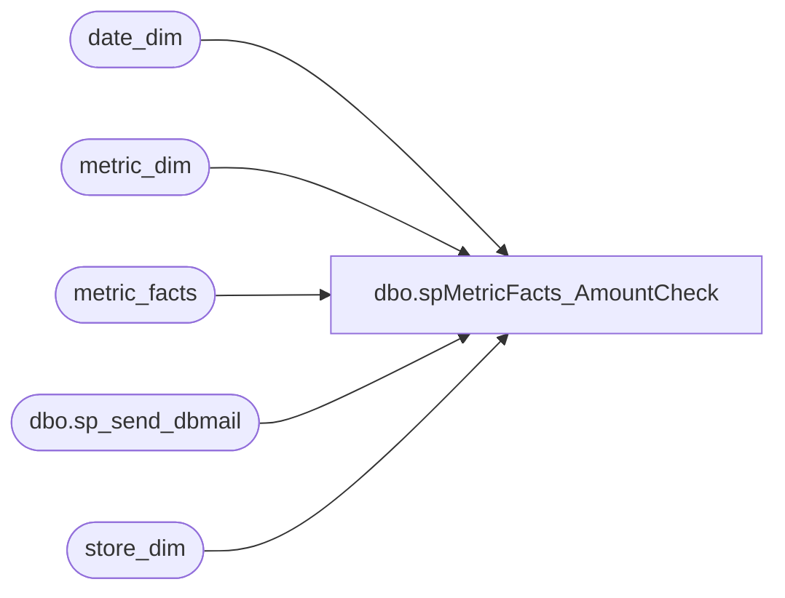

# dbo.spMetricFacts_AmountCheck

**Database:** dw  
**Server:** papamart  

## Architecture Diagram



## Table Dependencies

| Referenced Table |
|---|
| date_dim |
| metric_dim |
| metric_facts |
| dbo.sp_send_dbmail |
| store_dim |

## Stored Procedure Code

```sql
CREATE              procedure [dbo].[spMetricFacts_AmountCheck]
AS
-- =============================================================================================================
-- Name: spDistro_MismatchedStdPackQtyWith980
--
-- Description:	

--
-- Input:		
--				
--
--
-- Output: 
--
-- Dependencies: 
--
-- Revision History
--		Name:			Date:			Comments:
--		MikeP			20140223		converted to use msdb.dbo.sp_send_dbmail
-- =============================================================================================================

SET NOCOUNT ON
DECLARE @dupecnt int
	,@ydate datetime
	,@today datetime
	,@startdt datetime
	,@lycnt int

set @today = getdate()
set @startdt = dateadd(yy,-1, @today)
set @ydate = (dateadd(dd, -1,cast(convert(char(8),getdate(),1) as datetime)))

IF (Object_ID('tempdb..##metric_facts_amountCheck') IS NOT NULL) DROP TABLE ##metric_facts_amountCheck

select dd.actual_date, md.name, sum(amount) as Ttl
into ##metric_facts_amountCheck
from metric_facts mf (nolock)
	join metric_dim md on mf.metric_dim_key = md.metric_dim_key
	join date_dim dd on mf.date_key = dd.date_key
	join store_dim sd on mf.store_key = sd.store_key
where dd.actual_date = @ydate
and name not in ('ChargeAccount',
				'GuestSatisfaction',
				'InStoreCredit',
				'RepeatGuests',
				'ActualHoneyDiscount',
				'SalesPlanCA',
				'SalesPlan',
				'MallGC',
				'Animals_lt15',
				'Animals_gt20',
				'Animals_gt15_lt20')
group by dd.actual_date, md.name
having sum(amount) = 0
order by dd.actual_date, md.name

--select * from ##metric_facts_amountCheck
-- 
SET @dupecnt = (select count(*) from ##metric_facts_amountCheck)
--SELECT @dupecnt
 
IF @dupecnt > 0
BEGIN
--NOTIFY OF ANY METRICS THAT HAVE TOTAL AMOUNT = 0
	exec msdb.dbo.sp_send_dbmail @recipients='databears@buildabear.com', @subject ='Metric_Facts Amount Check FAILED ', 
	@query = 'select convert(char(8),actual_date,1) as Date, substring(name,1,30) as Name, cast(Ttl as decimal(9,2)) as Ttl from ##metric_facts_amountCheck'
 
END

ELSE
	BEGIN
	exec msdb.dbo.sp_send_dbmail @recipients='databears@buildabear.com', @subject ='Metric_Facts Amounts OK'
	END


set @lycnt = (select count(*)
			    from metric_facts mf
					join metric_dim md on mf.metric_dim_key = md.metric_dim_key
					join date_dim dd on mf.date_key = dd.date_key
					join store_dim sd on mf.store_key = sd.store_key
				where name not in ('ChargeAccount',
									'GuestSatisfaction',
									'InStoreCredit',
									'RepeatGuests',
									'ActualHoneyDiscount',
									'SalesPlanCA',
									'SalesPlan',
									'MallGC',
									'NetOtherUGA',
									'Animals_lt15',
									'Animals_gt20',
									'Animals_gt15_lt20')
					and dd.actual_date between @startdt and @today
					and mf.ly_date_key = 0
					and sd.opening_date < @today
				)

IF @lycnt > 0
BEGIN
--NOTIFY OF ANY METRICS THAT HAVE TOTAL AMOUNT = 0
	exec msdb.dbo.sp_send_dbmail @recipients='databears@buildabear.com', @subject ='Metric_Facts Amount Check FAILED ', @body = 'LY_date_keys missing for some dates in the past 2 years!!'
 
END

ELSE
	BEGIN
	exec msdb.dbo.sp_send_dbmail @recipients='databears@buildabear.com', @subject ='Metric_Facts LY_date_keys OK'
	END

				

/* TO TEST FOR CAUSE of missing LY DATE KEY */

/*
DECLARE @dupecnt int
	,@ydate datetime
	,@today datetime
	,@startdt datetime
	,@lycnt int

set @today = getdate()
set @startdt = dateadd(yy,-1, @today)
set @ydate = (dateadd(dd, -1,cast(convert(char(8),getdate(),1) as datetime)))

select *
from metric_facts mf
					join metric_dim md on mf.metric_dim_key = md.metric_dim_key
					join date_dim dd on mf.date_key = dd.date_key
					join store_dim sd on mf.store_key = sd.store_key
				where name not in ('ChargeAccount',
									'GuestSatisfaction',
									'InStoreCredit',
									'RepeatGuests',
									'ActualHoneyDiscount',
									'SalesPlanCA',
									'SalesPlan',
									'MallGC',
									'NetOtherUGA',
									'Animals_lt15',
									'Animals_gt20',
									'Animals_gt15_lt20')
					and dd.actual_date between @startdt and @today
					and mf.ly_date_key = 0
					and sd.opening_date < @today


*/
```

