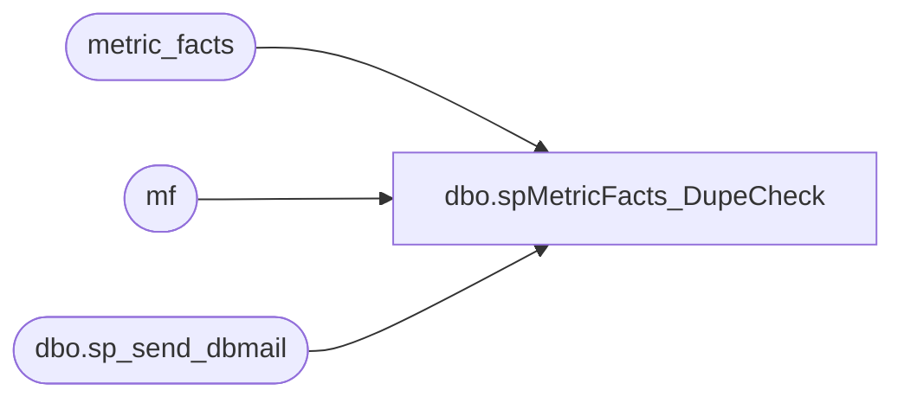

# dbo.spMetricFacts_DupeCheck

**Database:** dw  
**Server:** papamart  

## Architecture Diagram



## Table Dependencies

| Referenced Table |
|---|
| metric_facts |
| mf |
| dbo.sp_send_dbmail |

## Stored Procedure Code

```sql
--EXEC spMetricFacts_DupeCheck


CREATE PROCEDURE [dbo].[spMetricFacts_DupeCheck]
AS

-- =============================================================================================================
-- Name: [dbo].[spMetricFacts_DupeCheck]
--
-- Description: 
--
-- Dependencies: 
--
-- Revision History
--		Name:					Date:			Comments:
--		Trista Parmentier		11/29/2011		modified to use sp_send_dbmail instead of xp_sendmail
--		?						?				original creation
-- =============================================================================================================

DECLARE @dupecnt int

select metric_dim_key,store_key,date_key,min(metric_facts_key) as metric_facts_key
into ##metric_facts_dupes
from dw..metric_facts (nolock)
group by metric_dim_key,store_key,date_key
having count(*) >1

SET @dupecnt = (select count(*) from ##metric_facts_dupes)

IF @dupecnt > 0
BEGIN
--NOTIFY OF ANY DUPES THAT WOULDN'T BE DELETED, BECAUSE THEY DIDN'T HAVE AMOUNT =0
	exec msdb.dbo.sp_send_dbmail @recipients='databears@buildabear.com', @subject ='Metric_Facts Dupes PRE-FIX ', @query = 'select count(*) from ##metric_facts_dupes d join dw..metric_facts mf on mf.metric_facts_key = d.metric_facts_key and mf.store_key = d.store_key and mf.metric_dim_key = d.metric_dim_key and mf.date_key = d.date_key'

--REMOVE DUPES--
	delete mf
	from ##metric_facts_dupes d
		join metric_facts mf on mf.metric_facts_key = d.metric_facts_key 
			and mf.store_key = d.store_key 
			and mf.metric_dim_key = d.metric_dim_key
			and mf.date_key = d.date_key
	--where mf.amount = 0

--POST CHECK---
	exec msdb.dbo.sp_send_dbmail @recipients='databears@buildabear.com', @subject ='Metric_Facts Dupes POST-FIX CHECK (expect 0)', @query = 'select count(*) from dw..metric_facts (nolock) group by metric_dim_key,store_key,date_key having count(*) >1'
	END
ELSE
	BEGIN
	exec msdb.dbo.sp_send_dbmail @recipients='databears@buildabear.com', @subject ='Metric_Facts NO Dupes'
	END
```

