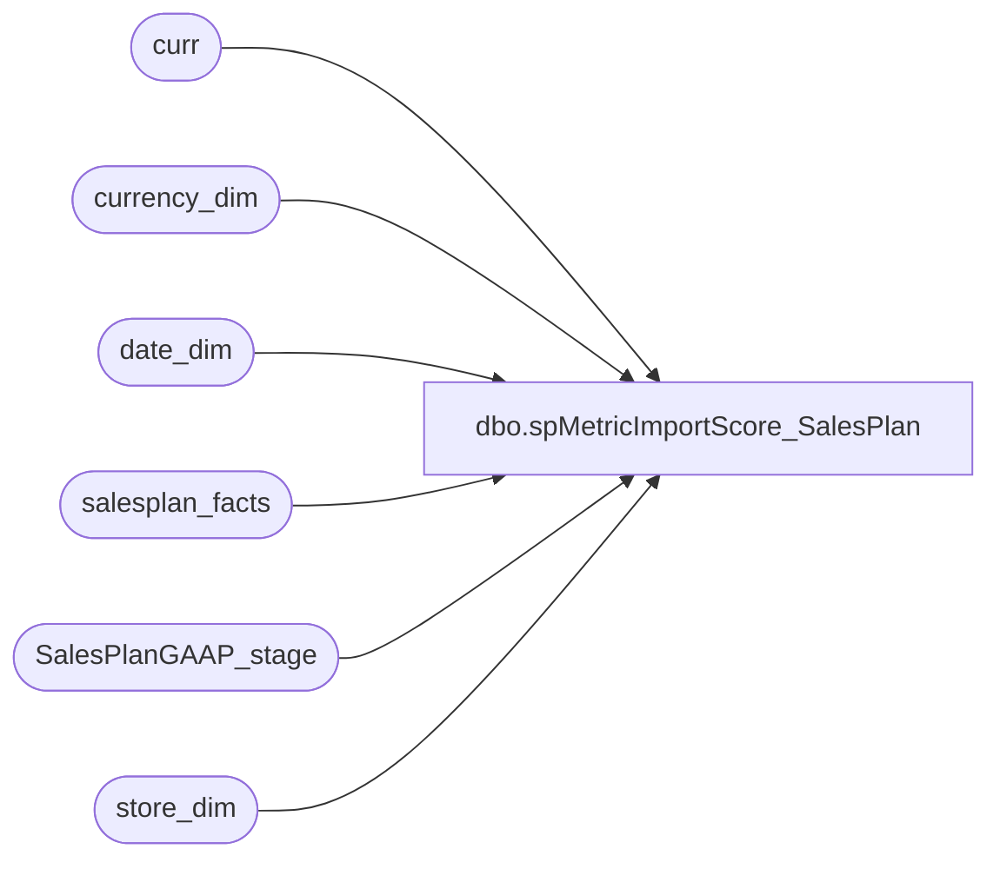

# dbo.spMetricImportScore_SalesPlan

**Database:** dw  
**Server:** papamart  

## Architecture Diagram



## Table Dependencies

| Referenced Table |
|---|
| curr |
| currency_dim |
| date_dim |
| salesplan_facts |
| SalesPlanGAAP_stage |
| store_dim |

## Stored Procedure Code

```sql
CREATE    PROCEDURE [dbo].[spMetricImportScore_SalesPlan]
AS

DECLARE 
 @date_key_min int
,@date_key_max int
,@GAAPdate_key_min int
,@GAAPdate_key_max int
,@MetricDimKey_GAAP int
--,@MetricDimKeyCA_GAAP int
/*
SET @MetricDimKey_GAAP = (select metric_dim_key from metric_dim where name = 'GAAPplan')
--SET @MetricDimKeyCA_GAAP = (select metric_dim_key from metric_dim where name = 'GAAPplanCA')

/*****does not include UK ******/
delete salesplan_facts where currency_key = 141 -- in (141,32)
/*****does not include UK ******/

insert into salesplan_facts (store_key, date_key, currency_key, amount)
SELECT [store_key]
      ,[date_key]
	  ,141 as [currency_key] --USD
      ,[amount]
  FROM [dw].[dbo].[Metric_facts]
WHERE metric_dim_key = @MetricDimKey_GAAP


select * from salesplan_facts where store_key = 188 and date_key = 3585 and currency_key = 141
select * from SalesPlanGAAP_stage


select * 
from (
	select sd.store_key, dd.date_key, c.currency_key, s.sales_plan from SalesPlanGAAP_stage s
	join store_dim sd on s.store = sd.store_id
	join currency_dim c on s.currency = c.currency_code
	join date_dim dd on s.actual_date = dd.actual_date) new
	left join salesplan_facts curr on new.store_key = curr.store_key 
								and new.date_key = curr.date_key
								and new.currency_key = curr.currency_key
where curr.salesplan_facts_key is not null
*/

-----------------UPDATE existing---------------------------------------------
update curr
set amount = new.sales_plan
from (
	select sd.store_key, dd.date_key, c.currency_key, ISNULL(s.sales_plan,0) AS sales_plan from SalesPlanGAAP_stage s
	join store_dim sd on s.store = sd.store_id
	join currency_dim c on s.currency = c.currency_code
	join date_dim dd on s.actual_date = dd.actual_date) new
	left join salesplan_facts curr on new.store_key = curr.store_key 
								and new.date_key = curr.date_key
								and new.currency_key = curr.currency_key
where curr.salesplan_facts_key is not null

-----------------INSERT New---------------------------------------------
insert into salesplan_facts (store_key, date_key, currency_key, amount)
select new.store_key, new.date_key, new.currency_key, ISNULL(new.sales_plan,0) AS sales_plan
from (
	select sd.store_key, dd.date_key, c.currency_key, s.sales_plan from SalesPlanGAAP_stage s
	join store_dim sd on s.store = sd.store_id
	join currency_dim c on s.currency = c.currency_code
	join date_dim dd on s.actual_date = dd.actual_date) new
	left join salesplan_facts curr on new.store_key = curr.store_key 
								and new.date_key = curr.date_key
								and new.currency_key = curr.currency_key
where curr.salesplan_facts_key is null


/*
insert into salesplan_facts (store_key, date_key, currency_key, amount)
SELECT [store_key]
      ,[date_key]
	  ,32 as [currency_key] --CAD
      ,[amount]
  FROM [dw].[dbo].[Metric_facts]
WHERE metric_dim_key = @MetricDimKeyCA_GAAP
*/

/*OOOOOOOOOOOOOOOOOOOO  GAAP  OOOOOOOOOOOOOOOOOOOOOOOOOOOOOOOOOOOOOOOOOO

SELECT 
	 @GAAPdate_key_min=min(dd.date_key)
	,@GAAPdate_key_max=max(dd.date_key) 
FROM SalesPlanGAAP_stage s 
	join date_dim dd on s.actual_date = dd.actual_date

--select @date_key_min, @date_key_max

--select * from 
delete plan_metric_facts 
where date_key between @GAAPdate_key_min and @GAAPdate_key_max 
	and metric_dim_key in (@MetricDimKey_GAAP, @MetricDimKeyCA_GAAP)


/********************************************************
**  UPDATE Existing records (US$)
********************************************************/
update plan_metric_facts
set amount = NewD.sales_plan
from 
	(
	select sd.store_key, dd.date_key,f.currency,f.sales_plan
	from date_dim dd
		join SalesPlanGAAP_stage f on dd.actual_date = f.actual_date
		join store_dim sd on f.store = sd.store_id
	where f.currency = 'US'
	) as NewD
 join plan_metric_facts mf 
	on  mf.store_key = NewD.store_key and
		mf.date_key = NewD.date_key and
		mf.metric_dim_key = @MetricDimKey_GAAP 
	    
/********************************************************
**  UPDATE Existing records (Canadian$)
********************************************************/
update plan_metric_facts
set amount = NewD.sales_plan
from 
	(
	select sd.store_key, dd.date_key,f.currency,f.sales_plan
	from date_dim dd
		join SalesPlanGAAP_stage f on dd.actual_date = f.actual_date
		join store_dim sd on f.store = sd.store_id
	where f.currency = 'CA'
	) as NewD
 join plan_metric_facts mf 
	on  mf.store_key = NewD.store_key and
		mf.date_key = NewD.date_key and
		mf.metric_dim_key = @MetricDimKeyCA_GAAP 
	    


/********************************************************
**  INSERT New records (US$)
********************************************************/
insert plan_metric_facts (metric_dim_key,store_key,date_key,amount)
select @MetricDimKey_GAAP, NewD.store_key, NewD.date_key, NewD.sales_plan
from 
	(
	select sd.store_key, dd.date_key,f.sales_plan
	from date_dim dd
		join SalesPlanGAAP_stage f on dd.actual_date = f.actual_date
		join store_dim sd on f.store = sd.store_id
	where f.currency = 'US'
	) as NewD
left join plan_metric_facts mf 
	on  mf.store_key = NewD.store_key and
		mf.date_key = NewD.date_key and
		mf.metric_dim_key = @MetricDimKey_GAAP 
	    
where mf.metric_facts_key is null

/********************************************************
**  INSERT New records (Canadian$)
********************************************************/
insert plan_metric_facts (metric_dim_key,store_key,date_key,amount)
select @MetricDimKeyCA_GAAP, NewD.store_key, NewD.date_key, NewD.sales_plan
from 
	(
	select sd.store_key, dd.date_key,f.sales_plan
	from date_dim dd
		join SalesPlanGAAP_stage f on dd.actual_date = f.actual_date
		join store_dim sd on f.store = sd.store_id
	where f.currency = 'CA'
	) as NewD
left join plan_metric_facts mf 
	on  mf.store_key = NewD.store_key and
		mf.date_key = NewD.date_key and
		mf.metric_dim_key = @MetricDimKeyCA_GAAP 
	    
where mf.metric_facts_key is null

*/
```

