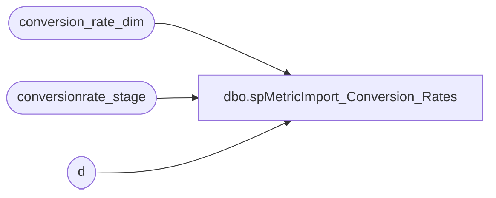

# dbo.spMetricImport_Conversion_Rates

**Database:** dw  
**Server:** papamart  

## Architecture Diagram



## Table Dependencies

| Referenced Table |
|---|
| conversion_rate_dim |
| conversionrate_stage |
| d |

## Stored Procedure Code

```sql
CREATE procedure [dbo].[spMetricImport_Conversion_Rates]
as

update d
set d.ca_to_us = s.CAtoUS,
	d.us_to_ca = s.UStoCA
from conversionrate_stage s
join conversion_rate_dim d on s.actual_date = d.actual_date
where s.actual_date is not null

----DRM:  manual update to match Sales Plan ----
update conversion_rate_dim
set  ca_to_us = 1.25
	,us_to_ca = .80
where actual_date >= '8/27/06' --changed to match SalesPlan rate
```

