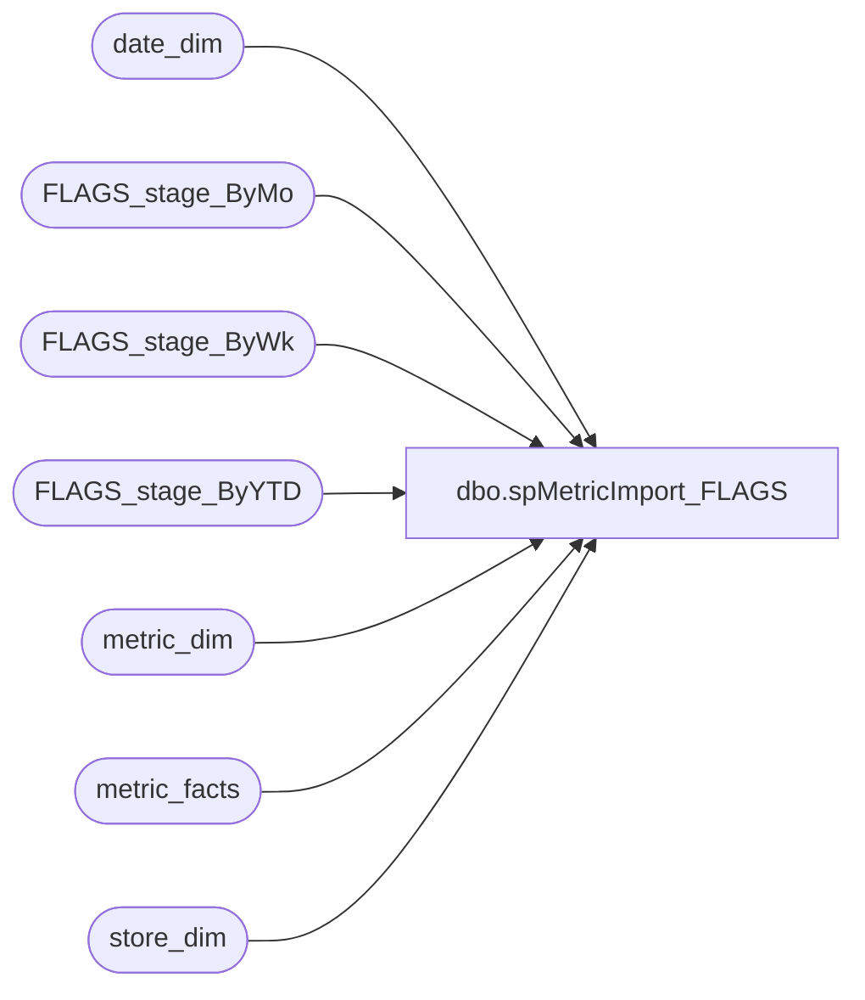

# dbo.spMetricImport_FLAGS

**Database:** dw  
**Server:** papamart  

## Architecture Diagram



## Table Dependencies

| Referenced Table |
|---|
| date_dim |
| FLAGS_stage_ByMo |
| FLAGS_stage_ByWk |
| FLAGS_stage_ByYTD |
| metric_dim |
| metric_facts |
| store_dim |

## Stored Procedure Code

```sql
CREATE PROCEDURE spMetricImport_FLAGS
AS

DECLARE 
 @Year int
,@MetricDimKey int

SET @Year = (select max(yearNo) from FLAGS_stage_ByYTD)
SET @MetricDimKey = (select metric_dim_key from metric_dim where name = 'GuestSatisfaction')


/********************************************************
**  UPDATE Existing records
********************************************************/
update metric_facts
set respondents = NewD.respondents,
	score = NewD.score
from 
	(
	select sd.store_key, dd.date_key,f.respondents, f.score
	from date_dim dd
		join FLAGS_stage_ByWk f on dd.actual_date = f.WeekEndingDt
		join store_dim sd on f.store = sd.store_id
	) as NewD
 join metric_facts mf 
	on  mf.store_key = NewD.store_key and
		mf.date_key = NewD.date_key and
		mf.metric_dim_key = @MetricDimKey and
	    mf.metric_freq_key = 'D'


/********************************************************
**  INSERT New records
********************************************************/

insert metric_facts (metric_dim_key,store_key,date_key,metric_freq_key,respondents,score)
select @MetricDimKey, NewD.store_key, NewD.date_key, 'D',NewD.respondents, NewD.score
from 
	(
	select sd.store_key, dd.date_key,f.respondents, f.score 
	from date_dim dd
		join FLAGS_stage_ByWk f on dd.actual_date = f.WeekEndingDt
		join store_dim sd on f.store = sd.store_id
	) as NewD
left join metric_facts mf 
	on  mf.store_key = NewD.store_key and
		mf.date_key = NewD.date_key and
		mf.metric_dim_key = @MetricDimKey and
	    mf.metric_freq_key = 'D'
where mf.metric_facts_key is null


/********************************************************
**  MONTHLY Totals
********************************************************/

insert metric_facts (metric_dim_key,store_key,date_key,metric_freq_key,respondents,score)
select @MetricDimKey, NewM.store_key, NewM.date_key, 'M',NewM.respondents, NewM.score
from 
	(
	select sd.store_key, max(dd.date_key)as 'date_key',max(f.respondents)as 'respondents', max(f.score)as 'score'
	from date_dim dd
		join FLAGS_stage_ByMo f on dd.fiscal_period = f.MonthNo
		join store_dim sd on f.store = sd.store_id
	where dd.fiscal_year = @Year
	group by sd.store_key, dd.fiscal_period
	) as NewM
left join metric_facts mf 
	on  mf.store_key = NewM.store_key and
		mf.date_key = NewM.date_key and
		mf.metric_dim_key = @MetricDimKey and
	    mf.metric_freq_key = 'M'
where mf.metric_facts_key is null


/********************************************************
**  YEARLY Totals
********************************************************/
insert metric_facts (metric_dim_key,store_key,date_key,metric_freq_key,respondents,score)
select @MetricDimKey, NewY.store_key, NewY.date_key, 'Y',NewY.respondents, NewY.score
from 
	(
	select sd.store_key, max(dd.date_key)as 'date_key',max(f.respondents)as 'respondents', max(f.score)as 'score'
	from date_dim dd
		join FLAGS_stage_ByYTD f on dd.fiscal_year = f.YearNo
		join store_dim sd on f.store = sd.store_id
	group by sd.store_key, dd.fiscal_year
	) as NewY
left join metric_facts mf 
	on  mf.store_key = NewY.store_key and
		mf.date_key = NewY.date_key and
		mf.metric_dim_key = 27 and --@MetricDimKey and
	    mf.metric_freq_key = 'Y'
where mf.metric_facts_key is null
```

