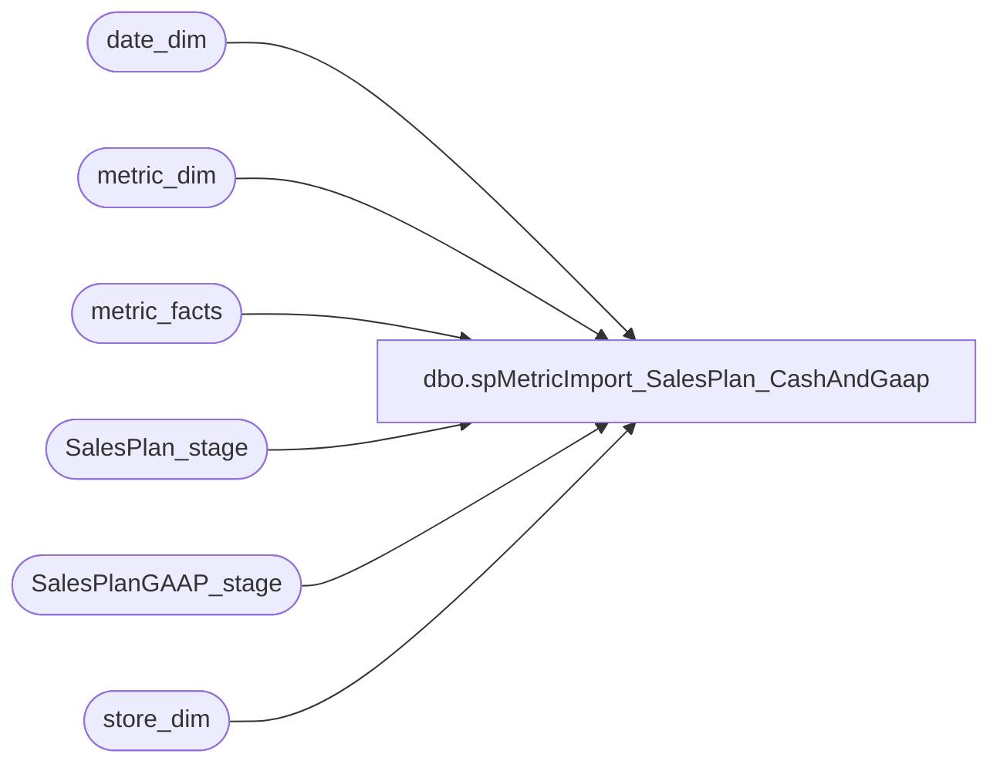

# dbo.spMetricImport_SalesPlan_CashAndGaap

**Database:** dw  
**Server:** papamart  

## Architecture Diagram



## Table Dependencies

| Referenced Table |
|---|
| date_dim |
| metric_dim |
| metric_facts |
| SalesPlan_stage |
| SalesPlanGAAP_stage |
| store_dim |

## Stored Procedure Code

```sql
Create    PROCEDURE spMetricImport_SalesPlan_CashAndGaap
AS

DECLARE 
 @MetricDimKey int
,@MetricDimKeyCA int
,@date_key_min int
,@date_key_max int
,@GAAPdate_key_min int
,@GAAPdate_key_max int
,@MetricDimKey_GAAP int
,@MetricDimKeyCA_GAAP int

SET @MetricDimKey = (select metric_dim_key from metric_dim where name = 'SalesPlan')
SET @MetricDimKeyCA = (select metric_dim_key from metric_dim where name = 'SalesPlanCA')
SET @MetricDimKey_GAAP = (select metric_dim_key from metric_dim where name = 'GAAPplan')
SET @MetricDimKeyCA_GAAP = (select metric_dim_key from metric_dim where name = 'GAAPplanCA')

/*OOOOOOOOOOOOOOOOOOOO  CASH  OOOOOOOOOOOOOOOOOOOOOOOOOOOOOOOOOOOOOOOOOO*/
SELECT 
	 @date_key_min=min(dd.date_key)
	,@date_key_max=max(dd.date_key) 
FROM SalesPlan_stage s 
	join date_dim dd on s.actual_date = dd.actual_date

--select @date_key_min, @date_key_max

--select * from 
delete metric_facts 
where date_key between @date_key_min and @date_key_max 
	and metric_dim_key in (@MetricDimKey,@MetricDimKeyCA)


/********************************************************
**  UPDATE Existing records (US$)
********************************************************/
update metric_facts
set amount = NewD.sales_plan
from 
	(
	select sd.store_key, dd.date_key,f.currency,f.sales_plan
	from date_dim dd
		join SalesPlan_stage f on dd.actual_date = f.actual_date
		join store_dim sd on f.store = sd.store_id
	where f.currency = 'US'
	) as NewD
 join metric_facts mf 
	on  mf.store_key = NewD.store_key and
		mf.date_key = NewD.date_key and
		mf.metric_dim_key = @MetricDimKey 
	    
/********************************************************
**  UPDATE Existing records (Canadian$)
********************************************************/
update metric_facts
set amount = NewD.sales_plan
from 
	(
	select sd.store_key, dd.date_key,f.currency,f.sales_plan
	from date_dim dd
		join SalesPlan_stage f on dd.actual_date = f.actual_date
		join store_dim sd on f.store = sd.store_id
	where f.currency = 'CA'
	) as NewD
 join metric_facts mf 
	on  mf.store_key = NewD.store_key and
		mf.date_key = NewD.date_key and
		mf.metric_dim_key = @MetricDimKeyCA 
	    


/********************************************************
**  INSERT New records (US$)
********************************************************/
insert metric_facts (metric_dim_key,store_key,date_key,amount)
select @MetricDimKey, NewD.store_key, NewD.date_key, NewD.sales_plan
from 
	(
	select sd.store_key, dd.date_key,f.sales_plan
	from date_dim dd
		join SalesPlan_stage f on dd.actual_date = f.actual_date
		join store_dim sd on f.store = sd.store_id
	where f.currency = 'US'
	) as NewD
left join metric_facts mf 
	on  mf.store_key = NewD.store_key and
		mf.date_key = NewD.date_key and
		mf.metric_dim_key = @MetricDimKey 
	    
where mf.metric_facts_key is null

/********************************************************
**  INSERT New records (Canadian$)
********************************************************/
insert metric_facts (metric_dim_key,store_key,date_key,amount)
select @MetricDimKeyCA, NewD.store_key, NewD.date_key, NewD.sales_plan
from 
	(
	select sd.store_key, dd.date_key,f.sales_plan
	from date_dim dd
		join SalesPlan_stage f on dd.actual_date = f.actual_date
		join store_dim sd on f.store = sd.store_id
	where f.currency = 'CA'
	) as NewD
left join metric_facts mf 
	on  mf.store_key = NewD.store_key and
		mf.date_key = NewD.date_key and
		mf.metric_dim_key = @MetricDimKeyCA 
	    
where mf.metric_facts_key is null


/*OOOOOOOOOOOOOOOOOOOO  GAAP  OOOOOOOOOOOOOOOOOOOOOOOOOOOOOOOOOOOOOOOOOO*/

SELECT 
	 @GAAPdate_key_min=min(dd.date_key)
	,@GAAPdate_key_max=max(dd.date_key) 
FROM SalesPlanGAAP_stage s 
	join date_dim dd on s.actual_date = dd.actual_date

--select @date_key_min, @date_key_max

--select * from 
delete metric_facts 
where date_key between @GAAPdate_key_min and @GAAPdate_key_max 
	and metric_dim_key in (@MetricDimKey_GAAP, @MetricDimKeyCA_GAAP)


/********************************************************
**  UPDATE Existing records (US$)
********************************************************/
update metric_facts
set amount = NewD.sales_plan
from 
	(
	select sd.store_key, dd.date_key,f.currency,f.sales_plan
	from date_dim dd
		join SalesPlanGAAP_stage f on dd.actual_date = f.actual_date
		join store_dim sd on f.store = sd.store_id
	where f.currency = 'US'
	) as NewD
 join metric_facts mf 
	on  mf.store_key = NewD.store_key and
		mf.date_key = NewD.date_key and
		mf.metric_dim_key = @MetricDimKey_GAAP 
	    
/********************************************************
**  UPDATE Existing records (Canadian$)
********************************************************/
update metric_facts
set amount = NewD.sales_plan
from 
	(
	select sd.store_key, dd.date_key,f.currency,f.sales_plan
	from date_dim dd
		join SalesPlanGAAP_stage f on dd.actual_date = f.actual_date
		join store_dim sd on f.store = sd.store_id
	where f.currency = 'CA'
	) as NewD
 join metric_facts mf 
	on  mf.store_key = NewD.store_key and
		mf.date_key = NewD.date_key and
		mf.metric_dim_key = @MetricDimKeyCA_GAAP 
	    


/********************************************************
**  INSERT New records (US$)
********************************************************/
insert metric_facts (metric_dim_key,store_key,date_key,amount)
select @MetricDimKey_GAAP, NewD.store_key, NewD.date_key, NewD.sales_plan
from 
	(
	select sd.store_key, dd.date_key,f.sales_plan
	from date_dim dd
		join SalesPlanGAAP_stage f on dd.actual_date = f.actual_date
		join store_dim sd on f.store = sd.store_id
	where f.currency = 'US'
	) as NewD
left join metric_facts mf 
	on  mf.store_key = NewD.store_key and
		mf.date_key = NewD.date_key and
		mf.metric_dim_key = @MetricDimKey_GAAP 
	    
where mf.metric_facts_key is null

/********************************************************
**  INSERT New records (Canadian$)
********************************************************/
insert metric_facts (metric_dim_key,store_key,date_key,amount)
select @MetricDimKeyCA_GAAP, NewD.store_key, NewD.date_key, NewD.sales_plan
from 
	(
	select sd.store_key, dd.date_key,f.sales_plan
	from date_dim dd
		join SalesPlanGAAP_stage f on dd.actual_date = f.actual_date
		join store_dim sd on f.store = sd.store_id
	where f.currency = 'CA'
	) as NewD
left join metric_facts mf 
	on  mf.store_key = NewD.store_key and
		mf.date_key = NewD.date_key and
		mf.metric_dim_key = @MetricDimKeyCA_GAAP 
	    
where mf.metric_facts_key is null
```

