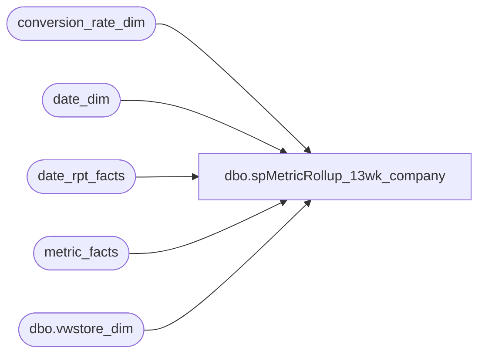

# dbo.spMetricRollup_13wk_company

**Database:** dw  
**Server:** papamart  

## Architecture Diagram



## Table Dependencies

| Referenced Table |
|---|
| conversion_rate_dim |
| date_dim |
| date_rpt_facts |
| metric_facts |
| dbo.vwstore_dim |

## Stored Procedure Code

```sql
/******************************************************************************
**
**	Name:		spMetricRollup_13wk_company
**
**	Description: 	Returns results for the Region and Director Trend Reports
**
**
**	Parameters:	none
**
** 	Returns:	result set
**
**	Examples:	EXEC spMetricRollup_13wk_company
**			
**
**	History:	
**  Date 		Author 		Purpose
**  08/07/03		CC and Dan	Created
******************************************************************************/
CREATE                                      PROCEDURE  spMetricRollup_13wk_company
/* ===== ARGUMENTS ===== */	
AS
SET NOCOUNT ON

/* ===== DECLARATIONS ===== */
DECLARE
 @curDay char(2)
,@curMon char(2)
,@curYr char(4)
,@curDate datetime
,@wkCurTY int
,@wk13TY int
,@dw	int


SET @curDay = datepart(dd,getdate())
SET @curMon = datepart(mm,getdate())
SET @curYr = datepart(yy,getdate())

--SET @fiscYrTY = @curYr
--SET @fiscYrLY = @curYr-1


SET @curDate = cast((@curMon+'/'+@curDay+'/'+@curYr) as Datetime)
--SET @curDate = dateadd(dd, -1,@curDate)

SET @dw = datepart(dw,@CurDate)
--select @dw
IF @dw BETWEEN 1 AND 6
	SET @wkCurTY = (select week_id-1 from date_dim where actual_date = @curDate)
	--SET @wkCurTY = (select week_id from date_dim where actual_date = @curDate)

ELSE 
	SET @wkCurTY = (select week_id from date_dim where actual_date = @curDate)

--select @wkCurTY

SET @wk13TY = @wkCurTY - 13 


--get TY and LY date keys
select date_key_TY, date_key_LY
into #date_key_xref 
from date_rpt_facts drf 		
	join date_dim dd on drf.date_key_TY = dd.date_key
	join date_dim ddly on drf.date_key_LY = ddly.date_key
	where dd.week_id > @wk13TY and dd.week_id <= @wkCurTY 

create index idx_temp_date_key_TY on #date_key_xref(date_key_TY)
create index idx_temp_date_key_LY on #date_key_xref(date_key_LY)

--populate table with TY data
select 	mf1.amount as 'TYamount',
	mf1.store_key,
	dd.date_key ,
	dd.fiscal_week,
	dd.week_id,
	dd.actual_date,
	dd.fiscal_year,
	mf1.metric_dim_key,
	'TY' as whatyear,
	CASE WHEN s.comp_week_id <= dd.week_id THEN 1 /*=Yes*/ ELSE 0 END as Comp_Y_N

into #TYdata
from metric_facts mf1
	join date_dim dd on mf1.date_key = dd.date_key
	join dbo.vwstore_dim s on s.store_key = mf1.store_key
where dd.date_key in (select date_key_TY from #date_key_xref)
	and mf1.metric_freq_key = 'd'
	and s.store_id <900
	and s.opening_date <= getdate()
	and coalesce(s.closing_date,@CurDate+7) >= getdate()

create index idx_tempTYdata_date_key_TY on #TYdata(date_key)

--populate table with LY data
select 	
	mf1.amount as 'LYamount',
	mf1.store_key,
	dd.date_key ,
	dd.fiscal_week,
	dd.week_id,
	dd.actual_date,
	dd.fiscal_year,
	mf1.metric_dim_key,
	'LY' as whatyear
into #LYdata
from metric_facts mf1
	join date_dim dd on mf1.date_key = dd.date_key
	join dbo.vwstore_dim s on s.store_key = mf1.store_key
where dd.date_key in (select date_key_LY from #date_key_xref)
	and mf1.metric_freq_key = 'd'
	and s.store_id <900
	and s.opening_date <= getdate()
	and coalesce(s.closing_date,@CurDate+7) >= getdate()

create index idx_tempLYdata_date_key_TY on #LYdata(date_key)

--add LY date key to TY results
select * 
into #TYLYkeys
from #TYdata t
	join #date_key_xref x on t.date_key = x.date_key_TY

--select * from #TYLYkeys

--join to get LY amount
--create new table #TYLYresults
select k.*,l.LYamount
into #TYLYresults
from #TYLYkeys k
	left join #LYdata l on k.date_key_LY = l.date_key
		and k.store_key = l.store_key
		and k.metric_dim_key = l.metric_dim_key
--select * from #TYLYresults

select 	sd.store_id
		,storeNameNum
		,sd.bearea
		,sd.bearritory
		,sd.region
		,a.fiscal_week
		--,a.week_id
		,(select max(dd1.actual_date) from date_dim dd1 where a.fiscal_week = dd1.fiscal_week
		and dd1.fiscal_year = a.fiscal_year  --2003 --year(@curDate) --changed by DanM to be uncommented on 1/6/04
				) as wkendingdate
		,max(a.comp_y_n) as Comp_Y_N
		--,CASE WHEN max(sd.comp_week_id) <= min(a.week_id) THEN 1 /*=Yes*/ ELSE 0 END as Comp_Y_N
		,sum(isnull(CASE WHEN a.metric_dim_key = 1 AND sd.country = 'US' THEN a.TYamount
				 WHEN a.metric_dim_key = 1 AND sd.country = 'CA' THEN (a.TYamount*crdTY.us_to_ca) END,0)) as 'ActualHoneyTY'
		,sum(isnull(CASE WHEN a.metric_dim_key = 1 AND sd.country = 'US' THEN a.LYamount
				 WHEN a.metric_dim_key = 1 AND sd.country = 'CA' THEN (a.LYamount*crdLY.us_to_ca) END,0)) as 'ActualHoneyLY'
		,sum(isnull(CASE WHEN a.metric_dim_key = 1 AND sd.country = 'CA' THEN a.TYamount END,0)) as 'ActualHoneyTY_CA'
		,sum(isnull(CASE WHEN a.metric_dim_key = 1 AND sd.country = 'CA' THEN a.LYamount	END,0)) as 'ActualHoneyLY_CA'

		,sum(isnull(CASE WHEN a.metric_dim_key = 5 AND sd.country = 'US' THEN a.TYamount
				 WHEN a.metric_dim_key = 5 AND sd.country = 'CA' THEN (a.TYamount*crdTY.us_to_ca) END,0)) as 'GiftCardsTY'
		,sum(isnull(CASE WHEN a.metric_dim_key = 5 AND sd.country = 'US' THEN a.LYamount
				 WHEN a.metric_dim_key = 5 AND sd.country = 'CA' THEN (a.LYamount*crdLY.us_to_ca) END,0)) as 'GiftCardsLY'
		,sum(isnull(CASE WHEN a.metric_dim_key = 5 AND sd.country = 'CA' THEN a.TYamount	END,0)) as 'GiftCardsTY_CA'
		,sum(isnull(CASE WHEN a.metric_dim_key = 5 AND sd.country = 'CA' THEN a.LYamount	END,0)) as 'GiftCardsLY_CA'

		,sum(isnull(CASE WHEN a.metric_dim_key = 6 AND sd.country = 'US' THEN a.TYamount
				 WHEN a.metric_dim_key = 6 AND sd.country = 'CA' THEN (a.TYamount*crdTY.us_to_ca) END,0)) as 'BearBucksTY'
		,sum(isnull(CASE WHEN a.metric_dim_key = 6 AND sd.country = 'US' THEN a.LYamount
				 WHEN a.metric_dim_key = 6 AND sd.country = 'CA' THEN (a.LYamount*crdLY.us_to_ca) END,0)) as 'BearBucksLY'
		,sum(isnull(CASE WHEN a.metric_dim_key = 6 AND sd.country = 'CA' THEN a.TYamount END,0)) as 'BearBucksTY_CA'
		,sum(isnull(CASE WHEN a.metric_dim_key = 6 AND sd.country = 'CA' THEN a.LYamount END,0)) as 'BearBucksLY_CA'

		,sum(isnull(CASE WHEN a.metric_dim_key = 9 AND sd.country = 'US' THEN a.TYamount
				 WHEN a.metric_dim_key = 9 AND sd.country = 'CA' THEN (a.TYamount*crdTY.us_to_ca) END,0)) as 'PartyDepsTY'
		,sum(isnull(CASE WHEN a.metric_dim_key = 9 AND sd.country = 'US' THEN a.LYamount
				 WHEN a.metric_dim_key = 9 AND sd.country = 'CA' THEN (a.LYamount*crdLY.us_to_ca) END,0)) as 'PartyDepsLY'
		,sum(isnull(CASE WHEN a.metric_dim_key = 9 AND sd.country = 'CA' THEN a.TYamount END,0)) as 'PartyDepsTY_CA'
		,sum(isnull(CASE WHEN a.metric_dim_key = 9 AND sd.country = 'CA' THEN a.LYamount	END,0)) as 'PartyDepsLY_CA'

		,sum(isnull(CASE WHEN a.metric_dim_key = 13 AND sd.country = 'US' THEN a.TYamount
				 WHEN a.metric_dim_key = 13 AND sd.country = 'CA' THEN (a.TYamount*crdTY.us_to_ca) END,0)) as 'PartySalesTY'
		,sum(isnull(CASE WHEN a.metric_dim_key = 13 AND sd.country = 'US' THEN a.LYamount
				 WHEN a.metric_dim_key = 13 AND sd.country = 'CA' THEN (a.LYamount*crdLY.us_to_ca) END,0)) as 'PartySalesLY'
		,sum(isnull(CASE WHEN a.metric_dim_key = 13 AND sd.country = 'CA' THEN a.TYamount	END,0)) as 'PartySalesTY_CA'
		,sum(isnull(CASE WHEN a.metric_dim_key = 13 AND sd.country = 'CA' THEN a.LYamount END,0)) as 'PartySalesLY_CA'
	
		,sum(isnull(CASE WHEN a.metric_dim_key = 17 AND sd.country = 'US' THEN a.TYamount
				 WHEN a.metric_dim_key = 17 AND sd.country = 'CA' THEN (a.TYamount*crdTY.us_to_ca) END,0)) as 'NetSalesTY'
		,sum(isnull(CASE WHEN a.metric_dim_key = 17 AND sd.country = 'US' THEN a.LYamount
				 WHEN a.metric_dim_key = 17 AND sd.country = 'CA' THEN (a.LYamount*crdLY.us_to_ca) END,0)) as 'NetSalesLY'
		,sum(isnull(CASE WHEN a.metric_dim_key = 17 AND sd.country = 'CA' THEN a.TYamount	END,0)) as 'NetSalesTY_CA'
		,sum(isnull(CASE WHEN a.metric_dim_key = 17 AND sd.country = 'CA' THEN a.LYamount END,0)) as 'NetSalesLY_CA'
		
		,sum(isnull(CASE WHEN a.metric_dim_key = 30 AND sd.country = 'US' THEN a.TYamount
				 WHEN a.metric_dim_key = 30 AND sd.country = 'CA' THEN (a.TYamount*crdTY.us_to_ca) END,0)) as 'SkinsUnitGrossAmtTY'
		,sum(isnull(CASE WHEN a.metric_dim_key = 30 AND sd.country = 'US' THEN a.LYamount
				 WHEN a.metric_dim_key = 30 AND sd.country = 'CA' THEN (a.LYamount*crdLY.us_to_ca) END,0)) as 'SkinsUnitGrossAmtLY'
		,sum(isnull(CASE WHEN a.metric_dim_key = 30 AND sd.country = 'CA' THEN a.TYamount	END,0)) as 'SkinsUnitGrossAmtTY_CA'
		,sum(isnull(CASE WHEN a.metric_dim_key = 30 AND sd.country = 'CA' THEN a.LYamount	END,0)) as 'SkinsUnitGrossAmtLY_CA'

		,sum(isnull(CASE WHEN a.metric_dim_key = 31 AND sd.country = 'US' THEN a.TYamount
				 WHEN a.metric_dim_key = 31 AND sd.country = 'CA' THEN (a.TYamount*crdTY.us_to_ca) END,0)) as 'NonSkinUnitGrossAmtTY'
		,sum(isnull(CASE WHEN a.metric_dim_key = 31 AND sd.country = 'US' THEN a.LYamount
				 WHEN a.metric_dim_key = 31 AND sd.country = 'CA' THEN (a.LYamount*crdLY.us_to_ca) END,0)) as 'NonSkinUnitGrossAmtLY'
		,sum(isnull(CASE WHEN a.metric_dim_key = 31 AND sd.country = 'CA' THEN a.TYamount END,0)) as 'NonSkinUGA_TY_CA'
		,sum(isnull(CASE WHEN a.metric_dim_key = 31 AND sd.country = 'CA' THEN a.LYamount END,0)) as 'NonSkinUGA_LY_CA'

		,sum(isnull(CASE WHEN a.metric_dim_key = 2 THEN a.TYamount END,0)) as 'TransactionsTY'
		,sum(isnull(CASE WHEN a.metric_dim_key = 2 THEN a.LYamount END,0)) as 'TransactionsLY'
		,sum(isnull(CASE WHEN a.metric_dim_key = 3 THEN a.TYamount END,0)) as 'InStoreCreditTY'
		,sum(isnull(CASE WHEN a.metric_dim_key = 3 THEN a.LYamount END,0)) as 'InStoreCreditLY'
		,sum(isnull(CASE WHEN a.metric_dim_key = 4 THEN a.TYamount END,0)) as 'ReturnsTY'
		,sum(isnull(CASE WHEN a.metric_dim_key = 4 THEN a.LYamount END,0)) as 'ReturnsLY'
		,sum(isnull(CASE WHEN a.metric_dim_key = 12 THEN a.TYamount END,0)) as 'PartiesTY'
		,sum(isnull(CASE WHEN a.metric_dim_key = 12 THEN a.LYamount END,0)) as 'PartiesLY'
		,sum(isnull(CASE WHEN a.metric_dim_key = 14 THEN a.TYamount END,0)) as 'AccessoriesTY'
		,sum(isnull(CASE WHEN a.metric_dim_key = 14 THEN a.LYamount END,0)) as 'AccessoriesLY'
		,sum(isnull(CASE WHEN a.metric_dim_key = 15 THEN a.TYamount END,0)) as 'ShoesTY'
		,sum(isnull(CASE WHEN a.metric_dim_key = 15 THEN a.LYamount END,0)) as 'ShoesLY'
		,sum(isnull(CASE WHEN a.metric_dim_key = 16 THEN a.TYamount END,0)) as 'SoundsTY'
		,sum(isnull(CASE WHEN a.metric_dim_key = 16 THEN a.LYamount END,0)) as 'SoundsLY'
		,sum(isnull(CASE WHEN a.metric_dim_key = 18 THEN a.TYamount END,0)) as 'SalesPlanTY'
		,sum(isnull(CASE WHEN a.metric_dim_key = 18 THEN a.LYamount END,0)) as 'SalesPlanLY'
		,sum(isnull(CASE WHEN a.metric_dim_key = 19 THEN a.TYamount END,0)) as 'UnitsTY'
		,sum(isnull(CASE WHEN a.metric_dim_key = 19 THEN a.LYamount END,0)) as 'UnitsLY'
		,sum(isnull(CASE WHEN a.metric_dim_key = 20 THEN a.TYamount END,0)) as 'AnimalsTY'
		,sum(isnull(CASE WHEN a.metric_dim_key = 20 THEN a.LYamount END,0)) as 'AnimalsLY'
		,sum(isnull(CASE WHEN a.metric_dim_key = 32 THEN a.TYamount END,0)) as 'NonAnimalsTY'
		,sum(isnull(CASE WHEN a.metric_dim_key = 32 THEN a.LYamount END,0)) as 'NonAnimalsLY'
		,sum(isnull(CASE WHEN a.metric_dim_key = 33 THEN a.TYamount END,0)) as 'BareBearTransTY'
		,sum(isnull(CASE WHEN a.metric_dim_key = 33 THEN a.LYamount END,0)) as 'BareBearTransLY'
		,sum(isnull(CASE WHEN a.metric_dim_key = 34 THEN a.TYamount END,0)) as 'BarePlusTransTY'
		,sum(isnull(CASE WHEN a.metric_dim_key = 34 THEN a.LYamount END,0)) as 'BarePlusTransLY'
		,sum(isnull(CASE WHEN a.metric_dim_key = 35 THEN a.TYamount END,0)) as 'PlusOnlyTransTY'
		,sum(isnull(CASE WHEN a.metric_dim_key = 35 THEN a.LYamount END,0)) as 'PlusOnlyTransLY'	
		,sum(isnull(CASE WHEN a.metric_dim_key = 36 THEN a.TYamount END,0)) as 'Animals_lt15TY'
		,sum(isnull(CASE WHEN a.metric_dim_key = 36 THEN a.LYamount END,0)) as 'Animals_lt15LY'
		,sum(isnull(CASE WHEN a.metric_dim_key = 37 THEN a.TYamount END,0)) as 'Animals_gt15_lt20TY'
		,sum(isnull(CASE WHEN a.metric_dim_key = 37 THEN a.LYamount END,0)) as 'Animals_gt15_lt20LY'
		,sum(isnull(CASE WHEN a.metric_dim_key = 38 THEN a.TYamount END,0)) as 'Animals_gte20TY'
		,sum(isnull(CASE WHEN a.metric_dim_key = 38 THEN a.LYamount END,0)) as 'Animals_gte20LY'
		,sum(isnull(CASE WHEN a.metric_dim_key = 39 THEN a.TYamount END,0)) as 'Shoe_TransTY'
		,sum(isnull(CASE WHEN a.metric_dim_key = 39 THEN a.LYamount END,0)) as 'Shoe_TransLY'
		,sum(isnull(CASE WHEN a.metric_dim_key = 40 THEN a.TYamount END,0)) as 'Sound_TransTY'
		,sum(isnull(CASE WHEN a.metric_dim_key = 40 THEN a.LYamount END,0)) as 'Sound_TransLY'	
		,sum(isnull(CASE WHEN a.metric_dim_key = 41 THEN a.TYamount END,0)) as 'BearBucksSoldTY'
		,sum(isnull(CASE WHEN a.metric_dim_key = 41 THEN a.LYamount END,0)) as 'BearBucksSoldLY'	
		--,max(isnull(CASE WHEN a.metric_dim_key = 27 THEN a.score END,0)) as 'GuestSatisfactionTY'
		--,max(isnull(CASE WHEN a.metric_dim_key = 27 THEN mf.score END,0)) as 'GuestSatisfactionLY'

	from (
	
	select 	
		TYamount,
		LYamount,
		store_key,
		date_key ,
		fiscal_week,
		week_id,
		actual_date,
		fiscal_year,
		metric_dim_key,
		whatyear,
		date_key_LY,
		comp_y_n
	from #TYLYresults
	
	) a
	
	join dbo.vwstore_dim sd on a.store_key = sd.store_key
	join conversion_rate_dim crdTY on crdTY.date_key = a.date_key
	join conversion_rate_dim crdLY on crdLY.date_key = a.date_key_LY


	group by sd.store_id
		,sd.store_name
		,storeNameNum
		,sd.bearea
		,sd.bearritory
		,sd.region
		,a.fiscal_week
		,a.fiscal_year
		--,a.week_id
```

