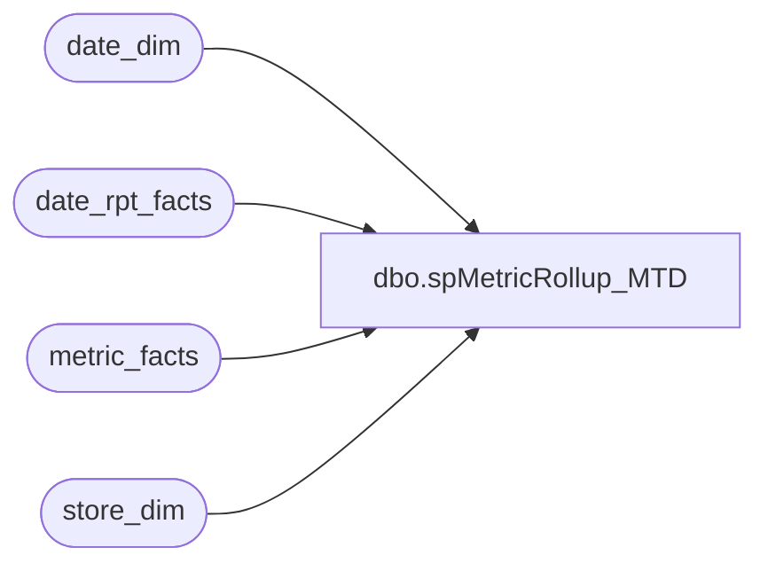

# dbo.spMetricRollup_MTD

**Database:** dw  
**Server:** papamart  

## Architecture Diagram



## Table Dependencies

| Referenced Table |
|---|
| date_dim |
| date_rpt_facts |
| metric_facts |
| store_dim |

## Stored Procedure Code

```sql
/******************************************************************************
**
**	Name:		spMetricRollup_MTD
**
**	Description: 	Returns WTD results for the Daily Sales Report
**
**
**	Parameters:	none
**
** 	Returns:	result set
**
**	Examples:	EXEC spMetricRollup_MTD
**			
**
**	History:	
**  Date 		Author 		Purpose
**  08/07/03		CC and Dan	Created
******************************************************************************/
CREATE               PROCEDURE  spMetricRollup_MTD
/* ===== ARGUMENTS ===== */	
AS
SET NOCOUNT ON

/* ===== DECLARATIONS ===== */
DECLARE
 @curDay char(2)
,@curMon char(2)
,@curYr char(4)
,@curDate datetime
,@wkCurTY int
,@mthCurTY int


SET @curDay = datepart(dd,getdate())
SET @curMon = datepart(mm,getdate())
SET @curYr = datepart(yy,getdate())


SET @curDate = cast((@curMon+'/'+@curDay+'/'+@curYr) as Datetime)
SET @curDate = dateadd(dd, -19,@curDate)

SET @wkCurTY = (select fiscal_week from date_dim where actual_date = @curDate)
SET @mthCurTY = (select fiscal_period from date_dim where actual_date = @curDate)


--rollup by month to date

select 		sd.store_id
		,right('000' + cast(sd.store_id as varchar),3) + ' ' + sd.store_name  as storeNameNum
				,CASE WHEN sd.bearea = 'Canada Stores' THEN 'Michigan'
		      WHEN sd.store_id NOT IN (13,136) THEN sd.bearea END as bearea
		,CASE WHEN sd.bearritory = 'Canada Stores' THEN 'Michigan'
		      WHEN sd.store_id NOT IN (13,136) THEN sd.bearritory END as bearritory 
		,CASE WHEN sd.region = 'Canada Stores' THEN 'Western US'
		      WHEN sd.store_id NOT IN (13,136) THEN sd.region END as region
		,CASE WHEN sd.store_id IN (13,136) THEN 'Internet' ELSE 'NonInternet' END as StoreGroup
		--,b.store_key
		,b.fiscal_period
		,b.mActualHoneyTY
		,b.mActualHoneyLY
		,b.mTransactionsTY
		,b.mTransactionsLY
		,b.mInStoreCreditTY
		,b.mInStoreCreditLY
		,b.mReturnsTY
		,b.mReturnsLY
		,b.mPartiesTY
		,b.mPartiesLY
		,b.mPartySalesTY
		,b.mPartySalesLY
		,b.mNetSalesTY
		,b.mNetSalesLY
		,b.mSalesPlanTY
		,b.mSalesPlanLY
		,b.mUnitsTY
		,b.mUnitsLY

from store_dim sd left join 

(

	select 	 a.store_key
		,a.fiscal_period
		,sum(isnull(CASE WHEN a.metric_dim_key = 1 THEN a.amount END,0)) as 'mActualHoneyTY'
		,sum(isnull(CASE WHEN a.metric_dim_key = 1 THEN mf.amount END,0)) as 'mActualHoneyLY'
		,sum(isnull(CASE WHEN a.metric_dim_key = 2 THEN a.amount END,0)) as 'mTransactionsTY'
		,sum(isnull(CASE WHEN a.metric_dim_key = 2 THEN mf.amount END,0)) as 'mTransactionsLY'
		,sum(isnull(CASE WHEN a.metric_dim_key = 3 THEN a.amount END,0)) as 'mInStoreCreditTY'
		,sum(isnull(CASE WHEN a.metric_dim_key = 3 THEN mf.amount END,0)) as 'mInStoreCreditLY'
		,sum(isnull(CASE WHEN a.metric_dim_key = 4 THEN a.amount END,0)) as 'mReturnsTY'
		,sum(isnull(CASE WHEN a.metric_dim_key = 4 THEN mf.amount END,0)) as 'mReturnsLY'
		,sum(isnull(CASE WHEN a.metric_dim_key = 12 THEN a.amount END,0)) as 'mPartiesTY'
		,sum(isnull(CASE WHEN a.metric_dim_key = 12 THEN mf.amount END,0)) as 'mPartiesLY'
		,sum(isnull(CASE WHEN a.metric_dim_key = 13 THEN a.amount END,0)) as 'mPartySalesTY'
		,sum(isnull(CASE WHEN a.metric_dim_key = 13 THEN mf.amount END,0)) as 'mPartySalesLY'
		,sum(isnull(CASE WHEN a.metric_dim_key = 17 THEN a.amount END,0)) as 'mNetSalesTY'
		,sum(isnull(CASE WHEN a.metric_dim_key = 17 THEN mf.amount END,0)) as 'mNetSalesLY'
		,sum(isnull(CASE WHEN a.metric_dim_key = 18 THEN a.amount END,0)) as 'mSalesPlanTY'
		,sum(isnull(CASE WHEN a.metric_dim_key = 18 THEN mf.amount END,0)) as 'mSalesPlanLY'
		,sum(isnull(CASE WHEN a.metric_dim_key = 19 THEN a.amount END,0)) as 'mUnitsTY'
		,sum(isnull(CASE WHEN a.metric_dim_key = 19 THEN mf.amount END,0)) as 'mUnitsLY'


	from (
		select 	mf1.amount,
			mf1.store_key,
			drf.date_key_TY,
			drf.date_key_LY,
			dd.fiscal_period,
			dd.fiscal_week,
			dd.actual_date,
			mf1.metric_dim_key 
		from metric_facts mf1
		join date_rpt_facts drf 
			on mf1.date_key = drf.date_key_TY
		join date_dim dd on  drf.date_key_TY = dd.date_key
	
		where dd.fiscal_period = @mthCurTY
		and dd.fiscal_year = @CurYr
		and mf1.metric_freq_key = 'd'
		
	) a
	
	left join metric_facts mf 
		on a.date_key_LY = mf.date_key
		and a.metric_dim_key = mf.metric_dim_key
		and a.store_key = mf.store_key
	
	group by a.store_key
		,a.fiscal_period	 

) b 
on sd.store_key = b.store_key 
where sd.store_id BETWEEN 1 and 900
--and sd.store_id NOT IN (13,136)
and sd.opening_date <= @curDate --'8/9/2003' --
and sd.closing_date is null
```

