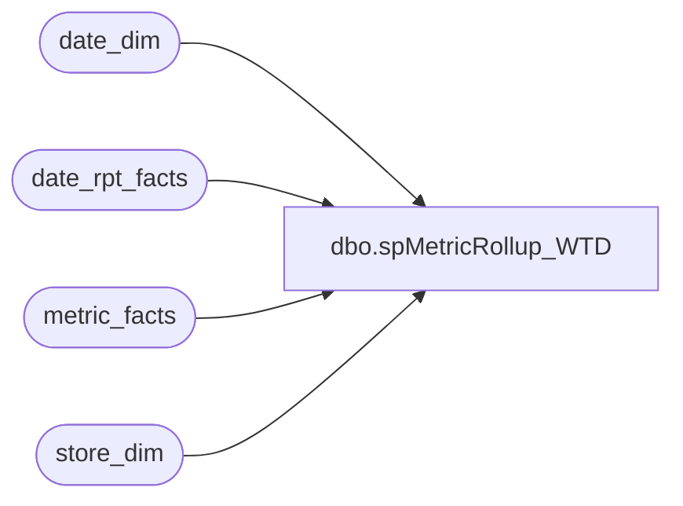

# dbo.spMetricRollup_WTD

**Database:** dw  
**Server:** papamart  

## Architecture Diagram



## Table Dependencies

| Referenced Table |
|---|
| date_dim |
| date_rpt_facts |
| metric_facts |
| store_dim |

## Stored Procedure Code

```sql
/******************************************************************************
**
**	Name:		spMetricRollup_WTD
**
**	Description: 	Returns WTD results for the Daily Sales Report
**
**
**	Parameters:	none
**
** 	Returns:	result set
**
**	Examples:	EXEC spMetricRollup_WTD
**			
**
**	History:	
**  Date 		Author 		Purpose
**  08/07/03		CC and Dan	Created
******************************************************************************/
CREATE               PROCEDURE  spMetricRollup_WTD
/* ===== ARGUMENTS ===== */	
AS
SET NOCOUNT ON

/* ===== DECLARATIONS ===== */
DECLARE
 @curDay char(2)
,@curMon char(2)
,@curYr char(4)
,@curDate datetime
,@wkCurTY int
,@mthCurTY int


SET @curDay = datepart(dd,getdate())
SET @curMon = datepart(mm,getdate())
SET @curYr = datepart(yy,getdate())


SET @curDate = cast((@curMon+'/'+@curDay+'/'+@curYr) as Datetime)
SET @curDate = dateadd(dd, -19,@curDate)
--select @curDate

SET @wkCurTY = (select fiscal_week from date_dim where actual_date = @curDate)
SET @mthCurTY = (select fiscal_period from date_dim where actual_date = @curDate)


--rollup by week to date
select sd.store_id
		,right('000' + cast(sd.store_id as varchar),3) + ' ' + sd.store_name  as storeNameNum
				,CASE WHEN sd.bearea = 'Canada Stores' THEN 'Michigan'
		      WHEN sd.store_id NOT IN (13,136) THEN sd.bearea END as bearea
		,CASE WHEN sd.bearritory = 'Canada Stores' THEN 'Michigan'
		      WHEN sd.store_id NOT IN (13,136) THEN sd.bearritory END as bearritory 
		,CASE WHEN sd.region = 'Canada Stores' THEN 'Western US'
		      WHEN sd.store_id NOT IN (13,136) THEN sd.region END as region
		,CASE WHEN sd.store_id IN (13,136) THEN 'Internet' ELSE 'NonInternet' END as StoreGroup
		--,b.store_key
		,b.fiscal_week
		,b.fiscal_period
		,b.wActualHoneyTY
		,b.wActualHoneyLY
		,b.wTransactionsTY
		,b.wTransactionsLY
		,b.wInStoreCreditTY
		,b.wInStoreCreditLY
		,b.wReturnsTY
		,b.wReturnsLY
		,b.wPartiesTY
		,b.wPartiesLY
		,b.wPartySalesTY
		,b.wPartySalesLY
		,b.wNetSalesTY
		,b.wNetSalesLY
		,b.wSalesPlanTY
		,b.wSalesPlanLY
		,b.wUnitsTY
		,b.wUnitsLY

from store_dim sd left join 

(

	select 	 a.store_key
		,a.fiscal_week
		,a.fiscal_period
		,sum(isnull(CASE WHEN a.metric_dim_key = 1 THEN a.amount END,0)) as 'wActualHoneyTY'
		,sum(isnull(CASE WHEN a.metric_dim_key = 1 THEN mf.amount END,0)) as 'wActualHoneyLY'
		,sum(isnull(CASE WHEN a.metric_dim_key = 2 THEN a.amount END,0)) as 'wTransactionsTY'
		,sum(isnull(CASE WHEN a.metric_dim_key = 2 THEN mf.amount END,0)) as 'wTransactionsLY'
		,sum(isnull(CASE WHEN a.metric_dim_key = 3 THEN a.amount END,0)) as 'wInStoreCreditTY'
		,sum(isnull(CASE WHEN a.metric_dim_key = 3 THEN mf.amount END,0)) as 'wInStoreCreditLY'
		,sum(isnull(CASE WHEN a.metric_dim_key = 4 THEN a.amount END,0)) as 'wReturnsTY'
		,sum(isnull(CASE WHEN a.metric_dim_key = 4 THEN mf.amount END,0)) as 'wReturnsLY'
		,sum(isnull(CASE WHEN a.metric_dim_key = 12 THEN a.amount END,0)) as 'wPartiesTY'
		,sum(isnull(CASE WHEN a.metric_dim_key = 12 THEN mf.amount END,0)) as 'wPartiesLY'
		,sum(isnull(CASE WHEN a.metric_dim_key = 13 THEN a.amount END,0)) as 'wPartySalesTY'
		,sum(isnull(CASE WHEN a.metric_dim_key = 13 THEN mf.amount END,0)) as 'wPartySalesLY'
		,sum(isnull(CASE WHEN a.metric_dim_key = 17 THEN a.amount END,0)) as 'wNetSalesTY'
		,sum(isnull(CASE WHEN a.metric_dim_key = 17 THEN mf.amount END,0)) as 'wNetSalesLY'
		,sum(isnull(CASE WHEN a.metric_dim_key = 18 THEN a.amount END,0)) as 'wSalesPlanTY'
		,sum(isnull(CASE WHEN a.metric_dim_key = 18 THEN mf.amount END,0)) as 'wSalesPlanLY'
		,sum(isnull(CASE WHEN a.metric_dim_key = 19 THEN a.amount END,0)) as 'wUnitsTY'
		,sum(isnull(CASE WHEN a.metric_dim_key = 19 THEN mf.amount END,0)) as 'wUnitsLY'


	from (
	select 	mf1.amount,
		mf1.store_key,
		drf.date_key_TY,
		drf.date_key_LY,
		dd.fiscal_period,
		dd.fiscal_week,
		dd.actual_date,
		mf1.metric_dim_key 
	from metric_facts mf1
	join date_rpt_facts drf 
		on mf1.date_key = drf.date_key_TY
	join date_dim dd on  drf.date_key_TY = dd.date_key
	

	where dd.fiscal_week = @wkCurTY
	and dd.fiscal_year = @curYr
	and mf1.metric_freq_key = 'd'
	
	) a
	
	left join metric_facts mf 
		on a.date_key_LY = mf.date_key
		and a.metric_dim_key = mf.metric_dim_key
		and a.store_key = mf.store_key
	
	
	
	group by a.store_key
		,a.fiscal_week
		,a.fiscal_period	 

) b 
on sd.store_key = b.store_key 
where sd.store_id BETWEEN 1 and 900
--and sd.store_id NOT IN (13,136)
and sd.opening_date <= @curDate --'8/9/2003' --
and sd.closing_date is null
```

