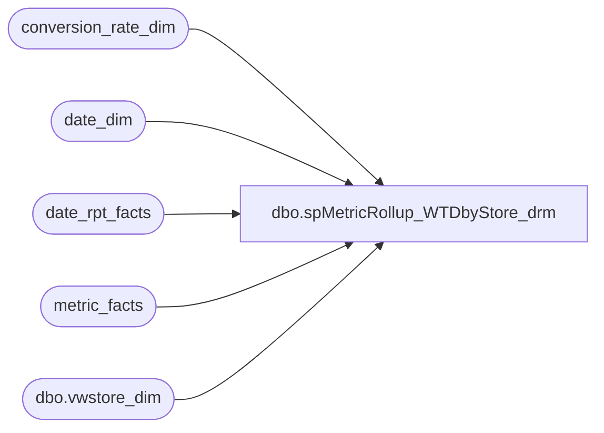

# dbo.spMetricRollup_WTDbyStore_drm

**Database:** dw  
**Server:** papamart  

## Architecture Diagram



## Table Dependencies

| Referenced Table |
|---|
| conversion_rate_dim |
| date_dim |
| date_rpt_facts |
| metric_facts |
| dbo.vwstore_dim |

## Stored Procedure Code

```sql
/******************************************************************************
**
**	Name:		spMetricRollup_WTDbyStore
**
**	Description: 	Returns results for the Trend Report.
**
**
**	Parameters:	none
**
** 	Returns:	result set
**
**	Examples:	EXEC spMetricRollup_WTDbyStore @TimePeriod = 'w'
**			
**
**	History:	
**  Date 		Author 		Purpose
**  08/07/03		CC and Dan	Created
******************************************************************************/
create                          PROCEDURE  spMetricRollup_WTDbyStore_drm
/* ===== ARGUMENTS ===== */	
@TimePeriod 	char(1) 

AS
SET NOCOUNT ON

/* ===== DECLARATIONS ===== */
DECLARE
 @curDay char(2)
,@curMon char(2)
,@curYr char(4)
,@curDate datetime
,@wkCurTYbegin int
,@wkCurTYend int
,@dw 	int


SET @curDay = datepart(dd,getdate())
SET @curMon = datepart(mm,getdate())
SET @curYr = datepart(yy,getdate())


SET @curDate = cast((@curMon+'/'+@curDay+'/'+@curYr) as Datetime)


SET @dw = datepart(dw,@CurDate)
--select @dw
IF @dw BETWEEN 1 AND 6 
	SET @wkCurTYend = (select week_id-1 from date_dim where actual_date = @curDate)
ELSE 
	SET @wkCurTYend = (select week_id from date_dim where actual_date = @curDate)

IF @TimePeriod = 'w'
	BEGIN
	SET @wkCurTYbegin = @wkCurTYend  
	END
ELSE IF @TimePeriod = 'm'
	BEGIN
	SET @wkCurTYbegin = (select min(week_id) from date_dim 
				where fiscal_period =(select min(fiscal_period) from date_dim where week_id = @wkCurTYend)
				  and fiscal_year =  (select min(fiscal_year) from date_dim where week_id = @wkCurTYend))
	
	END
     ELSE 
	BEGIN
	SET @wkCurTYbegin = (select min(week_id) from date_dim where fiscal_year = 
				(select min(fiscal_year) from date_dim where week_id = @wkCurTYend))
	END


	select 	sd.store_id
		,storeNameNum
		,sd.bearea
		,sd.bearritory
		,sd.region
		,a.date_key_TY
		,a.date_key_LY
		,a.actual_date
		,a.fiscal_week
		,a.fiscal_period
		,a.fiscal_year

		,(select max(dd1.actual_date) from date_dim dd1 where a.fiscal_week = dd1.fiscal_week
		and dd1.fiscal_year = year(@curDate)) as wkendingdate
		,CASE WHEN max(sd.comp_week_id) <= min(a.week_id) THEN 1 /*=Yes*/ ELSE 0 END as Comp_Y_N
		/*
		,sum(isnull(CASE WHEN a.metric_dim_key = 1 AND sd.country = 'US' THEN a.amount 
				 WHEN a.metric_dim_key = 1 AND sd.country = 'CA' THEN (a.amount*crdTY.us_to_ca) END,0)) as 'ActualHoneyTY'
		,sum(isnull(CASE WHEN a.metric_dim_key = 1 AND sd.country = 'US' THEN mf.amount 
				 WHEN a.metric_dim_key = 1 AND sd.country = 'CA' THEN (mf.amount*crdLY.us_to_ca) END,0)) as 'ActualHoneyLY'
		,sum(isnull(CASE WHEN a.metric_dim_key = 1 AND sd.country = 'CA' THEN a.amount END,0)) as 'ActualHoneyTY_CA'
		,sum(isnull(CASE WHEN a.metric_dim_key = 1 AND sd.country = 'CA' THEN mf.amount	END,0)) as 'ActualHoneyLY_CA'

		,sum(isnull(CASE WHEN a.metric_dim_key = 5 AND sd.country = 'US' THEN a.amount 
				 WHEN a.metric_dim_key = 5 AND sd.country = 'CA' THEN (a.amount*crdTY.us_to_ca) END,0)) as 'GiftCardsTY'
		,sum(isnull(CASE WHEN a.metric_dim_key = 5 AND sd.country = 'US' THEN mf.amount 
				 WHEN a.metric_dim_key = 5 AND sd.country = 'CA' THEN (mf.amount*crdLY.us_to_ca) END,0)) as 'GiftCardsLY'
		,sum(isnull(CASE WHEN a.metric_dim_key = 5 AND sd.country = 'CA' THEN a.amount	END,0)) as 'GiftCardsTY_CA'
		,sum(isnull(CASE WHEN a.metric_dim_key = 5 AND sd.country = 'CA' THEN mf.amount	END,0)) as 'GiftCardsLY_CA'

		,sum(isnull(CASE WHEN a.metric_dim_key = 6 AND sd.country = 'US' THEN a.amount 
				 WHEN a.metric_dim_key = 6 AND sd.country = 'CA' THEN (a.amount*crdTY.us_to_ca) END,0)) as 'BearBucksTY'
		,sum(isnull(CASE WHEN a.metric_dim_key = 6 AND sd.country = 'US' THEN mf.amount 
				 WHEN a.metric_dim_key = 6 AND sd.country = 'CA' THEN (mf.amount*crdLY.us_to_ca) END,0)) as 'BearBucksLY'
		,sum(isnull(CASE WHEN a.metric_dim_key = 6 AND sd.country = 'CA' THEN a.amount END,0)) as 'BearBucksTY_CA'
		,sum(isnull(CASE WHEN a.metric_dim_key = 6 AND sd.country = 'CA' THEN mf.amount END,0)) as 'BearBucksLY_CA'

		,sum(isnull(CASE WHEN a.metric_dim_key = 9 AND sd.country = 'US' THEN a.amount 
				 WHEN a.metric_dim_key = 9 AND sd.country = 'CA' THEN (a.amount*crdTY.us_to_ca) END,0)) as 'PartyDepsTY'
		,sum(isnull(CASE WHEN a.metric_dim_key = 9 AND sd.country = 'US' THEN mf.amount 
				 WHEN a.metric_dim_key = 9 AND sd.country = 'CA' THEN (mf.amount*crdLY.us_to_ca) END,0)) as 'PartyDepsLY'
		,sum(isnull(CASE WHEN a.metric_dim_key = 9 AND sd.country = 'CA' THEN a.amount END,0)) as 'PartyDepsTY_CA'
		,sum(isnull(CASE WHEN a.metric_dim_key = 9 AND sd.country = 'CA' THEN mf.amount	END,0)) as 'PartyDepsLY_CA'

		,sum(isnull(CASE WHEN a.metric_dim_key = 13 AND sd.country = 'US' THEN a.amount 
				 WHEN a.metric_dim_key = 13 AND sd.country = 'CA' THEN (a.amount*crdTY.us_to_ca) END,0)) as 'PartySalesTY'
		,sum(isnull(CASE WHEN a.metric_dim_key = 13 AND sd.country = 'US' THEN mf.amount 
				 WHEN a.metric_dim_key = 13 AND sd.country = 'CA' THEN (mf.amount*crdLY.us_to_ca) END,0)) as 'PartySalesLY'
		,sum(isnull(CASE WHEN a.metric_dim_key = 13 AND sd.country = 'CA' THEN a.amount	END,0)) as 'PartySalesTY_CA'
		,sum(isnull(CASE WHEN a.metric_dim_key = 13 AND sd.country = 'CA' THEN mf.amount END,0)) as 'PartySalesLY_CA'
	
		,sum(isnull(CASE WHEN a.metric_dim_key = 17 AND sd.country = 'US' THEN a.amount 
				 WHEN a.metric_dim_key = 17 AND sd.country = 'CA' THEN (a.amount*crdTY.us_to_ca) END,0)) as 'NetSalesTY'
		,sum(isnull(CASE WHEN a.metric_dim_key = 17 AND sd.country = 'US' THEN mf.amount 
				 WHEN a.metric_dim_key = 17 AND sd.country = 'CA' THEN (mf.amount*crdLY.us_to_ca) END,0)) as 'NetSalesLY'
		,sum(isnull(CASE WHEN a.metric_dim_key = 17 AND sd.country = 'CA' THEN a.amount	END,0)) as 'NetSalesTY_CA'
		,sum(isnull(CASE WHEN a.metric_dim_key = 17 AND sd.country = 'CA' THEN mf.amount END,0)) as 'NetSalesLY_CA'
		
		,sum(isnull(CASE WHEN a.metric_dim_key = 30 AND sd.country = 'US' THEN a.amount 
				 WHEN a.metric_dim_key = 30 AND sd.country = 'CA' THEN (a.amount*crdTY.us_to_ca) END,0)) as 'SkinsUnitGrossAmtTY'
		,sum(isnull(CASE WHEN a.metric_dim_key = 30 AND sd.country = 'US' THEN mf.amount 
				 WHEN a.metric_dim_key = 30 AND sd.country = 'CA' THEN (mf.amount*crdLY.us_to_ca) END,0)) as 'SkinsUnitGrossAmtLY'
		,sum(isnull(CASE WHEN a.metric_dim_key = 30 AND sd.country = 'CA' THEN a.amount	END,0)) as 'SkinsUnitGrossAmtTY_CA'
		,sum(isnull(CASE WHEN a.metric_dim_key = 30 AND sd.country = 'CA' THEN mf.amount	END,0)) as 'SkinsUnitGrossAmtLY_CA'

		,sum(isnull(CASE WHEN a.metric_dim_key = 31 AND sd.country = 'US' THEN a.amount 
				 WHEN a.metric_dim_key = 31 AND sd.country = 'CA' THEN (a.amount*crdTY.us_to_ca) END,0)) as 'NonSkinUnitGrossAmtTY'
		,sum(isnull(CASE WHEN a.metric_dim_key = 31 AND sd.country = 'US' THEN mf.amount 
				 WHEN a.metric_dim_key = 31 AND sd.country = 'CA' THEN (mf.amount*crdLY.us_to_ca) END,0)) as 'NonSkinUnitGrossAmtLY'
		,sum(isnull(CASE WHEN a.metric_dim_key = 31 AND sd.country = 'CA' THEN a.amount END,0)) as 'NonSkinUGA_TY_CA'
		,sum(isnull(CASE WHEN a.metric_dim_key = 31 AND sd.country = 'CA' THEN mf.amount END,0)) as 'NonSkinUGA_LY_CA'
		*/
		,sum(isnull(CASE WHEN a.metric_dim_key = 2 THEN a.amount END,0)) as 'TransactionsTY'
		,sum(isnull(CASE WHEN a.metric_dim_key = 2 THEN mf.amount END,0)) as 'TransactionsLY'
		,sum(isnull(CASE WHEN a.metric_dim_key = 3 THEN a.amount END,0)) as 'InStoreCreditTY'
		,sum(isnull(CASE WHEN a.metric_dim_key = 3 THEN mf.amount END,0)) as 'InStoreCreditLY'
		,sum(isnull(CASE WHEN a.metric_dim_key = 4 THEN a.amount END,0)) as 'ReturnsTY'
		,sum(isnull(CASE WHEN a.metric_dim_key = 4 THEN mf.amount END,0)) as 'ReturnsLY'

	/*
		,sum(isnull(CASE WHEN a.metric_dim_key = 12 THEN a.amount END,0)) as 'PartiesTY'
		,sum(isnull(CASE WHEN a.metric_dim_key = 12 THEN mf.amount END,0)) as 'PartiesLY'
		,sum(isnull(CASE WHEN a.metric_dim_key = 14 THEN a.amount END,0)) as 'AccessoriesTY'
		,sum(isnull(CASE WHEN a.metric_dim_key = 14 THEN mf.amount END,0)) as 'AccessoriesLY'
		,sum(isnull(CASE WHEN a.metric_dim_key = 18 THEN a.amount END,0)) as 'SalesPlanTY'
		,sum(isnull(CASE WHEN a.metric_dim_key = 18 THEN mf.amount END,0)) as 'SalesPlanLY'
		,sum(isnull(CASE WHEN a.metric_dim_key = 19 THEN a.amount END,0)) as 'UnitsTY'
		,sum(isnull(CASE WHEN a.metric_dim_key = 19 THEN mf.amount END,0)) as 'UnitsLY'
		,sum(isnull(CASE WHEN a.metric_dim_key = 20 THEN a.amount END,0)) as 'AnimalsTY'
		,sum(isnull(CASE WHEN a.metric_dim_key = 20 THEN mf.amount END,0)) as 'AnimalsLY'
		,sum(isnull(CASE WHEN a.metric_dim_key = 32 THEN a.amount END,0)) as 'NonAnimalsTY'
		,sum(isnull(CASE WHEN a.metric_dim_key = 32 THEN mf.amount END,0)) as 'NonAnimalsLY'
		,sum(isnull(CASE WHEN a.metric_dim_key = 33 THEN a.amount END,0)) as 'BareBearTransTY'
		,sum(isnull(CASE WHEN a.metric_dim_key = 33 THEN mf.amount END,0)) as 'BareBearTransLY'
		,sum(isnull(CASE WHEN a.metric_dim_key = 34 THEN a.amount END,0)) as 'BarePlusTransTY'
		,sum(isnull(CASE WHEN a.metric_dim_key = 34 THEN mf.amount END,0)) as 'BarePlusTransLY'
		,sum(isnull(CASE WHEN a.metric_dim_key = 35 THEN a.amount END,0)) as 'PlusOnlyTransTY'
		,sum(isnull(CASE WHEN a.metric_dim_key = 35 THEN mf.amount END,0)) as 'PlusOnlyTransLY'	
		,sum(isnull(CASE WHEN a.metric_dim_key = 36 THEN a.amount END,0)) as 'Animals_lt15TY'
		,sum(isnull(CASE WHEN a.metric_dim_key = 36 THEN mf.amount END,0)) as 'Animals_lt15LY'
		,sum(isnull(CASE WHEN a.metric_dim_key = 37 THEN a.amount END,0)) as 'Animals_gt15_lt20TY'
		,sum(isnull(CASE WHEN a.metric_dim_key = 37 THEN mf.amount END,0)) as 'Animals_gt15_lt20LY'
		,sum(isnull(CASE WHEN a.metric_dim_key = 38 THEN a.amount END,0)) as 'Animals_gte20TY'
		,sum(isnull(CASE WHEN a.metric_dim_key = 38 THEN mf.amount END,0)) as 'Animals_gte20LY'
		,sum(isnull(CASE WHEN a.metric_dim_key = 39 THEN a.amount END,0)) as 'Shoe_TransTY'
		,sum(isnull(CASE WHEN a.metric_dim_key = 39 THEN mf.amount END,0)) as 'Shoe_TransLY'
		,sum(isnull(CASE WHEN a.metric_dim_key = 40 THEN a.amount END,0)) as 'Sound_TransTY'
		,sum(isnull(CASE WHEN a.metric_dim_key = 40 THEN mf.amount END,0)) as 'Sound_TransLY'	
		,sum(isnull(CASE WHEN a.metric_dim_key = 41 THEN a.amount END,0)) as 'BearBucksSoldTY'
		,sum(isnull(CASE WHEN a.metric_dim_key = 41 THEN mf.amount END,0)) as 'BearBucksSoldLY'	
		*/
	from (
	select 	mf1.amount,
		mf1.score,
		mf1.store_key,
		drf.date_key_TY,
		drf.date_key_LY,
		dd.fiscal_week,
		dd.fiscal_period,
		dd.fiscal_year,
		ddly.week_id,
		dd.actual_date,
		mf1.metric_dim_key 
	from metric_facts mf1
	join date_rpt_facts drf 
		on mf1.date_key = drf.date_key_TY
	join date_dim dd on drf.date_key_TY = dd.date_key
	join date_dim ddly on drf.date_key_LY = ddly.date_key
	join dbo.vwstore_dim s on s.store_key = mf1.store_key
	where dd.week_id BETWEEN @wkCurTYbegin AND @wkCurTYend
	and mf1.metric_freq_key = 'd'
	--and s.store_id < 900 
	and s.store_id = 1 
	and s.opening_date <= getdate()
	and coalesce(s.closing_date,@CurDate+7) >= getdate()
	) a
	
	left join metric_facts mf 
		on a.date_key_LY = mf.date_key
		and a.metric_dim_key = mf.metric_dim_key
		and a.store_key = mf.store_key
	join dbo.vwstore_dim sd on a.store_key = sd.store_key
	join conversion_rate_dim crdTY on crdTY.date_key = a.date_key_TY
	join conversion_rate_dim crdLY on crdLY.date_key = a.date_key_LY


	group by sd.store_id
		--,sd.store_name
		,storeNameNum
		,sd.bearea
		,sd.bearritory
		,sd.region
		,a.date_key_TY
		,a.date_key_LY
		,a.actual_date
		,a.fiscal_week
		,a.fiscal_period
		,a.fiscal_year
		--,a.week_id
```

