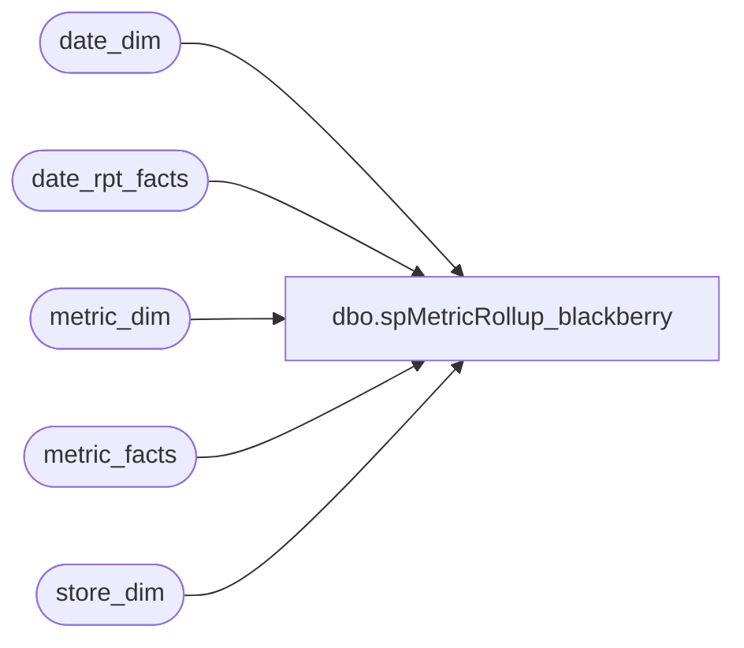

# dbo.spMetricRollup_blackberry

**Database:** dw  
**Server:** papamart  

## Architecture Diagram



## Table Dependencies

| Referenced Table |
|---|
| date_dim |
| date_rpt_facts |
| metric_dim |
| metric_facts |
| store_dim |

## Stored Procedure Code

```sql
/******************************************************************************
**
**	Name:		spMetricRollup_blackberry
**
**	Description: 	Returns results for the Trend Report.
**
**
**	Parameters:	none
**
** 	Returns:	result set
**
**	Examples:	EXEC spMetricRollup_blackberry
**			
**
**	History:	
**  Date 		Author 		Purpose
**  08/07/03		CC and Dan	Created
******************************************************************************/
CREATE      PROCEDURE  spMetricRollup_blackberry
/* ===== ARGUMENTS ===== */	
AS
SET NOCOUNT ON

/* ===== DECLARATIONS ===== */
DECLARE
 @curDay char(2)
,@curMon char(2)
,@curYr char(4)
,@curDate datetime
,@wkCurTY int
,@wk13TY int


SET @curDay = datepart(dd,getdate())
SET @curMon = datepart(mm,getdate())
SET @curYr = datepart(yy,getdate())

--SET @fiscYrTY = @curYr
--SET @fiscYrLY = @curYr-1


SET @curDate = cast((@curMon+'/'+@curDay+'/'+@curYr) as Datetime)
SET @curDate = dateadd(dd, -9,@curDate)

--select @curDate
--  select right('000' + cast(dbo.store_dim.store_id as varchar),3) + ' ' + dbo.store_dim.store_name  from dbo.store_dim

--rollup by day for current week

	select 	sd.store_id
		,sd.store_name
		,right('000' + cast(sd.store_id as varchar),3) + ' ' + sd.store_name  as storeNameNum
		,sd.bearea
		,sd.bearritory
		,sd.region
		,a.actual_date
		,a.fiscal_week
		/*
		,sum(isnull(CASE WHEN a.metric_dim_key = 1 THEN a.amount END,0)) as 'ActualHoneyTY'
		,sum(isnull(CASE WHEN a.metric_dim_key = 1 THEN mf.amount END,0)) as 'ActualHoneyLY'
		,sum(isnull(CASE WHEN a.metric_dim_key = 2 THEN a.amount END,0)) as 'TransactionsTY'
		,sum(isnull(CASE WHEN a.metric_dim_key = 2 THEN mf.amount END,0)) as 'TransactionsLY'
		,sum(isnull(CASE WHEN a.metric_dim_key = 3 THEN a.amount END,0)) as 'InStoreCreditTY'
		,sum(isnull(CASE WHEN a.metric_dim_key = 3 THEN mf.amount END,0)) as 'InStoreCreditLY'
		,sum(isnull(CASE WHEN a.metric_dim_key = 4 THEN a.amount END,0)) as 'ReturnsTY'
		,sum(isnull(CASE WHEN a.metric_dim_key = 4 THEN mf.amount END,0)) as 'ReturnsLY'
		,sum(isnull(CASE WHEN a.metric_dim_key = 5 THEN a.amount END,0)) as 'GiftCardsTY'
		,sum(isnull(CASE WHEN a.metric_dim_key = 5 THEN mf.amount END,0)) as 'GiftCardsLY'
		,sum(isnull(CASE WHEN a.metric_dim_key = 6 THEN a.amount END,0)) as 'BearBucksTY'
		,sum(isnull(CASE WHEN a.metric_dim_key = 6 THEN mf.amount END,0)) as 'BearBucksLY'
		,sum(isnull(CASE WHEN a.metric_dim_key = 7 THEN a.amount END,0)) as 'BuyStuffTY'
		,sum(isnull(CASE WHEN a.metric_dim_key = 7 THEN mf.amount END,0)) as 'BuyStuffLY'
		,sum(isnull(CASE WHEN a.metric_dim_key = 8 THEN a.amount END,0)) as 'MallGCTY'
		,sum(isnull(CASE WHEN a.metric_dim_key = 8 THEN mf.amount END,0)) as 'MallGCLY'
		,sum(isnull(CASE WHEN a.metric_dim_key = 9 THEN a.amount END,0)) as 'PartyDepsTY'
		,sum(isnull(CASE WHEN a.metric_dim_key = 9 THEN mf.amount END,0)) as 'PartyDepsLY'
		,sum(isnull(CASE WHEN a.metric_dim_key = 10 THEN a.amount END,0)) as 'CouponsTY'
		,sum(isnull(CASE WHEN a.metric_dim_key = 10 THEN mf.amount END,0)) as 'CouponsLY'
	
		,sum(isnull(CASE WHEN a.metric_dim_key = 11 THEN a.amount END,0)) as 'DiscountsTY'
		,sum(isnull(CASE WHEN a.metric_dim_key = 11 THEN mf.amount END,0)) as 'DiscountsLY'
		,sum(isnull(CASE WHEN a.metric_dim_key = 12 THEN a.amount END,0)) as 'PartiesTY'
		,sum(isnull(CASE WHEN a.metric_dim_key = 12 THEN mf.amount END,0)) as 'PartiesLY'
		,sum(isnull(CASE WHEN a.metric_dim_key = 13 THEN a.amount END,0)) as 'PartySalesTY'
		,sum(isnull(CASE WHEN a.metric_dim_key = 13 THEN mf.amount END,0)) as 'PartySalesLY'
		,sum(isnull(CASE WHEN a.metric_dim_key = 14 THEN a.amount END,0)) as 'AccessoriesTY'
		,sum(isnull(CASE WHEN a.metric_dim_key = 14 THEN mf.amount END,0)) as 'AccessoriesLY'
		,sum(isnull(CASE WHEN a.metric_dim_key = 15 THEN a.amount END,0)) as 'ShoesTY'
		,sum(isnull(CASE WHEN a.metric_dim_key = 15 THEN mf.amount END,0)) as 'ShoesLY'
		,sum(isnull(CASE WHEN a.metric_dim_key = 16 THEN a.amount END,0)) as 'SoundsTY'
		,sum(isnull(CASE WHEN a.metric_dim_key = 16 THEN mf.amount END,0)) as 'SoundsLY'
		*/
		,sum(isnull(CASE WHEN a.metric_dim_key = 17 THEN a.amount END,0)) as 'NetSalesTY'
		,sum(isnull(CASE WHEN a.metric_dim_key = 17 THEN mf.amount END,0)) as 'NetSalesLY'
		,sum(isnull(CASE WHEN a.metric_dim_key = 18 THEN a.amount END,0)) as 'SalesPlanTY'
		,sum(isnull(CASE WHEN a.metric_dim_key = 18 THEN mf.amount END,0)) as 'SalesPlanLY'
		/*
		,sum(isnull(CASE WHEN a.metric_dim_key = 19 THEN a.amount END,0)) as 'UnitsTY'
		,sum(isnull(CASE WHEN a.metric_dim_key = 19 THEN mf.amount END,0)) as 'UnitsLY'
		,sum(isnull(CASE WHEN a.metric_dim_key = 20 THEN a.amount END,0)) as 'AnimalsTY'
		,sum(isnull(CASE WHEN a.metric_dim_key = 20 THEN mf.amount END,0)) as 'AnimalsLY'

		,sum(isnull(CASE WHEN a.metric_dim_key = 21 THEN a.amount END,0)) as 'NewGuestsTY'
		,sum(isnull(CASE WHEN a.metric_dim_key = 21 THEN mf.amount END,0)) as 'NewGuestsLY'
		,sum(isnull(CASE WHEN a.metric_dim_key = 22 THEN a.amount END,0)) as 'RepeatGuestsTY'
		,sum(isnull(CASE WHEN a.metric_dim_key = 22 THEN mf.amount END,0)) as 'RepeatGuestsLY'
		,sum(isnull(CASE WHEN a.metric_dim_key = 23 THEN a.amount END,0)) as 'GirlRegistrationsTY'
		,sum(isnull(CASE WHEN a.metric_dim_key = 23 THEN mf.amount END,0)) as 'GirlRegistrationsLY'
		,sum(isnull(CASE WHEN a.metric_dim_key = 24 THEN a.amount END,0)) as 'BoyRegistrationsTY'
		,sum(isnull(CASE WHEN a.metric_dim_key = 24 THEN mf.amount END,0)) as 'BoyRegistrationsLY'
		,sum(isnull(CASE WHEN a.metric_dim_key = 25 THEN a.amount END,0)) as 'RegistrationsTY'
		,sum(isnull(CASE WHEN a.metric_dim_key = 25 THEN mf.amount END,0)) as 'RegistrationsLY'
		--,max(isnull(CASE WHEN a.metric_dim_key = 27 THEN a.amount END,0)) as 'GuestSatisfactionTY'
		--,max(isnull(CASE WHEN a.metric_dim_key = 27 THEN mf.amount END,0)) as 'GuestSatisfactionLY'
		,sum(isnull(CASE WHEN a.metric_dim_key = 28 THEN a.amount END,0)) as 'SelfRegistrationsTY'
		,sum(isnull(CASE WHEN a.metric_dim_key = 28 THEN mf.amount END,0)) as 'SelfRegistrationsLY'
		,sum(isnull(CASE WHEN a.metric_dim_key = 29 THEN a.amount END,0)) as 'GiftRegistrationsTY'
		,sum(isnull(CASE WHEN a.metric_dim_key = 29 THEN mf.amount END,0)) as 'GiftRegistrationsLY'
		,sum(isnull(CASE WHEN a.metric_dim_key = 30 THEN a.amount END,0)) as 'SkinsUnitGrossAmtTY'
		,sum(isnull(CASE WHEN a.metric_dim_key = 30 THEN mf.amount END,0)) as 'SkinsUnitGrossAmtLY'
		*/


	from (
	select 	mf1.amount,
		mf1.store_key,
		drf.date_key_TY,
		drf.date_key_LY,
		dd.fiscal_week,
		dd.actual_date,
		mf1.metric_dim_key 
	from metric_facts mf1
	join date_rpt_facts drf 
		on mf1.date_key = drf.date_key_TY
	join date_dim dd on  drf.date_key_TY = dd.date_key
	join store_dim s on s.store_key = mf1.store_key
	--where mf1.store_key = 14  --and mf1.date_key = 2369 mf1.metric_dim_key = 10 and 
	--where dd.week_id >= @wk13TY
	where dd.actual_date = @curDate
	and mf1.metric_freq_key = 'd'
	and s.store_id < 900
	) a
	
	left join metric_facts mf 
		on a.date_key_LY = mf.date_key
		and a.metric_dim_key = mf.metric_dim_key
		and a.store_key = mf.store_key
	join store_dim sd on a.store_key = sd.store_key
	join date_dim dd1 on a.date_key_TY = dd1.date_key
	join metric_dim md on a.metric_dim_key = md.metric_dim_key

	group by sd.store_id
		,sd.store_name
		,sd.bearea
		,sd.bearritory
		,sd.region
		,a.actual_date
		,a.fiscal_week
	
		 
	
/*
select distinct sd.store_id, md.name 
from metric_facts m
join store_dim sd on sd.store_key = m.store_key
join date_dim dd on dd.date_key = m.date_key
join metric_dim md on m.metric_dim_key = md.metric_dim_key
where store_id > 103
and actual_date = '2003-07-29'	
order by sd.store_id

select distinct store_id from dbo.store_dim


select * from metric_facts
where metric_dim_key = 27

*/
```

