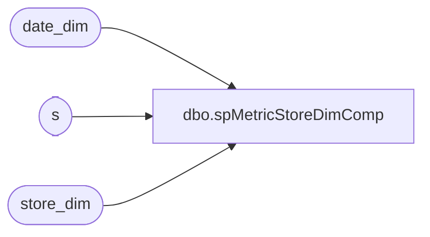

# dbo.spMetricStoreDimComp

**Database:** dw  
**Server:** papamart  

## Architecture Diagram



## Table Dependencies

| Referenced Table |
|---|
| date_dim |
| s |
| store_dim |

## Stored Procedure Code

```sql
CREATE   procedure spMetricStoreDimComp
as

/*
select s.opening_date,s.comp_week_id, d.comp_date, d.comp_week_id, d.week_id,d.day_of_week,s.*
from store_dim s
join 
(
		select LY.actual_date as actual_date
			 , TY.actual_date as comp_date
			 , LY.week_id as week_id
			 , TY.week_id as comp_week_id
			 , TY.day_of_week
		from date_dim TY
		 join date_dim LY on TY.fiscal_quarter = LY.fiscal_quarter 
							and TY.fiscal_period = LY.fiscal_period
							and TY.fiscal_week = LY.fiscal_week 
							and TY.day_of_week = LY.day_of_week
							and TY.fiscal_year = LY.fiscal_year+1
) as d		
on s.opening_date = d.actual_date
where d.day_of_week <> 1
*/


-- --Update for Sunday
-- update s
-- set s.comp_week_id = d.comp_week_id
-- from store_dim s
-- join 
-- (
-- 		select LY.actual_date as actual_date
-- 			 , TY.actual_date as comp_date
-- 			 , LY.week_id as week_id
-- 			 , TY.week_id as comp_week_id
-- 			 , TY.day_of_week
-- 		from date_dim TY
-- 		 join date_dim LY on TY.fiscal_quarter = LY.fiscal_quarter 
-- 							and TY.fiscal_period = LY.fiscal_period
-- 							and TY.fiscal_week = LY.fiscal_week 
-- 							and TY.day_of_week = LY.day_of_week
-- 							and TY.fiscal_year = LY.fiscal_year+1
-- ) as d		
-- on s.opening_date = d.actual_date
-- where d.day_of_week = 1
-- 
-- 
-- --Update for Next Full Week
-- update s
-- set s.comp_week_id = d.comp_week_id+1
-- from store_dim s
-- join 
-- (
-- 		select LY.actual_date as actual_date
-- 			 , TY.actual_date as comp_date
-- 			 , LY.week_id as week_id
-- 			 , TY.week_id as comp_week_id
-- 			 , TY.day_of_week
-- 		from date_dim TY
-- 		 join date_dim LY on TY.fiscal_quarter = LY.fiscal_quarter 
-- 							and TY.fiscal_period = LY.fiscal_period
-- 							and TY.fiscal_week = LY.fiscal_week 
-- 							and TY.day_of_week = LY.day_of_week
-- 							and TY.fiscal_year = LY.fiscal_year+1
-- ) as d		
-- on s.opening_date = d.actual_date
-- where d.day_of_week <> 1


--Update for Sunday opening
update s
set s.comp_week_id = d.week_id
from store_dim s
join date_dim d on s.comp_date = d.actual_date
where d.day_of_week = 1


--Update for Next Full Week
update s
set s.comp_week_id = d.week_id+1
from store_dim s
join date_dim d on s.comp_date = d.actual_date
where d.day_of_week <> 1
```

