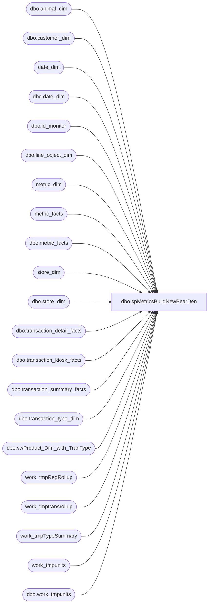

# dbo.spMetricsBuildNewBearDen

**Database:** dw  
**Server:** papamart  

## Architecture Diagram



## Table Dependencies

| Referenced Table |
|---|
| dbo.animal_dim |
| dbo.customer_dim |
| date_dim |
| dbo.date_dim |
| dbo.ld_monitor |
| dbo.line_object_dim |
| metric_dim |
| metric_facts |
| dbo.metric_facts |
| store_dim |
| dbo.store_dim |
| dbo.transaction_detail_facts |
| dbo.transaction_kiosk_facts |
| dbo.transaction_summary_facts |
| dbo.transaction_type_dim |
| dbo.vwProduct_Dim_with_TranType |
| work_tmpRegRollup |
| work_tmptransrollup |
| work_tmpTypeSummary |
| work_tmpunits |
| dbo.work_tmpunits |

## Stored Procedure Code

```sql
--Text
---------------------------------------------------------------------------------------------------------------------------------------------------------------------------------------------------------------------------------------------------------------
--02/12/2007	corrected transaction bucket logic


/****** Object:  Stored Procedure dbo.spMetricsBuild    Script Date: 3/23/2005 ******/

--EXEC spMetricsBuild '12/29/2002','1/25/2003'
-- select min(actual_date), max(actual_date) from date_dim where fiscal_year=2003 and fiscal_period = 1

CREATE PROCEDURE [dbo].[spMetricsBuildNewBearDen]
	/* ===== ARGUMENTS ===== */
	@StartDate 	datetime = NULL, 
	@EndDate 	datetime = NULL,
	@bDebugFl	bit = 0		-- Debug Flag

AS
SET NOCOUNT ON

/* ===== DECLARATIONS ===== */
DECLARE 
	@iRowCnt	INT		-- Used to save @@rowcount
	,@iErrNbr	INT		-- Used to save @@error
	,@iRtnCd	INT		-- Return code of procedure
	,@dStartDt	DATETIME	-- Time this procedure started
	,@dStopDt	DATETIME	-- Time this procedure ended
	,@SQLi 		VARCHAR(8000)
	,@sDateKeyList	VARCHAR(8000) 
	,@curDay 	char(2)
	,@curMon 	char(2)
	,@curYr 	char(4)
	,@curDate 	datetime
	,@wkCurTY 	int

--	,@StartDate	datetime
--	,@EndDate 	datetime
--	,@bDebugFl	bit

--SET @StartDate = NULL
--SET @EndDate = NULL
--SET @bDebugFl = 0

/* ===== INITIALIZE VARIABLES ===== */
SELECT @iRtnCd	= 0	


/* ============================================================================= */
/* ================================  BEGIN  ==================================== */
/* ============================================================================= */


SET @curDay = datepart(dd,getdate())
SET @curMon = datepart(mm,getdate())
SET @curYr = datepart(yy,getdate())


SET @curDate = cast((@curMon+'/'+@curDay+'/'+@curYr) as Datetime)

--SELECT @StartDate ='11/21/2003'
--SELECT @EndDate ='12/4/2003'
IF @StartDate is NULL
BEGIN
	SELECT @StartDate = dateadd(dd, -31,@curDate)  
	SELECT @EndDate =  dateadd(dd, -1,@curDate) 
END
--select @StartDate,@EndDate


/* ----- DEBUG */
IF @bDebugFl = 1

BEGIN
	PRINT 'KEY INDICATORS ROLLUP'
	PRINT ' '
	PRINT @@SERVERNAME + '/' + DB_Name()
	PRINT 'Procedure Name: ' + Object_Name(@@PROCID)
	PRINT 'Parmameter @StartDate: ' + cast(@StartDate as varchar)
	PRINT 'Parmameter @EndDate: ' + cast(@EndDate as varchar)
	PRINT ' '
END
/***************************************************************/
/*********************  DELETE PAST WEEK **********************/
/***************************************************************/


delete --dbo.metric_facts
from dbo.metric_facts 
where date_key IN (select date_key from dbo.date_dim 
	--WHERE actual_date BETWEEN '11/26/2003' AND '12/1/2003 23:59')				
	where actual_date BETWEEN @StartDate AND @EndDate)
and metric_dim_key in (select metric_dim_key from metric_dim 
						where source in ('KIOSK','POS')
						)


--log------------------------------------------------------------
UPDATE dbo.ld_monitor
SET status = 'complete', process_date = getdate()
WHERE step = 8
-----------------------------------------------------------------

/***************************************************************/
/********************* TRANSACTION ROLLUP  *********************/
/***************************************************************/

IF (Object_ID('work_tmptransrollup') IS NOT NULL) DROP TABLE work_tmptransrollup
SELECT   t.transaction_id
	,t.store_key
	,t.date_key
	,t.register_no
	,t.party_y_n
	,ttd.transaction_type
--	,t.UGA
 	,t.Merchandise_UGA
	,t.Coupon_Amt
	,t.Coupon_Units
	,t.Discounts
-- 	,t.Paid_Outs
	,t.Gift_Card_Sold
	,t.Bear_Buck_Tender
	,t.Gift_Card_Tender
	,t.Tax_Tender
	,t.Cash_Tender
	,t.Check_Tender
	,t.Other_Tender
	,t.Amex_Tender
	,t.Discover_Tender
	,t.MasterCard_Tender
	,t.Visa_Tender
	,t.BuyStuff_Tender
	,t.Reward_Cert_Tender
	,t.Shipping
	,t.Other_Fee
	,t.Donations
	,t.Cub_Cash
	,t.GiftCardDiscounts
	,t.Party_Deposit_Merch
	,t.StuffingAndSupplies
-- 	,t.Merch_Units	
	,t.Units
	,t.Donation_Only
	,t.Gift_Card_Only
	,t.Party_Dep_Only
	,t.Paid_Outs
	,t.Net_Sale
	,t.GAAP_Sale
	,t.Receipt_Ttl
	,(isnull(t.Net_Sale,0) - isnull(Shipping,0)) as ttlHoney

INTO work_tmptransrollup 	
FROM dbo.transaction_summary_facts t
JOIN dbo.store_dim s ON s.store_key = t.store_key
JOIN dbo.date_dim d ON d.date_key = t.date_key
LEFT JOIN dbo.transaction_type_dim ttd ON t.transaction_type_key = ttd.transaction_key
	
WHERE d.actual_date  BETWEEN @StartDate AND @EndDate 
--WHERE d.actual_date BETWEEN '12/8/2005' AND '12/8/2005 23:59'
--AND s.store_id = 3
--AND (t.transaction_line_seq >=0)
--AND (t.product_key <> -18)


	

/* ===== CREATE  INDEX ON TRANS ROLLUP TABLE ===== */

CREATE  CLUSTERED INDEX IX_TMPTrans on work_tmptransrollup (store_key, date_key)
CREATE  INDEX IX_TMPTrans_tranID on work_tmptransrollup (transaction_id, register_no)
--select * from work_tmptransrollup where giftcardonly_y_n = 1

--log------------------------------------------------------------
UPDATE dbo.ld_monitor
SET status = 'complete', process_date = getdate()
WHERE step = 9
-----------------------------------------------------------------

/***************************************************************/
/********************** UNITS BY DEPT **************************/
/***************************************************************/


IF (Object_ID('tempdb.dbo.#tmpunits') IS NOT NULL) DROP TABLE dbo.#tmpunits
SELECT  a.transaction_id,
		a.store_key,
		a.date_key,
		a.register_num,
		/*UNIT COUNTS*/
		sum(isnull(CASE WHEN right(a.department_code,2) = 25 OR right(a.subclass_code,2) = 25 OR right(a.department_code,2) = '02'--RZ added
				THEN a.units END,0)) as ttlanimals,	
--		sum(isnull(CASE WHEN a.department IN ('Animals','Dolls','Unstuffed')
--				 OR (a.department = 'Sports Licensing' AND a.subclass = 'Skins')
--				THEN a.units END,0)) as ttlanimals,		
		sum(isnull(CASE WHEN (right(a.department_code,2)  IN (10,15,20,05,30,35,12) and right(subclass_code,2) <> 25) and a.line_object = 100
				THEN a.units END,0)) as ttlnonanimals,		
--		sum(isnull(CASE WHEN a.department IN ('Sports Licensing','Clothes','Clothing','Sounds','Accessories','Footwear','Prestuffed','Human') 
--				AND a.subclass <> 'Skins'
--				THEN a.units END,0)) as ttlnonanimals,
		sum(isnull(CASE WHEN right(department_code,2) NOT IN (25,10,15,20,05,30,35,12) or department_code is null  
				THEN a.units END,0)) as ttlotherunits,
--		sum(isnull(CASE WHEN a.department NOT IN ('Animals','Dolls','Unstuffed','Sports Licensing','Clothes','Clothing','Sounds','Accessories','Footwear','Prestuffed','Human')
--				THEN a.units END,0)) as ttlotherunits,
		sum(isnull(CASE WHEN right(a.department_code,2) = 05 THEN a.units END,0)) as ttlaccessories,
--		sum(isnull(CASE WHEN a.department = 'Accessories' THEN a.units END,0)) as ttlaccessories,
		sum(isnull(CASE WHEN right(a.department_code,2) = 15 THEN a.units END,0)) as ttlshoes,	
--		sum(isnull(CASE WHEN a.department = 'Footwear' THEN a.units END,0)) as ttlshoes,
		sum(isnull(CASE WHEN right(a.department_code,2) = 20 THEN a.units END,0)) as ttlsounds,	
--		sum(isnull(CASE WHEN a.department = 'Sounds' THEN a.units END,0)) as ttlsounds,
		sum(isnull(CASE WHEN a.line_object = 100 THEN a.units END,0)) as ttlunits,
		sum(isnull(CASE WHEN a.line_object IN (294,400,401,402,403,404,410,1625)
				THEN a.units END ,0)) as ttlGiftCardUnits,

		/*UNIT NET AMOUNTS*/
		sum(isnull(CASE WHEN right(a.department_code,2) = 25 OR right(a.subclass_code,2) = 25
				THEN a.unit_net_amount END,0)) as ttlanimalUGA,
--		sum(isnull(CASE WHEN a.department IN ('Animals','Dolls','Unstuffed')
--				 OR (a.department = 'Sports Licensing' AND a.subclass = 'Skins')
--				THEN a.unit_net_amount END,0)) as ttlanimalUGA,
		sum(isnull(CASE WHEN (right(a.department_code,2) IN (10,15,20,05,30,35,12) and right(subclass_code,2) <> 25) and a.line_object = 100
				THEN a.unit_net_amount END,0)) as ttlnonanimalUGA,
--		sum(isnull(CASE WHEN a.department IN ('Sports Licensing','Clothes','Clothing','Sounds','Accessories','Footwear','Prestuffed','Human') 
--				AND a.subclass <> 'Skins'
--				THEN a.unit_net_amount END,0)) as ttlnonanimalUGA,
		sum(isnull(CASE WHEN  right(a.department_code,2) = 15 
				THEN a.unit_net_amount END,0)) as ttlFootwearUGA,
--		sum(isnull(CASE WHEN a.department = 'Footwear' 
--				THEN a.unit_net_amount END,0)) as ttlFootwearUGA,
		sum(isnull(CASE WHEN right(a.department_code,2) = 05 
				THEN a.unit_net_amount END,0)) as ttlAccessoriesUGA,
--		sum(isnull(CASE WHEN a.department = 'Accessories' 
--				THEN a.unit_net_amount END,0)) as ttlAccessoriesUGA,
		sum(isnull(CASE WHEN right(a.department_code,2) = 20  
				THEN a.unit_net_amount END,0)) as ttlSoundsUGA,
--		sum(isnull(CASE WHEN a.department = 'Sounds' 
--				THEN a.unit_net_amount END,0)) as ttlSoundsUGA,

		sum(isnull(CASE WHEN right(a.department_code,2) = 10  
				THEN a.unit_net_amount END,0)) as ttlClothingUGA,
--		sum(isnull(CASE WHEN a.department IN ('Clothes','Clothing')
--				THEN a.unit_net_amount END,0)) as ttlClothingUGA

--		sum(isnull(CASE WHEN a.line_object IN (294,400,401,402,403,404,410,1625)
--				THEN a.unit_net_amount END ,0)) as ttlGiftCardUGA,
--		sum(isnull(CASE WHEN (a.department NOT IN ('Clothes','Clothing','Sounds','Accessories','Footwear') 
--				AND a.subclass <> 'Skins') 
		sum(isnull(CASE WHEN right(department_code,2) NOT IN (25,10,15,20,05,30,35,12) or department_code is null  
				THEN a.unit_net_amount END,0)) as ttlOtherUGA
--				AND a.line_object NOT IN (294,400,401,402,403,404,410,1625)
--				THEN a.unit_net_amount END,0)) as ttlOtherUGA

INTO dbo.#tmpunits	
FROM 
		(
		SELECT  t.transaction_id,
				t.store_key,
				t.date_key,
				t.register_num,
--				p.department,
				p.department_code,
--				p.subclass,
				p.subclass_code,
				lo.line_object,
				sum(isnull(t.units,0)) as units,
				sum(isnull(t.unit_gross_amount,0)) as unit_gross_amount,
--				sum(isnull(t.unit_disc_amount,0)) as unit_disc_amount,
				sum(isnull(CASE WHEN (t.unit_gross_amount > 0 AND t.unit_disc_amount > 0) 
							    THEN t.unit_gross_amount - t.unit_disc_amount
							    WHEN (t.unit_gross_amount > 0 AND t.unit_disc_amount < 0)
							    THEN t.unit_gross_amount - t.unit_disc_amount
							    WHEN (t.unit_gross_amount < 0 AND t.unit_disc_amount > 0)
							    THEN t.unit_gross_amount + t.unit_disc_amount
							    WHEN (t.unit_gross_amount < 0 AND t.unit_disc_amount < 0)	
							    THEN t.unit_gross_amount + t.unit_disc_amount
							    WHEN (t.unit_gross_amount = 0 AND t.unit_disc_amount < 0)
							    THEN t.unit_gross_amount + t.unit_disc_amount
							    WHEN (t.unit_gross_amount = 0 AND t.unit_disc_amount > 0)
							    THEN t.unit_gross_amount - t.unit_disc_amount
								WHEN (t.unit_disc_amount = 0)
							    THEN t.unit_gross_amount 
								ELSE t.unit_gross_amount
				END,0)) as unit_net_amount,
				p.TRAN_TYPE_NUM
			--into #edin_testing				
			FROM dbo.transaction_detail_facts t
			JOIN dbo.store_dim s ON s.store_key = t.store_key
			JOIN dbo.date_dim d ON d.date_key = t.date_key
			left JOIN dbo.vwProduct_Dim_with_TranType p ON p.product_key = t.product_key
			JOIN dbo.line_object_dim lo ON lo.line_object_key = t.line_object_key
		WHERE d.actual_date  BETWEEN @StartDate AND @EndDate
		--WHERE d.actual_date BETWEEN '12/4/2006' AND '12/10/2006 23:59'
		--AND s.store_id =186
			AND (t.transaction_line_seq >=0)
		GROUP BY t.transaction_id,
				 t.store_key,
				 t.date_key,
				 t.register_num,
				 p.department_code,
				 p.subclass_code,
				 lo.line_object,
				 p.TRAN_TYPE_NUM	
	) a


GROUP BY a.transaction_id,
		 a.store_key,
		 a.date_key,
		 a.register_num

-- add sum_type column
IF (Object_ID('work_tmpunits') IS NOT NULL) DROP TABLE work_tmpunits
select u.*, sum_type
into work_tmpunits
from #tmpunits u
join 
(
select transaction_id, sum(tran_type_num) as sum_type from
(
SELECT  transaction_id,
		TRAN_TYPE_NUM
FROM dbo.transaction_detail_facts t
			JOIN dbo.store_dim s ON s.store_key = t.store_key
			JOIN dbo.date_dim d ON d.date_key = t.date_key
left JOIN dbo.vwProduct_Dim_with_TranType p ON p.product_key = t.product_key

		WHERE d.actual_date  BETWEEN @StartDate AND @EndDate
		--WHERE d.actual_date BETWEEN '12/4/2006' AND '12/10/2006 23:59'
		--AND s.store_id =186
		GROUP BY t.transaction_id, p.TRAN_TYPE_NUM
) d
group by transaction_id
) a
on u.transaction_id = a.transaction_id


--select * from dbo.work_tmpunits where transaction_id = 39809256 order by transaction_id


IF (Object_ID('work_tmpTypeSummary') IS NOT NULL) DROP TABLE work_tmpTypeSummary
SELECT  transaction_id,
	store_key,
	date_key,
	register_num,	
	case when sum_type = 1 then 1 else 0 end barebear,
	case when sum_type in (0,2,6) then 1 else 0 end plusonly,
	case when sum_type in (3,7) then 1 else 0 end bearplus,
	case when sum_type = 4 then 1 else 0 end otheronly,
	case when sum_type = 5 then 1 else 0 end bearwithother
into dbo.work_tmpTypeSummary
FROM dbo.work_tmpunits p	
--group by 	
--	transaction_id,
--	store_key,
--	date_key,
--	register_num


--select * from work_tmpTypeSummary ts


--select  sum(barebear) as barebear,
--		sum(bearwithother) as bearwithother,
--		sum(bearplus) as bearplus,
--		sum(plusonly) as plusonly,
--		sum(otheronly) as otheronly,
--		s.store_id,
--		month(d.actual_date) as dmonth,
--		year(d.actual_date) as dyear 
-- 
--from work_tmpTypeSummary ts
--JOIN dbo.store_dim s ON s.store_key = ts.store_key
--JOIN dbo.date_dim d ON d.date_key = ts.date_key
--GROUP BY s.store_id,month(d.actual_date) ,
--		year(d.actual_date)  


----select distinct department,class,subclass from dbo.product_dim order by department
--IF (Object_ID('tempdb.dbo.work_tmpunits') IS NOT NULL) DROP TABLE dbo.work_tmpunits
--
--/** Cece modified on 1/5/05 to include discounts **/
--/*
--sum(isnull(CASE WHEN t.unit_gross_amount >= 0 AND lo.line_object IN (101,294,400,401,402,403,404,410) --including heart donation line obj 
--				THEN (t.unit_disc_amount*-1)
--				WHEN t.unit_gross_amount < 0  AND lo.line_object IN (101,294,400,401,402,403,404,410)
--				THEN t.unit_disc_amount END ,0)) as ttlGiftCardDiscount,
--*/
--
--
--	SELECT  t.transaction_id,
--		t.store_key,
--		t.date_key,
--		t.register_num,
-- 		sum(isnull(CASE WHEN p.department IN ('Dolls','Unstuffed')
--				 OR (p.department = 'Sports Licensing' AND p.subclass = 'Skins')
--				THEN t.units 	END,0)) as ttlanimals,
--		sum(isnull(CASE WHEN p.department IN ('Dolls','Unstuffed')
--				 OR (p.department = 'Sports Licensing' AND p.subclass = 'Skins') 
--				 THEN t.unit_gross_amount 
--				 END,0)) as ttlanimaluga,
--
-- 		--modified 9/14/05 to catch exceptions with returned animals overrung
----		sum(isnull(CASE WHEN p.department IN ('Dolls','Unstuffed')
----				 OR (p.department = 'Sports Licensing' AND p.subclass = 'Skins') 
----				 AND (t.unit_gross_amount < 0 AND t.unit_disc_amount > 0)
----				THEN t.unit_gross_amount + t.unit_disc_amount
----				WHEN p.department IN ('Dolls','Unstuffed')
----				 OR (p.department = 'Sports Licensing' AND p.subclass = 'Skins') 
----				 AND (t.unit_gross_amount > 0 AND t.unit_disc_amount < 0)
----				THEN t.unit_gross_amount  
----				END,0)) as ttlanimaluga,
----		sum(isnull(CASE WHEN right(p.department_code,2) = 25 THEN t.units END,0)) as ttlanimals,
----		sum(isnull(CASE WHEN right(p.department_code,2) = 25 THEN t.unit_gross_amount END,0)) as ttlanimaluga,
--
---- 		sum(isnull(CASE WHEN p.department = 'Unstuffed' AND t.unit_gross_amount < 15 THEN t.units END,0)) as animals_lt15,
---- 		sum(isnull(CASE WHEN p.department = 'Unstuffed' AND t.unit_gross_amount >= 15 AND t.unit_gross_amount < 20 THEN t.units END,0)) as animals_gte15_lt20,
---- 		sum(isnull(CASE WHEN p.department = 'Unstuffed' AND t.unit_gross_amount >= 20 THEN t.units END,0)) as animals_gte20,
--		sum(isnull(CASE WHEN p.department IN ('Sports Licensing','Clothes','Sounds','Accessories','Footwear','Prestuffed','Human') 
--				AND p.subclass <> 'Skins'
--				THEN t.units END,0)) as ttlnonanimals,
--		sum(isnull(CASE WHEN p.department IN ('Sports Licensing','Clothes','Sounds','Accessories','Footwear','Prestuffed','Human') 
--				AND p.subclass <> 'Skins'
--				THEN t.unit_gross_amount END,0)) as ttlnonanimaluga,
--		sum(isnull(CASE WHEN p.department = 'Accessories' THEN t.units END,0)) as ttlaccessories,
--		sum(isnull(CASE WHEN p.department = 'Footwear' THEN t.units END,0)) as ttlshoes,	
--		sum(isnull(CASE WHEN p.department = 'Sounds' THEN t.units END,0)) as ttlsounds,
--		--units = coupons, bear bucks redeemed OR sold, gift cards redeemed OR sold, - basically just merchandise
--
----		sum(isnull(CASE WHEN p.product_key > 0 
----				AND p.department NOT IN ('Supplies','BABW Gift Cards') 
----				AND p.department <> '' AND p.department is not null 
----				THEN t.units END,0)) as ttlunits,
--		sum(isnull(CASE WHEN lo.line_object = 100 
--				THEN t.units END,0)) as ttlunits,
--		
--		sum(isnull(CASE WHEN lo.line_object IN (294,400,401,402,403,404,410,1625)
--				THEN t.units END ,0)) as ttlGiftCardUnits	
--		
----		sum(isnull(CASE WHEN p.product_key = -6 
----				THEN t.units END,0)) as ttlGiftCardUnits
--	
--	INTO dbo.work_tmpunits	
--	FROM dbo.transaction_detail_facts t
--	JOIN dbo.store_dim s ON s.store_key = t.store_key
--	JOIN dbo.date_dim d ON d.date_key = t.date_key
--	JOIN dbo.product_dim p ON p.product_key = t.product_key
--	JOIN dbo.line_object_dim lo ON lo.line_object_key = t.line_object_key
--	WHERE d.actual_date  BETWEEN @StartDate AND @EndDate
--	--WHERE d.actual_date BETWEEN '5/8/2005' AND '5/8/2005 23:59'
--	--AND s.store_id =186
--	AND (t.transaction_line_seq >=0)
--	
--
--	GROUP BY t.transaction_id,
--	 t.store_key,
--	 t.date_key,
--	 t.register_num
	

/* ===== CREATE  INDEX ON UNITS BY DEPT TABLE ===== */
CREATE  INDEX IX_TMPUnits on work_tmpunits (store_key, date_key)

--select * from work_tmpunits where transaction_id = 27411280


--log------------------------------------------------------------
UPDATE dbo.ld_monitor
SET status = 'complete', process_date = getdate()
WHERE step = 10
-----------------------------------------------------------------

/**************************************************************/
/**************************************************************/
/******** ===== INSERT TOTALS INTO METRICS TABLE ===== ********/

/**************************************************************/
/**************************************************************/


INSERT INTO [dbo].[metric_facts](metric_dim_key, [store_key], [date_key], [amount])

select 	1, --metric_dim_key
	a.store_key,
	a.date_key,
	sum(isnull(ttlHoney,0))	

FROM work_tmptransrollup a 

group by a.store_key,
	 a.date_key


INSERT INTO [dbo].[metric_facts](metric_dim_key, [store_key], [date_key], [amount])
select 	2, --all transactions 
	a.store_key,
	a.date_key,
	count(distinct a.transaction_id) 
from work_tmptransrollup a
group by a.store_key,
	 a.date_key


INSERT INTO [dbo].[metric_facts](metric_dim_key, [store_key], [date_key], [amount])
SELECT 	4, --returns
	a.store_key,
	a.date_key,
	count(transaction_id)

FROM work_tmptransrollup a
WHERE receipt_ttl < 0
GROUP BY a.store_key,
	 a.date_key


INSERT INTO [dbo].[metric_facts](metric_dim_key, [store_key], [date_key], [amount])
select 	5, --Gift Cards Redeemed
	a.store_key,
	a.date_key,
	sum(isnull(Gift_Card_Tender,0)) 
from work_tmptransrollup a
group by a.store_key,
	 a.date_key


INSERT INTO [dbo].[metric_facts](metric_dim_key, [store_key], [date_key], [amount])
select 	6, --Bear Bucks Redeemed
	a.store_key,
	a.date_key,
	sum(isnull(Bear_Buck_Tender,0)) 
from work_tmptransrollup a
group by a.store_key,
	 a.date_key


INSERT INTO [dbo].[metric_facts](metric_dim_key, [store_key], [date_key], [amount])
select 	7, --BuyStuff
	a.store_key,
	a.date_key,
	sum(isnull(BuyStuff_Tender,0)) 
from work_tmptransrollup a
group by a.store_key,
	 a.date_key


INSERT INTO [dbo].[metric_facts](metric_dim_key, [store_key], [date_key], [amount])
select 	9, --party deps
	a.store_key,
	a.date_key,
	sum(isnull(Party_Deposit_Merch,0)) 

from work_tmptransrollup a

group by a.store_key,
	 a.date_key


INSERT INTO [dbo].[metric_facts](metric_dim_key, [store_key], [date_key], [amount])
select 	10, --Coupons 
	a.store_key,
	a.date_key,
	sum(isnull(Coupon_Amt,0)) 
from work_tmptransrollup a
--where line_object IN (290,295,1600,1610,1611,1615,1618,1802,1803,1806,1809)
group by a.store_key,
	 a.date_key


INSERT INTO [dbo].[metric_facts](metric_dim_key, [store_key], [date_key], [amount])
select 	11, --discounts (incl coupons) 
	a.store_key,
	a.date_key,
	sum(isnull(Discounts,0)) 

from work_tmptransrollup a

group by a.store_key,
	 a.date_key


INSERT INTO [dbo].[metric_facts](metric_dim_key, [store_key], [date_key], [amount])
select 	12, --parties
	a.store_key,
	a.date_key,
	count(a.transaction_id) 

FROM work_tmptransrollup a

WHERE a.party_y_n = 'y'
group by a.store_key,
	 a.date_key


INSERT INTO [dbo].[metric_facts](metric_dim_key, [store_key], [date_key], [amount])


SELECT 	13, --party sales
	a.store_key,
	a.date_key,
	sum(isnull(PartySale,0))

FROM (
	Select a.transaction_id,
	       a.store_key,
	       a.date_key,
	       sum(isnull(a.Net_sale,0) - (isnull(a.Party_Deposit_Merch,0))) as PartySale

	FROM work_tmptransrollup a

	WHERE a.party_y_n = 'y'

	GROUP BY a.store_key,
	 	 a.date_key,
		 a.transaction_id
      ) a

GROUP BY a.store_key,
	 a.date_key


INSERT INTO [dbo].[metric_facts](metric_dim_key, [store_key], [date_key], [amount])
select 	14, --Accessories
	a.store_key,
	a.date_key,
	sum(isnull(ttlaccessories,0)) 

from work_tmpunits a

group by a.store_key,
	 a.date_key


INSERT INTO [dbo].[metric_facts](metric_dim_key, [store_key], [date_key], [amount])
select 	15, --shoe units
	a.store_key,
	a.date_key,
	sum(isnull(ttlshoes,0)) 

from work_tmpunits a

group by a.store_key,
	 a.date_key


INSERT INTO [dbo].[metric_facts](metric_dim_key, [store_key], [date_key], [amount])
select 	16, --sound units
	a.store_key,
	a.date_key,
	sum(isnull(ttlsounds,0)) 

from work_tmpunits a

group by a.store_key,
	 a.date_key

INSERT INTO [dbo].[metric_facts](metric_dim_key, [store_key], [date_key], [amount])
select 	17, --Net / cash SALES
	a.store_key,
	a.date_key,
	sum(isnull(Net_Sale,0))
		
FROM work_tmptransrollup a 
GROUP BY a.store_key,
	 a.date_key

INSERT INTO [dbo].[metric_facts](metric_dim_key, [store_key], [date_key], [amount])
select 	19, --units
	a.store_key,
	a.date_key,
	sum(isnull(ttlunits,0)) 

from work_tmpunits a

group by a.store_key,
	 a.date_key


INSERT INTO [dbo].[metric_facts](metric_dim_key, [store_key], [date_key], [amount])
select 	20, --Animals / unstuffed units
	a.store_key,
	a.date_key,
	sum(isnull(ttlanimals,0)) 

from work_tmpunits a

group by a.store_key,
	 a.date_key


INSERT INTO [dbo].[metric_facts](metric_dim_key, [store_key], [date_key], [amount])
select 	30, --Skins UGA
	a.store_key,
	a.date_key,
	sum(isnull(ttlanimaluga,0)) 

from work_tmpunits a

group by a.store_key,
	 a.date_key


INSERT INTO [dbo].[metric_facts](metric_dim_key, [store_key], [date_key], [amount])
select 	95, --NetClothingUGA 
	a.store_key,
	a.date_key,
	sum(isnull(ttlclothinguga,0)) 

from work_tmpunits a

group by a.store_key,
	 a.date_key


INSERT INTO [dbo].[metric_facts](metric_dim_key, [store_key], [date_key], [amount])
select 	96, --NetFootwearUGA 
	a.store_key,
	a.date_key,
	sum(isnull(ttlfootwearuga,0)) 

from work_tmpunits a

group by a.store_key,
	 a.date_key


INSERT INTO [dbo].[metric_facts](metric_dim_key, [store_key], [date_key], [amount])
select 	97, --NetAccessoriesUGA 
	a.store_key,
	a.date_key,
	sum(isnull(ttlAccessoriesuga,0)) 

from work_tmpunits a

group by a.store_key,
	 a.date_key


INSERT INTO [dbo].[metric_facts](metric_dim_key, [store_key], [date_key], [amount])
select 	98, --NetSoundsUGA 
	a.store_key,
	a.date_key,
	sum(isnull(ttlSoundsuga,0)) 

from work_tmpunits a

group by a.store_key,
	 a.date_key

INSERT INTO [dbo].[metric_facts](metric_dim_key, [store_key], [date_key], [amount])
select 	99, --NetSoundsUGA 
	a.store_key,
	a.date_key,
	sum(isnull(ttlotheruga,0)) 

from work_tmpunits a

group by a.store_key,
	 a.date_key


INSERT INTO [dbo].[metric_facts](metric_dim_key, [store_key], [date_key], [amount])
select 	31, --NonSkin UGA
	a.store_key,
	a.date_key,
	sum(isnull(ttlnonanimaluga,0)) 

from work_tmpunits a

group by a.store_key,
	 a.date_key

INSERT INTO [dbo].[metric_facts](metric_dim_key, [store_key], [date_key], [amount])

select 	32, --NonAnimal units 
	a.store_key,
	a.date_key,
	sum(isnull(ttlnonanimals,0)) 

from work_tmpunits a

group by a.store_key,
	 a.date_key


--select  sum(barebear) as barebear,
--		sum(bearwithother) as bearwithother,
--		sum(bearplus) as bearplus,
--		sum(plusonly) as plusonly,
--		sum(otheronly) as otheronly,
--		s.store_id,
--		month(d.actual_date) as dmonth,
--		year(d.actual_date) as dyear 
-- 
--from work_tmpTypeSummary ts


INSERT INTO [dbo].[metric_facts](metric_dim_key, [store_key], [date_key], [amount])
select 	33, --Bare Bear Transactions
	a.store_key,
	a.date_key,
	sum(barebear)

from work_tmpTypeSummary a
group by a.store_key,
	 a.date_key

INSERT INTO [dbo].[metric_facts](metric_dim_key, [store_key], [date_key], [amount])
select 	34, --Bear Plus
	a.store_key,
	a.date_key,
	sum(bearplus)

from work_tmpTypeSummary a
group by a.store_key,
	 a.date_key


INSERT INTO [dbo].[metric_facts](metric_dim_key, [store_key], [date_key], [amount])
select 	35, --Plus Only
	a.store_key,
	a.date_key,
	sum(plusonly)

from work_tmpTypeSummary a
group by a.store_key,
	 a.date_key


INSERT INTO [dbo].[metric_facts](metric_dim_key, [store_key], [date_key], [amount])
select 	100, --Bear with Other
	a.store_key,
	a.date_key,
	sum(bearwithother)

from work_tmpTypeSummary a
group by a.store_key,
	 a.date_key


INSERT INTO [dbo].[metric_facts](metric_dim_key, [store_key], [date_key], [amount])
select 	101, --Other Only 
	a.store_key,
	a.date_key,
	sum(otheronly)

from work_tmpTypeSummary a
group by a.store_key,
	 a.date_key


INSERT INTO [dbo].[metric_facts](metric_dim_key, [store_key], [date_key], [amount])
select 	39, --shoe transactions
	a.store_key,
	a.date_key,
	count(transaction_id) 

from work_tmpunits a
where ttlshoes > 0
group by a.store_key,
	 a.date_key


-- select * from work_tmpunits where ttlsounds > 0
INSERT INTO [dbo].[metric_facts](metric_dim_key, [store_key], [date_key], [amount])
select 	40, --sound transactions
	a.store_key,
	a.date_key,
	count(transaction_id) 

from work_tmpunits a
where ttlsounds > 0
group by a.store_key,
	 a.date_key


INSERT INTO [dbo].[metric_facts](metric_dim_key, [store_key], [date_key], [amount])
select 	41, --ttlBBUXsold  
	a.store_key,
	a.date_key,
	sum(isnull(Gift_Card_Sold+GiftCardDiscounts,0)) 

from work_tmptransrollup a

group by a.store_key,
	 a.date_key

--42 = Sales Plan CA
--43 = ActualHoneyDiscount

INSERT INTO [dbo].[metric_facts](metric_dim_key, [store_key], [date_key], [amount])
select 	44, --party units 
	a.store_key,
	a.date_key,
	sum(isnull(Units,0)) 

from work_tmptransrollup a
where party_y_n = 'y'

group by a.store_key,
	 a.date_key


INSERT INTO [dbo].[metric_facts](metric_dim_key, [store_key], [date_key], [amount])
select 	45, --Bare Bear Sales
	a.store_key,
	a.date_key,
	sum(isnull(Net_Sale,0))

FROM work_tmptransrollup a
JOIN work_tmpTypeSummary b ON a.transaction_id = b.transaction_id
where b.barebear = 1
group by a.store_key,
	 a.date_key


INSERT INTO [dbo].[metric_facts](metric_dim_key, [store_key], [date_key], [amount])
select 	46, --Bear Plus Sales
	a.store_key,
	a.date_key,
	sum(isnull(Net_Sale,0))

FROM work_tmptransrollup a
JOIN work_tmpTypeSummary b ON a.transaction_id = b.transaction_id
where b.bearplus = 1
group by a.store_key,
	 a.date_key


INSERT INTO [dbo].[metric_facts](metric_dim_key, [store_key], [date_key], [amount])
select 	47, -- Plus Only Sales
	a.store_key,
	a.date_key,
	sum(isnull(Net_Sale,0))

FROM work_tmptransrollup a
JOIN work_tmpTypeSummary b ON a.transaction_id = b.transaction_id
where b.plusonly = 1
group by a.store_key,
	 a.date_key


INSERT INTO [dbo].[metric_facts](metric_dim_key, [store_key], [date_key], [amount])
select 	103, -- BearWithOtherSales
	a.store_key,
	a.date_key,
	sum(isnull(Net_Sale,0))

FROM work_tmptransrollup a
JOIN work_tmpTypeSummary b ON a.transaction_id = b.transaction_id
where b.bearwithother = 1
group by a.store_key,
	 a.date_key


INSERT INTO [dbo].[metric_facts](metric_dim_key, [store_key], [date_key], [amount])
select 	105, -- OtherOnlySales
	a.store_key,
	a.date_key,
	sum(isnull(Net_Sale,0))

FROM work_tmptransrollup a
JOIN work_tmpTypeSummary b ON a.transaction_id = b.transaction_id
where b.otheronly = 1
group by a.store_key,
	 a.date_key


INSERT INTO [dbo].[metric_facts](metric_dim_key, [store_key], [date_key], [amount])
select 	48, --Gift Card Only Transactions 
	a.store_key,
	a.date_key,
	count(transaction_id)
	--sum(isnull(a.Gift_Card_Only,0))

from 	work_tmptransrollup a
where a.Gift_Card_Only = 1
group by a.store_key,
	 a.date_key

INSERT INTO [dbo].[metric_facts](metric_dim_key, [store_key], [date_key], [amount])
select 	49, --gift card only sales
	a.store_key,
	a.date_key,
	sum(isnull(GAAP_sale,0))

FROM  	work_tmptransrollup a
where a.Gift_Card_Only = 1
GROUP BY a.store_key,
	 a.date_key


INSERT INTO [dbo].[metric_facts](metric_dim_key, [store_key], [date_key], [amount])
select 	50, --actual transactions = ttl excluding returns
	a.store_key,
	a.date_key,
	count(transaction_id)

FROM work_tmptransrollup a
WHERE receipt_ttl >= 0
GROUP BY a.store_key,
	 a.date_key


INSERT INTO [dbo].[metric_facts](metric_dim_key, [store_key], [date_key], [amount])
select 	53, --Bare Bear 
	a.store_key,
	a.date_key,
	sum(isnull(Units,0)) 

from work_tmptransrollup a
JOIN work_tmpTypeSummary b ON a.transaction_id = b.transaction_id
where b.barebear = 1
group by a.store_key,
	 a.date_key

INSERT INTO [dbo].[metric_facts](metric_dim_key, [store_key], [date_key], [amount])
select 	54, --Bear Plus Units
	a.store_key,
	a.date_key,
	sum(isnull(Units,0))

from work_tmptransrollup a
JOIN work_tmpTypeSummary b ON a.transaction_id = b.transaction_id
where b.bearplus = 1
group by a.store_key,
	 a.date_key

INSERT INTO [dbo].[metric_facts](metric_dim_key, [store_key], [date_key], [amount])
select 	55, -- Plus Only Units
	a.store_key,
	a.date_key,
	sum(isnull(Units,0))

from work_tmptransrollup a
JOIN work_tmpTypeSummary b ON a.transaction_id = b.transaction_id
where b.plusonly = 1
group by a.store_key,
	 a.date_key


INSERT INTO [dbo].[metric_facts](metric_dim_key, [store_key], [date_key], [amount])
select 	102, -- BearWithOtherTransUnits
	a.store_key,
	a.date_key,
	sum(isnull(Units,0))

from work_tmptransrollup a
JOIN work_tmpTypeSummary b ON a.transaction_id = b.transaction_id
where b.bearwithother = 1
group by a.store_key,
	 a.date_key


INSERT INTO [dbo].[metric_facts](metric_dim_key, [store_key], [date_key], [amount])
select 	104, -- OtherOnlyUnits
	a.store_key,
	a.date_key,
	sum(isnull(Units,0))

from work_tmptransrollup a
JOIN work_tmpTypeSummary b ON a.transaction_id = b.transaction_id
where b.otheronly = 1
group by a.store_key,
	 a.date_key

INSERT INTO [dbo].[metric_facts](metric_dim_key, [store_key], [date_key], [amount])
select 	56, -- GiftCardOnly units
	a.store_key,
	a.date_key,
	sum(isnull(u.ttlGiftCardUnits,0))

from 	work_tmptransrollup a
join 	work_tmpunits u on a.transaction_id = u.transaction_id
	and a.store_key = u.store_key
	and a.date_key = u.date_key

where a.Gift_Card_Only = 1
group by a.store_key,
	 a.date_key


INSERT INTO [dbo].[metric_facts](metric_dim_key, [store_key], [date_key], [amount])
select 	59,  --Reward Certificates
	a.store_key,
	a.date_key,
	sum(isnull(Reward_Cert_Tender,0)) 
from work_tmptransrollup a
group by a.store_key,
	 a.date_key


INSERT INTO [dbo].[metric_facts](metric_dim_key, [store_key], [date_key], [amount])
select 	60, -- Party Guests
	a.store_key,
	a.date_key,
	sum(isnull(u.ttlAnimals,0)) 

from work_tmptransrollup a
join 	work_tmpunits u on a.transaction_id = u.transaction_id
	and a.store_key = u.store_key
	and a.date_key = u.date_key
where a.party_y_n = 'y'
group by a.store_key,
	 a.date_key


INSERT INTO [dbo].[metric_facts](metric_dim_key, [store_key], [date_key], [amount])
select 	64, --GAAP SALES
	a.store_key,
	a.date_key,
	sum(isnull(a.GAAP_sale,0))
		
FROM work_tmptransrollup a 
GROUP BY a.store_key,
	 a.date_key


INSERT INTO [dbo].[metric_facts](metric_dim_key, [store_key], [date_key], [amount])
select 	66, --GAAP transactions
	a.store_key,
	a.date_key,
	count(transaction_id)

FROM work_tmptransrollup a
WHERE receipt_ttl >= 0 
AND Donation_Only = 0
AND Gift_Card_Only = 0
AND Party_Dep_Only = 0
GROUP BY a.store_key,
	 a.date_key


INSERT INTO [dbo].[metric_facts](metric_dim_key, [store_key], [date_key], [amount])

SELECT 	67, --GAAP party sales
	a.store_key,
	a.date_key,
	sum(isnull(GAAP_sale,0))
FROM work_tmptransrollup a

WHERE a.party_y_n = 'y'

GROUP BY a.store_key,
	 a.date_key


INSERT INTO [dbo].[metric_facts](metric_dim_key, [store_key], [date_key], [amount])
select 	68, --GAAP Bare Bear Sales
	a.store_key,
	a.date_key,
	sum(isnull(GAAP_Sale,0))

FROM work_tmptransrollup a
where transaction_type = 'Bare Bear'
group by a.store_key,
	 a.date_key


INSERT INTO [dbo].[metric_facts](metric_dim_key, [store_key], [date_key], [amount])
select 	69, --GAAP Bear Plus Sales
	a.store_key,
	a.date_key,
	sum(isnull(GAAP_Sale,0))

FROM work_tmptransrollup a
where transaction_type = 'Bear Plus'
group by a.store_key,
	 a.date_key


INSERT INTO [dbo].[metric_facts](metric_dim_key, [store_key], [date_key], [amount])
select 	70, -- GAAP Plus Only Sales
	a.store_key,
	a.date_key,
	sum(isnull(GAAP_Sale,0))

FROM work_tmptransrollup a
where transaction_type = 'Plus Only'
group by a.store_key,
	 a.date_key


INSERT INTO [dbo].[metric_facts](metric_dim_key, [store_key], [date_key], [amount])
select 	71, --Tax
	a.store_key,
	a.date_key,
	sum(isnull(Tax_Tender,0)) 
from work_tmptransrollup a
group by a.store_key,
	 a.date_key


INSERT INTO [dbo].[metric_facts](metric_dim_key, [store_key], [date_key], [amount])
select 	72, --Cash
	a.store_key,
	a.date_key,
	sum(isnull(Cash_Tender,0)) 
from work_tmptransrollup a
group by a.store_key,
	 a.date_key

INSERT INTO [dbo].[metric_facts](metric_dim_key, [store_key], [date_key], [amount])
select 	73, --Checks
	a.store_key,
	a.date_key,
	sum(isnull(Check_Tender,0)) 
from work_tmptransrollup a
group by a.store_key,
	 a.date_key


INSERT INTO [dbo].[metric_facts](metric_dim_key, [store_key], [date_key], [amount])
select 	74, --OtherTender
	a.store_key,
	a.date_key,
	sum(isnull(Other_Tender,0)) 
from work_tmptransrollup a
group by a.store_key,
	 a.date_key


INSERT INTO [dbo].[metric_facts](metric_dim_key, [store_key], [date_key], [amount])
select 	75, --Amex_Tender
	a.store_key,
	a.date_key,
	sum(isnull(Amex_Tender,0)) 
from work_tmptransrollup a
group by a.store_key,
	 a.date_key

INSERT INTO [dbo].[metric_facts](metric_dim_key, [store_key], [date_key], [amount])
select 	76, --Discover_Tender
	a.store_key,
	a.date_key,
	sum(isnull(Discover_Tender,0)) 
from work_tmptransrollup a
group by a.store_key,
	 a.date_key

INSERT INTO [dbo].[metric_facts](metric_dim_key, [store_key], [date_key], [amount])
select 	77, --MasterCard_Tender
	a.store_key,
	a.date_key,
	sum(isnull(MasterCard_Tender,0)) 
from work_tmptransrollup a
group by a.store_key,
	 a.date_key


INSERT INTO [dbo].[metric_facts](metric_dim_key, [store_key], [date_key], [amount])
select 	78, --Visa_Tender
	a.store_key,
	a.date_key,
	sum(isnull(Visa_Tender,0)) 
from work_tmptransrollup a
group by a.store_key,
	 a.date_key
	
	

INSERT INTO [dbo].[metric_facts](metric_dim_key, [store_key], [date_key], [amount])
select 	79,   --GiftCardDiscounts
	a.store_key,
	a.date_key,
	sum(isnull(GiftCardDiscounts,0)) 

from work_tmptransrollup a

group by a.store_key,
	 a.date_key


INSERT INTO [dbo].[metric_facts](metric_dim_key, [store_key], [date_key], [amount])
select 	80, --CouponUnits
	a.store_key,
	a.date_key,
	sum(isnull(Coupon_Units,0)) 
from work_tmptransrollup a
group by a.store_key,
	 a.date_key


INSERT INTO [dbo].[metric_facts](metric_dim_key, [store_key], [date_key], [amount])
select 	81, --MerchandiseUGA
	a.store_key,
	a.date_key,
	sum(isnull(Merchandise_UGA,0)) 
from work_tmptransrollup a
group by a.store_key,
	 a.date_key


INSERT INTO [dbo].[metric_facts](metric_dim_key, [store_key], [date_key], [amount])
select 	82, --Donations
	a.store_key,

	a.date_key,
	sum(isnull(Donations,0)) 
from work_tmptransrollup a
group by a.store_key,
	 a.date_key

INSERT INTO [dbo].[metric_facts](metric_dim_key, [store_key], [date_key], [amount])
select 	83, --StuffingAndSupplies
	a.store_key,
	a.date_key,
	sum(isnull(StuffingAndSupplies,0)) 
from work_tmptransrollup a
group by a.store_key,
	 a.date_key


INSERT INTO [dbo].[metric_facts](metric_dim_key, [store_key], [date_key], [amount])
select 	84, --CubCash
	a.store_key,
	a.date_key,
	sum(isnull(Cub_Cash,0)) 
from work_tmptransrollup a
group by a.store_key,
	 a.date_key


INSERT INTO [dbo].[metric_facts](metric_dim_key, [store_key], [date_key], [amount])
select 	85, --Shipping
	a.store_key,
	a.date_key,
	sum(isnull(Shipping,0)) 
from work_tmptransrollup a
group by a.store_key,
	 a.date_key


INSERT INTO [dbo].[metric_facts](metric_dim_key, [store_key], [date_key], [amount])
select 	86,  --OtherFees
	a.store_key,
	a.date_key,
	sum(isnull(Other_Fee,0)) 
from work_tmptransrollup a
group by a.store_key,
	 a.date_key


INSERT INTO [dbo].[metric_facts](metric_dim_key, [store_key], [date_key], [amount])
select 	87,  --PartyDepOnlyTrans
	a.store_key,
	a.date_key,
	count(transaction_id)
	--sum(isnull(a.party_dep_only,0))

from 	work_tmptransrollup a
where a.party_dep_only = 1
group by a.store_key,
	 a.date_key


INSERT INTO [dbo].[metric_facts](metric_dim_key, [store_key], [date_key], [amount])
select 	88, --DonationOnlyTrans
	a.store_key,
	a.date_key,
	count(transaction_id)
	--sum(isnull(a.donation_only,0))

from 	work_tmptransrollup a
where a.donation_only = 1
group by a.store_key,
	 a.date_key


INSERT INTO [dbo].[metric_facts](metric_dim_key, [store_key], [date_key], [amount])
select 	89,  --PaidOuts
	a.store_key,
	a.date_key,
	sum(isnull(a.paid_outs,0))

from 	work_tmptransrollup a
group by a.store_key,
	 a.date_key

-- --log------------------------------------------------------------
-- INSERT INTO dw.dbo.ld_monitor(process_name, status, process_date)
-- VALUES('spMetricsBuild_GAAP', '16 of 17', getdate())
-- -----------------------------------------------------------------
--log------------------------------------------------------------
UPDATE dbo.ld_monitor
SET status = 'complete', process_date = getdate()
WHERE step = 11
-----------------------------------------------------------------


/***************************************************************/
/************************ REGISTRATIONS ************************/
/***************************************************************/

-- IF (Object_ID('tempdb..work_tmpRegRollup') IS NOT NULL) DROP TABLE work_tmpRegRollup
-- select 	tdf.store_key,
-- 
-- 	tdf.date_key,
-- 	count(distinct
-- 	CASE 	WHEN tdf.transaction_line_seq < 0 
--  		THEN ad.animal_id
-- 		ELSE null
-- 	END) as NumAnimalsReg,
-- 	count(distinct
-- 	CASE 	WHEN tdf.transaction_line_seq < 0 AND tdf.animal_key <> 0 AND cd.gender = 'M'
--  		THEN ad.animal_id
-- 		ELSE null
-- 	END) as NumBoyReg,
-- 	count(distinct
-- 	CASE 	WHEN tdf.transaction_line_seq < 0 AND tdf.animal_key <> 0 AND cd.gender = 'F'
--  		THEN ad.animal_id
-- 		ELSE null
-- 	END) as NumGirlReg,
-- 	count(distinct
-- 	CASE 	WHEN tdf.transaction_line_seq < 0 AND tdf.animal_key <> 0 AND tdf.purpose_key = 2
--  		THEN ad.animal_id
-- 		ELSE null
-- 	END) as NumGiftReg,
-- 	count(distinct
-- 	CASE 	WHEN tdf.transaction_line_seq < 0 AND tdf.animal_key <> 0 AND tdf.purpose_key = 1 
--  		THEN ad.animal_id
-- 		ELSE null
-- 	END) as NumSelfReg
-- into work_tmpRegRollup
-- 
-- from dbo.transaction_detail_facts tdf
-- join dbo.animal_dim ad ON tdf.animal_key = ad.animal_key
-- left join dbo.customer_dim cd ON ad.Reference_ID = cd.customer_num
-- join dbo.date_dim d on tdf.date_key = d.date_key 
-- join dbo.store_dim s on tdf.store_key = s.store_key
-- WHERE d.actual_date BETWEEN @StartDate AND @EndDate   
-- --WHERE d.actual_date >= '12/11/2003' 
-- AND tdf.transaction_line_seq < 0
-- --AND s.store_id = 1
-- --WHERE d.fiscal_year = 2003 and d.fiscal_week = 46	

-- GROUP BY tdf.store_key,
-- 	 tdf.date_key


IF (Object_ID('work_tmpRegRollup') IS NOT NULL) DROP TABLE work_tmpRegRollup
select 	tdf.store_key,
	tdf.date_key,
	count(distinct isnull(ad.animal_id,0)) as NumAnimalsReg,
	count(distinct
	CASE 	WHEN tdf.animal_key <> 0 AND cd.gender = 'M'
 		THEN ad.animal_id
		ELSE null
	END) as NumBoyReg,
	count(distinct
	CASE 	WHEN tdf.animal_key <> 0 AND cd.gender = 'F'
 		THEN ad.animal_id
		ELSE null
	END) as NumGirlReg,
	count(distinct
	CASE 	WHEN tdf.animal_key <> 0 AND tdf.purpose_key = 2
 		THEN ad.animal_id
		ELSE null
	END) as NumGiftReg,
	count(distinct
	CASE 	WHEN  tdf.animal_key <> 0 AND tdf.purpose_key = 1 
 		THEN ad.animal_id
		ELSE null
	END) as NumSelfReg,

	count(distinct
	CASE 	WHEN  tdf.purpose_key = 1 AND tdf.guest_type_key IN (1,2) 
 		THEN tdf.customer_key
		ELSE null
	END) as NumSelfRecipGuest,

	count(distinct
	CASE 	WHEN  tdf.purpose_key = 2 AND tdf.guest_type_key = 2 
 		THEN tdf.customer_key
		ELSE null
	END) as NumGiftGiverGuest,

	count(distinct
	CASE 	WHEN  tdf.purpose_key = 2 AND tdf.guest_type_key = 1 
 		THEN tdf.customer_key
		ELSE null
	END) as NumGiftRecipGuest,

	count(distinct
	CASE 	WHEN tdf.First_vs_Repeat = 'first'
 		THEN tdf.household_key --tdf.transaction_id
		ELSE null
	END) as NumNewVis,
	count(distinct
	CASE 	WHEN tdf.First_vs_Repeat = 'repeat'
 		THEN household_key --tdf.transaction_id
		ELSE null
	END) as NumRepeatVis
into work_tmpRegRollup

from dbo.transaction_kiosk_facts tdf
join dbo.animal_dim ad ON tdf.animal_key = ad.animal_key
join dbo.customer_dim cd ON tdf.customer_key = cd.customer_key
join dbo.date_dim d on tdf.date_key = d.date_key 
join dbo.store_dim s on tdf.store_key = s.store_key
WHERE d.actual_date BETWEEN @StartDate AND @EndDate   
--WHERE d.actual_date >= '11/11/2005' 
--AND s.store_id = 1
--WHERE d.fiscal_year = 2003 and d.fiscal_week = 46	
GROUP BY tdf.store_key,
	 tdf.date_key

--select * from work_tmpRegRollup


/* ===== CREATE  INDEX ON REG ROLLUP TABLE ===== */
CREATE  INDEX IX_TMPRegRoll on work_tmpRegRollup (store_key, date_key)

INSERT INTO [dbo].[metric_facts](metric_dim_key, [store_key], [date_key], [amount])
select 	92, --GiftRecipientGuests
	a.store_key,
	a.date_key,
	NumGiftRecipGuest 

from work_tmpRegRollup a


INSERT INTO [dbo].[metric_facts](metric_dim_key, [store_key], [date_key], [amount])
select 	93, --SelfRecipientGuests
	a.store_key,
	a.date_key,
	NumSelfRecipGuest 

from work_tmpRegRollup a

INSERT INTO [dbo].[metric_facts](metric_dim_key, [store_key], [date_key], [amount])
select 	94, --GiftGiverGuests
	a.store_key,
	a.date_key,
	NumGiftGiverGuest 

from work_tmpRegRollup a

INSERT INTO [dbo].[metric_facts](metric_dim_key, [store_key], [date_key], [amount])
select 	23, --Girl Reg
	a.store_key,
	a.date_key,
	NumGirlReg 

from work_tmpRegRollup a


INSERT INTO [dbo].[metric_facts](metric_dim_key, [store_key], [date_key], [amount])
select 	24, --Boy Reg
	a.store_key,
	a.date_key,
	NumBoyReg

from work_tmpRegRollup a


INSERT INTO [dbo].[metric_facts](metric_dim_key, [store_key], [date_key], [amount])
select 	25, --Registrations
	a.store_key,
	a.date_key,
	NumAnimalsReg

from work_tmpRegRollup a


INSERT INTO [dbo].[metric_facts](metric_dim_key, [store_key], [date_key], [amount])
select 	28, --Self Reg
	a.store_key,
	a.date_key,
	NumSelfReg

from work_tmpRegRollup a


INSERT INTO [dbo].[metric_facts](metric_dim_key, [store_key], [date_key], [amount])
select 	29, --Gift Reg
	a.store_key,
	a.date_key,
	NumGiftReg

from work_tmpRegRollup a

INSERT INTO [dbo].[metric_facts](metric_dim_key, [store_key], [date_key], [amount])
select 	91, --New Guests
	a.store_key,
	a.date_key,
	NumNewVis

from work_tmpRegRollup a


INSERT INTO [dbo].[metric_facts](metric_dim_key, [store_key], [date_key], [amount])
select 	22, --Gift Reg
	a.store_key,
	a.date_key,
	NumRepeatVis

from work_tmpRegRollup a


--log------------------------------------------------------------
UPDATE dbo.ld_monitor
SET status = 'complete', process_date = getdate()
WHERE step = 12
-----------------------------------------------------------------


/*************************************************
** Fill in the missing date_key blanks
** Added:  Dan M. 10/10/03
**************************************************/
---- get 26 months of date_keys
select * into #date_dim
from date_dim where actual_date >= dateadd(mm,-26,getdate()) and actual_date <= dateadd(mm,2,getdate())

---- populate a table with every combination
select date_key, store_key,metric_dim_key
into #metric_cross_join
from #date_dim dd
	cross join metric_dim mf 
	cross join store_dim sd 

---- insert the blanks
INSERT INTO dbo.metric_facts(metric_dim_key, store_key, date_key, amount)
select mc.metric_dim_key
	,mc.store_key
	,mc.date_key
	,0
 from #metric_cross_join mc
	left join metric_facts mf on mc.date_key = mf.date_key 
		and mc.store_key = mf.store_key
		and mc.metric_dim_key = mf.metric_dim_key
where mf.date_key is null

-- --log------------------------------------------------------------
-- INSERT INTO dw.dbo.ld_monitor(process_name, status, process_date)
-- VALUES('spMetricsBuild_GAAP', '17 of 17', getdate())
-- -----------------------------------------------------------------
--log------------------------------------------------------------
UPDATE dbo.ld_monitor
SET status = 'complete', process_date = getdate()
WHERE step = 13
-----------------------------------------------------------------

---- rebuild the indexes on metric_facts
--DBCC DBREINDEX (metric_facts, '', 80)

/**************************************************/
-- 3/9/05 DanM--now called separately in DTS package; 
-- /*==========================================================================
-- == Call the procedure for "Jacks Facts"
-- =================================================================*/
-- DECLARE @RC int

-- 
-- EXEC @RC = dw.dbo.spTransactionSummaryBuild @StartDate, @EndDate
-- /*==========================================================================*/


SET NOCOUNT OFF
Return(@iRtnCd)
```

