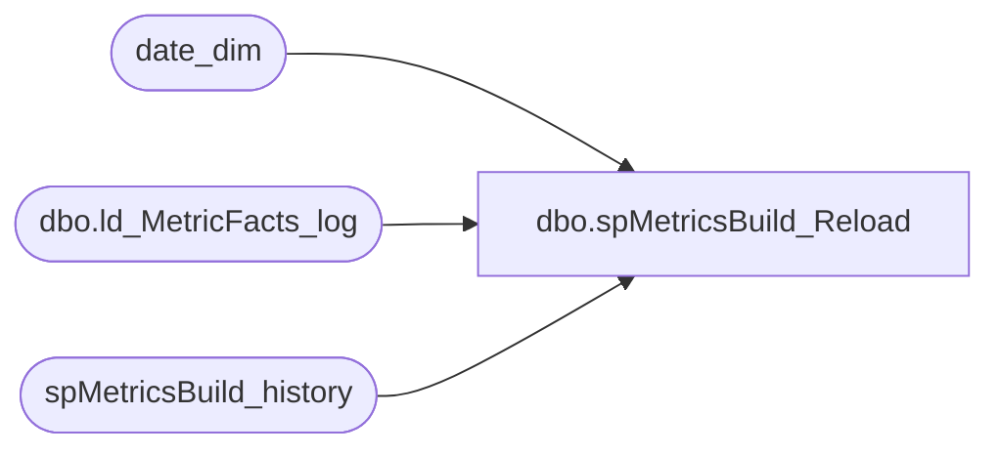

# dbo.spMetricsBuild_Reload

**Database:** dw  
**Server:** papamart  

## Architecture Diagram



## Table Dependencies

| Referenced Table |
|---|
| date_dim |
| dbo.ld_MetricFacts_log |
| spMetricsBuild_history |

## Stored Procedure Code

```sql
/**************************************************************************
* Purpose:  This procedure is a "shell" that calculates 
*			monthly intervals based on the input parameters given 
*			and then passes those monthly intervals to spMetricsBuild.
*			
*			This proc is to be used when the Metrics Facts table
*			needs to be rebuilt over a several month/year span
*
* Sample:	exec spMetricsBuild_Reload '1/1/03', '1/31/04'
*
* Author: 	Dan Morgan
* Created:	1/15/04 
*
* Notes:	This rebuilds one month at a time.
*			The EndDt parameter passed in should be the end of a month.
*
***************************************************************************/

CREATE  PROCEDURE [dbo].[spMetricsBuild_Reload] 
@StartDt datetime
,@EndDt datetime
as
DECLARE
 @cur_mo_num int
,@cur_yr_num int
,@cur_mo_beg_dt datetime
,@cur_mo_end_dt datetime
,@next_mo_beg_dt datetime


SET @cur_mo_beg_dt = @StartDt
SET @cur_mo_num = (select dd.month from date_dim dd where dd.actual_date = @cur_mo_beg_dt)
SET @cur_yr_num = (select dd.year from date_dim dd where dd.actual_date = @cur_mo_beg_dt)

SET @cur_mo_beg_dt = (select min(dd.actual_date) from date_dim dd where dd.year=@cur_yr_num and dd.month=@cur_mo_num)
SET @cur_mo_end_dt = (select max(dd.actual_date) from date_dim dd where dd.year=@cur_yr_num and dd.month=@cur_mo_num)

WHILE @cur_mo_end_dt <=@EndDt
BEGIN
	SET @cur_mo_num = (select dd.month from date_dim dd where dd.actual_date = @cur_mo_beg_dt)
	SET @cur_yr_num = (select dd.year from date_dim dd where dd.actual_date = @cur_mo_beg_dt)
	
	SET @cur_mo_beg_dt = (select min(dd.actual_date) from date_dim dd where dd.year=@cur_yr_num and dd.month=@cur_mo_num)
	SET @cur_mo_end_dt = (select max(dd.actual_date) from date_dim dd where dd.year=@cur_yr_num and dd.month=@cur_mo_num)

	--EXEC spMetricsBuild @cur_mo_beg_dt, @cur_mo_end_dt
	EXEC spMetricsBuild_history @cur_mo_beg_dt, @cur_mo_end_dt

	--log--
	INSERT INTO DBAUtility.dbo.ld_MetricFacts_log(begin_date, end_date, process_name, process_date)
	--VALUES(@cur_mo_beg_dt, @cur_mo_end_dt, 'spMetricsBuild_Reload', getdate())
	VALUES(@cur_mo_beg_dt, @cur_mo_end_dt, 'spMetricsBuild_history', getdate())
	

	SET @cur_mo_beg_dt = (dateadd(dd,1,@cur_mo_end_dt))
		
END
```

