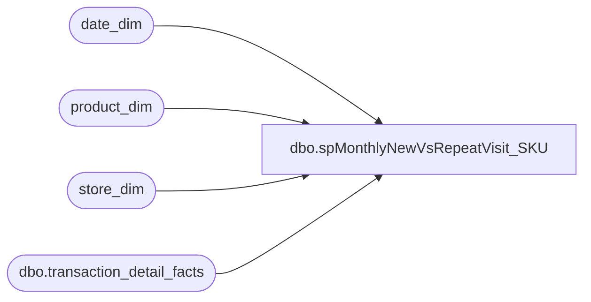

# dbo.spMonthlyNewVsRepeatVisit_SKU

**Database:** dw  
**Server:** papamart  

## Architecture Diagram



## Table Dependencies

| Referenced Table |
|---|
| date_dim |
| product_dim |
| store_dim |
| dbo.transaction_detail_facts |

## Stored Procedure Code

```sql
/******************************************************************************
**
**	Name:		spMonthlyNewVsRepeatVisit_SKU
**
**	Description: 	Display new and repeat visits, by month, by store based on the purchase of a specified
**  				SKU
**
**	Parameters:
**		@FromDate	- Date to start with
**		@ToDate		- Date to end with
**		@SKU		--product sku
**		@GroupByMonthFl	- Group by month, instead of by store, by month
**		@bDebugFl	- Debug flag. Prints intermediate results.
**
** 	Returns:	@iRtnCd {0=Success; non-zero=Failure}
**
**	Examples:
		EXEC spMonthlyNewVsRepeatVisit_SKU @FromDate = '11/1/04', @ToDate='12/31/04', @SKU=5885, @PriorYearOnly_Y_N='Y', @GroupByStoreFl=0

**	History:	02/17/2005	PaulK	DEVELOP
**			    04/24/2003	davidr	switched output over to fiscal year and fiscal month
**	       		10/16/2003	cecec	modified to run on Papamart/DW
**				02/17/2005	danm	created to be run by SKU
******************************************************************************/
CREATE
PROCEDURE dbo.spMonthlyNewVsRepeatVisit_SKU
	/* ===== ARGUMENTS ===== */
	@FromDate 		DATETIME	= NULL,
	@ToDate 		DATETIME	= NULL,
	@SKU			INT			,
	@PriorYearOnly_Y_N char(1) , --when calculating repeat household
	@GroupByStoreFl		BIT		= 0--,
	--@bDebugFl		BIT 		= 0	-- Debug Flag

AS

SET NOCOUNT ON
SET QUOTED_IDENTIFIER OFF
	
	
/* ===== DECLARATIONS ===== */
DECLARE
	@iRowCnt		INT,		-- Used to save @@rowcount
	@iErrNbr		INT,		-- Used to save @@error
	@iRtnCd			INT,		-- Return code of procedure
	@dStartDt		DATETIME,	-- Time this procedure started
	@dStopDt		DATETIME,	-- Time this procedure ended
	@bDebugFl		BIT,
	@HistoryFromDate datetime
	

/* ===== INITIALIZE VARIABLES ===== */
SELECT @iRtnCd	= 0	
SELECT @bDebugFl = 0

/* ============================================================================= */
/* ================================  BEGIN  ==================================== */
/* ============================================================================= */
SELECT @dStartDt = GetDate()
SELECT @HistoryFromDate = dateadd(mm, -12, @FromDate)

/* ----- DEBUG */
IF @bDebugFl = 1
BEGIN
	PRINT 'NEW VS. REPEAT VISITS, BY STORE, BY MONTH'
	PRINT ' '
	PRINT @@SERVERNAME + '/'		+ DB_Name()
	PRINT 'Parameter @FromDate: '		+ IsNull(Convert(VARCHAR(20),@FromDate,120),'NULL')
	PRINT 'Parameter @ToDate: '		+ IsNull(Convert(VARCHAR(20),@ToDate,120),'NULL')
	PRINT 'Parameter @GroupByStoreFl: '	+ Ltrim(Str(@GroupByStoreFl))
	PRINT 'Parameter @bDebugFl: '		+ Ltrim(Str(@bDebugFl))
	PRINT ' '
	PRINT ' '
END


/* ===== VALIDATE CONDITIONS ===== */
IF @FromDate IS NULL OR @ToDate IS NULL
BEGIN
	PRINT 'Invalid date range parameter(s)'
	GOTO CLEANUP
END


/* ===== GET VISIT INFO FROM Transaction Detail Facts TABLE FOR ALL stores in DATE range ===== */
IF (Object_ID('tempdb..#TMPKiosk1') IS NOT NULL) DROP TABLE #TMPKiosk1
--gift senders
SELECT --DISTINCT 
	dd.actual_date,
	sd.store_id,
	tdf.sender_household_key as hhkey,
	0 as FirstVisit,
	0 as RepeatVisit
INTO #TMPKiosk1
FROM dbo.transaction_detail_facts tdf
JOIN product_dim pd on tdf.product_key = pd.product_key
JOIN store_dim sd ON tdf.store_key = sd.store_key
JOIN date_dim dd ON tdf.date_key = dd.date_key
WHERE dd.actual_date BETWEEN @FromDate AND @ToDate --BETWEEN '1/31/2002' AND '12/31/2002 23:59'
and sender_household_key <> 0
and pd.sku = @SKU

-- UNION
--self recipients
IF (Object_ID('tempdb..#TMPKiosk2') IS NOT NULL) DROP TABLE #TMPKiosk2
SELECT --DISTINCT 
	dd.actual_date,
	sd.store_id,
	tdf.recipient_household_key as hhkey,
	0 as FirstVisit,
	0 as RepeatVisit
INTO #TMPKiosk2
FROM dbo.transaction_detail_facts tdf
JOIN product_dim pd on tdf.product_key = pd.product_key
JOIN store_dim sd ON tdf.store_key = sd.store_key
JOIN date_dim dd ON tdf.date_key = dd.date_key
WHERE dd.actual_date BETWEEN @FromDate AND @ToDate 
AND tdf.purpose_key = 1 
and recipient_household_key <> 0
and pd.sku = @SKU
--(347375 row(s) affected) in 17 sec
--select count(*) from #TMPKiosk
--select * from purpose_dim

IF (Object_ID('tempdb..#TMPKiosk') IS NOT NULL) DROP TABLE #TMPKiosk
select *
into #TMPKiosk
from #TMPKiosk1
UNION
select *
from #TMPKiosk2

SELECT @iRowCnt = @@RowCount, @iErrNbr = @@Error
/* ----- ERROR TRAP */
IF @iErrNbr <> 0
	GOTO CLEANUP
/* ----- DEBUG */
IF @bDebugFl = 1
	PRINT 'Rows added to #TMPKiosk: ' + Ltrim(Str(@iRowCnt))

CREATE       INDEX IX_hhkey ON #TMPKiosk (hhkey)


/* ===== GET ALL VISITS FOR SELECTED HHs ===== */

IF @PriorYearOnly_Y_N = 'N'
BEGIN  --all history
	IF (Object_ID('tempdb..#TMPAllVisits1_sku') IS NOT NULL) DROP TABLE #TMPAllVisits1_sku
	SELECT --DISTINCT	
		dd.actual_date,
		tk.hhkey
		--tdf.sender_household_key as hhkey		
	into #TMPAllVisits1_sku
	FROM #TMPKiosk tk --(index = IX_hhkey) 
	JOIN dbo.transaction_detail_facts tdf (nolock) ON tk.hhkey = tdf.sender_household_key
	JOIN date_dim dd ON tdf.date_key = dd.date_key		
	WHERE tdf.transaction_line_seq = -1
	 and dd.actual_date <= @ToDate

	IF (Object_ID('tempdb..#TMPAllVisits2_sku') IS NOT NULL) DROP TABLE #TMPAllVisits2_sku
	SELECT --DISTINCT	
		dd.actual_date,
		tk.hhkey
		--tdf.recipient_household_key as hhkey		
	into #TMPAllVisits2_sku
	FROM #TMPKiosk tk --(index = IX_hhkey) 
	JOIN dbo.transaction_detail_facts tdf (nolock) ON tk.hhkey = tdf.recipient_household_key
	JOIN date_dim dd ON tdf.date_key = dd.date_key		
	WHERE tdf.purpose_key = 1 and tdf.transaction_line_seq = -1
		and dd.actual_date <= @ToDate

	IF (Object_ID('tempdb..#TMPAllVisits') IS NOT NULL) DROP TABLE #TMPAllVisits
	SELECT distinct a.actual_date, hhkey
	INTO	#TMPAllVisits
	from(
	SELECT --DISTINCT	
		actual_date,
		hhkey
		--tdf.sender_household_key as hhkey		
	FROM #TMPAllVisits1_sku 
	UNION 
	SELECT --DISTINCT	
		actual_date,
		hhkey
		--tdf.sender_household_key as hhkey		
	FROM #TMPAllVisits2_sku
	) a
	
	
	SELECT @iRowCnt = @@RowCount, @iErrNbr = @@Error
	/* ----- ERROR TRAP */
	IF @iErrNbr <> 0
		GOTO CLEANUP
	/* ----- DEBUG */
	IF @bDebugFl = 1
		PRINT 'Rows added to #TMPAllVisits: ' + Ltrim(Str(@iRowCnt))


	CREATE   INDEX IX_Visit_hhkey ON #TMPAllVisits (hhkey)
	
	/* ===== COMPUTE FIRST VISIT ===== */
	IF (Object_ID('tempdb..#TMPFirstVisit') IS NOT NULL) DROP TABLE #TMPFirstVisit
	SELECT		Min(actual_date)	'FirstVisit',
			hhkey
	INTO		#TMPFirstVisit
	FROM		#TMPAllVisits
	GROUP BY 	hhkey
	
	
	SELECT @iRowCnt = @@RowCount, @iErrNbr = @@Error
	/* ----- ERROR TRAP */
	IF @iErrNbr <> 0
		GOTO CLEANUP
	/* ----- DEBUG */
	IF @bDebugFl = 1
		PRINT 'Rows added to #TMPFirstVisit: ' + Ltrim(Str(@iRowCnt))
	
	
	
	/* ===== MARK FIRST VISIT ===== */
	
	UPDATE		#TMPKiosk
	SET		FirstVisit = 1
	FROM		#TMPKiosk
	JOIN		#TMPFirstVisit V
		ON	V.hhkey = #TMPKiosk.hhkey 
	WHERE		V.FirstVisit = #TMPKiosk.actual_date  --  BETWEEN  @FromDate AND @ToDate
	
	
	SELECT @iRowCnt = @@RowCount, @iErrNbr = @@Error
	/* ----- ERROR TRAP */
	IF @iErrNbr <> 0
		GOTO CLEANUP
	/* ----- DEBUG */
	IF @bDebugFl = 1
		PRINT 'Rows marked as FirstVisit: ' + Ltrim(Str(@iRowCnt))
	
	

	

END
ELSE
BEGIN
	IF (Object_ID('tempdb..#TMPAllVisits1_sku') IS NOT NULL) DROP TABLE #TMPAllVisits3_sku
	SELECT --DISTINCT	
		dd.actual_date,
		tk.hhkey
		--tdf.sender_household_key as hhkey		
	into #TMPAllVisits3_sku
	FROM #TMPKiosk tk --(index = IX_hhkey) 
	JOIN dbo.transaction_detail_facts tdf (nolock) ON tk.hhkey = tdf.sender_household_key
	JOIN date_dim dd ON tdf.date_key = dd.date_key		
	WHERE tdf.transaction_line_seq = -1 and dd.actual_date >= @HistoryFromDate
	 	and dd.actual_date <= @ToDate

	IF (Object_ID('tempdb..#TMPAllVisits2_sku') IS NOT NULL) DROP TABLE #TMPAllVisits2_sku
	SELECT --DISTINCT	
		dd.actual_date,
		tk.hhkey
		--tdf.recipient_household_key as hhkey		
	into #TMPAllVisits4_sku
	FROM #TMPKiosk tk --(index = IX_hhkey) 
	JOIN dbo.transaction_detail_facts tdf (nolock) ON tk.hhkey = tdf.recipient_household_key
	JOIN date_dim dd ON tdf.date_key = dd.date_key		
	WHERE tdf.purpose_key = 1 and tdf.transaction_line_seq = -1 and dd.actual_date >= @HistoryFromDate
		and dd.actual_date <= @ToDate

	IF (Object_ID('tempdb..#TMPAllVisitsY') IS NOT NULL) DROP TABLE #TMPAllVisitsY
	SELECT distinct a.actual_date, hhkey
	INTO	#TMPAllVisitsY
	from(
	SELECT --DISTINCT	
		actual_date,
		hhkey
		--tdf.sender_household_key as hhkey		
	FROM #TMPAllVisits3_sku 
	UNION 
	SELECT --DISTINCT	
		actual_date,
		hhkey
		--tdf.sender_household_key as hhkey		
	FROM #TMPAllVisits4_sku
	) a
	
	
	SELECT @iRowCnt = @@RowCount, @iErrNbr = @@Error
	/* ----- ERROR TRAP */
	IF @iErrNbr <> 0
		GOTO CLEANUP
	/* ----- DEBUG */
	IF @bDebugFl = 1
		PRINT 'Rows added to #TMPAllVisitsY: ' + Ltrim(Str(@iRowCnt))


	CREATE   INDEX IX_Visit_hhkey ON #TMPAllVisitsY (hhkey)
	
	/* ===== COMPUTE FIRST VISIT ===== */
	IF (Object_ID('tempdb..#TMPFirstVisitY') IS NOT NULL) DROP TABLE #TMPFirstVisitY
	SELECT		Min(actual_date)	'FirstVisit',
			hhkey
	INTO		#TMPFirstVisitY
	FROM		#TMPAllVisitsY
	GROUP BY 	hhkey
	
	
	SELECT @iRowCnt = @@RowCount, @iErrNbr = @@Error
	/* ----- ERROR TRAP */
	IF @iErrNbr <> 0
		GOTO CLEANUP
	/* ----- DEBUG */
	IF @bDebugFl = 1
		PRINT 'Rows added to #TMPFirstVisit: ' + Ltrim(Str(@iRowCnt))
	
	
	
	/* ===== MARK FIRST VISIT ===== */
	
	UPDATE		#TMPKiosk
	SET		FirstVisit = 1
	FROM		#TMPKiosk
	JOIN		#TMPFirstVisitY V
		ON	V.hhkey = #TMPKiosk.hhkey 
	WHERE		V.FirstVisit = #TMPKiosk.actual_date  --  BETWEEN  @FromDate AND @ToDate
	
	
	SELECT @iRowCnt = @@RowCount, @iErrNbr = @@Error
	/* ----- ERROR TRAP */
	IF @iErrNbr <> 0
		GOTO CLEANUP
	/* ----- DEBUG */
	IF @bDebugFl = 1
		PRINT 'Rows marked as FirstVisit: ' + Ltrim(Str(@iRowCnt))
	


END


	
	
	/* ===== MARK REPEAT VISIT ===== */
	UPDATE		#TMPKiosk
	SET		RepeatVisit = 1
	WHERE		FirstVisit = 0
	
	SELECT @iRowCnt = @@RowCount, @iErrNbr = @@Error
	/* ----- ERROR TRAP */
	IF @iErrNbr <> 0
		GOTO CLEANUP
	/* ----- DEBUG */
	IF @bDebugFl = 1
		PRINT 'Rows marked as RepeatVisit: ' + Ltrim(Str(@iRowCnt))
	
	
	--select left(Date,11) Date, Left(Address,25) Address, Left(sCity,16) City, Left(sState,2) state, left(Zipcode,5) zipcode, Left(sLastName,12) lastname, FirstVisit First, RepeatVisit Repeat from #tmpkiosk K
	--join tbluniqueaddress U on U.sAddress = K.Address and U.sZipcode = K.zipcode
	--order by FirstVisit DESC, Date, Address, Zipcode
	
	/* ===== OUTPUT GROUPING ===== */
	IF @GroupByStoreFl = 0
		/* ----- GROUP BY STORE ----- */
		SELECT		dd.Fiscal_Year		'Year',
				dd.Fiscal_Period	'Month',
				dd.Fiscal_Week		'Week',				
				tk.store_id,
				@SKU as 'SKU',
				Sum(tk.FirstVisit)	'SumFirstVisit',
				Sum(tk.RepeatVisit)	'SumRepeatVisit'
		FROM		#TMPKiosk tk
				JOIN Date_dim dd
				ON dd.actual_Date = tk.actual_date
		GROUP BY	dd.Fiscal_Year,
				dd.Fiscal_Period,
				dd.Fiscal_Week,
				tk.store_id
		ORDER BY	dd.Fiscal_Year,
				dd.Fiscal_Period,
				dd.Fiscal_Week,
				tk.store_id
	
	ELSE
		/* ----- GROUP BY MONTH ----- */
		SELECT		dd.Fiscal_Year		'Year',
				dd.Fiscal_Period	'Month',
				dd.Fiscal_Week		'Week',				
				@SKU as 'SKU',
				Sum(tk.FirstVisit)	'SumFirstVisit',
				Sum(tk.RepeatVisit)	'SumRepeatVisit'
		FROM		#TMPKiosk tk
				JOIN Date_dim dd
				ON dd.actual_Date = tk.actual_date
		GROUP BY	dd.Fiscal_Year,
				dd.Fiscal_Period,
				dd.Fiscal_Week
		ORDER BY	dd.Fiscal_Year,
				dd.Fiscal_Period,
				dd.Fiscal_Week


/* ======================== */
/* =====  CLEAN UP  ======= */
/* ======================== */
CLEANUP:

IF @iErrNbr <> 0
BEGIN
	SELECT @iRtnCd = @iErrNbr * -1
	IF @bDebugFl = 1
		PRINT 'PROC RETURN CODE: ' + Ltrim(Str(@iRtnCd))
END


SELECT @dStopDt = GetDate()
/* ----- DEBUG */
IF @bDebugFl = 1
	PRINT 'Start Date: ' + Convert(VARCHAR,@dStartDt,120) + ',  Stop Date: ' + Convert(VARCHAR,@dStopDt,120)


SET NOCOUNT OFF
SET QUOTED_IDENTIFIER ON
Return(@iRtnCd)
/* ============================================================================= */
/* =================================  END  ===================================== */
/* ============================================================================= */
```

