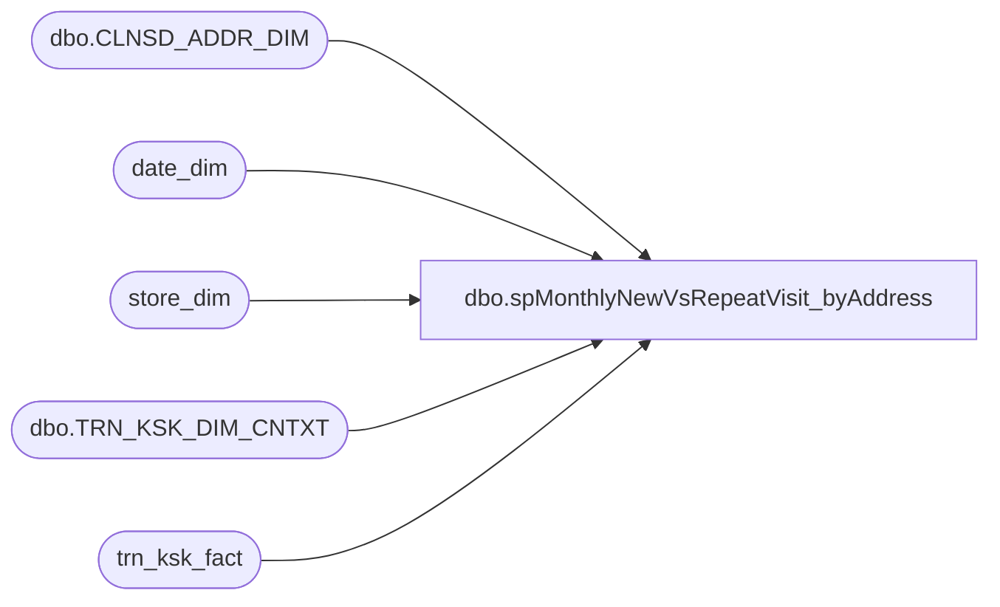

# dbo.spMonthlyNewVsRepeatVisit_byAddress

**Database:** dw  
**Server:** papamart  

## Architecture Diagram



## Table Dependencies

| Referenced Table |
|---|
| dbo.CLNSD_ADDR_DIM |
| date_dim |
| store_dim |
| dbo.TRN_KSK_DIM_CNTXT |
| trn_ksk_fact |

## Stored Procedure Code

```sql
/******************************************************************************
**
**	Name:		spMonthlyNewVsRepeatVisit_byAddress
**
**	Description: 	Display new and repeat visits, by month, by store
**
**	Parameters:
**		@FromDate	- Date to start with
**		@ToDate		- Date to end with
**		@GroupByMonthFl	- Group by month, instead of by store, by month
**		@bDebugFl	- Debug flag. Prints intermediate results.
**
** 	Returns:	@iRtnCd {0=Success; non-zero=Failure}
**
**	Examples:
			spMonthlyNewVsRepeatVisit_byAddress @FromDate='2004-01-4 00:00:00', @ToDate='2005-1-1 23:59:59'
			spMonthlyNewVsRepeatVisit_byAddress @FromDate='2005-10-01 00:00:00', @ToDate='2002-12-31 23:59:59', @bDebugFl=1
--select min(actual_date), max(actual_date) from date_dim where fiscal_year = 2004


**	History:	12/05/2002	PaulK		DEVELOP
**			 4/24/2003	davidr	switched output over to fiscal year and fiscal month
**	       		10/16/2003	cecec	modified to run on Papamart/DW
				01/13/2004  danm   modified to run at the customer level
				3/9/2011	Gary Murrish	Changed to run against TRN_KSK_FACT instead of transaction_kiosk_facts
******************************************************************************/
CREATE PROCEDURE [dbo].[spMonthlyNewVsRepeatVisit_byAddress]
	/* ===== ARGUMENTS ===== */
    @FromDate datetime = NULL
   ,@ToDate datetime = NULL
   ,@GroupByStoreFl bit = 0--,
	--@bDebugFl		BIT 		= 0	-- Debug Flag

AS
SET NOCOUNT ON
SET QUOTED_IDENTIFIER OFF
	
	
/* ===== DECLARATIONS ===== */
DECLARE
    @iRowCnt int
   ,		-- Used to save @@rowcount
    @iErrNbr int
   ,		-- Used to save @@error
    @iRtnCd int
   ,		-- Return code of procedure
    @dStartDt datetime
   ,	-- Time this procedure started
    @dStopDt datetime
   ,	-- Time this procedure ended
    @bDebugFl bit

-- ---tbd vvvvvvvvvvvvvvvvvvvvvvvvvvvvvvvvvvvvvvvvvvvvvvvvvvvvvvvvvvvvvvvvvvvvvvvvvvvvvvvvvvv
-- ,	@FromDate 		DATETIME	--= NULL,
-- ,	@ToDate 		DATETIME	--= NULL,
-- ,	@GroupByStoreFl		BIT		
-- ---tbd ^^^^^^^^^^^^^^^^^^^^^^^^^^^^^^^^^^^^^^^^^^^^^^^^^^^^^^^^^^^^^^^^^^^^^^^^^^^^^^^^^^^

/* ===== INITIALIZE VARIABLES ===== */
SELECT
    @iRtnCd = 0
SELECT
    @bDebugFl = 0

-- ---tbd vvvvvvvvvvvvvvvvvvvvvvvvvvvvvvvvvvvvvvvvvvvvvvvvvvvvvvvvvvvvvvvvvvvvvvvvvvvvvvvvvvv
-- SET @FromDate = '10/1/04'
-- SET @ToDate = '10/31/04'
-- SET @GroupByStoreFl = 0
-- ---tbd ^^^^^^^^^^^^^^^^^^^^^^^^^^^^^^^^^^^^^^^^^^^^^^^^^^^^^^^^^^^^^^^^^^^^^^^^^^^^^^^^^^^


/* ============================================================================= */
/* ================================  BEGIN  ==================================== */
/* ============================================================================= */
SELECT
    @dStartDt = GetDate()


/* ----- DEBUG */
IF @bDebugFl = 1
    BEGIN
        PRINT 'NEW VS. REPEAT VISITS, BY STORE, BY MONTH'
        PRINT ' '
        PRINT @@SERVERNAME + '/' + DB_Name()
        PRINT 'Parameter @FromDate: ' + IsNull(CONVERT(varchar(20), @FromDate, 120), 'NULL')
        PRINT 'Parameter @ToDate: ' + IsNull(CONVERT(varchar(20), @ToDate, 120), 'NULL')
        PRINT 'Parameter @GroupByStoreFl: ' + Ltrim(Str(@GroupByStoreFl))
        PRINT 'Parameter @bDebugFl: ' + Ltrim(Str(@bDebugFl))
        PRINT ' '
        PRINT ' '
    END


/* ===== VALIDATE CONDITIONS ===== */
IF @FromDate IS NULL
OR @ToDate IS NULL
    BEGIN
        PRINT 'Invalid date range parameter(s)'
        GOTO CLEANUP
    END


/* ===== GET VISIT INFO FROM Transaction Detail Facts TABLE FOR ALL stores in DATE range ===== */
IF (Object_ID('tempdb..#TMPKiosk') IS NOT NULL)
    DROP TABLE #TMPKiosk
--gift senders
SELECT DISTINCT
    dd.actual_date
   ,sd.store_id
   ,tkf.TOR_CLNSD_ADDR_ID AS hhkey
   ,ad.PSTL_CD AS postal_code
   ,CTX.GST_VST_RECUR_CD AS First_vs_Repeat
--	0 as FirstVisit,
--	0 as RepeatVisit
INTO
    #TMPKiosk
--FROM dbo.transaction_detail_facts tdf
--FROM dbo.tdf_rpt tdf
FROM
    trn_ksk_fact tkf WITH (NOLOCK)
JOIN store_dim sd WITH (NOLOCK)
    ON tkf.str_id = sd.store_key
JOIN date_dim dd WITH (NOLOCK)
    ON tkf.DT_ID = dd.date_key
JOIN dbo.CLNSD_ADDR_DIM ad WITH (NOLOCK)
    ON tkf.TOR_CLNSD_ADDR_ID = ad.CLNSD_ADDR_ID
INNER JOIN dbo.TRN_KSK_DIM_CNTXT CTX WITH (NOLOCK)
	ON tkf.TRN_KSK_CNTXT_ID = ctx.TRN_KSK_CNTXT_ID
WHERE
    (dd.actual_date BETWEEN @FromDate
    AND @ToDate)
AND ad.CLNSD_ADDR_ID > 0
AND ad.CNTRY_ABBRV = 'USA'
AND sd.country = 'US'
AND sd.store_id NOT IN (13, 136, 1513)
-- GMurrish Removed the following where
--AND ((tkf.purpose_key = 1
--      AND tkf.guest_type_key IN (1, 2))  --self sender or self recip
--     OR (tkf.purpose_key = 2
--         AND tkf.guest_type_key = 2) --gift sender
--    )


 
--and sd.store_id = 54

--UNION
----self recipients
--SELECT --DISTINCT 
--	dd.actual_date,
--	sd.store_id,
----	tdf.recipient_household_key as hhkey,
--	tdf.recipient_address_key as hhkey,
--	ad.postal_code,
--	0 as FirstVisit,
--	0 as RepeatVisit
----FROM dbo.transaction_detail_facts tdf
--FROM dbo.tdf_rpt tdf
--JOIN store_dim sd ON tdf.store_key = sd.store_key
--JOIN date_dim dd ON tdf.date_key = dd.date_key
--JOIN address_dim ad ON tdf.recipient_address_key = address_key
--WHERE (dd.actual_date BETWEEN @FromDate AND @ToDate)
--AND tdf.purpose_key = 1 
--and recipient_address_key <> 0
--and ad.country = 'US'
--and sd.store_id NOT IN (8,13,17,136,119,124,130,150)
----(347375 row(s) affected) in 17 sec
----select count(*) from #TMPKiosk
----select * from purpose_dim
----and sd.store_id = 54


SELECT
    @iRowCnt = @@RowCount
   ,@iErrNbr = @@Error
/* ----- ERROR TRAP */
IF @iErrNbr <> 0
    GOTO CLEANUP
/* ----- DEBUG */
IF @bDebugFl = 1
    PRINT 'Rows added to #TMPKiosk: ' + Ltrim(Str(@iRowCnt))


CREATE INDEX IX_hhkey ON #TMPKiosk (hhkey)


/* ===== GET ALL VISITS FOR SELECTED Addresses ===== */

--IF (Object_ID('tempdb..#TMPAllVisits') IS NOT NULL) DROP TABLE #TMPAllVisits
--SELECT distinct a.actual_date, hhkey
--INTO	#TMPAllVisits
--from(
--SELECT --DISTINCT	
--	dd.actual_date,
--	tdf.sender_address_key as hhkey
--	--tdf.sender_household_key as hhkey		
----FROM dbo.transaction_detail_facts tdf (nolock) 
--FROM dbo.tdf_rpt tdf (nolock)
--	JOIN date_dim dd ON tdf.date_key = dd.date_key		
--WHERE tdf.transaction_line_seq = -1
--and tdf.sender_address_key in (select hhkey from #TMPKiosk where hhkey >0)
-- 
--UNION 
--SELECT --DISTINCT	
--	dd.actual_date,
--	tdf.recipient_address_key as hhkey
--	--tdf.recipient_household_key as hhkey		
----FROM dbo.transaction_detail_facts tdf (nolock)
--FROM dbo.tdf_rpt tdf (nolock)
--	JOIN date_dim dd ON tdf.date_key = dd.date_key		
--WHERE tdf.purpose_key = 1 and tdf.transaction_line_seq = -1
--and tdf.recipient_address_key in (select hhkey from #TMPKiosk where hhkey >0)
--) a
--
--
--SELECT @iRowCnt = @@RowCount, @iErrNbr = @@Error
--/* ----- ERROR TRAP */
--IF @iErrNbr <> 0
--	GOTO CLEANUP
--/* ----- DEBUG */
--IF @bDebugFl = 1
--	PRINT 'Rows added to #TMPAllVisits: ' + Ltrim(Str(@iRowCnt))
--
--CREATE   INDEX IX_Visit_hhkey ON #TMPAllVisits (hhkey)
--
--/* ===== COMPUTE FIRST VISIT ===== */
--IF (Object_ID('tempdb..#TMPFirstVisit') IS NOT NULL) DROP TABLE #TMPFirstVisit
--SELECT		Min(actual_date)	'FirstVisit',
--		hhkey
--INTO		#TMPFirstVisit
--FROM		#TMPAllVisits
--GROUP BY 	hhkey
--
--
--SELECT @iRowCnt = @@RowCount, @iErrNbr = @@Error
--/* ----- ERROR TRAP */
--IF @iErrNbr <> 0
--	GOTO CLEANUP
--/* ----- DEBUG */
--IF @bDebugFl = 1
--	PRINT 'Rows added to #TMPFirstVisit: ' + Ltrim(Str(@iRowCnt))
--
--
--
--/* ===== MARK FIRST VISIT ===== */
--
--UPDATE		#TMPKiosk
--SET		FirstVisit = 1
--FROM		#TMPKiosk
--JOIN		#TMPFirstVisit V
--	ON	V.hhkey = #TMPKiosk.hhkey 
--WHERE		V.FirstVisit = #TMPKiosk.actual_date  --  BETWEEN  @FromDate AND @ToDate
--
--
--SELECT @iRowCnt = @@RowCount, @iErrNbr = @@Error
--/* ----- ERROR TRAP */
--IF @iErrNbr <> 0
--	GOTO CLEANUP
--/* ----- DEBUG */
--IF @bDebugFl = 1
--	PRINT 'Rows marked as FirstVisit: ' + Ltrim(Str(@iRowCnt))
--
--
--
--
--/* ===== MARK REPEAT VISIT ===== */
--UPDATE		#TMPKiosk
--SET		RepeatVisit = 1
--WHERE		FirstVisit = 0
--
--SELECT @iRowCnt = @@RowCount, @iErrNbr = @@Error
--/* ----- ERROR TRAP */
--IF @iErrNbr <> 0
--	GOTO CLEANUP
--/* ----- DEBUG */
--IF @bDebugFl = 1
--	PRINT 'Rows marked as RepeatVisit: ' + Ltrim(Str(@iRowCnt))
--

--select left(Date,11) Date, Left(Address,25) Address, Left(sCity,16) City, Left(sState,2) state, left(Zipcode,5) zipcode, Left(sLastName,12) lastname, FirstVisit First, RepeatVisit Repeat from #tmpkiosk K
--join tbluniqueaddress U on U.sAddress = K.Address and U.sZipcode = K.zipcode
--order by FirstVisit DESC, Date, Address, Zipcode

/* ===== OUTPUT GROUPING ===== */
	/* ----- GROUP BY STORE AND ZIP ----- */
-- 	SELECT		dd.Fiscal_Year		'Year',
-- 			dd.Fiscal_Period	'Month',
-- 			dd.Fiscal_Week		'Week',		
SELECT
    tk.postal_code
   ,tk.store_id
   ,Sum(CASE
             WHEN tk.First_vs_Repeat = 'N' THEN 1
             ELSE 0
        END) AS 'SumFirstVisit'
   ,Sum(CASE
             WHEN tk.First_vs_Repeat = 'R' THEN 1
             ELSE 0
        END) AS 'SumRepeatVisit'
FROM
    #TMPKiosk tk
JOIN Date_dim dd
    ON dd.actual_Date = tk.actual_date
-- 	GROUP BY	dd.Fiscal_Year,
-- 			dd.Fiscal_Period,
-- 			dd.Fiscal_Week,
GROUP BY
    tk.postal_code
   ,tk.store_id
-- 	ORDER BY	dd.Fiscal_Year,
-- 			dd.Fiscal_Period,
-- 			dd.Fiscal_Week,
-- 			tk.store_id

-- ELSE
-- 	/* ----- GROUP BY MONTH ----- */
-- 	SELECT		dd.Fiscal_Year		'Year',
-- 			dd.Fiscal_Period	'Month',
-- 			dd.Fiscal_Week		'Week',				
-- 			Sum(tk.FirstVisit)	'SumFirstVisit',
-- 			Sum(tk.RepeatVisit)	'SumRepeatVisit'
-- 	FROM		#TMPKiosk tk
-- 			JOIN Date_dim dd
-- 			ON dd.actual_Date = tk.actual_date
-- 	GROUP BY	dd.Fiscal_Year,
-- 			dd.Fiscal_Period,
-- 			dd.Fiscal_Week
-- 	ORDER BY	dd.Fiscal_Year,
-- 			dd.Fiscal_Period,
-- 			dd.Fiscal_Week


/* ======================== */
/* =====  CLEAN UP  ======= */
/* ======================== */
CLEANUP:

IF @iErrNbr <> 0
    BEGIN
        SELECT
            @iRtnCd = @iErrNbr * -1
        IF @bDebugFl = 1
            PRINT 'PROC RETURN CODE: ' + Ltrim(Str(@iRtnCd))
    END


SELECT
    @dStopDt = GetDate()
/* ----- DEBUG */
IF @bDebugFl = 1
    PRINT 'Start Date: ' + CONVERT(varchar, @dStartDt, 120) + ',  Stop Date: ' + CONVERT(varchar, @dStopDt, 120)


SET NOCOUNT OFF
SET QUOTED_IDENTIFIER ON
RETURN (@iRtnCd)
/* ============================================================================= */
/* =================================  END  ===================================== */
/* ============================================================================= */
```

