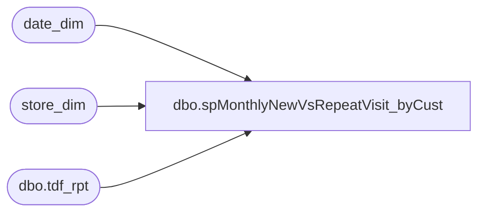

# dbo.spMonthlyNewVsRepeatVisit_byCust

**Database:** dw  
**Server:** papamart  

## Architecture Diagram



## Table Dependencies

| Referenced Table |
|---|
| date_dim |
| store_dim |
| dbo.tdf_rpt |

## Stored Procedure Code

```sql
/******************************************************************************
**
**	Name:		spMonthlyNewVsRepeatVisit
**
**	Description: 	Display new and repeat visits, by month, by store
**
**	Parameters:
**		@FromDate	- Date to start with
**		@ToDate		- Date to end with
**		@GroupByMonthFl	- Group by month, instead of by store, by month
**		@bDebugFl	- Debug flag. Prints intermediate results.
**
** 	Returns:	@iRtnCd {0=Success; non-zero=Failure}
**
**	Examples:
			spMonthlyNewVsRepeatVisit @FromDate='2002-01-31 00:00:00', @ToDate='2002-12-31 23:59:59', @GroupByMonthFl=1
			spMonthlyNewVsRepeatVisit @FromDate='2002-10-01 00:00:00', @ToDate='2002-12-31 23:59:59', @bDebugFl=1

**	History:	12/05/2002	PaulK		DEVELOP
**			 4/24/2003	davidr	switched output over to fiscal year and fiscal month
**	       		10/16/2003	cecec	modified to run on Papamart/DW
				01/13/2004  danm   modified to run at the customer level
******************************************************************************/
CREATE
PROCEDURE dbo.spMonthlyNewVsRepeatVisit_byCust
	/* ===== ARGUMENTS ===== */
	@FromDate 		DATETIME	= NULL,
	@ToDate 		DATETIME	= NULL,
	@GroupByStoreFl		BIT		= 0--,
	--@bDebugFl		BIT 		= 0	-- Debug Flag

AS

SET NOCOUNT ON
SET QUOTED_IDENTIFIER OFF
	
	
/* ===== DECLARATIONS ===== */
DECLARE
	@iRowCnt		INT,		-- Used to save @@rowcount
	@iErrNbr		INT,		-- Used to save @@error
	@iRtnCd			INT,		-- Return code of procedure
	@dStartDt		DATETIME,	-- Time this procedure started
	@dStopDt		DATETIME,	-- Time this procedure ended
	@bDebugFl		BIT

-- ---tbd vvvvvvvvvvvvvvvvvvvvvvvvvvvvvvvvvvvvvvvvvvvvvvvvvvvvvvvvvvvvvvvvvvvvvvvvvvvvvvvvvvv
-- ,	@FromDate 		DATETIME	--= NULL,
-- ,	@ToDate 		DATETIME	--= NULL,
-- ,	@GroupByStoreFl		BIT		
-- ---tbd ^^^^^^^^^^^^^^^^^^^^^^^^^^^^^^^^^^^^^^^^^^^^^^^^^^^^^^^^^^^^^^^^^^^^^^^^^^^^^^^^^^^

/* ===== INITIALIZE VARIABLES ===== */
SELECT @iRtnCd	= 0	
SELECT @bDebugFl = 0

-- ---tbd vvvvvvvvvvvvvvvvvvvvvvvvvvvvvvvvvvvvvvvvvvvvvvvvvvvvvvvvvvvvvvvvvvvvvvvvvvvvvvvvvvv
-- SET @FromDate = '10/1/04'
-- SET @ToDate = '10/31/04'
-- SET @GroupByStoreFl = 0
-- ---tbd ^^^^^^^^^^^^^^^^^^^^^^^^^^^^^^^^^^^^^^^^^^^^^^^^^^^^^^^^^^^^^^^^^^^^^^^^^^^^^^^^^^^


/* ============================================================================= */
/* ================================  BEGIN  ==================================== */
/* ============================================================================= */
SELECT @dStartDt = GetDate()


/* ----- DEBUG */
IF @bDebugFl = 1
BEGIN
	PRINT 'NEW VS. REPEAT VISITS, BY STORE, BY MONTH'
	PRINT ' '
	PRINT @@SERVERNAME + '/'		+ DB_Name()
	PRINT 'Parameter @FromDate: '		+ IsNull(Convert(VARCHAR(20),@FromDate,120),'NULL')
	PRINT 'Parameter @ToDate: '		+ IsNull(Convert(VARCHAR(20),@ToDate,120),'NULL')
	PRINT 'Parameter @GroupByStoreFl: '	+ Ltrim(Str(@GroupByStoreFl))
	PRINT 'Parameter @bDebugFl: '		+ Ltrim(Str(@bDebugFl))
	PRINT ' '
	PRINT ' '
END


/* ===== VALIDATE CONDITIONS ===== */
IF @FromDate IS NULL OR @ToDate IS NULL
BEGIN
	PRINT 'Invalid date range parameter(s)'
	GOTO CLEANUP
END


/* ===== GET VISIT INFO FROM Transaction Detail Facts TABLE FOR ALL stores in DATE range ===== */
IF (Object_ID('tempdb..#TMPKiosk') IS NOT NULL) DROP TABLE #TMPKiosk
--gift senders
SELECT --DISTINCT 
	dd.actual_date,
	sd.store_id,
--	tdf.sender_household_key as hhkey,
	tdf.sender_customer_key as hhkey,
	0 as FirstVisit,
	0 as RepeatVisit
INTO #TMPKiosk
--FROM dbo.transaction_detail_facts tdf
FROM dbo.tdf_rpt tdf
JOIN store_dim sd ON tdf.store_key = sd.store_key
JOIN date_dim dd ON tdf.date_key = dd.date_key
WHERE dd.actual_date BETWEEN @FromDate AND @ToDate --BETWEEN '1/31/2002' AND '12/31/2002 23:59'
and sender_customer_key <> 0
--and sd.store_id = 54

UNION
--self recipients
SELECT --DISTINCT 
	dd.actual_date,
	sd.store_id,
--	tdf.recipient_household_key as hhkey,
	tdf.sender_customer_key as hhkey,
	0 as FirstVisit,
	0 as RepeatVisit
--FROM dbo.transaction_detail_facts tdf
FROM dbo.tdf_rpt tdf
JOIN store_dim sd ON tdf.store_key = sd.store_key
JOIN date_dim dd ON tdf.date_key = dd.date_key
WHERE dd.actual_date BETWEEN @FromDate AND @ToDate 
AND tdf.purpose_key = 1 
and recipient_customer_key <> 0
--(347375 row(s) affected) in 17 sec
--select count(*) from #TMPKiosk
--select * from purpose_dim
--and sd.store_id = 54


SELECT @iRowCnt = @@RowCount, @iErrNbr = @@Error
/* ----- ERROR TRAP */
IF @iErrNbr <> 0
	GOTO CLEANUP
/* ----- DEBUG */
IF @bDebugFl = 1
	PRINT 'Rows added to #TMPKiosk: ' + Ltrim(Str(@iRowCnt))


CREATE     INDEX IX_hhkey ON #TMPKiosk (hhkey)


/* ===== GET ALL VISITS FOR SELECTED HHs ===== */

IF (Object_ID('tempdb..#TMPAllVisits') IS NOT NULL) DROP TABLE #TMPAllVisits
SELECT distinct a.actual_date, hhkey
INTO	#TMPAllVisits
from(
SELECT --DISTINCT	
	dd.actual_date,
	tdf.sender_customer_key as hhkey
	--tdf.sender_household_key as hhkey		
--FROM dbo.transaction_detail_facts tdf (nolock) 
FROM dbo.tdf_rpt tdf (nolock)
	JOIN date_dim dd ON tdf.date_key = dd.date_key		
WHERE tdf.transaction_line_seq = -1
and tdf.sender_customer_key in (select hhkey from #TMPKiosk where hhkey >0)
 
UNION 
SELECT --DISTINCT	
	dd.actual_date,
	tdf.recipient_customer_key as hhkey
	--tdf.recipient_household_key as hhkey		
--FROM dbo.transaction_detail_facts tdf (nolock)
FROM dbo.tdf_rpt tdf (nolock)
	JOIN date_dim dd ON tdf.date_key = dd.date_key		
WHERE tdf.purpose_key = 1 and tdf.transaction_line_seq = -1
and tdf.recipient_customer_key in (select hhkey from #TMPKiosk where hhkey >0)
) a


SELECT @iRowCnt = @@RowCount, @iErrNbr = @@Error
/* ----- ERROR TRAP */
IF @iErrNbr <> 0
	GOTO CLEANUP
/* ----- DEBUG */
IF @bDebugFl = 1
	PRINT 'Rows added to #TMPAllVisits: ' + Ltrim(Str(@iRowCnt))

CREATE   INDEX IX_Visit_hhkey ON #TMPAllVisits (hhkey)

/* ===== COMPUTE FIRST VISIT ===== */
IF (Object_ID('tempdb..#TMPFirstVisit') IS NOT NULL) DROP TABLE #TMPFirstVisit
SELECT		Min(actual_date)	'FirstVisit',
		hhkey
INTO		#TMPFirstVisit
FROM		#TMPAllVisits
GROUP BY 	hhkey


SELECT @iRowCnt = @@RowCount, @iErrNbr = @@Error
/* ----- ERROR TRAP */
IF @iErrNbr <> 0
	GOTO CLEANUP
/* ----- DEBUG */
IF @bDebugFl = 1
	PRINT 'Rows added to #TMPFirstVisit: ' + Ltrim(Str(@iRowCnt))


/* ===== MARK FIRST VISIT ===== */

UPDATE		#TMPKiosk
SET		FirstVisit = 1
FROM		#TMPKiosk
JOIN		#TMPFirstVisit V
	ON	V.hhkey = #TMPKiosk.hhkey 
WHERE		V.FirstVisit = #TMPKiosk.actual_date  --  BETWEEN  @FromDate AND @ToDate


SELECT @iRowCnt = @@RowCount, @iErrNbr = @@Error
/* ----- ERROR TRAP */
IF @iErrNbr <> 0
	GOTO CLEANUP
/* ----- DEBUG */
IF @bDebugFl = 1
	PRINT 'Rows marked as FirstVisit: ' + Ltrim(Str(@iRowCnt))


/* ===== MARK REPEAT VISIT ===== */
UPDATE		#TMPKiosk
SET		RepeatVisit = 1
WHERE		FirstVisit = 0

SELECT @iRowCnt = @@RowCount, @iErrNbr = @@Error
/* ----- ERROR TRAP */
IF @iErrNbr <> 0
	GOTO CLEANUP
/* ----- DEBUG */
IF @bDebugFl = 1
	PRINT 'Rows marked as RepeatVisit: ' + Ltrim(Str(@iRowCnt))


--select left(Date,11) Date, Left(Address,25) Address, Left(sCity,16) City, Left(sState,2) state, left(Zipcode,5) zipcode, Left(sLastName,12) lastname, FirstVisit First, RepeatVisit Repeat from #tmpkiosk K
--join tbluniqueaddress U on U.sAddress = K.Address and U.sZipcode = K.zipcode
--order by FirstVisit DESC, Date, Address, Zipcode

/* ===== OUTPUT GROUPING ===== */
IF @GroupByStoreFl = 0
	/* ----- GROUP BY STORE ----- */
	SELECT		dd.Fiscal_Year		'Year',
			dd.Fiscal_Period	'Month',
			dd.Fiscal_Week		'Week',				
			tk.store_id,
			Sum(tk.FirstVisit)	'SumFirstVisit',
			Sum(tk.RepeatVisit)	'SumRepeatVisit'
	FROM		#TMPKiosk tk
			JOIN Date_dim dd
			ON dd.actual_Date = tk.actual_date
	GROUP BY	dd.Fiscal_Year,
			dd.Fiscal_Period,
			dd.Fiscal_Week,
			tk.store_id
	ORDER BY	dd.Fiscal_Year,
			dd.Fiscal_Period,
			dd.Fiscal_Week,
			tk.store_id

ELSE
	/* ----- GROUP BY MONTH ----- */
	SELECT		dd.Fiscal_Year		'Year',
			dd.Fiscal_Period	'Month',
			dd.Fiscal_Week		'Week',				
			Sum(tk.FirstVisit)	'SumFirstVisit',
			Sum(tk.RepeatVisit)	'SumRepeatVisit'
	FROM		#TMPKiosk tk
			JOIN Date_dim dd
			ON dd.actual_Date = tk.actual_date
	GROUP BY	dd.Fiscal_Year,
			dd.Fiscal_Period,
			dd.Fiscal_Week
	ORDER BY	dd.Fiscal_Year,
			dd.Fiscal_Period,
			dd.Fiscal_Week


/* ======================== */
/* =====  CLEAN UP  ======= */
/* ======================== */
CLEANUP:

IF @iErrNbr <> 0
BEGIN
	SELECT @iRtnCd = @iErrNbr * -1
	IF @bDebugFl = 1
		PRINT 'PROC RETURN CODE: ' + Ltrim(Str(@iRtnCd))
END


SELECT @dStopDt = GetDate()
/* ----- DEBUG */
IF @bDebugFl = 1
	PRINT 'Start Date: ' + Convert(VARCHAR,@dStartDt,120) + ',  Stop Date: ' + Convert(VARCHAR,@dStopDt,120)


SET NOCOUNT OFF
SET QUOTED_IDENTIFIER ON
Return(@iRtnCd)
/* ============================================================================= */
/* =================================  END  ===================================== */
/* ============================================================================= */
```

