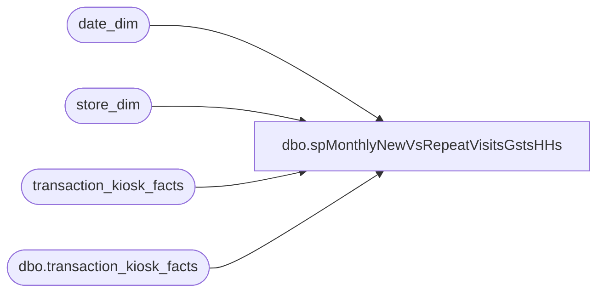

# dbo.spMonthlyNewVsRepeatVisitsGstsHHs

**Database:** dw  
**Server:** papamart  

## Architecture Diagram



## Table Dependencies

| Referenced Table |
|---|
| date_dim |
| store_dim |
| transaction_kiosk_facts |
| dbo.transaction_kiosk_facts |

## Stored Procedure Code

```sql
/******************************************************************************
**
**	Name:		spMonthlyNewVsRepeatVisit
**
**	Description: 	Display new and repeat visits, by month, by store
**
**	Parameters:
**		@FromDate	- Date to start with
**		@ToDate		- Date to end with
**		@GroupByMonthFl	- Group by month, instead of by store, by month
**		@bDebugFl	- Debug flag. Prints intermediate results.
**
** 	Returns:	@iRtnCd {0=Success; non-zero=Failure}
**
**	Examples:
			spMonthlyNewVsRepeatVisit @FromDate='2002-01-31 00:00:00', @ToDate='2002-12-31 23:59:59', @GroupByMonthFl=1
			spMonthlyNewVsRepeatVisit @FromDate='2002-10-01 00:00:00', @ToDate='2002-12-31 23:59:59', @bDebugFl=1

**	History:	12/05/2002	PaulK		DEVELOP
**			 4/24/2003	davidr	switched output over to fiscal year and fiscal month
**	       		10/16/2003	cecec	modified to run on Papamart/DW
				01/13/2004  danm   modified to run at the customer level
				5/8/2007 danm   Dorrie needs for an apples-to-apples comparison historically
******************************************************************************/
CREATE 
PROCEDURE [dbo].[spMonthlyNewVsRepeatVisitsGstsHHs]

	/* ===== ARGUMENTS ===== */
	@FromDate 		DATETIME	= NULL,
	@ToDate 		DATETIME	= NULL,
	@GroupByStoreFl		BIT		= 0--,
	--@bDebugFl		BIT 		= 0	-- Debug Flag

AS
SET NOCOUNT ON
SET QUOTED_IDENTIFIER OFF
	
	
/* ===== DECLARATIONS ===== */
DECLARE
	@iRowCnt		INT,		-- Used to save @@rowcount
	@iErrNbr		INT,		-- Used to save @@error
	@iRtnCd			INT,		-- Return code of procedure
	@dStartDt		DATETIME,	-- Time this procedure started
	@dStopDt		DATETIME,	-- Time this procedure ended
	@bDebugFl		BIT

/* ===== INITIALIZE VARIABLES ===== */
SELECT @iRtnCd	= 0	
SELECT @bDebugFl = 0

/* ============================================================================= */
/* ================================  BEGIN  ==================================== */
/* ============================================================================= */
SELECT @dStartDt = GetDate()


/* ===== GET VISIT INFO FROM Transaction Detail Facts TABLE FOR ALL stores in DATE range ===== */
IF (Object_ID('tempdb..#TMPKiosk') IS NOT NULL) 

DROP TABLE #TMPKiosk

SELECT tkf.transaction_id,
	dd.fiscal_year ,
	dd.fiscal_quarter ,
	dd.fiscal_period,
	dd.fiscal_week,
	dd.actual_date,
	sd.store_id,
	sd.store_name,
	tkf.customer_key,
	tkf.first_vs_repeat,
	tkf.household_key as hhkey,
	0 as FirstVisit,
	0 as RepeatVisit
INTO #TMPKiosk
--FROM dbo.transaction_detail_facts tdf
--FROM dbo.tdf_rpt tdf
FROM transaction_kiosk_facts tkf with (nolock)
JOIN store_dim sd  with (nolock) ON tkf.store_key = sd.store_key
JOIN date_dim dd  with (nolock) ON tkf.date_key = dd.date_key
WHERE dd.actual_date BETWEEN @FromDate AND @ToDate  -- '10/28/2007' and '11/24/2007' 
and (tkf.first_vs_repeat is not null) 

CREATE     INDEX IX_hhkey ON #TMPKiosk (hhkey)
CREATE     INDEX IX_custkey ON #TMPKiosk (customer_key)
CREATE     INDEX IX_transID ON #TMPKiosk (transaction_id)


/* ===== GET ALL VISITS FOR SELECTED HHs ===== */

IF (Object_ID('tempdb..#TMPAllVisits') IS NOT NULL) DROP TABLE #TMPAllVisits

SELECT 	dd.actual_date,
	tkf.household_key as hhkey
INTO	#TMPAllVisits
FROM dbo.transaction_kiosk_facts tkf  with (nolock)
	JOIN date_dim dd  with (nolock) ON tkf.date_key = dd.date_key		
WHERE tkf.first_vs_repeat is not null
GROUP BY dd.actual_date,
		 tkf.household_key

CREATE   INDEX IX_Visit_hhkey ON #TMPAllVisits (hhkey)

/* ===== COMPUTE FIRST VISIT ===== */
IF (Object_ID('tempdb..#TMPFirstVisit') IS NOT NULL) DROP TABLE #TMPFirstVisit
SELECT		Min(actual_date)	'FirstVisit',
		hhkey
INTO		#TMPFirstVisit
FROM		#TMPAllVisits  with (nolock)
GROUP BY 	hhkey

/* ===== MARK FIRST VISIT ===== */

UPDATE		#TMPKiosk
SET		FirstVisit = 1
FROM		#TMPKiosk
JOIN		#TMPFirstVisit V
	ON	V.hhkey = #TMPKiosk.hhkey 
WHERE		V.FirstVisit = #TMPKiosk.actual_date  --  BETWEEN  @FromDate AND @ToDate

/* ===== MARK REPEAT VISIT ===== */
UPDATE		#TMPKiosk
SET		RepeatVisit = 1
WHERE		FirstVisit = 0


/* ===== OUTPUT GROUPING ===== */
IF @GroupByStoreFl = 0
	/* ----- GROUP BY STORE ----- */

--No Of First and Repeat Guests

	SELECT	fiscal_year ,
			fiscal_quarter ,
			fiscal_period,
			store_id ,
			store_name ,
			case when first_vs_repeat = 'First' then 'NewGuests'
			when first_vs_repeat = 'Repeat' then 'RepeatGuests'
			else 'Recipient' end as NewVsRepeatGuests,
			count(distinct customer_key) NoOfGuests
	FROM	#TMPKiosk   with (nolock)
	--WHERE store_id in (1,59,88,149,178)
	Group by	fiscal_year ,
			fiscal_quarter ,
			fiscal_period,
			store_id ,
			store_name ,
			first_vs_repeat

--No of Registrations by New Guests
	SELECT
			fiscal_year ,
			fiscal_quarter ,
			fiscal_period,
			store_id ,
			store_name ,
			count(distinct transaction_id) NoOfRegsByNewGsts
	FROM	#TMPKiosk with (nolock)
	--WHERE store_id in (1,59,88,149,178) and
	WHERE first_vs_repeat = 'First'
	GROUP BY fiscal_year ,
			fiscal_quarter ,
			fiscal_period,
			store_id ,
			store_name 


--No of Registrations by Repeat Guests
	SELECT	fiscal_year ,
			fiscal_quarter ,
			fiscal_period,
			store_id ,
			store_name ,
			count(distinct transaction_id) NoOfRegsByRepeatGsts
	FROM	#TMPKiosk with (nolock)
	--WHERE store_id in (1,59,88,149,178) and
	WHERE first_vs_repeat = 'Repeat'
	GROUP BY fiscal_year ,
			fiscal_quarter ,
			fiscal_period,
			store_id ,
			store_name 


--No Of New and Repeat HHs
--First
	SELECT	fiscal_year ,
			fiscal_quarter ,
			fiscal_period,
			store_id ,
			store_name ,
			count(distinct hhkey) NoOfNewHHs
	FROM		#TMPKiosk   with (nolock)
	--WHERE store_id in (1,59,88,149,178) and
	WHERE FirstVisit = 1
	GROUP BY fiscal_year ,
			fiscal_quarter ,
			fiscal_period,
			store_id ,
			store_name 

--Repeat
	SELECT	fiscal_year ,
			fiscal_quarter ,
			fiscal_period,
			store_id ,
			store_name ,
			count(distinct hhkey) NoOfRepeatHHs
	FROM	#TMPKiosk  with (nolock)
	--WHERE store_id in (1,59,88,149,178) and
	WHERE RepeatVisit = 1
	GROUP BY fiscal_year ,
			fiscal_quarter ,
			fiscal_period,
			store_id ,
			store_name 

--No Of First and Repeat HH Visits
	SELECT	fiscal_year ,
			fiscal_quarter ,
			fiscal_period,
			store_id ,
			store_name ,
			Sum(FirstVisit)	'NoOfRegsByNewHHs',
			Sum(RepeatVisit)	'NoOfRegsByRepeatHHs'
	FROM	#TMPKiosk   with (nolock)
	--WHERE store_id in (1,59,88,149,178)
	GROUP BY 	fiscal_year ,
			fiscal_quarter ,
			fiscal_period,
			store_id ,
			store_name


SET NOCOUNT OFF
SET QUOTED_IDENTIFIER ON
Return(@iRtnCd)
/* ============================================================================= */
/* =================================  END  ===================================== */
/* ============================================================================= */
```

