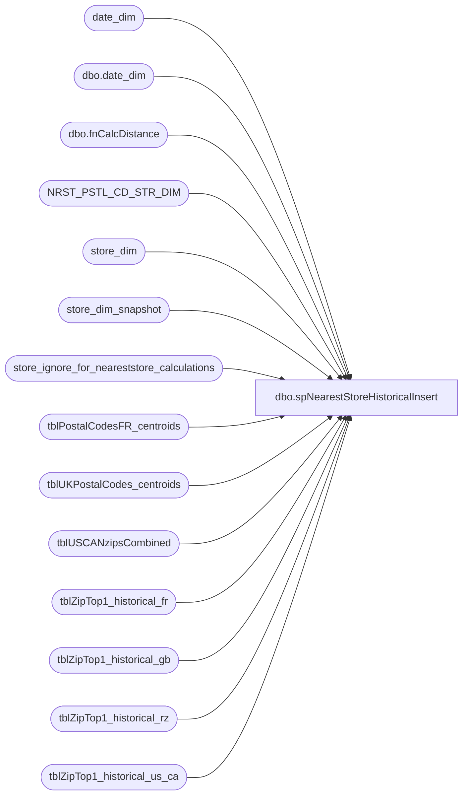

# dbo.spNearestStoreHistoricalInsert

**Database:** dw  
**Server:** papamart  

## Architecture Diagram



## Table Dependencies

| Referenced Table |
|---|
| date_dim |
| dbo.date_dim |
| dbo.fnCalcDistance |
| NRST_PSTL_CD_STR_DIM |
| store_dim |
| store_dim_snapshot |
| store_ignore_for_neareststore_calculations |
| tblPostalCodesFR_centroids |
| tblUKPostalCodes_centroids |
| tblUSCANzipsCombined |
| tblZipTop1_historical_fr |
| tblZipTop1_historical_gb |
| tblZipTop1_historical_rz |
| tblZipTop1_historical_us_ca |

## Stored Procedure Code

```sql
CREATE PROCEDURE [dbo].[spNearestStoreHistoricalInsert] AS
set nocount on

-- all valid stores better have valid lat/lons

-- if we have a problem, i.e., we notice an issue with the store_dim stuff where the lat/lon or opening/closing
-- dates changed, and we didn't realize it in time, we need to pop all data from the point of the beginning of
-- the problem
--
--	another issue is new zipcodes
--
-- 12/10/2008
--		we had a problem with stores 2011 and 2050, the lat/lons dropped off due to geocoding issues, they had
--		to be manually set in the informatica code, so, the last entry for 2011 was on 2008-08-29, it dropped off 
--		that date, so i had to at least delete from there forward to make sure i redid everything correctly.
--
--		store 2050, opened on 2008-10-30
--
--		ideally, we need to modify any historical tkf records to reference these changes
--
--	01/17/2010 - france fix, we closed the stores 12/31, but the code below wasn't using closing date which caused dups

--delete from tblZipTop1_historical_gb
--from tblZipTop1_historical_gb h
--	join date_dim d
--	on d.date_key = h.date_key
--where d.actual_date >= '2008-08-29'
--
-- to do:
-- right code to clean up tkf, and customer_dim records


/*
drop table store_ignore_for_neareststore_calculations
create table store_ignore_for_neareststore_calculations (
	store_key int,
	web bit,
	stadium bit,
	zoo	bit,
	other bit,
	comment varchar(80)
)

select
	store_id, 
	case when store_id in (13, 136, 2013, 1513) then 1 else 0 end web,
	case when store_id in (17, 155, 179, 180, 212, 285) then 1 else 0 end stadium,
	case when store_id in (209) then 1 else 0 end zoo,
	case when store_id in (0,272,2036,242) then 1 else 0 end other,
	*
from dw..store_dim
where
	(store_id in (2013, 2036)
	or store_id in (0, 13, 17, 136, 155, 179, 180, 209, 212, 242, 272, 285, 1513))

select * from store_dim where postal_code like '91764%'

--truncate table store_ignore_for_neareststore_calculations

insert into store_ignore_for_neareststore_calculations
select store_key,
	case when store_id in (13, 136, 2013, 1513) then 1 else 0 end web,
	case when store_id in (17, 155, 179,180, 212, 285) then 1 else 0 end stadium,
	case when store_id in (209) then 1 else 0 end zoo,
	case when store_id in (0,272,2036,242,1589,1590) then 1 else 0 end other,
	case when store_id in (242) then 'friend store in same mall with bear store (134), use bear' else null end comment
from store_dim
where (store_id in (2013, 2036)
	or store_id in (0, 13, 17, 136, 155, 179, 180, 209, 212, 242, 272, 285, 1513, 1589, 1590))

select * from store_ignore_for_neareststore_calculations

select * From store_ignore_for_neareststore_calculations

*/


--declare @count int
--
--select @count = count(*)
--select *
--from store_dim s
--where 1=1 
--	and store_id between 0 and 2199
--	and store_id not in (136, 2036)	-- ca web store, ireland stores
--	and (opening_date is not null or closing_date is not null)
--	and opening_date < dateadd(mm, 2, getdate())
--	and (latitude is null or longitude is null)
--	
--
--	and (s.store_id between 1 and 399 or store_id in (485))
--	and s.store_id not in (0, 13, 17, 136, 155, 179, 180, 209, 212, 242, 272, 285, 1513)  -- yes, rx web is redundant, but it's a reminder - no RZ stores allowed
--	and (latitude is null or longitude is null)
--
--
---- UK
--where 1=1
--	and store_id between 2000 and 2199
--	and store_id not in (2013, 2036)	-- remove the web store and ireland
--	and s.Latitude is not null
--	and d.actual_date < dateadd(mm, 2, getdate()) -- don't go too far ahead
--
--
--if @count != 0
--begin
--print 'bad'
--	-- send email
--end


delete from tblZipTop1_historical_us_ca where date_key >= (select min(date_key) from dw.dbo.date_dim where actual_date >= getdate())
delete from tblZipTop1_historical_gb where date_key >= (select min(date_key) from dw.dbo.date_dim where actual_date >= getdate())
delete from tblZipTop1_historical_fr where date_key >= (select min(date_key) from dw.dbo.date_dim where actual_date >= getdate())


IF (Object_ID('tempdb..#tblUSCANzipsCombined') IS NOT NULL) DROP TABLE #tblUSCANzipsCombined
select zip postcode, c.lat, c.lon
into #tblUSCANzipsCombined
from dw..tblUSCANzipsCombined c
where CAST(lat AS FLOAT)<> 0
--zip not in (
--	select zip from dw..tblUSCANzipsCombined
--	where (
--		zip between '34002' and '34099'	--AA
--		or zip between '09001' and '09898'	--AE
--		or zip between '96201' and '96698'	--AP
--		or zip between '96799' and '96799'	--AS
--		or zip between '96941' and '96944'	--FM
--		or zip between '96910' and '96932'	--GU
--		or zip between '96960' and '96970'	--MH
--		or zip between '96950' and '96952'	--MP
--		or zip between '96939' and '96940'	--PW
--		or zip between '00801' and '00851'	--VI
--		)
--		or lat = 0
--	)

-- *****************************************************************************************************************
-- * United States/Canada
-- *****************************************************************************************************************
print 'United States/Canada'

drop index tblZipTop1_historical_us_ca.PK_tblZipTop1_historical_us_ca_postal_code_store_key
drop index tblZipTop1_historical_us_ca.IX_tblZipTop1_historical_us_ca_date_key

declare @opening_date	datetime
declare @date_key	int
declare @Zip char(5), @Lat decimal(10,6), @Lon decimal(10,6)


IF (Object_ID('tempdb..#opening_dates_us_ca') IS NOT NULL) DROP TABLE #opening_dates_us_ca
select distinct opening_date, d.date_key
into #opening_dates_us_ca
from dw..store_dim s
	join date_dim d
	on d.actual_date = s.opening_date
	left join tblZipTop1_historical_us_ca h
	on h.date_key = d.date_key
	left join store_ignore_for_neareststore_calculations i
	on i.store_key = s.store_key
where 1=1
	and (s.store_id between 1 and 399 or store_id in (485))
	and i.store_key is null
	and h.date_key is null
	and d.actual_date < dateadd(mm, 2, getdate()) -- don't go too far ahead

union

select distinct dateadd(dd,1,closing_date), d.date_key
from dw..store_dim s
	join date_dim d
	on d.actual_date = dateadd(dd,1,s.closing_date)
	left join tblZipTop1_historical_us_ca h
	on h.date_key = d.date_key
	left join store_ignore_for_neareststore_calculations i
	on i.store_key = s.store_key
where 1=1
	and (s.store_id between 1 and 399 or store_id in (485))
	and i.store_key is null
	and closing_date is not null
	and h.date_key is null
	and d.actual_date < dateadd(mm, 2, getdate())  -- don't go too far ahead

DECLARE curOpeningDates CURSOR
FOR
select opening_date, date_key
from #opening_dates_us_ca
order by opening_date

OPEN curOpeningDates
FETCH NEXT FROM curOpeningDates INTO @opening_date, @date_key
WHILE (@@FETCH_STATUS <> -1)
BEGIN
--  	print @opening_date 

-- ******************************************************************************************
	IF (Object_ID('tempdb..#store_dim_us_ca') IS NOT NULL) DROP TABLE #store_dim_us_ca
	select s.store_id, s.store_key, s.latitude, s.longitude
	into #store_dim_us_ca
	from store_dim s
		left join store_ignore_for_neareststore_calculations i
		on i.store_key = s.store_key
	where 1=1
		and (s.store_id between 1 and 399 or store_id in (485))
		and i.store_key is null
		and s.Latitude is not null
		and s.opening_date <= @opening_date 
		and (s.closing_date >= @opening_date or s.closing_date is null)
		
	DECLARE curZips CURSOR
	FOR
		select postcode, lat, lon
		from #tblUSCANzipsCombined

	OPEN curZips

	FETCH NEXT FROM curZips INTO @Zip, @Lat, @Lon
	WHILE (@@FETCH_STATUS <> -1)
	BEGIN
		INSERT INTO tblZipTop1_historical_us_ca (postal_code, store_key, date_key)
		SELECT TOP 1 @zip zip, s.store_key, @date_key
		FROM #store_dim_us_ca s
		ORDER BY dw.dbo.fnCalcDistance(s.Latitude, s.Longitude, @Lat, @Lon) ASC
	
		FETCH NEXT FROM curZips INTO @Zip, @Lat, @Lon
	END
	CLOSE curZips
	DEALLOCATE curZips

-- ******************************************************************************************

	FETCH NEXT FROM curOpeningDates INTO @opening_date, @date_key
END
CLOSE curOpeningDates
DEALLOCATE curOpeningDates

CREATE  UNIQUE  CLUSTERED  INDEX [PK_tblZipTop1_historical_us_ca_postal_code_store_key] ON [dbo].[tblZipTop1_historical_us_ca]([postal_code], [store_key], [date_key]) WITH  FILLFACTOR = 100 ON [PRIMARY]
CREATE  INDEX [IX_tblZipTop1_historical_us_ca_date_key] ON [dbo].[tblZipTop1_historical_us_ca]([date_key]) WITH  FILLFACTOR = 100 ON [PRIMARY]


-- update any existing stores
-- this is too problematic, if there were other changes to the stores, we might miss that information

-- insert a snapshot for the new stores we just processed
insert into store_dim_snapshot (store_key, store_id, postal_code, opening_date, closing_date, latitude, longitude)
select s.store_key, s.store_id, s.postal_code, s.opening_date, s.closing_date, s.latitude, s.longitude
from dw..store_dim s
	left join store_dim_snapshot ss
	on ss.store_key = s.store_key
	join #opening_dates_us_ca o
	on o.opening_date = s.opening_date
	left join store_ignore_for_neareststore_calculations i
	on i.store_key = s.store_key
where 1=1
	and ss.store_key is null
	and (s.store_id between 1 and 399 or s.store_id in (485))
	and i.store_key is null


-- *****************************************************************************************************************
-- * United Kingdom
-- *****************************************************************************************************************
print 'United Kingdom'

drop index tblZipTop1_historical_gb.PK_tblZipTop1_historical_gb_postal_code_store_key
drop index tblZipTop1_historical_gb.IX_tblZipTop1_historical_gb_date_key

--declare @opening_date	datetime
--declare @date_key	int
--DECLARE @Zip char(5), @Lat decimal(10,6), @Lon decimal(10,6)

IF (Object_ID('tempdb..#tblUKPostalCodes_centroids') IS NOT NULL) DROP TABLE #tblUKPostalCodes_centroids
select postcode, c.lat, c.lon
into #tblUKPostalCodes_centroids
from dw..tblUKPostalCodes_centroids c

--select date_key, count(*) from tblZipTop1_historical_gb
--group by date_key
--order by date_key
------32
--
--truncate table tblZipTop1_historical_gb

IF (Object_ID('tempdb..#opening_dates_uk') IS NOT NULL) DROP TABLE #opening_dates_uk
select distinct opening_date, d.date_key
into #opening_dates_uk
from dw..store_dim s
	join date_dim d
	on d.actual_date = s.opening_date
	left join tblZipTop1_historical_gb h
	on h.date_key = d.date_key
	left join store_ignore_for_neareststore_calculations i
	on i.store_key = s.store_key
where 1=1
	and store_id between 2000 and 2199
	and i.store_key is null
	and s.Latitude is not null
	and h.date_key is null
	and d.actual_date < dateadd(mm, 2, getdate()) -- don't go too far ahead
union
select distinct opening_date, d.date_key
from dw..store_dim s
	join date_dim d
	on d.actual_date = dateadd(dd,1,s.closing_date)
	left join tblZipTop1_historical_gb h
	on h.date_key = d.date_key
	left join store_ignore_for_neareststore_calculations i
	on i.store_key = s.store_key
where 1=1
	and store_id between 2000 and 2199
	and i.store_key is null
	and s.Latitude is not null
	and h.date_key is null
	and d.actual_date < dateadd(mm, 2, getdate()) -- don't go too far ahead

DECLARE curOpeningDates CURSOR
FOR
select distinct opening_date, date_key
from #opening_dates_uk
order by opening_date

OPEN curOpeningDates
FETCH NEXT FROM curOpeningDates INTO @opening_date, @date_key
WHILE (@@FETCH_STATUS <> -1)
BEGIN
--  	print @opening_date 

-- ******************************************************************************************
	IF (Object_ID('tempdb..#store_dim_uk') IS NOT NULL) DROP TABLE #store_dim_uk
	select s.store_id, s.store_key, s.latitude, s.longitude
	into #store_dim_uk
	from store_dim s
		left join store_ignore_for_neareststore_calculations i
		on i.store_key = s.store_key
	where 1=1
		and store_id between 2000 and 2199
		and i.store_key is null
		and s.Latitude is not null
		and opening_date <= @opening_date 
		and (closing_date >= @opening_date or closing_date is null)
		
	DECLARE curZips CURSOR
	FOR
		select postcode, lat, lon
		from #tblUKPostalCodes_centroids

	OPEN curZips

	FETCH NEXT FROM curZips INTO @Zip, @Lat, @Lon
	WHILE (@@FETCH_STATUS <> -1)
	BEGIN
		INSERT INTO tblZipTop1_historical_gb (postal_code, store_key, date_key)
		SELECT TOP 1 @zip zip, s.store_key, @date_key
		FROM #store_dim_uk s
		ORDER BY dw.dbo.fnCalcDistance(s.Latitude, s.Longitude, @Lat, @Lon) ASC
	
		FETCH NEXT FROM curZips INTO @Zip, @Lat, @Lon
	END
	CLOSE curZips
	DEALLOCATE curZips

-- ******************************************************************************************

	FETCH NEXT FROM curOpeningDates INTO @opening_date, @date_key
END
CLOSE curOpeningDates
DEALLOCATE curOpeningDates

CREATE  UNIQUE  CLUSTERED  INDEX [PK_tblZipTop1_historical_gb_postal_code_store_key] ON [dbo].[tblZipTop1_historical_gb]([postal_code], [store_key], [date_key]) WITH  FILLFACTOR = 100 ON [PRIMARY]
CREATE  INDEX [IX_tblZipTop1_historical_gb_date_key] ON [dbo].[tblZipTop1_historical_gb]([date_key]) WITH  FILLFACTOR = 100 ON [PRIMARY]


-- update any existing stores
-- this is too problematic, if there were other changes to the stores, we might miss that information

-- insert a snapshot for the new stores we just processed
insert into store_dim_snapshot (store_key, store_id, postal_code, opening_date, closing_date, latitude, longitude)
select s.store_key, s.store_id, s.postal_code, s.opening_date, s.closing_date, s.latitude, s.longitude
from dw..store_dim s
	left join store_dim_snapshot ss
	on ss.store_key = s.store_key
	join #opening_dates_uk o
	on o.opening_date = s.opening_date
	left join store_ignore_for_neareststore_calculations i
	on i.store_key = s.store_key
where 1=1
	and ss.store_key is null
	and s.store_id between 2000 and 2199
	and i.store_key is null


-- *****************************************************************************************************************
-- * France
-- *****************************************************************************************************************
print 'France'

drop index tblZipTop1_historical_fr.PK_tblZipTop1_historical_fr_postal_code_store_key
drop index tblZipTop1_historical_fr.IX_tblZipTop1_historical_fr_date_key

--declare @opening_date	datetime
--declare @date_key	int
--DECLARE @Zip char(5), @Lat decimal(10,6), @Lon decimal(10,6)

-- we need to override the store_dim table, because the france postal_codes aren't coming through
IF (Object_ID('tempdb..#france_store_dim') IS NOT NULL) DROP TABLE #france_store_dim
select store_key, store_id, opening_date, closing_date, latitude, longitude, postal_code
into #france_store_dim
from dw..store_dim s
where 1=1
	and store_id between 2200 and 2299

update #france_store_dim set postal_code = '94110' where store_id = 2201
update #france_store_dim set postal_code = '78140' where store_id = 2202
update #france_store_dim set postal_code = '92092' where store_id = 2203

update #france_store_dim
set latitude = c.lat, longitude = c.lon
from #france_store_dim fs
	join tblPostalCodesFR_centroids c
	on c.postcode = fs.postal_code

IF (Object_ID('tempdb..#tblPostalCodesFR_centroids') IS NOT NULL) DROP TABLE #tblPostalCodesFR_centroids
select postcode, c.lat, c.lon
into #tblPostalCodesFR_centroids
from dw..tblPostalCodesFR_centroids c

IF (Object_ID('tempdb..#opening_dates_fr') IS NOT NULL) DROP TABLE #opening_dates_fr
select distinct opening_date, d.date_key
into #opening_dates_fr
from #france_store_dim s
-- 	from dw..store_dim s
	join date_dim d
	on d.actual_date = s.opening_date
	left join tblZipTop1_historical_fr h
	on h.date_key = d.date_key
	left join store_ignore_for_neareststore_calculations i
	on i.store_key = s.store_key
where 1=1
	and store_id between 2200 and 2299
	and i.store_key is null
	and s.Latitude is not null
	and h.date_key is null
	and d.actual_date < dateadd(mm, 2, getdate()) -- don't go too far ahead
union

--select distinct opening_date, d.date_key
select distinct dateadd(dd,1,closing_date), d.date_key
from #france_store_dim s
-- 	from dw..store_dim s
	join date_dim d
	on d.actual_date = dateadd(dd,1,s.closing_date)
	left join tblZipTop1_historical_fr h
	on h.date_key = d.date_key
	left join store_ignore_for_neareststore_calculations i
	on i.store_key = s.store_key
where 1=1
	and store_id between 2200 and 2299
	and i.store_key is null
	and s.Latitude is not null
	and closing_date is not null
	and h.date_key is null
	and d.actual_date < dateadd(mm, 2, getdate()) -- don't go too far ahead


DECLARE curOpeningDates CURSOR
FOR
select distinct opening_date, date_key
from #opening_dates_fr
order by opening_date

OPEN curOpeningDates
FETCH NEXT FROM curOpeningDates INTO @opening_date, @date_key
WHILE (@@FETCH_STATUS <> -1)
BEGIN
--  	print @opening_date 

-- ******************************************************************************************
	IF (Object_ID('tempdb..#store_dim_fr') IS NOT NULL) DROP TABLE #store_dim_fr
	select s.store_id, s.store_key, s.latitude, s.longitude
	into #store_dim_fr
	from #france_store_dim s
	-- 	from dw..store_dim s
		left join store_ignore_for_neareststore_calculations i
		on i.store_key = s.store_key
	where 1=1
		and s.store_id between 2200 and 2299
		and i.store_key is null
		and s.Latitude is not null
		and opening_date <= @opening_date 
		and (closing_date >= @opening_date or closing_date is null)
		
	DECLARE curZips CURSOR
	FOR
		select postcode, lat, lon
		from #tblPostalCodesFR_centroids

	OPEN curZips

	FETCH NEXT FROM curZips INTO @Zip, @Lat, @Lon
	WHILE (@@FETCH_STATUS <> -1)
	BEGIN
		INSERT INTO tblZipTop1_historical_fr (postal_code, store_key, date_key)
		SELECT TOP 1 @zip zip, s.store_key, @date_key
		FROM #store_dim_fr s
		ORDER BY dw.dbo.fnCalcDistance(s.Latitude, s.Longitude, @Lat, @Lon) ASC
	
		FETCH NEXT FROM curZips INTO @Zip, @Lat, @Lon
	END
	CLOSE curZips
	DEALLOCATE curZips

-- ******************************************************************************************

	FETCH NEXT FROM curOpeningDates INTO @opening_date, @date_key
END
CLOSE curOpeningDates
DEALLOCATE curOpeningDates


CREATE  UNIQUE  CLUSTERED  INDEX [PK_tblZipTop1_historical_fr_postal_code_store_key] ON [dbo].[tblZipTop1_historical_fr]([postal_code], [store_key], [date_key]) WITH  FILLFACTOR = 100 ON [PRIMARY]
CREATE  INDEX [IX_tblZipTop1_historical_fr_date_key] ON [dbo].[tblZipTop1_historical_fr]([date_key]) WITH  FILLFACTOR = 100 ON [PRIMARY]

-- update any existing stores
-- this is too problematic, if there were other changes to the stores, we might miss that information

-- insert a snapshot for the new stores we just processed
insert into store_dim_snapshot (store_key, store_id, postal_code, opening_date, closing_date, latitude, longitude)
select s.store_key, s.store_id, s.postal_code, s.opening_date, s.closing_date, s.latitude, s.longitude
from dw..store_dim s
	left join store_dim_snapshot ss
	on ss.store_key = s.store_key
	join #opening_dates_fr o
	on o.opening_date = s.opening_date
	left join store_ignore_for_neareststore_calculations i
	on i.store_key = s.store_key
where 1=1
	and ss.store_key is null
	and s.store_id between 2200 and 2299
	and i.store_key is null


--select date_key,count(*) From [tblZipTop1_historical_fr]
--group by date_key
--order by date_key

-- *****************************************************************************************************************
-- * RideMakerz
-- *****************************************************************************************************************
print 'RideMakerz'

--truncate table tblZipTop1_historical_rz

drop index tblZipTop1_historical_rz.PK_tblZipTop1_historical_rz_postal_code_store_key
drop index tblZipTop1_historical_rz.IX_tblZipTop1_historical_rz_date_key

--declare @opening_date	datetime
--declare @date_key	int
--declare @Zip char(5), @Lat decimal(10,6), @Lon decimal(10,6)

IF (Object_ID('tempdb..#opening_dates_rz') IS NOT NULL) DROP TABLE #opening_dates_rz
select distinct opening_date, d.date_key
into #opening_dates_rz
from dw..store_dim s
	join date_dim d
	on d.actual_date = s.opening_date
	left join tblZipTop1_historical_rz h
	on h.date_key = d.date_key
	left join store_ignore_for_neareststore_calculations i
	on i.store_key = s.store_key
where 1=1
	and (s.store_id between 1500 and 1569)
	and i.store_key is null
	and h.date_key is null
	and d.actual_date < dateadd(mm, 2, getdate()) -- don't go too far ahead

union

select distinct dateadd(dd,1,closing_date), d.date_key
from dw..store_dim s
	join date_dim d
	on d.actual_date = dateadd(dd,1,s.closing_date)
	left join tblZipTop1_historical_rz h
	on h.date_key = d.date_key
	left join store_ignore_for_neareststore_calculations i
	on i.store_key = s.store_key
where 1=1
	and (s.store_id between 1500 and 1569)
	and i.store_key is null
	and closing_date is not null
	and h.date_key is null
	and d.actual_date < dateadd(mm, 2, getdate())  -- don't go too far ahead

DECLARE curOpeningDates CURSOR
FOR
select opening_date, date_key
from #opening_dates_rz
order by opening_date

OPEN curOpeningDates
FETCH NEXT FROM curOpeningDates INTO @opening_date, @date_key
WHILE (@@FETCH_STATUS <> -1)
BEGIN
--  	print @opening_date 

-- ******************************************************************************************
	IF (Object_ID('tempdb..#store_dim_rz') IS NOT NULL) DROP TABLE #store_dim_rz
	select s.store_id, s.store_key, s.latitude, s.longitude
	into #store_dim_rz
	from store_dim s
		left join store_ignore_for_neareststore_calculations i
		on i.store_key = s.store_key
	where 1=1
		and (s.store_id between 1500 and 1569)
		and i.store_key is null
		and s.Latitude is not null
		and s.opening_date <= @opening_date 
		and (s.closing_date >= @opening_date or s.closing_date is null)
		
	DECLARE curZips CURSOR
	FOR
		select postcode, lat, lon
		from #tblUSCANzipsCombined

	OPEN curZips

	FETCH NEXT FROM curZips INTO @Zip, @Lat, @Lon
	WHILE (@@FETCH_STATUS <> -1)
	BEGIN
		INSERT INTO tblZipTop1_historical_rz (postal_code, store_key, date_key)
		SELECT TOP 1 @zip zip, s.store_key, @date_key
		FROM #store_dim_rz s
		ORDER BY dw.dbo.fnCalcDistance(s.Latitude, s.Longitude, @Lat, @Lon) ASC
	
		FETCH NEXT FROM curZips INTO @Zip, @Lat, @Lon
	END
	CLOSE curZips
	DEALLOCATE curZips

-- ******************************************************************************************

	FETCH NEXT FROM curOpeningDates INTO @opening_date, @date_key
END
CLOSE curOpeningDates
DEALLOCATE curOpeningDates

CREATE  UNIQUE  CLUSTERED  INDEX [PK_tblZipTop1_historical_rz_postal_code_store_key] ON [dbo].[tblZipTop1_historical_rz]([postal_code], [store_key], [date_key]) WITH  FILLFACTOR = 100 ON [PRIMARY]
CREATE  INDEX [IX_tblZipTop1_historical_rz_date_key] ON [dbo].[tblZipTop1_historical_rz]([date_key]) WITH  FILLFACTOR = 100 ON [PRIMARY]

-- update any existing stores
-- this is too problematic, if there were other changes to the stores, we might miss that information

-- insert a snapshot for the new stores we just processed
insert into store_dim_snapshot (store_key, store_id, postal_code, opening_date, closing_date, latitude, longitude)
select s.store_key, s.store_id, s.postal_code, s.opening_date, s.closing_date, s.latitude, s.longitude
from dw..store_dim s
	left join store_dim_snapshot ss
	on ss.store_key = s.store_key
	join #opening_dates_rz o
	on o.opening_date = s.opening_date
	left join store_ignore_for_neareststore_calculations i
	on i.store_key = s.store_key
where 1=1
	and ss.store_key is null
--	and (s.store_id between 1500 and 1599)
	and i.store_key is null


-- Patch because of trailing Spaces....
UPDATE NRST_PSTL_CD_STR_DIM
       SET PSTL_CD = LTRIM(RTRIM(PSTL_CD))
WHERE
       RIGHT(PSTL_CD, 1) = ' '
```

