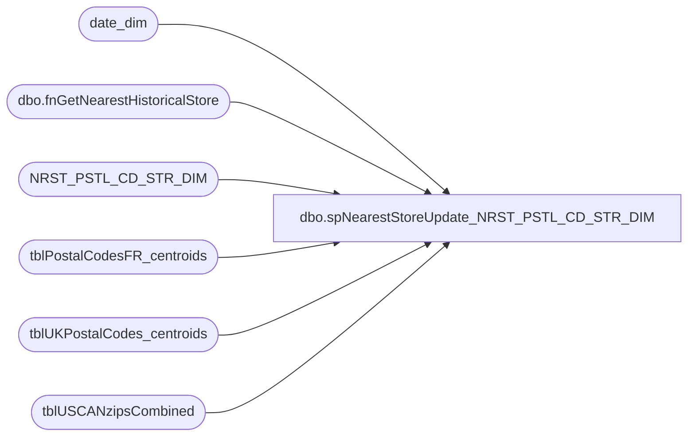

# dbo.spNearestStoreUpdate_NRST_PSTL_CD_STR_DIM

**Database:** dw  
**Server:** papamart  

## Architecture Diagram



## Table Dependencies

| Referenced Table |
|---|
| date_dim |
| dbo.fnGetNearestHistoricalStore |
| NRST_PSTL_CD_STR_DIM |
| tblPostalCodesFR_centroids |
| tblUKPostalCodes_centroids |
| tblUSCANzipsCombined |

## Stored Procedure Code

```sql
-- =============================================
-- Author:		dave
-- Create date: 12/10/2008
-- this should run at least once a week
-- =============================================
CREATE PROCEDURE [dbo].[spNearestStoreUpdate_NRST_PSTL_CD_STR_DIM]
AS
BEGIN

set nocount on

declare @date_key_current int
declare @date_key_future int
set @date_key_current = (
	select date_key
	from date_dim
	where actual_date = cast(convert(varchar, getdate(), 101) as datetime)
)
set @date_key_future = (
	select date_key
	from date_dim
	where actual_date = cast(convert(varchar, dateadd(ww, 6, getdate()), 101) as datetime)
)

truncate table NRST_PSTL_CD_STR_DIM

insert into NRST_PSTL_CD_STR_DIM (cntry_abbrv, pstl_cd, str_id, futr_str_id, ins_dt, updt_dt, etl_log_id, etl_evnt_id)
select 
	'USA', 
	zip, 
	dbo.fnGetNearestHistoricalStore('USA', zip, @date_key_current, 0), 
	dbo.fnGetNearestHistoricalStore('USA', zip, @date_key_future, 0),
	getdate(),
	getdate(),
	-1,
	-1
from tblUSCANzipsCombined
where len(zip) = 5
-- some zips were removed because we don't need to set nearest stores for guam and others
	and dbo.fnGetNearestHistoricalStore('USA', zip, @date_key_current, 0) is not null
	and dbo.fnGetNearestHistoricalStore('USA', zip, @date_key_future, 0) is not null

insert into NRST_PSTL_CD_STR_DIM (cntry_abbrv, pstl_cd, str_id, futr_str_id, ins_dt, updt_dt, etl_log_id, etl_evnt_id)
select 
	'CAN', 
	zip, 
	dbo.fnGetNearestHistoricalStore('CAN', zip, @date_key_current, 0), 
	dbo.fnGetNearestHistoricalStore('CAN', zip, @date_key_future, 0),
	getdate(),
	getdate(),
	-1,
	-1
from tblUSCANzipsCombined
where len(zip) != 5

insert into NRST_PSTL_CD_STR_DIM (cntry_abbrv, pstl_cd, str_id, futr_str_id, ins_dt, updt_dt, etl_log_id, etl_evnt_id)
select 
	'GBR', 
	postcode, 
	dbo.fnGetNearestHistoricalStore('GBR', postcode, @date_key_current, 0), 
	dbo.fnGetNearestHistoricalStore('GBR', postcode, @date_key_future, 0),
	getdate(),
	getdate(),
	-1,
	-1
from tblUKPostalCodes_centroids

insert into NRST_PSTL_CD_STR_DIM (cntry_abbrv, pstl_cd, str_id, futr_str_id, ins_dt, updt_dt, etl_log_id, etl_evnt_id)
select 
	'FRA', 
	postcode, 
	dbo.fnGetNearestHistoricalStore('FRA', postcode, @date_key_current, 0), 
	dbo.fnGetNearestHistoricalStore('FRA', postcode, @date_key_future, 0),
	getdate(),
	getdate(),
	-1,
	-1
from tblPostalCodesFR_centroids
END
```

