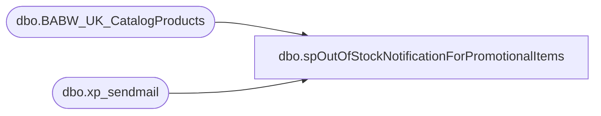

# dbo.spOutOfStockNotificationForPromotionalItems

**Database:** dw  
**Server:** papamart  

## Architecture Diagram



## Table Dependencies

| Referenced Table |
|---|
| dbo.BABW_UK_CatalogProducts |
| dbo.xp_sendmail |

## Stored Procedure Code

```sql
--exec spOutOfStockNotificationForPromotionalItems

CREATE procedure [dbo].[spOutOfStockNotificationForPromotionalItems] as

IF (Object_ID('tempdb..##OutOfStockItems') IS NOT NULL) DROP TABLE ##OutOfStockItems;

create table ##OutOfStockItems (
	SKU	varchar(50),
	OOSFlag varchar(15),
	Quantity int
);

/*
--US moved to ATG platform where the issue with selling out of a GWP should no longer matter
insert into ##OutOfStockItems
(SKU, OOSFlag, Quantity)
select cp.sku, 'IsOutOfStock', (cp.InventoryBaseValue-(InventoryReservedOnHand + InventoryReservedBackOrdered))
	from bearwebdb.webcart_Commerce.dbo.BABW_US_CatalogProducts cp with (nolock)
	where cp.sku in ('16442', '16444') --16443,16441 went out of stock so it was removed from this alert
	and (cp.InventoryBaseValue-(InventoryReservedOnHand + InventoryReservedBackOrdered)) <= 15;
*/


--all UK hello kitty clips have few remaining stock so we removed the gwp
insert into ##OutOfStockItems
(SKU, OOSFlag, Quantity)
select cp.sku, 'IsOutOfStock', (cp.InventoryBaseValue-(InventoryReservedOnHand + InventoryReservedBackOrdered))
	from bearwebdb.webcart_Commerce.dbo.BABW_UK_CatalogProducts cp with (nolock)
	--where cp.sku in ('416442','416441','416443','416444')
	where cp.sku in ('416505')
	and (cp.InventoryBaseValue-(InventoryReservedOnHand + InventoryReservedBackOrdered)) <= 25;


if (select count(*) from ##OutOfStockItems) > 0
begin
	declare @SQL varchar(2000)
	set @SQL = 'select OOS.SKU as SKU
		--, OOS.OOSFlag as OOSFlag
		, Quantity as Quantity
		from ##OutOfStockItems OOS
		where OOSFlag = ''IsOutOfStock''
		Print ''''
		Print ''Ran from papamart.dw.spOutOfStockNotificationForPromotionalItems'''

 		exec master.dbo.xp_sendmail 
  		@recipients = 'webteam@buildabear.com;CorieB@buildabear.com',
--		@recipients = 'justind@buildabear.com',
 		@subject='Webcart - OOS Notification for Promotional Items', 
 		@width = 1000,
 		@query= @SQL
end

WAITFOR DELAY '00:00:20'

IF (Object_ID('tempdb..##OutOfStockItems') IS NOT NULL) DROP TABLE ##OutOfStockItems;
```

