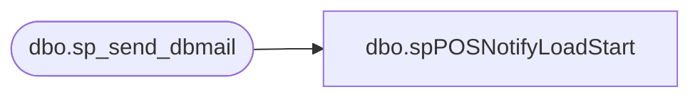

# dbo.spPOSNotifyLoadStart

**Database:** dw  
**Server:** papamart  

## Architecture Diagram



## Table Dependencies

| Referenced Table |
|---|
| dbo.sp_send_dbmail |

## Stored Procedure Code

```sql
CREATE PROCEDURE [dbo].[spPOSNotifyLoadStart]
AS
	-- =====================================================================================================
	-- Name: spPOSNotifyLoadStart
	--
	-- Description:	Sends an email indicating that the POS Load has started
	--
	-- Input:	
	--			N/A
	--
	-- Output: Resultset with the following columns:
	--			N/A
	--
	-- Dependencies: None
	--
	-- Revision History
	--		Name:			Date:			Comments:
	--		Gary Murrish	12/2/2011		Initial Release
	-- =====================================================================================================
	EXEC msdb.dbo.sp_send_dbmail
	@recipients = 'Poll@buildabear.com;databears@buildabear.com;servicedesk@buildabear.com'
	, @subject = 'Datawarehouse POS Load Started'
	, @body = 'The datawarehouse load from POS has started. '
```

