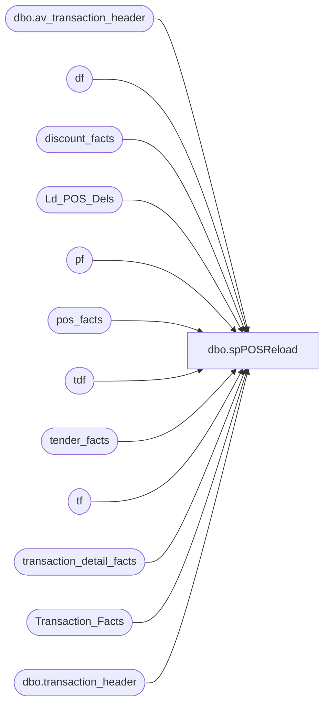

# dbo.spPOSReload

**Database:** dw  
**Server:** papamart  

## Architecture Diagram



## Table Dependencies

| Referenced Table |
|---|
| dbo.av_transaction_header |
| df |
| discount_facts |
| Ld_POS_Dels |
| pf |
| pos_facts |
| tdf |
| tender_facts |
| tf |
| transaction_detail_facts |
| Transaction_Facts |
| dbo.transaction_header |

## Stored Procedure Code

```sql
CREATE   procedure [dbo].[spPOSReload] 
	@DeleteAllPOSFromDt datetime 
as
-- =====================================================================================================
-- Name: spPOSReload
--
-- Description:	Pulls transaction data from Sales Audit
--
-- Input:	
--			@DeleteAllPOSFromDt			datetime	Sets date range
--
-- Output: Resultset with the following columns:
--			N/A
--
-- Dependencies: None
--
-- Revision History
--		Name:			Date:			Comments:
--		Gary Murrish	12/28/2011		Added Transaction_facts to the delete
--		RickC			12/01/2011		Removed tender_Group references and added tender_facts
--		GaryD			08/18/2010		Initial version in source control.
--		GaryD			08/19/2010		Change server name for SA 5.0
-- =====================================================================================================

--BUILD THE LIST OF TRANSACTION_IDs nto DELETE/RELOAD--
INSERT INTO Ld_POS_Dels(transaction_id,dm_deleted_y_n)
select transaction_id,'N'
	from bedrockdb01.auditworks.dbo.transaction_header 
	where transaction_date >= @DeleteAllPOSFromDt
UNION
select av_transaction_id,'N'
	from bedrockdb01.auditworks.dbo.av_transaction_header 
	where transaction_date >= @DeleteAllPOSFromDt

		--BUILD temp table to assist with deletes---
				select 	DISTINCT
					tdf.store_key ,
					tdf.date_key 
				into #tmp_drm_POSdels
				from transaction_detail_facts tdf 
					join ld_POS_Dels d on tdf.transaction_id = d.transaction_id
				where  tdf.transaction_line_seq >= 0 and d.dm_deleted_y_n ='N'
				
				create index idxN_NU_#tmp_date_store_key on #tmp_drm_POSdels(date_key,store_key)
				---------------
				--DELETE data--
				--delete tender_group_dim where tender_group_key in (select tender_group_key from #tmp_drm_POSdels)
				--delete tender_group_bridge where tender_group_key in (select tender_group_key from #tmp_drm_POSdels)
				delete tf
				from tender_facts tf 
					join ld_POS_Dels d on tf.transaction_id = d.transaction_id
				
				--delete coupon_group_dim where coupon_group_key in (select coupon_group_key from #tmp_drm_POSdels)
				--delete coupon_group_bridge where coupon_group_key in (select coupon_group_key from #tmp_drm_POSdels)
				
				delete tdf
				from transaction_detail_facts tdf 
					join ld_POS_Dels d on tdf.transaction_id = d.transaction_id
				where  tdf.transaction_line_seq >= 0 
				
				delete df
				from discount_facts df 
					join ld_POS_Dels d on df.transaction_id = d.transaction_id
				
				delete pf 
				from pos_facts pf 
					join #tmp_drm_POSdels d
					on pf.transaction_date_key = d.date_key and pf.store_key = d.store_key 

				delete tf
				from Transaction_Facts tf 
					join ld_POS_Dels d on tf.transaction_id = d.transaction_id

	update Ld_POS_Dels
	set dm_deleted_y_n='Y'
	where dm_deleted_y_n='N'
```

