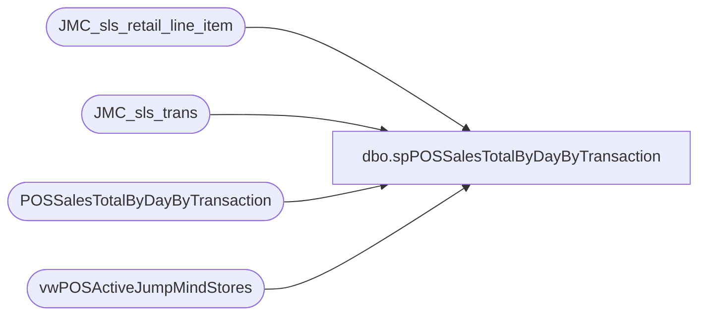

# dbo.spPOSSalesTotalByDayByTransaction

**Database:** dw  
**Server:** papamart  

## Architecture Diagram



## Table Dependencies

| Referenced Table |
|---|
| JMC_sls_retail_line_item |
| JMC_sls_trans |
| POSSalesTotalByDayByTransaction |
| vwPOSActiveJumpMindStores |

## Stored Procedure Code

```sql
---- =====================================================================================================
---- Name: spPOSSalesTotalByDayByTransaction
---- Revision History
----		Name:			Date:			Comments:
----		Tim Callahan	08/15/2023		Replaces View vwPOSSalesTotalByDayByTransaction
----		Tim Callahan	05/20/2024		Updated to build temp table for store lookup view for perfomrance
----										Added Trans Status = Completed to ensure we do not include cancelled\suspended\etc transactions 
---- =====================================================================================================

CREATE PROCEDURE [dbo].[spPOSSalesTotalByDayByTransaction]

as

--Build Temp Table for performance 
-- Added 5/20/2024
IF OBJECT_ID(N'tempdb..#vwPOSActiveJumpMindStores') IS NOT NULL
DROP TABLE #vwPOSActiveJumpMindStores
select * 
into #vwPOSActiveJumpMindStores
from vwPOSActiveJumpMindStores

IF OBJECT_ID(N'tempdb..#Units') IS NOT NULL
DROP TABLE #Units
select 
cast (r.create_time as date) as BusinessDate,
left (r.device_id, 4) as StoreNumber, 
case 
	when left(r.device_id,1)='2 '
		then left (r.device_id, 4)
	else cast (v.StoreID as Int) 
end as StoreID,
--right (r.device_id,1) as RegisterNumber, 
right (r.device_id,2) as RegisterNumber, 
r.sequence_number as TransactionNumber, 
cast (sum (r.quantity) as int)  as Units, 
sum (r.extended_amount)  as LineSales

into #Units
from JMC_sls_retail_line_item r (nolock) 
join #vwPOSActiveJumpMindStores v (nolock) on v.business_unit_id = left(r.device_id, 4)
join JMC_sls_trans s (nolock) on s.device_id=r.device_id and r.sequence_number=s.trans_nbr and r.business_date=s.business_date
where 1=1
and r.voided = 0
and len(r.item_id) = 6
and r.item_type <> 'GIFTCARD'
and s.trans_status = 'Completed' -- Added 5/20/2024
group by 
cast (r.create_time as date),
left (r.device_id, 4), 
case 
	when left(r.device_id,1)='2 '
		then left (r.device_id, 4)
	else cast (v.StoreID as Int) 
end ,
--right (r.device_id,1), 
right (r.device_id,2), 
r.sequence_number 


IF OBJECT_ID(N'tempdb..#Sales') IS NOT NULL
DROP TABLE #Sales
select 
	--cast(s.business_date as date) as BusinessDate,
	cast (s.create_time as date) as BusinessDate, -- Replaced above on 8/14/2023
	case 
		when left(s.business_unit_id,1)='2 '
			then s.business_unit_id
		else cast(right((cast('0000' as varchar) + cast(right(s.business_unit_id,3) as varchar)),4) as int)
	end as StoreID,
	--cast(right(s.device_id,2) as int) as RegisterNumber,
	case when s.device_id like '%customerdisplay%' then 2 else cast(right(s.device_id,2) as int) end as RegisterNumber,
	s.trans_nbr TransactionNumber,
	sum(s.subtotal) Sales
	into #Sales 
from JMC_sls_trans s with (nolock) 
where 
	(
		--cast(business_date as date) >='2023-04-12' --first day of new POs
		cast(s.create_time as date) >='2023-04-12' --first day of new POs -- -- Replaced above on 8/14/2023
		--and datediff(dd, business_date, getdate())<=7
	)
and 
	case 
		when left(s.business_unit_id,1)='2 '
			then s.business_unit_id
		else cast(right((cast('0000' as varchar) + cast(right(s.business_unit_id,3) as varchar)),4) as int)
	end not in ('13', '2013') ---excluding endless aisle??
and s.trans_status = 'Completed' -- Added 5/20/2024
group by
	--cast(s.business_date as date),
	cast (s.create_time as date) , -- Replaced above on 8/14/2023
	business_unit_id,
	--s.device_id,
	case when s.device_id like '%customerdisplay%' then 2 else cast(right(s.device_id,2) as int) end,
	s.trans_nbr


CREATE NONCLUSTERED INDEX [<Name of Missing Index, sysname,>]
ON [dbo].[#Sales] ([BusinessDate],[StoreID],[RegisterNumber],[TransactionNumber])
INCLUDE ([Sales])

IF OBJECT_ID(N'tempdb..#Summary1') IS NOT NULL
DROP TABLE #Summary1
select 
	s.BusinessDate,
	s.StoreID,
	s.RegisterNumber,
	s.TransactionNumber,
	sum(s.Sales) Sales,
	sum(u.Units) Units
into #Summary1
from #Sales s
join #Units u on 
	s.BusinessDate=u.BusinessDate
	and s.StoreID=u.StoreID
	and s.RegisterNumber=u.RegisterNumber
	and s.TransactionNumber=u.TransactionNumber
--where s.BusinessDate = '08/14/2023'
--and s.StoreID = '015'
group by 
	s.BusinessDate,
	s.StoreID,
	s.RegisterNumber,
	s.TransactionNumber

truncate table POSSalesTotalByDayByTransaction

insert into POSSalesTotalByDayByTransaction
select *
from #Summary1
--where BusinessDate = '2023-08-14'
--and storeid in ('15','47','63','86','91','102','104','110','117','154','192','193','199','201','221','256','257','307','308','318','330','393','425','521','534')
--order by 2
```

