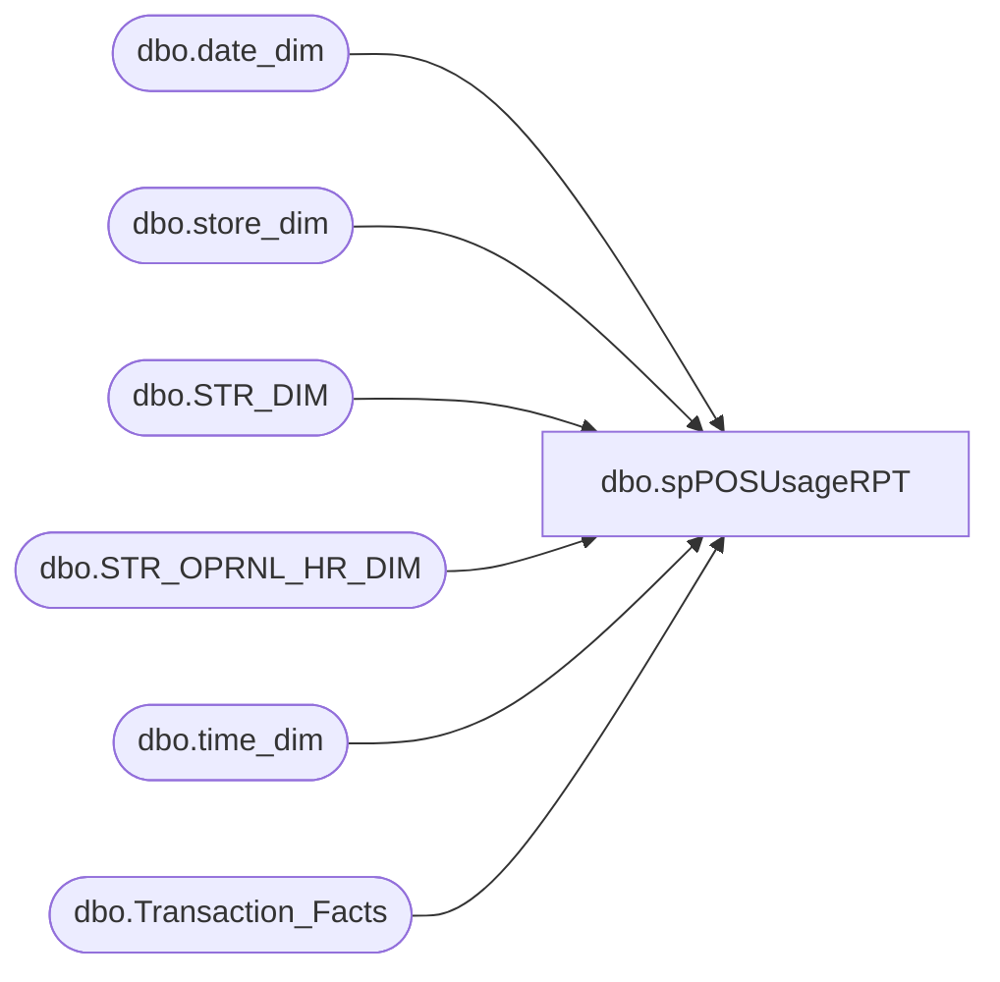

# dbo.spPOSUsageRPT

**Database:** dw  
**Server:** papamart  

## Architecture Diagram



## Table Dependencies

| Referenced Table |
|---|
| dbo.date_dim |
| dbo.store_dim |
| dbo.STR_DIM |
| dbo.STR_OPRNL_HR_DIM |
| dbo.time_dim |
| dbo.Transaction_Facts |

## Stored Procedure Code

```sql
CREATE PROCEDURE [dbo].[spPOSUsageRPT]
	
	@StartDate AS DATETIME = NULL
	,@EndDate AS DATETIME = NULL
	,@StoreID AS INT = NULL
	,@Bearea AS VARCHAR(100) = NULL
	,@Region AS VARCHAR(100) = NULL
	,@Country AS VARCHAR(50) = NULL

AS
-- =============================================================================================================
-- Name: [dbo].[spPOSUsageRPT]
--
-- Description:	The following query is used to return POS station details for each store.
--
-- Input:	N/A
--
-- Output: N/A
--
-- Dependencies: 
--
-- Revision History
--		Name:			Date:			Comments:
--		Chad Lich		04/04/2014		created
--		Mike Pelikan	04/29/2014		Changed BABWMSTRDATA linked server reference
-- =============================================================================================================

BEGIN
	
--POS Usage Report

IF ISNULL(@StartDate,'') = ''
BEGIN
	SET @StartDate = DATEADD(dd,-30,GETDATE())
END

IF ISNULL(@EndDate,'') = ''
BEGIN
	SET @EndDate = GETDATE()
END

SELECT
  st.store_id
  ,st.store_name
  ,st.bearea
  ,st.region
  ,st.country_name
  ,st.num_of_pos
  ,COUNT(distinct ts.transaction_id) total_transactions
  ,COUNT(distinct ts.register_no) total_registers
  ,ISNULL(COUNT(distinct ts.transaction_id),0) / NULLIF(COUNT(distinct ts.register_no),0) trans_per_register
  ,COUNT(td.hour) total_hours
  ,SUM(ts.Giftcard_UGA) total_giftcard_dollars
  ,SUM(ts.Net_Sales_amount) total_net_sales_dollars
  ,SUM(ts.GAAP_Sales_amount) total_gaap_sales_dollars
  ,SUM(DATEDIFF(HH,ohr.STRT_TM,ohr.END_TM)) Open_Hours
FROM
  dbo.store_dim st
  INNER JOIN dbo.Transaction_Facts ts ON st.store_key = ts.store_key
  INNER JOIN dbo.date_dim dd ON ts.date_key = dd.date_key
  INNER JOIN dbo.time_dim td ON ts.time_key = td.time_key
  LEFT JOIN KODIAK.BABWMstrData.dbo.STR_DIM st1 ON st.Store_ID = st1.STR_NUM
  LEFT JOIN KODIAK.BABWMstrData.dbo.STR_OPRNL_HR_DIM ohr ON st1.STR_ID = ohr.STR_ID AND dd.day_of_week = ohr.DY_OF_WK_ID
WHERE
	st.closing_date >= @StartDate
	AND dd.actual_date BETWEEN @StartDate AND @EndDate
	AND (ISNULL(@StoreID,0) = 0 OR st.Store_ID = @StoreID)
	AND (ISNULL(@Bearea,'') = '' OR st.bearea = @Bearea)
	AND (ISNULL(@Region,'') = '' OR st.region = @Region)
	AND (ISNULL(@Country,'') = '' OR st.country_name = @Country)
GROUP BY
	st.store_id
	,st.store_name
	,st.bearea
	,st.region
	,st.country_name
	,st.num_of_pos
ORDER BY
	st.store_ID

END
```

