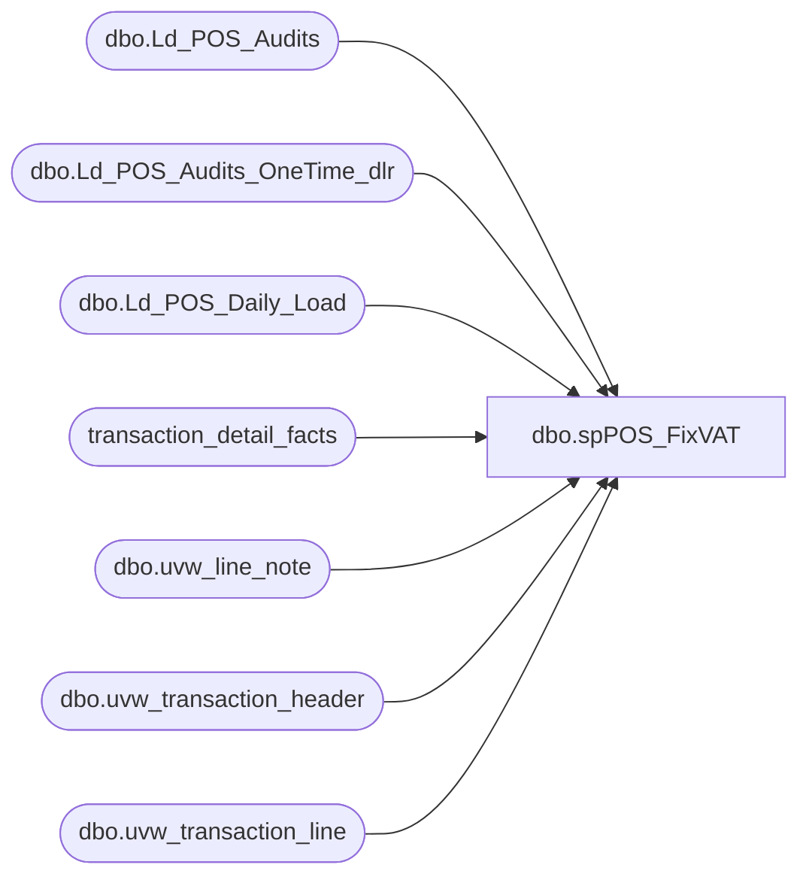

# dbo.spPOS_FixVAT

**Database:** dw  
**Server:** papamart  

## Architecture Diagram



## Table Dependencies

| Referenced Table |
|---|
| dbo.Ld_POS_Audits |
| dbo.Ld_POS_Audits_OneTime_dlr |
| dbo.Ld_POS_Daily_Load |
| transaction_detail_facts |
| dbo.uvw_line_note |
| dbo.uvw_transaction_header |
| dbo.uvw_transaction_line |

## Stored Procedure Code

```sql
CREATE PROCEDURE [dbo].[spPOS_FixVAT]
	@load_version varchar(20)
as
-- =====================================================================================================
-- Name: spPOS_FixVAT
--
-- Description:	fixes for vat for the lines where a 1621 action was applied to it
--
-- Input:	
--		@load_version - the pos load can be done from three different 
--			Audit	
--			Daily
--			OneTime
--
-- Output: Resultset with the following columns:
--			N/A
--
-- Dependencies: None
--
--
--	exec spPOS_FixVAT 'Audit'
--	exec spPOS_FixVAT 'Daily'
--	exec spPOS_FixVAT 'OneTime'
--
-- Revision History
--		Name:			Date:			Comments:
--		dave			11/03/2010		created
-- =====================================================================================================
BEGIN

set nocount on 

--declare	@load_version varchar(20)
--set 	@load_version = 'Daily'

IF (Object_ID('tempdb..#LD_POS_Audits_FixVAT') IS NOT NULL) DROP TABLE #LD_POS_Audits_FixVAT
create table #LD_POS_Audits_FixVAT (
	transaction_id decimal(12,0),
	transaction_line_seq decimal(6,0),
	unit_gross_amount decimal(8,2),
	vat_tax_amount decimal(8,2)
)

IF (Object_ID('tempdb..#tran_1621') IS NOT NULL) DROP TABLE #tran_1621
create table #tran_1621 (
	transaction_id decimal(12,0),
	line_sequence decimal(6,0),
	line_note decimal(8,2)
)

-- pull the transactions we that have a vat that needs to be looked out
-- depending on what load just ran
if @load_version = 'Audit'
	insert into #tran_1621 (transaction_id, line_sequence, line_note)
	select distinct tl.transaction_id, tl.line_sequence, ln.line_note
	from bedrockdb01.auditworks.dbo.Ld_POS_Audits l
		join bedrockdb01.auditworks.dbo.uvw_transaction_header th
		on th.transaction_id = l.transaction_id
		join bedrockdb01.auditworks.dbo.uvw_transaction_line tl
		on tl.transaction_id = th.transaction_id
		join bedrockdb01.auditworks.dbo.uvw_line_note ln
		on ln.transaction_id = tl.transaction_id
		and ln.line_id = tl.line_id
		and ln.note_type = 35
	where 1=1
		and tl.line_object = 1621
		and th.transaction_id < (select max(transaction_id) from transaction_detail_facts)

else if @load_version = 'Daily'
	insert into #tran_1621 (transaction_id, line_sequence, line_note)
	select distinct tl.transaction_id, tl.line_sequence, ln.line_note
	from bedrockdb01.auditworks.dbo.Ld_POS_Daily_Load l
		join bedrockdb01.auditworks.dbo.uvw_transaction_header th
		on th.transaction_id = l.transaction_id
		join bedrockdb01.auditworks.dbo.uvw_transaction_line tl
		on tl.transaction_id = th.transaction_id
		join bedrockdb01.auditworks.dbo.uvw_line_note ln
		on ln.transaction_id = tl.transaction_id
		and ln.line_id = tl.line_id
		and ln.note_type = 35
	where 1=1
		and tl.line_object = 1621
		and th.transaction_id < (select max(transaction_id) from transaction_detail_facts)

else if @load_version = 'OneTime'
	insert into #tran_1621 (transaction_id, line_sequence, line_note)
	select distinct tl.transaction_id, tl.line_sequence, ln.line_note
	from bedrockdb01.auditworks.dbo.Ld_POS_Audits_OneTime_dlr l
		join bedrockdb01.auditworks.dbo.uvw_transaction_header th
		on th.transaction_id = l.transaction_id
		join bedrockdb01.auditworks.dbo.uvw_transaction_line tl
		on tl.transaction_id = th.transaction_id
		join bedrockdb01.auditworks.dbo.uvw_line_note ln
		on ln.transaction_id = tl.transaction_id
		and ln.line_id = tl.line_id
		and ln.note_type = 35
	where 1=1
		and tl.line_object = 1621
		and th.transaction_id < (select max(transaction_id) from transaction_detail_facts)


declare @transaction_id numeric(14,0)
declare @line_sequence numeric(7, 0)
declare @line_note numeric(12,4)

truncate table #LD_POS_Audits_FixVAT

declare cur1621 cursor
for	
	select distinct transaction_id, line_sequence, line_note
	from #tran_1621
open cur1621

fetch next from cur1621 into @transaction_id, @line_sequence, @line_note
while (@@fetch_STATUS <> -1)
begin
	-- grab the previous line for which the 1621 applies to 
	-- make sure to set the gross_line_amount and vat_tax_amount to the correct signage as in the informatica load
	insert into #LD_POS_Audits_FixVAT (transaction_id, transaction_line_seq, unit_gross_amount, vat_tax_amount)
	select top 1 
		@transaction_id, 
		tl.line_sequence, 
		tl.gross_line_amount *
			case 
				when line_action in (2, 12, 19, 27, 25, 18) then
					case 
						when not(line_action = 12 and line_object in (690, 633, 640)) then -1 
						else 1 
					end
				when line_object = 1103 and line_action = 13 then -1
				else 1
			end,

		@line_note * 
			case 
				-- Returns and Refunds should be negative
				when (line_object between 100 and 199 and line_action = 2) 
					-- Shipping Fee Refunds
					or (line_object between 200 and 289 and line_action = 12) then -1
				else 1 
			end
	from bedrockdb01.auditworks.dbo.uvw_transaction_line tl
	where 1=1
		and tl.transaction_id = @transaction_id
		and tl.line_sequence < @line_sequence
	order by tl.line_sequence desc

	fetch next from cur1621 into @transaction_id, @line_sequence, @line_note
end
close cur1621
deallocate cur1621


--select v.*, tdf.vat_tax_amount, v.unit_gross_amount - v.vat_tax_amount,  tdf.unit_gross_amount,
----	v.vat_tax_amount * (case when units < 0 then -1 else 1 end), 
----	unit_gross_amount + (v.vat_tax_amount * (case when units > 0 then -1 else 1 end)),
--	tdf.*
--from transaction_detail_facts tdf
--	join #LD_POS_Audits_FixVAT v
--	on v.transaction_id = tdf.transaction_id
--	and v.transaction_line_seq = tdf.transaction_line_seq
--order by units
--where v.unit_gross_amount - v.vat_tax_amount !=  tdf.unit_gross_amount

--
--where tdf.vat_tax_amount != v.vat_tax_amount
--order by units
--
--
--

-- update the tdf vat/gross amounts
update transaction_detail_facts
set vat_tax_amount = v.vat_tax_amount,
	unit_gross_amount = v.unit_gross_amount - v.vat_tax_amount,
	process_date = getdate()
--select v.*, tdf.vat_tax_amount, v.unit_gross_amount - v.vat_tax_amount,  tdf.unit_gross_amount
from transaction_detail_facts tdf
	join #LD_POS_Audits_FixVAT v
	on v.transaction_id = tdf.transaction_id
	and v.transaction_line_seq = tdf.transaction_line_seq
where tdf.vat_tax_amount != v.vat_tax_amount
	or tdf.unit_gross_amount != v.unit_gross_amount - v.vat_tax_amount

END


dbo,spHalHolleyBookAnalysis,
CREATE
--CREATE 
PROCEDURE [dbo].[spHalHolleyBookAnalysis] 
@StartDate datetime,
@EndDate datetime

AS

SET NOCOUNT ON


IF (Object_ID('tempdb..##tmpHalHolleyBrook1') IS NOT NULL) drop table ##tmpHalHolleyBrook1


select transaction_id, s.store_id,d.actual_date,d.fiscal_week, d.fiscal_period, d.fiscal_quarter, d.fiscal_year,
p.sku, description = case
when p.sku in (013868,113868,413868) then 'Hal'
when p.sku in (013867,113867,413867) then 'Holley'
when p.sku in (014386,114386,414386) then 'Book'
else 'Other' end ,p.product_desc,p.division
into ##tmpHalHolleyBrook1
from transaction_detail_facts t with (nolock) join 
date_dim d  with (nolock) on 
t.date_key = d.date_key join
product_dim p  with (nolock) on 
t.product_key = p.product_key join
store_dim s on t.store_key = s.store_key
where p.sku in (013868,013867,014386,113868,113867,114386,413868,413867,414386) --*******************
and d.actual_date between @StartDate and @EndDate 
--11/15/2008' and '11/23/2008'
group by transaction_id,s.store_id, d.actual_date,d.fiscal_week, d.fiscal_period, d.fiscal_quarter, d.fiscal_year,
p.sku, p.product_desc,p.division, case
when p.sku in (013868,113868,413868) then 'Hal'
when p.sku in (013867,113867,413867) then 'Holley'
when p.sku in (014386,114386,414386) then 'Book'
else 'Other' end 


/*
B) Identify how many skus (from given SKUs) each transaction has 
*/

IF (Object_ID('tempdb..##tmpHalHolleyBrookNoOfSKUs') IS NOT NULL) drop table ##tmpHalHolleyBrookNoOfSKUs

select store_id, transaction_id, count(distinct sku) NoOfSKUs
into ##tmpHalHolleyBrookNoOfSKUs
from ##tmpHalHolleyBrook1 with (nolock)
group by store_id, transaction_id

--select count(*) from ##tmpHalHolleyBrook
--select count(*) from ##tmpHalHolleyBrookNoOfSKUs

/*
C) Put above queries together (A & B)
*/

IF (Object_ID('tempdb..##tmpHalHolleyBrook') IS NOT NULL) drop table ##tmpHalHolleyBrook

select s.*, n.NoOfSKUs 
into ##tmpHalHolleyBrook
from ##tmpHalHolleyBrook1 s with (nolock) join 
##tmpHalHolleyBrookNoOfSKUs n with (nolock) on 
s.transaction_id = n.transaction_id


/*
D) Output stats 
*/

--i)Total transactions that have a Hal, Holley or Book
select division, cast(store_id as varchar (50)) store_id, count(distinct transaction_id) Trans_With_Hal_Or_Holley_Or_Book 
from ##tmpHalHolleyBrook
group by division, cast(store_id as varchar (50))
order by division desc,cast(cast(store_id as varchar (50)) as int)

--ii) 1)Hal only 2)Holley only 3)Book only 

select division,cast(store_id as varchar (50)) store_id,sku,description,count(distinct transaction_id) HalOnly_HolleyOnly_N_BookOnly_Trans
from ##tmpHalHolleyBrook
where NoOfSKUs = 1 
group by division,sku,cast(store_id as varchar (50)),description
order by division desc,cast(cast(store_id as varchar (50)) as int), SKU

--iii)Hal & Holley on the same transaction

select a.division,cast(a.store_id as varchar (50)) store_id, count(distinct a.transaction_id) Trans_With_Hall_N_Holly
from ##tmpHalHolleyBrook a join ##tmpHalHolleyBrook b on 
a.transaction_id = b.transaction_id 
where a.NoOfSKUs = 2 
and a.description = 'Hal' 
and b.description = 'Holley' 
group by a.division,cast(a.store_id as varchar (50))--, a.description,b.description
order by a.division desc, cast(cast(a.store_id as varchar (50)) as int)


--iv)Hal, Holley & Book on the same transaction
select division,cast(store_id as varchar (50)) store_id,count(distinct transaction_id) Trans_With_Hall_N_Holly_N_Book
from ##tmpHalHolleyBrook
where NoOfSKUs = 3 
group by division, cast(store_id as varchar (50))
order by division desc,cast(cast(store_id as varchar (50)) as int)


SET ANSI_NULLS OFF
```

