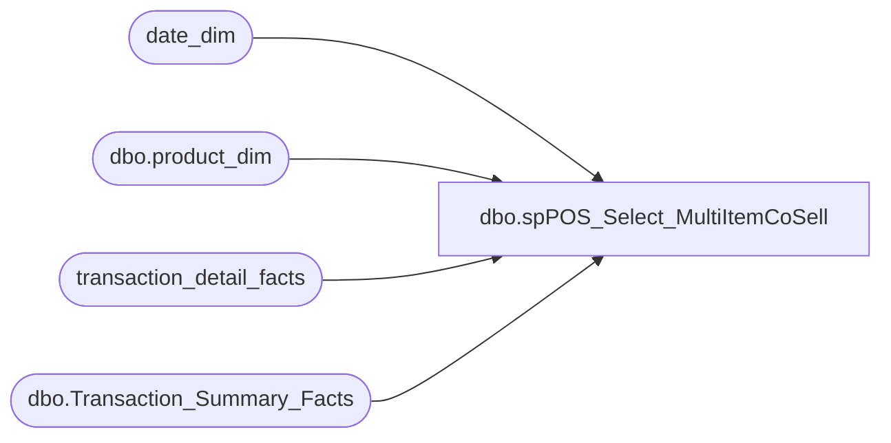

# dbo.spPOS_Select_MultiItemCoSell

**Database:** dw  
**Server:** papamart  

## Architecture Diagram



## Table Dependencies

| Referenced Table |
|---|
| date_dim |
| dbo.product_dim |
| transaction_detail_facts |
| dbo.Transaction_Summary_Facts |

## Stored Procedure Code

```sql
CREATE   
PROCEDURE [dbo].[spPOS_Select_MultiItemCoSell]

	/* ===== ARGUMENTS ===== */
	@1_StartDate 	datetime, 
	@2_EndDate 	datetime,
	@1stItem	INT,
	@2ndItem	INT =NULL,
	@3rdItem	INT =NULL,
	@4thItem	INT =NULL,
	@5thItem	INT =NULL,
	@6thItem	INT =NULL

AS

SET NOCOUNT ON

--transaction info for the primary skus
IF (Object_ID('tempdb.dbo.##PrimaryTrans1') IS NOT NULL) DROP TABLE dbo.##PrimaryTrans1

select
cast(tdf.transaction_id as varchar(20)) + ':' + cast(p.SKU as varchar(20)) UniqueID, 
 tdf.transaction_id, tdf.store_key, tdf.date_key, tdf.register_num, tdf.tender_group_key, 
tdf.product_key PrimaryProdKey, cast(p.SKU as varchar(20)) PrimarySKU,tdf.units, tdf.unit_gross_amount
into dbo.##PrimaryTrans1
from transaction_detail_facts tdf  with (nolock)
	join date_dim dd on tdf.date_key = dd.date_key 
join dbo.product_dim p  with (nolock) on p.product_key = tdf.product_key 
where transaction_line_seq >= 0 
and dd.actual_date >= @1_StartDate AND dd.actual_date <= @2_EndDate 
and p.sku in (@1stItem, @2ndItem, @3rdItem,@4thItem, @5thItem,@6thItem )
--and dd.actual_date >= '4/5/2009' AND dd.actual_date <= '7/4/2009' 
--and p.sku in (10076,10077,14778)

/*
and dd.actual_date >= @1_StartDate AND dd.actual_date <= @2_EndDate 
--and p.sku in (@1stItem, @2ndItem)
and ((p.sku = @1stItem  and @2ndItem is null and @3rdItem is null 
and @4thItem is null  and @5thItem is null and @6thItem is null)
or (p.sku in (@1stItem, @2ndItem) and @3rdItem is null 
and @4thItem is null  and @5thItem is null and @6thItem is null)
or (p.sku in (@1stItem, @2ndItem, @3rdItem) and @4thItem is null 
 and @5thItem is null and @6thItem is null)
or (p.sku in (@1stItem, @2ndItem, @3rdItem,@4thItem) and @5thItem is null 
and @6thItem is null)
or (p.sku in (@1stItem, @2ndItem, @3rdItem,@4thItem, @5thItem) and @6thItem is null)
or (p.sku in (@1stItem, @2ndItem, @3rdItem,@4thItem, @5thItem,@6thItem )))
*/


--get total SKU units and SKU uga for each primary transaction

IF (Object_ID('tempdb.dbo.##PrimaryTrans') IS NOT NULL) DROP TABLE dbo.##PrimaryTrans

select tdf.UniqueID, count(transaction_id) NoOfPrimarySKURecs, tdf.transaction_id, tdf.store_key, tdf.date_key, tdf.register_num, tdf.tender_group_key, 
tdf.PrimaryProdKey, tdf.PrimarySKU,sum(tdf.units) TotalPrimarySKUUnits, sum(tdf.unit_gross_amount) TotalPrimarySKUUGA
into ##PrimaryTrans
from dbo.##PrimaryTrans1 tdf
group by tdf.UniqueID,tdf.transaction_id, tdf.store_key, tdf.date_key, tdf.register_num, tdf.tender_group_key, 
tdf.PrimaryProdKey, tdf.PrimarySKU
--select * from ##PrimaryTrans

IF (Object_ID('tempdb.dbo.##SecondaryTrans1') IS NOT NULL) DROP TABLE dbo.##SecondaryTrans1

select pt.PrimarySKU,
cast(tdf.transaction_id as varchar(20)) + ':' + cast(p.SKU as varchar(20)) UniqueID, 
tdf.transaction_id, tdf.store_key, tdf.date_key, tdf.register_num, tdf.tender_group_key, 
tdf.product_key, p.department,p.subclass,cast(p.SKU as varchar(20)) SKU, p.product_desc,tdf.units, 
CASE 	WHEN tdf.product_key NOT IN (-700,-701,-710,-711,-712,-713,-714,-9,-7,-18) 
THEN tdf.unit_gross_amount
ELSE 0 END as uga
into ##SecondaryTrans1
from transaction_detail_facts tdf  with (nolock)
join dbo.product_dim p  with (nolock) on p.product_key = tdf.product_key 
join ##PrimaryTrans pt  with (nolock) on tdf.transaction_id = pt.transaction_id
where tdf.transaction_id in (select transaction_id from ##PrimaryTrans)
and transaction_line_seq >= 0

IF (Object_ID('tempdb.dbo.##SecondaryTrans') IS NOT NULL) DROP TABLE dbo.##SecondaryTrans

select PrimarySKU,UniqueID,
count(transaction_id ) NoOfTDFRecords, 
transaction_id, store_key, date_key, register_num, tender_group_key, 
product_key, department,subclass,SKU,product_desc,sum(units) Units, sum(uga) UGA
into ##SecondaryTrans
from ##SecondaryTrans1
group by 
PrimarySKU,UniqueID,transaction_id, store_key, date_key, register_num, tender_group_key, 
product_key, department,subclass,SKU,product_desc

IF (Object_ID('tempdb.dbo.##MultiplePrimarySKUsInTrans') IS NOT NULL) DROP TABLE dbo.##MultiplePrimarySKUsInTrans

select * 
into ##MultiplePrimarySKUsInTrans
from ##SecondaryTrans where UniqueID in 
(select UniqueID from ##SecondaryTrans
group by UniqueID having count(PrimarySKU) > 1)
order by UniqueID

-- select top 3 * from ##MultiplePrimarySKUsInTrans

IF (Object_ID('tempdb.dbo.##DedupMultiple_##MinPrimarySKUsInTrans') IS NOT NULL) 
DROP TABLE dbo.##DedupMultiple_##MinPrimarySKUsInTrans

Select min(PrimarySKU) PrimarySKU ,UniqueID,NoOfTDFRecords,
transaction_id, store_key, date_key, register_num, tender_group_key, 
product_key, department,subclass,SKU,product_desc,Units,UGA
into ##DedupMultiple_##MinPrimarySKUsInTrans
from ##MultiplePrimarySKUsInTrans 
group by 
UniqueID,NoOfTDFRecords,
transaction_id, store_key, date_key, register_num, tender_group_key, 
product_key, department,subclass,SKU,product_desc,Units,UGA

IF (Object_ID('tempdb.dbo.##AllTrans') IS NOT NULL) DROP TABLE dbo.##AllTrans

select * 
into ##AllTrans
from ##SecondaryTrans where UniqueID in 
(select UniqueID from ##SecondaryTrans
group by UniqueID having count(PrimarySKU) = 1)
union all 
select * from ##DedupMultiple_##MinPrimarySKUsInTrans
order by UniqueID

--determine total transaction UGA and SKU count for these transactions
IF (Object_ID('tempdb.dbo.##TransUGA') IS NOT NULL) DROP TABLE dbo.##TransUGA

select tdf.transaction_id, tdf.store_key, tdf.date_key, tdf.register_num ,-- tdf.tender_group_key, 
 count(distinct SKU) TransSKUCount, sum(uga) TotalTransUGA
into ##TransUGA
from ##AllTrans tdf
group by tdf.transaction_id, tdf.store_key, tdf.date_key, tdf.register_num --, tdf.tender_group_key
--select * from ##TransUGA

IF (Object_ID('tempdb..##tsf') IS NOT NULL) DROP TABLE ##tsf

select t.transaction_id,t.store_key,t.date_key,t.register_no,
IsNull((Bear_Buck_Tender + Gift_Card_Tender + Reward_Cert_Tender + BuyStuff_Tender),0) TtlRedemptions,
IsNull((discounts + coupon_amt),0) TtlDiscounts 
into ##tsf
from dbo.Transaction_Summary_Facts t 	
join ##PrimaryTrans pt on 
t.transaction_id = pt.transaction_id
and t.date_key = pt.date_key
and t.store_key = pt.store_key
and t.register_no = pt.register_num 
group by t.transaction_id,t.store_key,t.date_key,t.register_no,
(Bear_Buck_Tender + Gift_Card_Tender + Reward_Cert_Tender + BuyStuff_Tender),
(discounts + coupon_amt)  
order by t.transaction_id

--select top 3 * from ##AllTrans
IF (Object_ID('tempdb..##AllTransTtlHoney') IS NOT NULL) DROP TABLE ##AllTransTtlHoney

select s.*,u.TotalTransUGA,t.TtlRedemptions,t.TtlDiscounts,
(u.TotalTransUGA+t.TtlRedemptions+ t.TtlDiscounts) TtlHoney, u.TransSKUCount,
 ((u.TotalTransUGA+t.TtlRedemptions+ t.TtlDiscounts)/u.TransSKUCount) TtlHoneyBySKU
into ##AllTransTtlHoney
from 
##AllTrans s with (nolock)  
join ##tsf t with (nolock) on 
s.transaction_id = t.transaction_id 
and s.store_key = t.store_key
and s.date_key = t.date_key 
and s.register_num = t.register_no  
join ##TransUGA u with (nolock) on 
s.transaction_id = u.transaction_id 
and s.store_key = u.store_key
and s.date_key = u.date_key 
and s.register_num = u.register_num


--$$--$$--$$
/*
select
PrimarySKU,transaction_id, store_key, date_key, register_num, tender_group_key, 
product_key, department,subclass,SKU,product_desc,units, uga
 from ##AllTransTtlHoney --where sku = 14778
where PrimarySKU = 10076 
group by PrimarySKU,transaction_id, store_key, date_key, register_num, tender_group_key, 
product_key, department,subclass,SKU,product_desc,units, uga

*/


IF (Object_ID('tempdb..##TtlHoney') IS NOT NULL) DROP TABLE ##TtlHoney

select PrimarySKU,sum(TtlHoneyBySKU) TtlHoney 
into ##TtlHoney
from ##AllTransTtlHoney
group by PrimarySKU


IF (Object_ID('tempdb..##HoneyBySKU') IS NOT NULL) DROP TABLE ##HoneyBySKU

select 	department,subclass,SKU,product_desc,
	count(distinct transaction_id) TransCnt,
	sum(Units) TotalUnits,
	sum(TtlHoneyBySKU) as TtlHoneyBySKU 
into ##HoneyBySKU
from ##AllTransTtlHoney
group by department,subclass,SKU,product_desc


IF (Object_ID('tempdb..##SKU_HPG') IS NOT NULL) DROP TABLE ##SKU_HPG

select h.PrimarySKU,s.product_desc,s.TransCnt,s.TotalUnits, h.TtlHoney,
(h.TtlHoney/s.TransCnt) HPG 
into ##SKU_HPG
	 from ##HoneyBySKU s join ##TtlHoney h on 
s.SKU = h.PrimarySKU


Select * from ##HoneyBySKU 
where department is not null and len(ltrim(rtrim(department))) > 0 and department not in 
('Bear Bucks / Coupons','Donations / Discount','Donation / Discounts','Kits','Misc POS','N/A','Supplies','Transaction Flags')


Select * from ##SKU_HPG


/* ------------------------------
/*
Select * from ##HoneyBySKU 
where department is null or len(ltrim(rtrim(department))) = 0 or department in 
('Bear Bucks / Coupons','Donations / Discount','Donation / Discounts','Kits','Misc POS','N/A','Supplies','Transaction Flags')
order by department
*/
select 	department,subclass,sku,product_desc,
	count(distinct transaction_id) TransCnt,
	sum(Units) TotalUnits,
	sum(TtlHoneyBySKU) as TtlHoneyBySKU 
from ##AllTransTtlHoney
--where PrimarySKU = @1stItem  
/*
where PrimarySKU = 10076 
and sku in ( 14778,10076,582)
*/
group by department,subclass,sku,product_desc
order by TtlHoneyBySKU desc

select 	department,subclass,sku,product_desc,
	count(distinct transaction_id) TransCnt,
	sum(Units) TotalUnits,
	sum(TtlHoneyBySKU) as TtlHoneyBySKU 
from ##AllTransTtlHoney
where PrimarySKU = @2ndItem  
group by department,subclass,sku,product_desc
order by TtlHoneyBySKU desc

select 	department,subclass,sku,product_desc,
	count(distinct transaction_id) TransCnt,
	sum(Units) TotalUnits,
	sum(TtlHoneyBySKU) as TtlHoneyBySKU 
from ##AllTransTtlHoney
where PrimarySKU = @3rdItem  
group by department,subclass,sku,product_desc
order by TtlHoneyBySKU desc

select 	department,subclass,sku,product_desc,
	count(distinct transaction_id) TransCnt,
	sum(Units) TotalUnits,
	sum(TtlHoneyBySKU) as TtlHoneyBySKU 
from ##AllTransTtlHoney
where PrimarySKU = @4thItem  
group by department,subclass,sku,product_desc
order by TtlHoneyBySKU desc

select 	department,subclass,sku,product_desc,
	count(distinct transaction_id) TransCnt,
	sum(Units) TotalUnits,
	sum(TtlHoneyBySKU) as TtlHoneyBySKU 
from ##AllTransTtlHoney
where PrimarySKU = @5thItem  
group by department,subclass,sku,product_desc
order by TtlHoneyBySKU desc


select 	department,subclass,sku,product_desc,
	count(distinct transaction_id) TransCnt,
	sum(Units) TotalUnits,
	sum(TtlHoneyBySKU) as TtlHoneyBySKU 
from ##AllTransTtlHoney
where PrimarySKU = @6thItem  
group by department,subclass,sku,product_desc
order by TtlHoneyBySKU desc

--------------------------------------------------------*/

/*
IF (Object_ID('tempdb..##AllTransTtlHoney2') IS NOT NULL) DROP TABLE ##AllTransTtlHoney2

select s.*,u.TotalTransUGA,t.TtlRedemptions,t.TtlDiscounts,
(u.TotalTransUGA+t.TtlRedemptions+ t.TtlDiscounts) TtlHoney, u.TransSKUCount,
 ((u.TotalTransUGA+t.TtlRedemptions+ t.TtlDiscounts)/u.TransSKUCount) TtlHoneyBySKU
into ##AllTransTtlHoney2
from 
##SecondaryTrans s with (nolock)  
join ##tsf t with (nolock) on 
s.transaction_id = t.transaction_id 
and s.store_key = t.store_key
and s.date_key = t.date_key 
and s.register_num = t.register_no  
join ##TransUGA u with (nolock) on 
s.transaction_id = u.transaction_id 
and s.store_key = u.store_key
and s.date_key = u.date_key 
and s.register_num = u.register_num

select 	department,subclass,sku,product_desc,
	count(distinct transaction_id) TransCnt,
	sum(Units) TotalUnits,
	sum(TtlHoneyBySKU) as TtlHoneyBySKU 
from ##AllTransTtlHoney2
where PrimarySKU = 10076 
--where PrimarySKU = @1stItem  
/*
and sku in ( 14778,10076,582)
*/
group by department,subclass,sku,product_desc
order by TtlHoneyBySKU desc


select 	department,subclass,sku,product_desc,
	count(distinct transaction_id) TransCnt,
	sum(Units) TotalUnits,
	sum(TtlHoneyBySKU) as TtlHoneyBySKU 
from ##AllTransTtlHoney2
where PrimarySKU = 10077 
--where PrimarySKU = @2ndItem  
group by department,subclass,sku,product_desc
order by TtlHoneyBySKU desc

select 	department,subclass,sku,product_desc,
	count(distinct transaction_id) TransCnt,
	sum(Units) TotalUnits,
	sum(TtlHoneyBySKU) as TtlHoneyBySKU 
from ##AllTransTtlHoney2
where PrimarySKU = 14778 
--where PrimarySKU = @3rdItem  
group by department,subclass,sku,product_desc
order by TtlHoneyBySKU desc

*/
```

