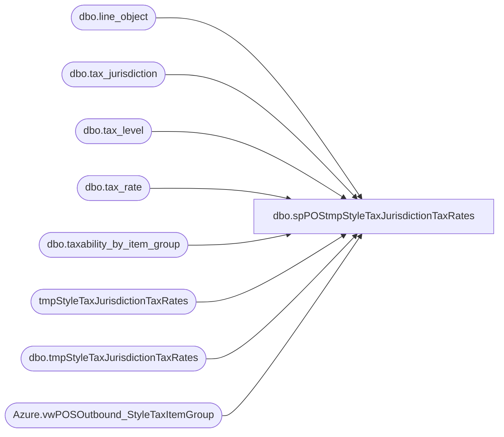

# dbo.spPOStmpStyleTaxJurisdictionTaxRates

**Database:** dw  
**Server:** papamart  

## Architecture Diagram



## Table Dependencies

| Referenced Table |
|---|
| dbo.line_object |
| dbo.tax_jurisdiction |
| dbo.tax_level |
| dbo.tax_rate |
| dbo.taxability_by_item_group |
| tmpStyleTaxJurisdictionTaxRates |
| dbo.tmpStyleTaxJurisdictionTaxRates |
| Azure.vwPOSOutbound_StyleTaxItemGroup |

## Stored Procedure Code

```sql
CREATE proc [dbo].[spPOStmpStyleTaxJurisdictionTaxRates] 

as 

set nocount on


--if (object_id('tempdb..#tmpStyleTaxJurisdictionTaxRates') is not null) drop table #tmpStyleTaxJurisdictionTaxRates

truncate table tmpStyleTaxJurisdictionTaxRates


INSERT INTO [dbo].[tmpStyleTaxJurisdictionTaxRates]
           ([style_code]
           ,[style_short_description]
           ,[class_description]
           ,[tax_item_group_description]
           ,[tax_item_group_id]
           ,[tax_jurisdiction]
           ,[jurisdiction_name]
           ,[tax_level]
           ,[line_object]
           ,[taxleveldescription]
           ,[gl_replacement_value]
           ,[effective_from_date]
           ,[effective_until_date]
           ,[tax_rate_code]
           ,[tax_rate_code_description]
           ,[tax_rate_id]
           ,[combined_rate]
           ,[federal_rate]
           ,[state_rate]
           ,[county_rate]
           ,[city_rate]
           ,[district_rate]
           ,[threshold_amount]
           ,[tax_on_threshold_excess]
           ,[tax_on_tax_level]
           ,[below_threshold_combined_rate]
           ,[below_federal_rate]
           ,[below_state_rate]
           ,[below_county_rate]
           ,[below_city_rate]
           ,[below_district_rate]
           ,[resource_id]
           ,[item_tax_strip_flag]
           ,[tax_schedule_id]
           ,[transaction_level_tax_calc]
           ,[compound_order]
           ,[exemption_tax_rate_code])
select
	s.style_code,
	s.style_short_description,
	s.class_description,
	s.tax_item_group_description,
	s.tax_item_group_id,
	tbig.tax_jurisdiction,
	tj.jurisdiction_name,
	tl.tax_level,
	lo.line_object,
	lo.line_object_description as TaxLevelDecsription,
	tj.gl_replacement_value,
	tr.effective_from_date,
	tr.effective_until_date,
	tr.tax_rate_code,
	tr.tax_rate_code_description,
	tr.tax_rate_id,
	tr.combined_rate,	
	tr.federal_rate,	
	tr.state_rate,	
	tr.county_rate,	
	tr.city_rate,	
	tr.district_rate,	
	tr.threshold_amount,	
	tr.tax_on_threshold_excess,	
	tr.tax_on_tax_level,	
	tr.below_threshold_combined_rate,	
	tr.below_federal_rate,	
	tr.below_state_rate,	
	tr.below_county_rate,	
	tr.below_city_rate,	
	tr.below_district_rate,	
	tr.resource_id,	
	tr.item_tax_strip_flag,	
	tr.tax_schedule_id,	
	tr.transaction_level_tax_calc,	
	tr.compound_order,	
	tr.exemption_tax_rate_code
--into dbo.tmpStyleTaxJurisdictionTaxRates
from [Azure].[vwPOSOutbound_StyleTaxItemGroup] s     --#StyleTaxItemGroup s
join bedrockdb01.auditworks.dbo.taxability_by_item_group tbig on s.tax_item_group_id= tbig.tax_item_group_id
join bedrockdb01.auditworks.dbo.tax_level tl on tbig.tax_level=tl.tax_level
join bedrockdb01.auditworks.dbo.line_object lo on tl.line_object=lo.line_object
join bedrockdb01.auditworks.dbo.tax_jurisdiction tj on tbig.tax_jurisdiction=tj.tax_jurisdiction
join bedrockdb01.auditworks.dbo.tax_rate tr 
	on tbig.tax_jurisdiction=tr.tax_jurisdiction
	and tbig.tax_level=tr.tax_level
	and tbig.tax_rate_code=tr.tax_rate_code
where tj.active_flag=1
and
	(
		tr.effective_from_date <= getdate()
		and (tr.effective_until_date is null or tr.effective_until_date > getdate())
	)
and
	(
		tbig.effective_from_date <= getdate()
		and  (tbig.effective_until_date is null or tbig.effective_until_date > getdate())
	)
```

