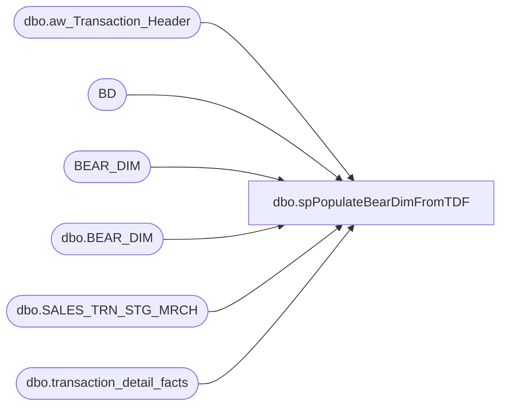

# dbo.spPopulateBearDimFromTDF

**Database:** dw  
**Server:** papamart  

## Architecture Diagram



## Table Dependencies

| Referenced Table |
|---|
| dbo.aw_Transaction_Header |
| BD |
| BEAR_DIM |
| dbo.BEAR_DIM |
| dbo.SALES_TRN_STG_MRCH |
| dbo.transaction_detail_facts |

## Stored Procedure Code

```sql
CREATE PROCEDURE [dbo].[spPopulateBearDimFromTDF]
AS
-- =============================================
-- Author:		Burge, Shawn
-- Create date: 09/17/2012
-- Description:	Populdate BearDim from TDF + TDF Staging Tables
--
-- 9/18/2013	G. Murrish		Changed to improve performance
-- 8/14/2014	M. Pelikan		changed sts.bear_id to LEFT(STS.[bear_id], 20) bear_id 
-- =============================================
BEGIN
	SET NOCOUNT ON;

	SELECT
		LEFT(STS.[bear_id], 20) bear_id,
		ath.store_key,
		ath.date_key,
		TDF.[tdf_key]
	INTO #SoldBears
	FROM
		[DWStaging].[dbo].[SALES_TRN_STG_MRCH] STS WITH (NOLOCK)
		INNER JOIN DWStaging.dbo.aw_Transaction_Header ath WITH (NOLOCK)
			ON STS.transaction_id = ath.transaction_id
		INNER JOIN dbo.[transaction_detail_facts] TDF WITH (NOLOCK)
			ON STS.transaction_id = TDF.[transaction_id]
			AND STS.Line_Sequence = TDF.[transaction_line_seq]
	WHERE
		(STS.[bear_id] IS NOT NULL
		AND STS.[bear_id] <> '')


	-- Create new bears
	INSERT INTO [dbo].[BEAR_DIM]
		(	BearID,
			store_key,
			date_key,
			tdf_key)
		SELECT
			x.bear_id,
			x.store_key,
			x.date_key,
			x.tdf_key
		FROM
			#SoldBears x WITH (NOLOCK)
			LEFT JOIN [dbo].[BEAR_DIM] BD WITH (NOLOCK)
				ON BD.[BearID] = x.[bear_id]
				AND BD.[store_key] = x.store_key
				AND BD.[date_key] = x.date_key
		WHERE
			BD.BEARKEY IS NULL

	-- Set the TDF on those which are missing
	UPDATE BD
		SET [tdf_key] = sb.tdf_key
	FROM
		BEAR_DIM BD WITH (NOLOCK)
		INNER JOIN #SoldBears sb WITH (NOLOCK)
			ON BD.store_key = sb.store_key
			AND BD.date_key = sb.date_key
			AND BD.BearID = sb.bear_id
	WHERE BD.tdf_key IS NULL


END
```

