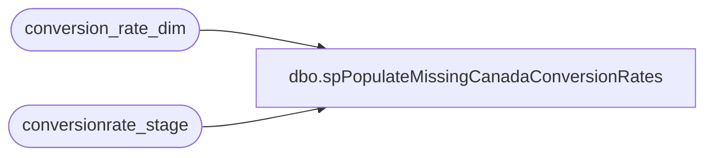

# dbo.spPopulateMissingCanadaConversionRates

**Database:** dw  
**Server:** papamart  

## Architecture Diagram



## Table Dependencies

| Referenced Table |
|---|
| conversion_rate_dim |
| conversionrate_stage |

## Stored Procedure Code

```sql
CREATE PROCEDURE spPopulateMissingCanadaConversionRates 
	@ERROR int  OUTPUT
AS
	
--DECLARE LOCAL VALUES
DECLARE @conversion_key_min int  --lowest key vlaue that has a rate starting point
DECLARE @date_out           datetime  --only go two weeks out past the current date
DECLARE @conversion_key_max int --the max key out we want to go #'s are faster to compared then dates
DECLARE @counter            int  --counts how many records between the range we want are missing rates

DECLARE @ca_to_us          float  --holds the ca_to_us rate
DECLARE @us_to_ca          float  --holds the us_to_ca rate


DECLARE @maxwovalue       int  --used for incrementing to get the max one without rates
DECLARE @maxwvalue        int   --used for incrementing to get the max one with rates 
DECLARE @daterecmax       datetime  --used to determine what the max date they supplied  


--SET RATES TO ZERO FOR ANY DATES THAT COME AFTER LAST RECEIVED DATE THAT HAVE VALUES  
SELECT @daterecmax=MAX(actual_date) 
FROM conversionrate_stage 

SELECT * FROM conversionrate_stage
BEGIN TRAN
UPDATE conversion_rate_dim
SET ca_to_us=0,
    us_to_ca=0
WHERE actual_date>@daterecmax
IF @@ERROR=0
	COMMIT TRAN
ELSE
	ROLLBACK TRAN

--STARTING POINT WHERE RATES BEGIN
SELECT @conversion_key_min=MIN(conversion_rate_key)  
FROM conversion_rate_dim
WHERE ca_to_us > 0

--HOW FAR OUT DO I WANT TO GO with RATES
--FOR NOW 2 WEEKS PAST CURRENT DATE
SET @date_out=dateadd(wk,2,getdate())

SELECT @conversion_key_max=MAX(conversion_rate_key)
FROM conversion_rate_dim
WHERE actual_date<=@date_out


--RECORDS BETWEEN RANGE INITAL MIN AND MAX POINTS
SELECT @counter=COUNT(*)
FROM  conversion_rate_dim
WHERE conversion_rate_key     >  @conversion_key_min  
      AND conversion_rate_key <= @conversion_key_max
      AND ca_to_us=0

WHILE @counter>0
BEGIN

	--WHAT THE MAX RECORD WITHOUT A VALUE WITHIN DATE RANGE
	SELECT @maxwovalue=MAX(conversion_rate_key)
	FROM conversion_rate_dim
	WHERE conversion_rate_key     >  @conversion_key_min  
      	      AND conversion_rate_key <= @conversion_key_max
      	      AND ca_to_us=0

	--WHAT THE MAX RECORD WITH A VALUE
	SELECT @maxwvalue=MAX(conversion_rate_key)
	FROM  conversion_rate_dim
	WHERE conversion_rate_key<@maxwovalue 
	      AND ca_to_us>0

	--GET THE MAX WITH VALUE RATES
	SELECT  @ca_to_us=ca_to_us,
		@us_to_ca=us_to_ca
	FROM conversion_rate_dim
	WHERE conversion_rate_key=@maxwvalue
	
	--UPDATE EVERY RECORD BETWEEN RANGE WITH AND WITHOUT A VALUE
	BEGIN TRAN
	UPDATE conversion_rate_dim
	SET ca_to_us=@ca_to_us,
    	    us_to_ca=@us_to_ca
	FROM conversion_rate_dim
	WHERE     conversion_rate_key >  @maxwvalue
              AND conversion_rate_key <= @maxwovalue
	IF @@ERROR=0
		COMMIT TRAN
	ELSE
        BEGIN
		ROLLBACK TRAN 
		GOTO ERRORHANDLER
	END

	
	
	SELECT @counter=COUNT(*)
	FROM  conversion_rate_dim
	WHERE 	    conversion_rate_key >  @conversion_key_min  
      		AND conversion_rate_key <= @conversion_key_max
      		AND ca_to_us=0

	CONTINUE
END

SET @ERROR=0
RETURN 

ERRORHANDLER:
SET @ERROR=-1
```

