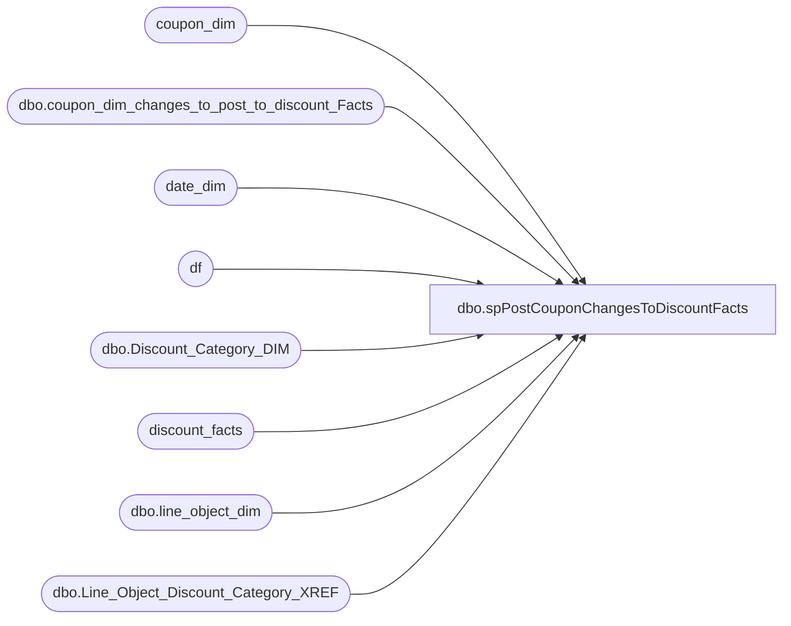

# dbo.spPostCouponChangesToDiscountFacts

**Database:** dw  
**Server:** papamart  

## Architecture Diagram



## Table Dependencies

| Referenced Table |
|---|
| coupon_dim |
| dbo.coupon_dim_changes_to_post_to_discount_Facts |
| date_dim |
| df |
| dbo.Discount_Category_DIM |
| discount_facts |
| dbo.line_object_dim |
| dbo.Line_Object_Discount_Category_XREF |

## Stored Procedure Code

```sql
-- =============================================================================================================
-- Name: spPostCouponChangesToDiscountFacts
--
-- Description:	
--		Update all of the discount_Facts records based upon changes that came from Discount Manager Load
--
-- Input:
--		DWStaging.dbo.coupon_dim_changes_to_post_to_discount_Facts - This contains all of the coupons which
--				had a change that should impact discount_facts
--		
--		NOTE: CHANGING THE NA LOGIC HERE SHOULD ALSO BE CHANGED IN DW.dbo.spPostCouponChangesToDiscountFacts
--
-- Output: 
--		Updated discount_Facts table
--
-- Dependencies: 
--

--
-- Revision History
--		Name:				Date:			Comments:
--		Gary Murrish		8/14/2013		Initial
--		Gary Murrish		3/6/2014		Added logic for expired before the start date
--											as well as the categorytypeID of Not Applicable
-- =============================================================================================================
CREATE PROCEDURE [dbo].[spPostCouponChangesToDiscountFacts]
AS
BEGIN
	SET NOCOUNT ON;

	-- Determine the line objects which are to be considered 'No Discounts'
	IF OBJECT_ID('tempdb..#OmittedLineObjects') IS NOT NULL
	BEGIN
		DROP TABLE #OmittedLineObjects
	END
	SELECT
		lod.Line_Object_Key,
		dcd.categoryTypeID
	INTO #OmittedLineObjects
	FROM
		DWStaging.dbo.Line_Object_Discount_Category_XREF X WITH (NOLOCK)
		INNER JOIN dw.dbo.line_object_dim lod WITH (NOLOCK)
			ON X.Line_Object = lod.Line_Object
		INNER JOIN dw.dbo.Discount_Category_DIM dcd WITH (NOLOCK)
			ON X.categoryType = dcd.categoryType
			AND X.channelType = dcd.channelType
	WHERE
		dcd.channelType = 'NA'

	IF OBJECT_ID('tempdb..#trigger') IS NOT NULL
	BEGIN
		DROP TABLE #trigger
	END

	SELECT
		x.coupon_key,
		cd.categoryTypeID,
		ISNULL(sDT.date_key, 1) AS effectiveDateKey,
		ISNULL(dd.date_key, 999999) AS expireDateKey
	INTO #trigger
	FROM
		DWStaging.dbo.coupon_dim_changes_to_post_to_discount_Facts x WITH (NOLOCK)
		INNER JOIN coupon_dim cd WITH (NOLOCK)
			ON x.coupon_key = cd.coupon_key
		LEFT JOIN date_dim dd WITH (NOLOCK)
			ON cd.stop_date = dd.actual_date
		LEFT JOIN date_dim sDT WITH (NOLOCK)
			ON cd.start_date = sDT.actual_date

	IF OBJECT_ID('tempdb..#CouponsToUpdate') IS NOT NULL
	BEGIN
		DROP TABLE #CouponsToUpdate
	END

	SELECT
		df.uid,
		ISNULL(olo.categoryTypeID, t.categoryTypeID) AS categoryTypeID,
		CASE
			WHEN df.date_key > t.expireDateKey OR
			df.date_key < t.effectiveDateKey THEN 1
			ELSE 0
		END AS isExpired,
		df.date_key
	INTO #CouponsToUpdate
	FROM
		discount_facts df WITH (NOLOCK)
		INNER JOIN #trigger t WITH (NOLOCK)
			ON df.coupon_key = t.coupon_key
		LEFT JOIN #OmittedLineObjects olo WITH (NOLOCK)
			ON df.Line_Object_Key = olo.Line_Object_Key
	WHERE
		df.categoryTypeID <> ISNULL(olo.categoryTypeID, t.categoryTypeID)
		OR
			CASE
				WHEN df.date_key > t.expireDateKey OR
				df.date_key < t.effectiveDateKey THEN 1
				ELSE 0
			END <> df.isExpired


	UPDATE df
		SET	df.categoryTypeID = ctu.categoryTypeID,
			df.isExpired = ctu.isExpired
	FROM
		discount_facts df 
		INNER JOIN #CouponsToUpdate ctu WITH (NOLOCK)
			ON df.uid = ctu.uid

END
```

