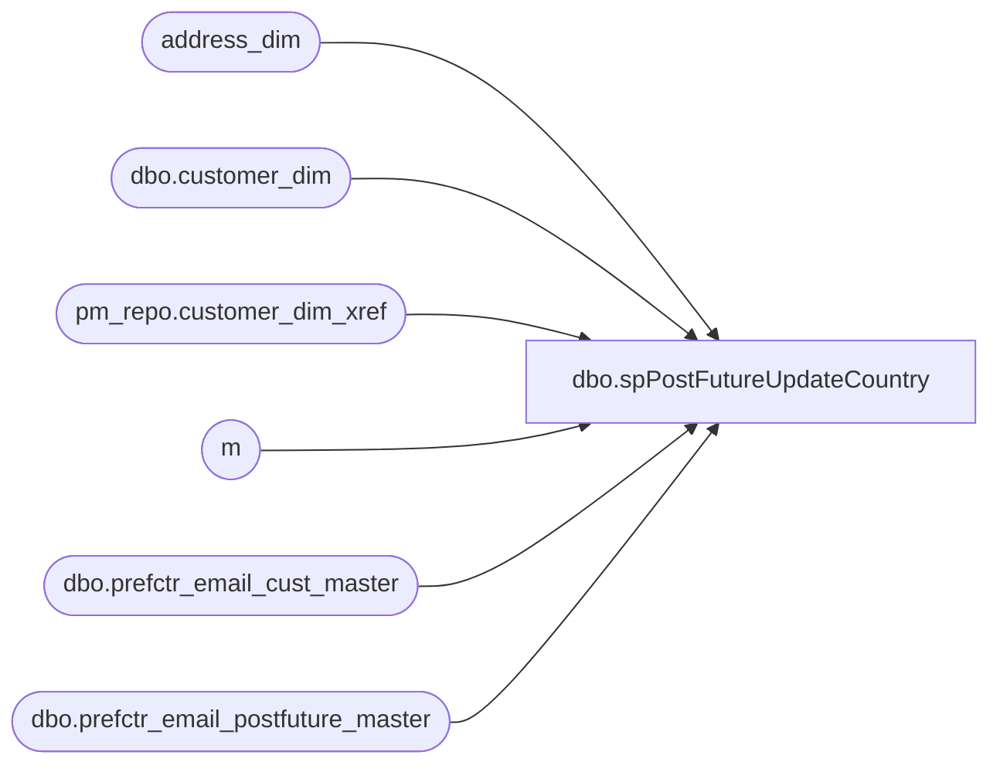

# dbo.spPostFutureUpdateCountry

**Database:** dw  
**Server:** papamart  

## Architecture Diagram



## Table Dependencies

| Referenced Table |
|---|
| address_dim |
| dbo.customer_dim |
| pm_repo.customer_dim_xref |
| m |
| dbo.prefctr_email_cust_master |
| dbo.prefctr_email_postfuture_master |

## Stored Procedure Code

```sql
-- =============================================
-- Author:		GaryD
-- Create date: 07/08/2008
-- Description:	Updates country code with value from address dimension
-- Date:		Name:		Description:
-- 08152008		GaryD		Set province Quebec to FR.  Leave last update date as is with US to USA update.
-- exec spPostFutureUpdateCountry
-- =============================================
CREATE PROCEDURE [dbo].[spPostFutureUpdateCountry] 
	@BatchSize int = 100000 
AS
BEGIN
	-- SET NOCOUNT ON added to prevent extra result sets from
	-- interfering with SELECT statements.
	SET NOCOUNT ON;

	DECLARE @MaxKey INT
	DECLARE @LowEnd INT
	DECLARE @HighEnd INT
	DECLARE @UpdateDate DATETIME

	SELECT @LowEnd = 0
	SELECT @HighEnd = @BatchSize  
	SELECT @UpdateDate = GETDATE()

	CREATE TABLE #updcountry (
		[updcountry_key] [int] IDENTITY(1,1) NOT NULL ,
		[customer_no] [int] NOT NULL ,
		[EMAILCOUNTRY] [varchar] (60) NULL ,
		[addresscountry] [varchar] (60) NULL ,
		[state_province] [char] (2) NULL,
		[addresscountryname] [varchar] (60) NULL ,
		[UPDATECOUNTRY] [varchar] (60) NULL)  


	--Find records with Email country different from country in address table.  Derive the new country.
	INSERT INTO #updcountry ([customer_no]
	--, [email_address]
	, [emailcountry]
	, [addresscountry]
	, [state_province]
	, [addresscountryname]
	, [updatecountry])
	SELECT DISTINCT pepm.customer_no
	--, email_address
	, pepm.country as emailcountry
	, a.country as addresscountry
	, a.state_province 
	, a.country_name
	, CASE
		WHEN a.country = 'CAN' AND (a.state_province <> 'QC' OR a.state_province IS NULL)  THEN 'CA'
		WHEN a.country = 'CAN' AND a.state_province = 'QC' THEN 'FR'
		WHEN a.country = 'CANADA' AND (a.state_province <> 'QC' OR a.state_province IS NULL) THEN 'CA'
		WHEN a.country = 'CANADA' AND a.state_province = 'QC' THEN 'FR'
		WHEN a.country = 'CAF'  AND (a.state_province <> 'QC' OR a.state_province IS NULL) THEN 'CA'
		WHEN a.country = 'CAF' AND a.state_province = 'QC' THEN 'FR'
		WHEN a.country = 'CA' AND (a.state_province <> 'QC' OR a.state_province IS NULL) THEN 'CA'
		WHEN a.country = 'CA' AND a.state_province = 'QC' THEN 'FR'
		WHEN a.country = 'GB' THEN 'GB'
		WHEN a.country = 'GBR' THEN 'GB'
		WHEN a.country = 'UK' THEN 'GB'
		WHEN a.country = 'FR' THEN 'FR'
		WHEN pepm.country = 'US' THEN 'USA'
		WHEN a.address_key IS NOT NULL AND pepm.country NOT IN ('USA', 'GB', 'FR', 'CA') AND pepm.country IS NOT NULL THEN 'USA'--any other international email address, set to USA
		WHEN a.address_key IS NULL AND pepm.country IS NULL THEN 'USA' --if Address_dim cc is null and email cc is null then USA
		WHEN a.address_key IS NULL AND pepm.country NOT IN ('USA', 'GB', 'FR', 'CA') THEN 'USA' --if address_dim cc is null and existing email cc not usa, gb, fr, or ca.
	END AS 'updatecountry'
	FROM dbo.prefctr_email_postfuture_master pepm with (NOLOCK)
	 INNER JOIN dbo.prefctr_email_cust_master pecm with (NOLOCK) 
	  ON (pepm.customer_no = pecm.email_cust_num)
	 INNER JOIN dbo.customer_dim c with (NOLOCK) 
	  ON (pecm.customer_key = c.customer_key)
	 INNER JOIN pm_repo.customer_dim_xref cdx WITH (NOLOCK)
	  ON (c.customer_key = cdx.customer_key_alt)
--	 INNER JOIN dbo.Guest_Activity_Summary gs WITH (NOLOCK)
--	  ON pecm.customer_key = gs.customer_key
	 LEFT OUTER JOIN address_dim a WITH (NOLOCK) ON (a.address_key = cdx.current_address_key)
	 WHERE ((a.country <> pepm.country) OR pepm.country IS NULL)   
     AND cdx.Current_Flag = 'Y'
	 ORDER BY pepm.customer_no
	--OPTION (MAXDOP 1);--max 1 about 3:30

--select * from  address_dim where country_name like 'Scot%'

	--remove records where EmailCountry = UpdateCountry.  These do not need to be updated again.
	DELETE #updcountry WHERE [emailcountry] = [updatecountry]

	DELETE #updcountry WHERE [updatecountry] IS NULL


	--Add indexes to speed update
	 CREATE  INDEX [udx_TempUpdcountry_CustomerNo] ON [dbo].[#updcountry]([customer_no]) 
	 CREATE  UNIQUE  INDEX [udx_TempUpdcountry_updcountry_key] ON [dbo].[#updcountry]([updcountry_key]) 


--select distinct 
--substring(emailcountry, 1, 20) as 'EMAILCOUNTRY'
--,substring(addresscountry, 1, 20) as 'addresscountry'
--,substring(state_province, 1, 10) as 'province'
--,substring(addresscountryname, 1, 30) as 'addresscountryname'
--,substring(updatecountry, 1, 20) as 'UPDATECOUNTRY'
--from #updcountry
--order by 
--emailcountry
--return 


	SELECT @MaxKey = MAX(updcountry_key) FROM #updcountry

	WHILE @LowEnd < @MaxKey
	BEGIN

	 BEGIN TRAN

		 UPDATE m
		 SET m.country = c.updatecountry
			,m.last_update_date = @UpdateDate
		 FROM dbo.prefctr_email_postfuture_master m JOIN #updcountry c ON (m.customer_no = c.customer_no)
		 WHERE c.updcountry_key > @LowEnd AND c.updcountry_key <= @HighEnd

	 COMMIT TRAN
	 
	 SELECT @LowEnd = @HighEnd, @HighEnd = @HighEnd + @BatchSize

	 WAITFOR  DELAY '00:00:10'
	END

	--update any remaining US to USA
		 UPDATE m
		 SET m.country = 'USA'
			--,m.last_update_date = @UpdateDate --do not change LastUpdateDate in this case because mailer list filters on most recent 3 days.
		 FROM dbo.prefctr_email_postfuture_master m 
		 WHERE m.country = 'US'

	
 
END


dbo,spAuditWebCart_BasicAudit_BAK,-- =============================================================================================================
-- Name: spAuditWebCart_BasicAudit_BAK
--
-- Description:	

--
-- Input:		@firstdate	smalldatetime
--				@lastdate	smalldatetime
--
--
-- Output: 
--
-- Dependencies: 
--
-- Revision History
--		Name:			Date:			Comments:
--		Brad Atkinson					created
-- =============================================================================================================


--exec spAuditWebCart_BasicAudit

CREATE      procedure [dbo].[spAuditWebCart_BasicAudit_BAK]
(@firstDate as smalldatetime = null
,@lastDate as smalldatetime = null
)
as

declare @today as smalldatetime, @daysBack as smallint
select @today = Cast(Convert(varchar(20), getdate(), 1) as smalldatetime)
select @daysBack = 30

if (@firstDate is null or @lastDate is null ) begin
	select @firstDate = DateAdd(day, - @daysBack, @today)
		, @lastDate = DateAdd(day, -1, @today)
end


exec spAuditWebCart_Compare_PMSCreated_to_PMSShipped @firstDate, @lastDate, 0, 0, 0


IF EXISTS (SELECT * FROM tempdb..sysobjects WHERE id = object_id(N'[tempdb]..[##WebCartAudit]')) BEGIN
	drop table ##WebCartAudit
END

create table ##WebCartAudit(
	DateCreated smalldatetime
	,Created int
	,Amount_Created money
	,Cancelled int null
	,Amount_Cancelled money null
	,BeingBuilt int null
	,Amount_BeingBuilt money null
	,Shipped int null
	,Amount_Shipped money null
	,Settled int null
	,InAw int null
)
create index ix_WebCartAudit_DateCreated on ##WebCartAudit(DateCreated)


insert into ##WebCartAudit
(DateCreated, Created, Amount_Created)
select --PMS_Created_Site as Site,
	PMS_Created_DateOrderCreated as DateCreated
	,count(*) as Created
	,SUM(PMS_Created_TotalAmount) as Amount_Created
	--,SUM(PMS_Created_ItemAmount) as ItemAmount
	--,SUM(PMS_Created_ShippingAmount) as ShippingAmount
	--,SUM(PMS_Created_ItemCount) as ItemCount
from queries.dbo.WCAudit_PMS_Created_COMPARETO_PMS_Settled
group by PMS_Created_DateOrderCreated --, PMS_Created_Site
order by PMS_Created_DateOrderCreated --, PMS_Created_Site


select PMS_Created_DateOrderCreated as DateCreated
	,PMS_Created_ProductionStatusCode as Status
	,count(*) as Orders
	,SUM(PMS_Created_TotalAmount) as TotalAmount
into #createdDetails
from queries.dbo.WCAudit_PMS_Created_COMPARETO_PMS_Settled
group by PMS_Created_ProductionStatusCode, PMS_Created_DateOrderCreated --, PMS_Created_Site
order by PMS_Created_DateOrderCreated, PMS_Created_ProductionStatusCode --, PMS_Created_Site


select DateCreated, Sum(Cancelled) as Cancelled, Sum(Completed) as Shipped, Sum(Released + Wait) as BeingBuilt
	, Sum(Amount_Cancelled) as Amount_Cancelled, Sum(Amount_Completed) as Amount_Shipped, Sum(Amount_Released + Amount_Wait) as Amount_BeingBuilt
into #createdDetails2
from (
	select DateCreated
	,case WHEN Status = 'Canceled' THEN Orders ELSE	0 END as Cancelled
	,case WHEN Status = 'Completed' THEN Orders ELSE 0 END as Completed
	,case WHEN Status = 'Released' THEN Orders ELSE 0 END as Released
	,case WHEN Status = 'Wait' THEN Orders ELSE 0 END as Wait
	
	,case WHEN Status = 'Canceled' THEN TotalAmount ELSE 0 END as Amount_Cancelled
	,case WHEN Status = 'Completed' THEN TotalAmount ELSE 0 END as Amount_Completed
	,case WHEN Status = 'Released' THEN TotalAmount ELSE 0 END as Amount_Released
	,case WHEN Status = 'Wait' THEN TotalAmount ELSE 0 END as Amount_Wait
	from #createdDetails
 	) a
group by DateCreated


Update ##WebCartAudit
set Cancelled=cd2.Cancelled, BeingBuilt=cd2.BeingBuilt, Shipped=cd2.Shipped
	,Amount_Cancelled=cd2.Amount_Cancelled, Amount_BeingBuilt=cd2.Amount_BeingBuilt, Amount_Shipped=cd2.Amount_Shipped 
from #createdDetails2 cd2
join ##WebCartAudit wc on cd2.DateCreated=wc.DateCreated


select PMS_Created_DateOrderCreated as DateCreated, order_number, sendtosettlement, datesenttosettlement, sendtosalesexport, datesenttosalesexport, PMS_Shipped_ProductionStatusCode
into #ShippedOrderStatus
from BearWebDB.WebCart_Commerce.dbo.ordergroup og
join queries.dbo.WCAudit_PMS_Created_COMPARETO_PMS_Settled ship with (nolock)
on ship.PMS_Shipped_OrderNumber = og.order_number
where order_number in 
	(
	select PMS_Shipped_OrderNumber 
	from queries.dbo.WCAudit_PMS_Created_COMPARETO_PMS_Settled with (nolock)
	where PMS_Shipped_OrderNumber is not null
	)

--select * from #ShippedOrderStatus


select DateCreated
	, count(*) as Orders
	, sendtosettlement
	, sendtosalesexport
	, PMS_Shipped_ProductionStatusCode as Status
into #CompletedDetails
from #ShippedOrderStatus
group by sendtosettlement
	, sendtosalesexport
	, PMS_Shipped_ProductionStatusCode
	, DateCreated
order by DateCreated, sendtosettlement, sendtosalesexport


select DateCreated, Sum(Settled) as Settled, Sum(inAW) as inAW
into #CompletedDetails2
from (
	select DateCreated
	,case WHEN SendToSettlement in (2,3) THEN orders ELSE 0 END as Settled
	,case WHEN SendToSalesExport in (2,3) THEN orders ELSE 0 END as inAW
	from #CompletedDetails
 	) a
group by DateCreated


Update ##WebCartAudit
set Settled=cd2.Settled, inAW=cd2.inAW
from #CompletedDetails2 cd2
join ##WebCartAudit wc on cd2.DateCreated=wc.DateCreated


declare @sql as varchar(5000)
set @sql = 'select Cast(DateCreated as varchar(6)) as DateCreate
		,Cast(Created as varchar(6)) as Created
		,Cast(Amount_Created as varchar(9)) as [$_Created]
		,Cast(Cancelled as varchar(6)) as Cancel
		,Cast(Amount_Cancelled as varchar(9)) as [$_Cancel]
		,Cast(BeingBuilt as varchar(6)) as Build
		,Cast(Amount_BeingBuilt as varchar(9)) as [$_Building]
		,Cast(Shipped as varchar(6)) as Shipped
		,Cast(Amount_Shipped as varchar(9)) as [$_Shipped]
		,Cast(Settled as varchar(6)) as Settled
		,Cast(InAW as varchar(6)) as InAw
		,Cast((Settled - InAW) as varchar(6)) as NotInAW
	from ##WebCartAudit 
	order by DateCreated DESC'


exec master.dbo.xp_sendmail @recipients= 'jackm@buildabear.com; lindak@buildabear.com; MarkS@buildabear.com'
,@copy_recipients = 'Develobears@buildabear.com'
,@subject = 'Basic Webcart Audit - 30 days rolling'
,@width=125
,@query = @sql
,@message = 'Source: Papamart.spAuditWebCart_BasicAudit (SQL task: 05_AuditWebcart_Basic)
Schedule:  5:30 AM Daily'


drop table #createdDetails
drop table #createdDetails2
drop table #ShippedOrderStatus
drop table #CompletedDetails
drop table #CompletedDetails2
```

