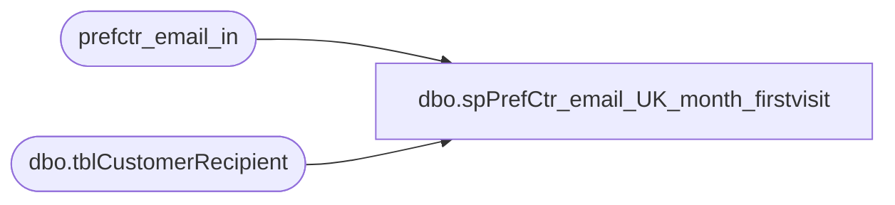

# dbo.spPrefCtr_email_UK_month_firstvisit

**Database:** dw  
**Server:** papamart  

## Architecture Diagram



## Table Dependencies

| Referenced Table |
|---|
| prefctr_email_in |
| dbo.tblCustomerRecipient |

## Stored Procedure Code

```sql
CREATE PROCEDURE [dbo].[spPrefCtr_email_UK_month_firstvisit]
-- =============================================================================================================
-- Name: [dbo].[spPrefCtr_email_UK_month_firstvisit]
--
-- Description:	returns e-mails from UK where opt-in date is in the month and year specified
--
-- Input:	N/A
--
-- Output: N/A
--
-- Dependencies: 
--
-- Revision History
--		Name:			Date:			Comments:
--		Dan Morgan						created
--		Keith Missey	7/3/2008		proc didn't work so redid query to pull right information based on parameters
-- =============================================================================================================
    @firstvisit_year SMALLINT,
    @firstvisit_month SMALLINT
AS 
    SET nocount ON

    SELECT	EMAIL_ADDR,
            MIN([SYS_KEY_VALUE]) AS sys_key_value,
            MIN(DATE_OPTIN) AS date_optin
    INTO    #tmp_UKemail
    FROM    prefctr_email_in WITH (NOLOCK)
    WHERE   purchase_storeid >= 2000
            AND sys_key = 1 --kiosk  
            AND date_optout IS NULL AND YEAR(date_optin) = @firstvisit_year 
            AND MONTH(date_optin) = @firstvisit_month
    GROUP BY email_addr
    ORDER BY email_addr
    
  
    SELECT  UPPER(sSFirstName) AS FirstName,
            LOWER(sSEMail) AS Email, drstarttime
    FROM    mamamart.babw.dbo.tblCustomerRecipient
    WHERE   id IN (
            SELECT  sys_key_value
            FROM   #tmp_UKemail)  
    ORDER BY ssemail
```

