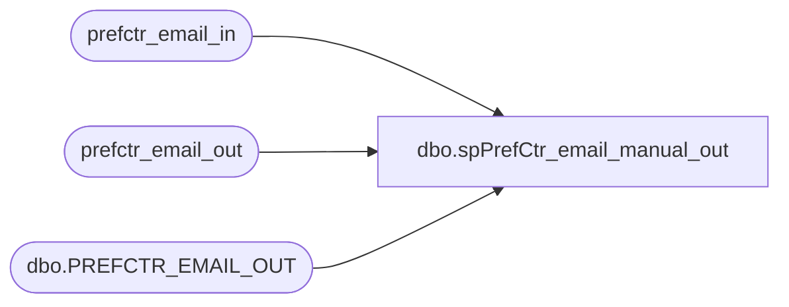

# dbo.spPrefCtr_email_manual_out

**Database:** dw  
**Server:** papamart  

## Architecture Diagram



## Table Dependencies

| Referenced Table |
|---|
| prefctr_email_in |
| prefctr_email_out |
| dbo.PREFCTR_EMAIL_OUT |

## Stored Procedure Code

```sql
CREATE PROCEDURE [dbo].[spPrefCtr_email_manual_out] 
	@email_addr_lc varchar(65),
	@return_results bit=1
AS
-- =============================================================================================================
-- Name: spPrefCtr_email_manual_out
--
-- Description:	To be used if someone wants opted out of email.
--
-- Input:	N/A
--
-- Output: 
--
-- Dependencies: 
--
-- EXAMPLE:
--		DECLARE @RC int
--		DECLARE @email_addr_lc varchar(65)
--		SET @email_addr_lc = 'danm@buildabear.com'
--		EXECUTE @RC = [dw].[dbo].[spPrefCtr_email_manual_out] 
--		   @email_addr_lc
--
-- Revision History
--		Name:			Date:			Comments:
--		Dan Morgan		11/8/2006		Created
--		Keith Missey	11/6/2007		added @return_results parameter 
-- =============================================================================================================

DECLARE @email_out_key int
SET @email_out_key = (select min(email_out_key)-1 from prefctr_email_out)


--Print 'RECORDS BEFORE:'
IF @return_results = 1
BEGIN
select 'prefctr_email_out BEFORE:',* from prefctr_email_out where email_addr_lc = @email_addr_lc
select 'prefctr_email_in BEFORE:',* from prefctr_email_in where email_addr_lc = @email_addr_lc
END

update prefctr_email_in set date_optout = getdate() where email_addr_lc = @email_addr_lc

INSERT INTO [dw].[dbo].[PREFCTR_EMAIL_OUT]
           ([EMAIL_OUT_KEY],[EMAIL_ADDR],[EMAIL_ADDR_LC],[BRAND],[SYS_KEY],[DATE_OPTOUT],[DATE_OPTBACKIN],[FINAL_OPTOUT])
VALUES (@email_out_key, @email_addr_lc,@email_addr_lc,'BABW',4,getdate(),NULL,getdate())

IF @return_results = 1
BEGIN
--Print 'RECORDS AFTER:'
select 'prefctr_email_out AFTER:',* from prefctr_email_out where email_addr_lc = @email_addr_lc
select 'prefctr_email_in AFTER:',* from prefctr_email_in where email_addr_lc = @email_addr_lc
END
```

