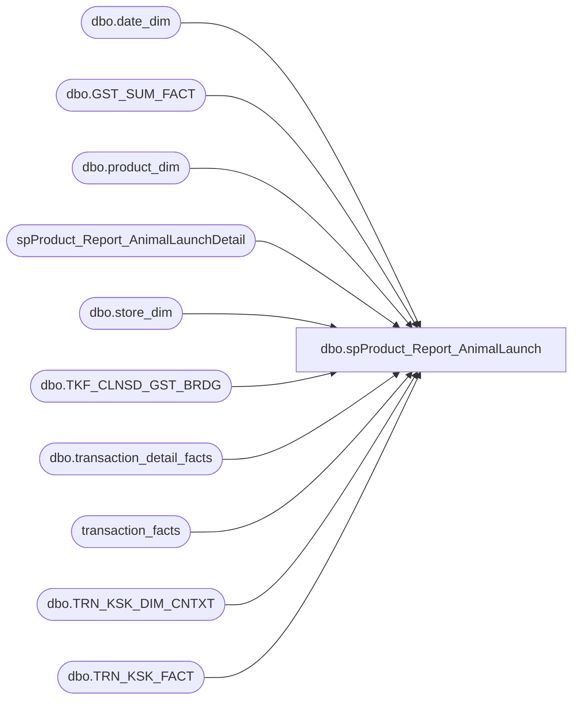

# dbo.spProduct_Report_AnimalLaunch

**Database:** dw  
**Server:** papamart  

## Architecture Diagram



## Table Dependencies

| Referenced Table |
|---|
| dbo.date_dim |
| dbo.GST_SUM_FACT |
| dbo.product_dim |
| spProduct_Report_AnimalLaunchDetail |
| dbo.store_dim |
| dbo.TKF_CLNSD_GST_BRDG |
| dbo.transaction_detail_facts |
| transaction_facts |
| dbo.TRN_KSK_DIM_CNTXT |
| dbo.TRN_KSK_FACT |

## Stored Procedure Code

```sql
CREATE PROC [dbo].[spProduct_Report_AnimalLaunch] --'NORTH AMERICA', '021969', '10/24/2014', '11/1/2014', '11/1/2014'
-- =============================================================================================================
-- Name: [dbo].[spProduct_Report_AnimalLaunch]
--
-- Description:	takes style_code and 3 input dates and runs detail data and summarizes data, only for NA
--
-- Input:	@productstyle		varchar(10)		style_code for animal launch
--			@startdate		datetime		start date of analysis
--			@enddate1		datetime		first end date of analysis for report
--			@enddate2		datetime		second end date of analysis for report
--
-- Output: N/A
--
-- Dependencies: 
--
-- Revision History
--		Name:			Date:			Comments:
--		Keith Missey	7/31/2009		created
--		Keith Missey	3/9/2010		changed sku to style_code
--		Gary Murrish	9/18/2012		Changed to Transaction_facts from vwdw_transactions
--		Gary Murrish	1/3/2012		Changed ProductStyle to be without the leading zero (last 5 digits)
-- =============================================================================================================
    @country VARCHAR(30),
    @productstyle VARCHAR(10),
    @startdate DATETIME,
    @enddate1 DATETIME,
    @enddate2 DATETIME
AS 
BEGIN
    SET NOCOUNT ON

	-- 
--ENSURE THAT THE SECOND DATE PARAMETER IS THE LATER DATE     		
    IF @enddate1 >= @enddate2 
        BEGIN
            DECLARE @tmpdate DATETIME
	
            SET @tmpdate = @enddate2
	
            SET @enddate2 = @enddate1
            SET @enddate1 = @tmpdate
        END

    IF EXISTS ( SELECT  *
                FROM    sysobjects
                WHERE   id = OBJECT_ID(N'[tmp_AnimalReportRegData]')
                        AND type in ( N'U' ) ) 
        DROP TABLE dbo.[tmp_AnimalReportRegData]

--RETRIEVE NECESSARY KIOSK DATA
    SELECT  tkf.tkf_id,
            style_code,
            actual_date,
            gndr_cd,
            CAST(clnsd_gst_age_nbr AS DECIMAL(4,1)) AS clnsd_gst_age_nbr,
            gift_ind,
            gst_vst_recur_cd
    INTO    dbo.[tmp_AnimalReportRegData]
    FROM    dw.dbo.[TRN_KSK_FACT] tkf WITH ( NOLOCK )
            INNER JOIN dw.dbo.[TRN_KSK_DIM_CNTXT] c WITH ( NOLOCK ) ON tkf.trn_ksk_cntxt_id = c.trn_ksk_cntxt_id
            INNER JOIN dw.dbo.[TKF_CLNSD_GST_BRDG] b WITH ( NOLOCK ) ON b.tkf_id = tkf.tkf_id
            INNER JOIN dw.dbo.[GST_SUM_FACT] f WITH ( NOLOCK ) ON f.clnsd_gst_id = b.clnsd_gst_id
            INNER JOIN dw.dbo.[date_dim] dd WITH ( NOLOCK ) ON tkf.dt_id = dd.date_key
            INNER JOIN dw.dbo.store_dim sd WITH ( NOLOCK ) ON tkf.[STR_ID] = sd.store_key
            INNER JOIN dw.dbo.product_dim pd WITH ( NOLOCK ) ON tkf.prdct_id = pd.product_key
    WHERE   ( (@country = 'NORTH AMERICA' AND sd.country IN ('US','CA') AND store_id NOT IN (17, 155, 180, 209, 212, 285))
              OR (@country = 'UK' AND sd.country IN ('UK')) )
            AND actual_date BETWEEN @startdate AND @enddate2

    IF EXISTS ( SELECT  *
                FROM    sysobjects
                WHERE   id = OBJECT_ID(N'[tmp_AnimalReportSalesData]')
                        AND type in ( N'U' ) ) 
        DROP TABLE dbo.[tmp_AnimalReportSalesData]	

--RETRIEVE NECESSARY SALES DATA	
    SELECT  transaction_id,
            actual_date,
            v.animal_units AS animalunits,
            v.footwear_units AS shoeunits,
            v.sounds_units AS soundunits,
            v.merchandise_units AS merchandiseunits,
            v.GAAP_sales_amount AS gaapsales
    INTO    #tmpsales
    FROM    transaction_facts v WITH ( NOLOCK )
            INNER JOIN dw.dbo.date_dim dd ON v.date_key = dd.date_key
            INNER JOIN dw.dbo.store_dim sd ON v.store_key = sd.store_key
    WHERE   v.GAAP_transaction_flag = 1 AND
            ( (@country = 'NORTH AMERICA' AND sd.country IN ('US','CA') AND store_id NOT IN (17, 155, 180, 209, 212, 285))
              OR (@country = 'UK' AND sd.country IN ('UK')) )
            AND actual_date BETWEEN @startdate AND @enddate2

    SELECT  tdf.transaction_id,
            style_code,
            SUM([units]) AS productunits
    INTO    #tmpproduct
    FROM    dw.dbo.[transaction_detail_facts] tdf WITH ( NOLOCK )
            INNER JOIN dw.dbo.product_dim p WITH ( NOLOCK ) ON tdf.[product_key] = p.[product_key]
            INNER JOIN #tmpsales s ON tdf.transaction_id = s.transaction_id
    WHERE   ( (@country = 'NORTH AMERICA' AND RIGHT(style_code,5) = RIGHT(@productstyle,5) AND LEFT(style_code,1) IN (1,0))
              OR (@country = 'UK' AND RIGHT(style_code,5) = RIGHT(@productstyle,5) AND LEFT(style_code,1) IN (4)) )
    GROUP BY tdf.transaction_id,
            style_code

    SELECT  s.*,
            style_code,
            productunits
    INTO    dbo.[tmp_AnimalReportSalesData]
    FROM    [#tmpsales] s
            LEFT JOIN #tmpproduct p ON s.transaction_id = p.transaction_id

    CREATE TABLE #tmpReport
        (
          tmpid INT IDENTITY(1, 1),
          timeFrameGroup CHAR(20),
          rowType VARCHAR(20),						-- 'header', 'subheader', 'detail'
          rowheaderAlign VARCHAR(20),				-- horiz align value
          thresholdHighlight VARCHAR(10),			-- supports: '>50%', '>500', '>5.0', '>$55.00'
          rowheader VARCHAR(30),
          productvalue VARCHAR(50),
          totalvalue VARCHAR(50)
        )
        
----EXECUTE REPORT FOR LONGER DATE DURATION
    EXEC spProduct_Report_AnimalLaunchDetail 'THRU 1ST WEEK', @productstyle, @startdate, @enddate2

----EXECUTE REPORT FOR SHORTER DATE DURATION
    EXEC spProduct_Report_AnimalLaunchDetail 'WEEKEND', @productstyle, @startdate, @enddate1

    SELECT  timeFrameGroup, rowType, rowheaderAlign, thresholdHighlight,
            ISNULL(rowheader, '') AS rowheader,
            [productvalue],
            [totalvalue]
    FROM    #tmpreport
    
END
```

