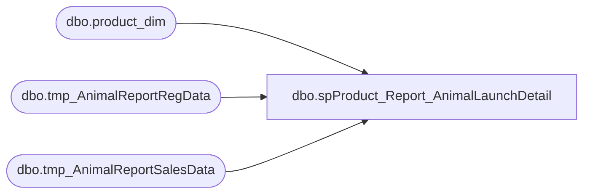

# dbo.spProduct_Report_AnimalLaunchDetail

**Database:** dw  
**Server:** papamart  

## Architecture Diagram



## Table Dependencies

| Referenced Table |
|---|
| dbo.product_dim |
| dbo.tmp_AnimalReportRegData |
| dbo.tmp_AnimalReportSalesData |

## Stored Procedure Code

```sql
CREATE PROC [dbo].[spProduct_Report_AnimalLaunchDetail] 
-- =============================================================================================================
-- Name: [dbo].[spProduct_Report_AnimalLaunchDetail]
--
-- Description:	provides detailed registration and sales data for animal launches by sku and start and end dates
--
-- Input:	@productstyle		varchar(10)		style code for animal launch
--			@startdate		datetime		start date of analysis
--			@enddate		datetime		end date of analysis
--
-- Output: N/A
--
-- Dependencies: 
--
-- Revision History
--		Name:			Date:			Comments:
--		Keith Missey	7/31/2009		created
--		Keith Missey	3/9/2010		added RIGHT(style_code,5) to check both CA and US styles
--		Gary Murrish	12/21/2012		Corrected check for productStyle to only be RIGHT(@productstyle,5)
--										And fixed a problem on the Age Ranges (changed from inner join to left join)
-- =============================================================================================================
    @timeFrameGroup VARCHAR(20), -- 'THRU 1ST WEEK' or 'WEEKEND'
    @productstyle   VARCHAR(10),
    @startdate      DATETIME,
    @enddate        DATETIME
AS
BEGIN
	SET NOCOUNT ON

	--TOTAL COUNTS 
	DECLARE @productcount DECIMAL,
            @totalcount   DECIMAL

	SET @productcount = (
						 SELECT count(DISTINCT tkf_id)
						 FROM
							 dw.dbo.tmp_AnimalReportRegData
						 WHERE
							 right(style_code, 5) = RIGHT(@productstyle,5)
							 AND actual_date <= @enddate)
	SET @totalcount = (
					   SELECT count(DISTINCT tkf_id)
					   FROM
						   dw.dbo.tmp_AnimalReportRegData
					   WHERE
						   actual_date <= @enddate)
	

	--REPORT HEADER
	SELECT 1 AS orderby
		 , 'YEAR' AS col1
		 , @productstyle AS col2
		 , '' AS col3
		 , 'header' AS rowType
	INTO
		#tmpheader
	UNION
	SELECT DISTINCT 2
				  , 'LAUNCH-' + @timeFrameGroup
				  , style_desc
				  , ''
				  , 'header'
	FROM
		dw.dbo.product_dim
	WHERE
		right(style_code, 5) = RIGHT(@productstyle,5)
		AND left(style_code, 1) IN (1, 0)
	UNION
	SELECT 3
		 , 'Period Dates'
		 , convert(VARCHAR, @startdate, 101)
		 , convert(VARCHAR, @enddate, 101)
		 , 'subheader'
	UNION
	SELECT 4
		 , @timeFrameGroup
		 , 'LAUNCH ANIMAL'
		 , 'BABW OVERALL'
		 , 'subheader'

	INSERT #tmpreport
	SELECT @timeFrameGroup
		 , rowType
		 , 'Center'
		 , NULL
		 , col1
		 , col2
		 , col3
	FROM
		#tmpheader
	ORDER BY
		orderby

	--INSERT GENDER DATA
	SELECT CASE
			   WHEN gndr_cd = 'F' THEN
				   'GIRL'
			   WHEN gndr_cd = 'M' THEN
				   'BOY'
			   ELSE
				   'UNKNOWN'
		   END AS rowheader
		 , 100 * (count(DISTINCT tkf_id) / @productcount) AS productvalue
	INTO
		#tmpprodgender
	FROM
		dw.dbo.tmp_AnimalReportRegData
	WHERE
		right(style_code, 5) = RIGHT(@productstyle,5)
		AND [gndr_cd] IN ('m', 'f')
		AND actual_date <= @enddate
	GROUP BY
		CASE
			WHEN gndr_cd = 'F' THEN
				'GIRL'
			WHEN gndr_cd = 'M' THEN
				'BOY'
			ELSE
				'UNKNOWN'
		END
	ORDER BY
		CASE
			WHEN gndr_cd = 'F' THEN
				'GIRL'
			WHEN gndr_cd = 'M' THEN
				'BOY'
			ELSE
				'UNKNOWN'
		END

	SELECT CASE
			   WHEN gndr_cd = 'F' THEN
				   'GIRL'
			   WHEN gndr_cd = 'M' THEN
				   'BOY'
			   ELSE
				   'UNKNOWN'
		   END AS rowheader
		 , 100 * (count(DISTINCT tkf_id) / @totalcount) AS totalvalue
	INTO
		#tmptotalgender
	FROM
		dw.dbo.tmp_AnimalReportRegData
	WHERE
		[gndr_cd] IN ('m', 'f')
		AND actual_date <= @enddate
	GROUP BY
		CASE
			WHEN gndr_cd = 'F' THEN
				'GIRL'
			WHEN gndr_cd = 'M' THEN
				'BOY'
			ELSE
				'UNKNOWN'
		END
	ORDER BY
		CASE
			WHEN gndr_cd = 'F' THEN
				'GIRL'
			WHEN gndr_cd = 'M' THEN
				'BOY'
			ELSE
				'UNKNOWN'
		END

	INSERT #tmpreport
	SELECT @timeFrameGroup
		 , 'detail'
		 , 'left'
		 , CASE
			   WHEN p.rowheader = 'GIRL' THEN
				   '>80%'
			   WHEN p.rowheader = 'BOY' THEN
				   '>40%'
			   ELSE
				   'UNKNOWN'
		   END
		 , p.rowheader
		 , productvalue
		 , totalvalue
	FROM
		[#tmpprodgender] p
		INNER JOIN #tmptotalgender t
			ON t.rowheader = p.rowheader

	--INSERT ROW SEPARATOR
	INSERT #tmpreport
	SELECT @timeFrameGroup
		 , 'detail'
		 , NULL
		 , NULL
		 , NULL
		 , NULL
		 , NULL

	--INSERT OVERALL AGE
	INSERT #tmpreport
	SELECT @timeFrameGroup
		 , 'detail'
		 , 'Left'
		 , NULL
		 , 'Overall Age Range'
		 , NULL
		 , NULL

	SELECT CASE
			   WHEN clnsd_gst_age_nbr <= 0.0 THEN
				   '0'
			   WHEN clnsd_gst_age_nbr BETWEEN 0.1 AND 3.9 THEN
				   '01 to 03'
			   WHEN clnsd_gst_age_nbr BETWEEN 4.0 AND 6.9 THEN
				   '04 to 06'
			   WHEN clnsd_gst_age_nbr BETWEEN 7.0 AND 9.9 THEN
				   '07 to 09'
			   WHEN clnsd_gst_age_nbr BETWEEN 10.0 AND 12.9 THEN
				   '10 to 12'
			   WHEN clnsd_gst_age_nbr BETWEEN 13.0 AND 19.9 THEN
				   'teens'
			   WHEN clnsd_gst_age_nbr >= 20.0 THEN
				   'adults'
			   ELSE
				   'Unknown'
		   END AS rowheader
		 , 100 * (count(DISTINCT tkf_id) / @productcount) AS productvalue
	INTO
		#tmpproductage
	FROM
		dw.dbo.tmp_AnimalReportRegData
	WHERE
		right(style_code, 5) = RIGHT(@productstyle,5)
		AND actual_date <= @enddate
	GROUP BY
		CASE
			   WHEN clnsd_gst_age_nbr <= 0.0 THEN
				   '0'
			   WHEN clnsd_gst_age_nbr BETWEEN 0.1 AND 3.9 THEN
				   '01 to 03'
			   WHEN clnsd_gst_age_nbr BETWEEN 4.0 AND 6.9 THEN
				   '04 to 06'
			   WHEN clnsd_gst_age_nbr BETWEEN 7.0 AND 9.9 THEN
				   '07 to 09'
			   WHEN clnsd_gst_age_nbr BETWEEN 10.0 AND 12.9 THEN
				   '10 to 12'
			   WHEN clnsd_gst_age_nbr BETWEEN 13.0 AND 19.9 THEN
				   'teens'
			   WHEN clnsd_gst_age_nbr >= 20.0 THEN
				   'adults'
			   ELSE
				   'Unknown'
		   END
	ORDER BY
		CASE
			   WHEN clnsd_gst_age_nbr <= 0.0 THEN
				   '0'
			   WHEN clnsd_gst_age_nbr BETWEEN 0.1 AND 3.9 THEN
				   '01 to 03'
			   WHEN clnsd_gst_age_nbr BETWEEN 4.0 AND 6.9 THEN
				   '04 to 06'
			   WHEN clnsd_gst_age_nbr BETWEEN 7.0 AND 9.9 THEN
				   '07 to 09'
			   WHEN clnsd_gst_age_nbr BETWEEN 10.0 AND 12.9 THEN
				   '10 to 12'
			   WHEN clnsd_gst_age_nbr BETWEEN 13.0 AND 19.9 THEN
				   'teens'
			   WHEN clnsd_gst_age_nbr >= 20.0 THEN
				   'adults'
			   ELSE
				   'Unknown'
		   END

	SELECT CASE
			   WHEN clnsd_gst_age_nbr <= 0.0 THEN
				   '0'
			   WHEN clnsd_gst_age_nbr BETWEEN 0.1 AND 3.9 THEN
				   '01 to 03'
			   WHEN clnsd_gst_age_nbr BETWEEN 4.0 AND 6.9 THEN
				   '04 to 06'
			   WHEN clnsd_gst_age_nbr BETWEEN 7.0 AND 9.9 THEN
				   '07 to 09'
			   WHEN clnsd_gst_age_nbr BETWEEN 10.0 AND 12.9 THEN
				   '10 to 12'
			   WHEN clnsd_gst_age_nbr BETWEEN 13.0 AND 19.9 THEN
				   'teens'
			   WHEN clnsd_gst_age_nbr >= 20.0 THEN
				   'adults'
			   ELSE
				   'Unknown'
		   END AS rowheader
		 , 100 * (count(DISTINCT tkf_id) / @totalcount) AS totalvalue
	INTO
		#tmptotalage
	FROM
		dw.dbo.tmp_AnimalReportRegData
	WHERE
		actual_date <= @enddate
	GROUP BY
		CASE
			   WHEN clnsd_gst_age_nbr <= 0.0 THEN
				   '0'
			   WHEN clnsd_gst_age_nbr BETWEEN 0.1 AND 3.9 THEN
				   '01 to 03'
			   WHEN clnsd_gst_age_nbr BETWEEN 4.0 AND 6.9 THEN
				   '04 to 06'
			   WHEN clnsd_gst_age_nbr BETWEEN 7.0 AND 9.9 THEN
				   '07 to 09'
			   WHEN clnsd_gst_age_nbr BETWEEN 10.0 AND 12.9 THEN
				   '10 to 12'
			   WHEN clnsd_gst_age_nbr BETWEEN 13.0 AND 19.9 THEN
				   'teens'
			   WHEN clnsd_gst_age_nbr >= 20.0 THEN
				   'adults'
			   ELSE
				   'Unknown'
		   END
	ORDER BY
		CASE
			   WHEN clnsd_gst_age_nbr <= 0.0 THEN
				   '0'
			   WHEN clnsd_gst_age_nbr BETWEEN 0.1 AND 3.9 THEN
				   '01 to 03'
			   WHEN clnsd_gst_age_nbr BETWEEN 4.0 AND 6.9 THEN
				   '04 to 06'
			   WHEN clnsd_gst_age_nbr BETWEEN 7.0 AND 9.9 THEN
				   '07 to 09'
			   WHEN clnsd_gst_age_nbr BETWEEN 10.0 AND 12.9 THEN
				   '10 to 12'
			   WHEN clnsd_gst_age_nbr BETWEEN 13.0 AND 19.9 THEN
				   'teens'
			   WHEN clnsd_gst_age_nbr >= 20.0 THEN
				   'adults'
			   ELSE
				   'Unknown'
		   END

	INSERT #tmpreport
	--SELECT  @timeFrameGroup, 'detail', 'Center', '>30%',
	--        p.rowheader,
	--        productvalue,
	--        totalvalue
	--FROM    [#tmpproductage] p
	--        INNER JOIN #tmptotalage t ON t.rowheader = p.rowheader

	SELECT @timeFrameGroup
		 , 'detail'
		 , 'Center'
		 , '>30%'
		 , sub.rowheader
		 , sum(productvalue)
		 , sum(totalvalue)
	FROM
		(
		 SELECT t.rowheader AS rowheader
			  , ISNULL(productvalue,0) AS productvalue
			  , totalvalue AS totalvalue
		 FROM
			 #tmptotalage t
			 LEFT JOIN  [#tmpproductage] p
				 ON t.rowheader = p.rowheader
		 UNION -- UNIONing and SUMming ensures that we get data for all categories...even if zero
		 SELECT '0'
			  , 0
			  , 0 UNION
		 SELECT '01 to 03'
			  , 0
			  , 0 UNION
		 SELECT '04 to 06'
			  , 0
			  , 0 UNION
		 SELECT '07 to 09'
			  , 0
			  , 0 UNION
		 SELECT '10 to 12'
			  , 0
			  , 0 UNION
		 SELECT 'teens'
			  , 0
			  , 0 UNION
		 SELECT 'adults'
			  , 0
			  , 0 UNION
		 SELECT 'Unknown'
			  , 0
			  , 0) AS sub
	GROUP BY
		sub.rowheader

	--INSERT ROW SEPARATOR
	INSERT #tmpreport
	SELECT @timeFrameGroup
		 , 'detail'
		 , NULL
		 , NULL
		 , NULL
		 , NULL
		 , NULL

	--INSERT GIRL AGE
	INSERT #tmpreport
	SELECT @timeFrameGroup
		 , 'detail'
		 , 'Left'
		 , NULL
		 , 'Girl Age Range'
		 , NULL
		 , NULL

	DECLARE @productgirlcount DECIMAL,
            @totalgirlcount   DECIMAL

	SET @productgirlcount = (
							 SELECT count(DISTINCT tkf_id)
							 FROM
								 dw.dbo.tmp_AnimalReportRegData
							 WHERE
								 right(style_code, 5) = RIGHT(@productstyle,5)
								 AND [gndr_cd] = 'F'
								 AND actual_date <= @enddate)
	SET @totalgirlcount = (
						   SELECT count(DISTINCT tkf_id)
						   FROM
							   dw.dbo.tmp_AnimalReportRegData
						   WHERE
							   [gndr_cd] = 'F'
							   AND actual_date <= @enddate)

	SELECT CASE
			   WHEN clnsd_gst_age_nbr <= 0.0 THEN
				   '0'
			   WHEN clnsd_gst_age_nbr BETWEEN 0.1 AND 3.9 THEN
				   '01 to 03'
			   WHEN clnsd_gst_age_nbr BETWEEN 4.0 AND 6.9 THEN
				   '04 to 06'
			   WHEN clnsd_gst_age_nbr BETWEEN 7.0 AND 9.9 THEN
				   '07 to 09'
			   WHEN clnsd_gst_age_nbr BETWEEN 10.0 AND 12.9 THEN
				   '10 to 12'
			   WHEN clnsd_gst_age_nbr BETWEEN 13.0 AND 19.9 THEN
				   'teens'
			   WHEN clnsd_gst_age_nbr >= 20.0 THEN
				   'adults'
			   ELSE
				   'Unknown'
		   END AS rowheader
		 , 100 * (count(DISTINCT tkf_id) / @productgirlcount) AS productvalue
	INTO
		#tmpproductgirlage
	FROM
		dw.dbo.tmp_AnimalReportRegData
	WHERE
		right(style_code, 5) = RIGHT(@productstyle,5)
		AND [gndr_cd] = 'F'
		AND actual_date <= @enddate
	GROUP BY
		CASE
			   WHEN clnsd_gst_age_nbr <= 0.0 THEN
				   '0'
			   WHEN clnsd_gst_age_nbr BETWEEN 0.1 AND 3.9 THEN
				   '01 to 03'
			   WHEN clnsd_gst_age_nbr BETWEEN 4.0 AND 6.9 THEN
				   '04 to 06'
			   WHEN clnsd_gst_age_nbr BETWEEN 7.0 AND 9.9 THEN
				   '07 to 09'
			   WHEN clnsd_gst_age_nbr BETWEEN 10.0 AND 12.9 THEN
				   '10 to 12'
			   WHEN clnsd_gst_age_nbr BETWEEN 13.0 AND 19.9 THEN
				   'teens'
			   WHEN clnsd_gst_age_nbr >= 20.0 THEN
				   'adults'
			   ELSE
				   'Unknown'
		   END
	ORDER BY
		CASE
			   WHEN clnsd_gst_age_nbr <= 0.0 THEN
				   '0'
			   WHEN clnsd_gst_age_nbr BETWEEN 0.1 AND 3.9 THEN
				   '01 to 03'
			   WHEN clnsd_gst_age_nbr BETWEEN 4.0 AND 6.9 THEN
				   '04 to 06'
			   WHEN clnsd_gst_age_nbr BETWEEN 7.0 AND 9.9 THEN
				   '07 to 09'
			   WHEN clnsd_gst_age_nbr BETWEEN 10.0 AND 12.9 THEN
				   '10 to 12'
			   WHEN clnsd_gst_age_nbr BETWEEN 13.0 AND 19.9 THEN
				   'teens'
			   WHEN clnsd_gst_age_nbr >= 20.0 THEN
				   'adults'
			   ELSE
				   'Unknown'
		   END

	SELECT CASE
			   WHEN clnsd_gst_age_nbr <= 0.0 THEN
				   '0'
			   WHEN clnsd_gst_age_nbr BETWEEN 0.1 AND 3.9 THEN
				   '01 to 03'
			   WHEN clnsd_gst_age_nbr BETWEEN 4.0 AND 6.9 THEN
				   '04 to 06'
			   WHEN clnsd_gst_age_nbr BETWEEN 7.0 AND 9.9 THEN
				   '07 to 09'
			   WHEN clnsd_gst_age_nbr BETWEEN 10.0 AND 12.9 THEN
				   '10 to 12'
			   WHEN clnsd_gst_age_nbr BETWEEN 13.0 AND 19.9 THEN
				   'teens'
			   WHEN clnsd_gst_age_nbr >= 20.0 THEN
				   'adults'
			   ELSE
				   'Unknown'
		   END AS rowheader
		 , 100 * (count(DISTINCT tkf_id) / @totalgirlcount) AS totalvalue
	INTO
		#tmptotalgirlage
	FROM
		dw.dbo.tmp_AnimalReportRegData
	WHERE
		[gndr_cd] = 'F'
		AND actual_date <= @enddate
	GROUP BY
		CASE
			   WHEN clnsd_gst_age_nbr <= 0.0 THEN
				   '0'
			   WHEN clnsd_gst_age_nbr BETWEEN 0.1 AND 3.9 THEN
				   '01 to 03'
			   WHEN clnsd_gst_age_nbr BETWEEN 4.0 AND 6.9 THEN
				   '04 to 06'
			   WHEN clnsd_gst_age_nbr BETWEEN 7.0 AND 9.9 THEN
				   '07 to 09'
			   WHEN clnsd_gst_age_nbr BETWEEN 10.0 AND 12.9 THEN
				   '10 to 12'
			   WHEN clnsd_gst_age_nbr BETWEEN 13.0 AND 19.9 THEN
				   'teens'
			   WHEN clnsd_gst_age_nbr >= 20.0 THEN
				   'adults'
			   ELSE
				   'Unknown'
		   END
	ORDER BY
		CASE
			   WHEN clnsd_gst_age_nbr <= 0.0 THEN
				   '0'
			   WHEN clnsd_gst_age_nbr BETWEEN 0.1 AND 3.9 THEN
				   '01 to 03'
			   WHEN clnsd_gst_age_nbr BETWEEN 4.0 AND 6.9 THEN
				   '04 to 06'
			   WHEN clnsd_gst_age_nbr BETWEEN 7.0 AND 9.9 THEN
				   '07 to 09'
			   WHEN clnsd_gst_age_nbr BETWEEN 10.0 AND 12.9 THEN
				   '10 to 12'
			   WHEN clnsd_gst_age_nbr BETWEEN 13.0 AND 19.9 THEN
				   'teens'
			   WHEN clnsd_gst_age_nbr >= 20.0 THEN
				   'adults'
			   ELSE
				   'Unknown'
		   END

	INSERT #tmpreport
	--SELECT  @timeFrameGroup, 'detail', 'Center', '>30%', 
	--        p.rowheader,
	--        productvalue,
	--        totalvalue
	--FROM    [#tmpproductgirlage] p
	--        INNER JOIN #tmptotalgirlage t ON t.rowheader = p.rowheader
	SELECT @timeFrameGroup
		 , 'detail'
		 , 'Center'
		 , '>30%'
		 , sub.rowheader
		 , sum(productvalue)
		 , sum(totalvalue)
	FROM
		(
		 SELECT t.rowheader AS rowheader
			  , ISNULL(productvalue,0) AS productvalue
			  , totalvalue AS totalvalue
		 FROM
			 #tmptotalgirlage t
			 LEFT JOIN  [#tmpproductgirlage] p
				 ON t.rowheader = p.rowheader
		 UNION -- UNIONing and SUMming ensures that we get data for all categories...even if zero
		 SELECT '0'
			  , 0
			  , 0 UNION
		 SELECT '01 to 03'
			  , 0
			  , 0 UNION
		 SELECT '04 to 06'
			  , 0
			  , 0 UNION
		 SELECT '07 to 09'
			  , 0
			  , 0 UNION
		 SELECT '10 to 12'
			  , 0
			  , 0 UNION
		 SELECT 'teens'
			  , 0
			  , 0 UNION
		 SELECT 'adults'
			  , 0
			  , 0 UNION
		 SELECT 'Unknown'
			  , 0
			  , 0) AS sub
	GROUP BY
		sub.rowheader

	--INSERT ROW SEPARATOR
	INSERT #tmpreport
	SELECT @timeFrameGroup
		 , 'detail'
		 , NULL
		 , NULL
		 , NULL
		 , NULL
		 , NULL

	--INSERT BOY AGE

	INSERT #tmpreport
	SELECT @timeFrameGroup
		 , 'detail'
		 , NULL
		 , NULL
		 , 'Boy Age Range'
		 , NULL
		 , NULL

	DECLARE @productboycount DECIMAL,
            @totalboycount   DECIMAL

	SET @productboycount = (
							SELECT count(DISTINCT tkf_id)
							FROM
								dw.dbo.tmp_AnimalReportRegData
							WHERE
								right(style_code, 5) = RIGHT(@productstyle,5)
								AND [gndr_cd] = 'M'
								AND actual_date <= @enddate)
	SET @totalboycount = (
						  SELECT count(DISTINCT tkf_id)
						  FROM
							  dw.dbo.tmp_AnimalReportRegData
						  WHERE
							  [gndr_cd] = 'M'
							  AND actual_date <= @enddate)

	SELECT CASE
			   WHEN clnsd_gst_age_nbr <= 0.0 THEN
				   '0'
			   WHEN clnsd_gst_age_nbr BETWEEN 0.1 AND 3.9 THEN
				   '01 to 03'
			   WHEN clnsd_gst_age_nbr BETWEEN 4.0 AND 6.9 THEN
				   '04 to 06'
			   WHEN clnsd_gst_age_nbr BETWEEN 7.0 AND 9.9 THEN
				   '07 to 09'
			   WHEN clnsd_gst_age_nbr BETWEEN 10.0 AND 12.9 THEN
				   '10 to 12'
			   WHEN clnsd_gst_age_nbr BETWEEN 13.0 AND 19.9 THEN
				   'teens'
			   WHEN clnsd_gst_age_nbr >= 20.0 THEN
				   'adults'
			   ELSE
				   'Unknown'
		   END AS rowheader
		 , 100 * (count(DISTINCT tkf_id) / @productboycount) AS productvalue
	INTO
		#tmpproductboyage
	FROM
		dw.dbo.tmp_AnimalReportRegData
	WHERE
		right(style_code, 5) = RIGHT(@productstyle,5)
		AND [gndr_cd] = 'M'
		AND actual_date <= @enddate
	GROUP BY
		CASE
			   WHEN clnsd_gst_age_nbr <= 0.0 THEN
				   '0'
			   WHEN clnsd_gst_age_nbr BETWEEN 0.1 AND 3.9 THEN
				   '01 to 03'
			   WHEN clnsd_gst_age_nbr BETWEEN 4.0 AND 6.9 THEN
				   '04 to 06'
			   WHEN clnsd_gst_age_nbr BETWEEN 7.0 AND 9.9 THEN
				   '07 to 09'
			   WHEN clnsd_gst_age_nbr BETWEEN 10.0 AND 12.9 THEN
				   '10 to 12'
			   WHEN clnsd_gst_age_nbr BETWEEN 13.0 AND 19.9 THEN
				   'teens'
			   WHEN clnsd_gst_age_nbr >= 20.0 THEN
				   'adults'
			   ELSE
				   'Unknown'
		   END
	ORDER BY
		CASE
			   WHEN clnsd_gst_age_nbr <= 0.0 THEN
				   '0'
			   WHEN clnsd_gst_age_nbr BETWEEN 0.1 AND 3.9 THEN
				   '01 to 03'
			   WHEN clnsd_gst_age_nbr BETWEEN 4.0 AND 6.9 THEN
				   '04 to 06'
			   WHEN clnsd_gst_age_nbr BETWEEN 7.0 AND 9.9 THEN
				   '07 to 09'
			   WHEN clnsd_gst_age_nbr BETWEEN 10.0 AND 12.9 THEN
				   '10 to 12'
			   WHEN clnsd_gst_age_nbr BETWEEN 13.0 AND 19.9 THEN
				   'teens'
			   WHEN clnsd_gst_age_nbr >= 20.0 THEN
				   'adults'
			   ELSE
				   'Unknown'
		   END

	SELECT CASE
			   WHEN clnsd_gst_age_nbr <= 0.0 THEN
				   '0'
			   WHEN clnsd_gst_age_nbr BETWEEN 0.1 AND 3.9 THEN
				   '01 to 03'
			   WHEN clnsd_gst_age_nbr BETWEEN 4.0 AND 6.9 THEN
				   '04 to 06'
			   WHEN clnsd_gst_age_nbr BETWEEN 7.0 AND 9.9 THEN
				   '07 to 09'
			   WHEN clnsd_gst_age_nbr BETWEEN 10.0 AND 12.9 THEN
				   '10 to 12'
			   WHEN clnsd_gst_age_nbr BETWEEN 13.0 AND 19.9 THEN
				   'teens'
			   WHEN clnsd_gst_age_nbr >= 20.0 THEN
				   'adults'
			   ELSE
				   'Unknown'
		   END AS rowheader
		 , 100 * (count(DISTINCT tkf_id) / @totalboycount) AS totalvalue
	INTO
		#tmptotalboyage
	FROM
		dw.dbo.tmp_AnimalReportRegData
	WHERE
		[gndr_cd] = 'M'
		AND actual_date <= @enddate
	GROUP BY
		CASE
			   WHEN clnsd_gst_age_nbr <= 0.0 THEN
				   '0'
			   WHEN clnsd_gst_age_nbr BETWEEN 0.1 AND 3.9 THEN
				   '01 to 03'
			   WHEN clnsd_gst_age_nbr BETWEEN 4.0 AND 6.9 THEN
				   '04 to 06'
			   WHEN clnsd_gst_age_nbr BETWEEN 7.0 AND 9.9 THEN
				   '07 to 09'
			   WHEN clnsd_gst_age_nbr BETWEEN 10.0 AND 12.9 THEN
				   '10 to 12'
			   WHEN clnsd_gst_age_nbr BETWEEN 13.0 AND 19.9 THEN
				   'teens'
			   WHEN clnsd_gst_age_nbr >= 20.0 THEN
				   'adults'
			   ELSE
				   'Unknown'
		   END
	ORDER BY
		CASE
			   WHEN clnsd_gst_age_nbr <= 0.0 THEN
				   '0'
			   WHEN clnsd_gst_age_nbr BETWEEN 0.1 AND 3.9 THEN
				   '01 to 03'
			   WHEN clnsd_gst_age_nbr BETWEEN 4.0 AND 6.9 THEN
				   '04 to 06'
			   WHEN clnsd_gst_age_nbr BETWEEN 7.0 AND 9.9 THEN
				   '07 to 09'
			   WHEN clnsd_gst_age_nbr BETWEEN 10.0 AND 12.9 THEN
				   '10 to 12'
			   WHEN clnsd_gst_age_nbr BETWEEN 13.0 AND 19.9 THEN
				   'teens'
			   WHEN clnsd_gst_age_nbr >= 20.0 THEN
				   'adults'
			   ELSE
				   'Unknown'
		   END

	INSERT #tmpreport
	--SELECT  @timeFrameGroup, 'detail', 'Center', '>30%', 
	--        p.rowheader,
	--        productvalue,
	--        totalvalue
	--FROM    [#tmpproductboyage] p
	--        INNER JOIN #tmptotalboyage t ON t.rowheader = p.rowheader
	SELECT @timeFrameGroup
		 , 'detail'
		 , 'Center'
		 , '>30%'
		 , sub.rowheader
		 , sum(productvalue)
		 , sum(totalvalue)
	FROM
		(
		 SELECT t.rowheader AS rowheader
			  , ISNULL(productvalue,0) AS productvalue
			  , totalvalue AS totalvalue
		 FROM
			 #tmptotalboyage t
			 left JOIN  [#tmpproductboyage] p
				 ON t.rowheader = p.rowheader
		 UNION -- UNIONing and SUMming ensures that we get data for all categories...even if zero
		 SELECT '0'
			  , 0
			  , 0 UNION
		 SELECT '01 to 03'
			  , 0
			  , 0 UNION
		 SELECT '04 to 06'
			  , 0
			  , 0 UNION
		 SELECT '07 to 09'
			  , 0
			  , 0 UNION
		 SELECT '10 to 12'
			  , 0
			  , 0 UNION
		 SELECT 'teens'
			  , 0
			  , 0 UNION
		 SELECT 'adults'
			  , 0
			  , 0 UNION
		 SELECT 'Unknown'
			  , 0
			  , 0) AS sub
	GROUP BY
		sub.rowheader

	--INSERT ROW SEPARATOR
	INSERT #tmpreport
	SELECT @timeFrameGroup
		 , 'detail'
		 , NULL
		 , NULL
		 , NULL
		 , NULL
		 , NULL

	--INSERT NEW VS REPEAT
	SELECT CASE
			   WHEN gst_vst_recur_cd = 'N' THEN
				   'NEW'
			   WHEN gst_vst_recur_cd = 'R' THEN
				   'REPEAT'
			   ELSE
				   'UNKNOWN'
		   END AS rowheader
		 , 100 * (count(DISTINCT tkf_id) / @productcount) AS productvalue
	INTO
		#tmpprodnvr
	FROM
		dw.dbo.tmp_AnimalReportRegData
	WHERE
		right(style_code, 5) = RIGHT(@productstyle,5)
		AND actual_date <= @enddate
	GROUP BY
		CASE
			WHEN gst_vst_recur_cd = 'N' THEN
				'NEW'
			WHEN gst_vst_recur_cd = 'R' THEN
				'REPEAT'
			ELSE
				'UNKNOWN'
		END
	ORDER BY
		CASE
			WHEN gst_vst_recur_cd = 'N' THEN
				'NEW'
			WHEN gst_vst_recur_cd = 'R' THEN
				'REPEAT'
			ELSE
				'UNKNOWN'
		END

	SELECT CASE
			   WHEN gst_vst_recur_cd = 'N' THEN
				   'NEW'
			   WHEN gst_vst_recur_cd = 'R' THEN
				   'REPEAT'
			   ELSE
				   'UNKNOWN'
		   END AS rowheader
		 , 100 * (count(DISTINCT tkf_id) / @totalcount) AS totalvalue
	INTO
		#tmptotalnvr
	FROM
		dw.dbo.tmp_AnimalReportRegData
	WHERE
		actual_date <= @enddate
	GROUP BY
		CASE
			WHEN gst_vst_recur_cd = 'N' THEN
				'NEW'
			WHEN gst_vst_recur_cd = 'R' THEN
				'REPEAT'
			ELSE
				'UNKNOWN'
		END
	ORDER BY
		CASE
			WHEN gst_vst_recur_cd = 'N' THEN
				'NEW'
			WHEN gst_vst_recur_cd = 'R' THEN
				'REPEAT'
			ELSE
				'UNKNOWN'
		END

	INSERT #tmpreport
	SELECT @timeFrameGroup
		 , 'detail'
		 , 'Left'
		 , CASE
			   WHEN p.rowheader = 'NEW' THEN
				   '>50%'
			   WHEN p.rowheader = 'REPEAT' THEN
				   '>60%'
			   ELSE
				   'UNKNOWN'
		   END
		 , p.rowheader
		 , productvalue
		 , totalvalue
	FROM
		[#tmpprodnvr] p
		INNER JOIN #tmptotalnvr t
			ON t.rowheader = p.rowheader

	--INSERT ROW SEPARATOR
	INSERT #tmpreport
	SELECT @timeFrameGroup
		 , 'detail'
		 , NULL
		 , NULL
		 , NULL
		 , NULL
		 , NULL

	--INSERT GIFTING
	SELECT CASE
			   WHEN gift_ind = 'N' THEN
				   'Self'
			   WHEN gift_ind = 'Y' THEN
				   'Gift'
			   ELSE
				   'UNKNOWN'
		   END AS rowheader
		 , 100 * (count(DISTINCT tkf_id) / @productcount) AS productvalue
	INTO
		#tmpprodgift
	FROM
		dw.dbo.tmp_AnimalReportRegData
	WHERE
		right(style_code, 5) = RIGHT(@productstyle,5)
		AND actual_date <= @enddate
	GROUP BY
		CASE
			WHEN gift_ind = 'N' THEN
				'Self'
			WHEN gift_ind = 'Y' THEN
				'Gift'
			ELSE
				'UNKNOWN'
		END
	ORDER BY
		CASE
			WHEN gift_ind = 'N' THEN
				'Self'
			WHEN gift_ind = 'Y' THEN
				'Gift'
			ELSE
				'UNKNOWN'
		END

	SELECT CASE
			   WHEN gift_ind = 'N' THEN
				   'Self'
			   WHEN gift_ind = 'Y' THEN
				   'Gift'
			   ELSE
				   'UNKNOWN'
		   END AS rowheader
		 , 100 * (count(DISTINCT tkf_id) / @totalcount) AS totalvalue
	INTO
		#tmptotalgift
	FROM
		dw.dbo.tmp_AnimalReportRegData
	WHERE
		actual_date <= @enddate
	GROUP BY
		CASE
			WHEN gift_ind = 'N' THEN
				'Self'
			WHEN gift_ind = 'Y' THEN
				'Gift'
			ELSE
				'UNKNOWN'
		END
	ORDER BY
		CASE
			WHEN gift_ind = 'N' THEN
				'Self'
			WHEN gift_ind = 'Y' THEN
				'Gift'
			ELSE
				'UNKNOWN'
		END

	INSERT #tmpreport
	SELECT @timeFrameGroup
		 , 'detail'
		 , 'Left'
		 , NULL
		 , p.rowheader
		 , productvalue
		 , totalvalue
	FROM
		[#tmpprodgift] p
		INNER JOIN #tmptotalgift t
			ON t.rowheader = p.rowheader

	--INSERT ROW SEPARATOR
	INSERT #tmpreport
	SELECT @timeFrameGroup
		 , 'detail'
		 , NULL
		 , NULL
		 , NULL
		 , NULL
		 , NULL

	--INSERT SALES DATA
	SELECT sum(gaapsales) / count(transaction_id) AS producthpg
		 , cast(sum(merchandiseunits) AS DECIMAL) / cast(count(transaction_id) AS DECIMAL) AS productbags
		 , 100 * cast(sum(shoeunits) AS DECIMAL) / cast(sum(animalunits) AS DECIMAL) AS productshoe
		 , 100 * cast(sum(soundunits) AS DECIMAL) / cast(sum(animalunits) AS DECIMAL) AS productsound
		 , sum(productunits) AS productsold
	INTO
		#tmpproductsales
	FROM
		dw.dbo.tmp_AnimalReportSalesData
	WHERE
		right(style_code, 5) = RIGHT(@productstyle,5)
		AND actual_date <= @enddate

	SELECT sum(gaapsales) / count(transaction_id) AS totalhpg
		 , cast(sum(merchandiseunits) AS DECIMAL) / cast(count(transaction_id) AS DECIMAL) AS totalbags
		 , 100 * cast(sum(shoeunits) AS DECIMAL) / cast(sum(animalunits) AS DECIMAL) AS totalshoe
		 , 100 * cast(sum(soundunits) AS DECIMAL) / cast(sum(animalunits) AS DECIMAL) AS totalsound
		 , sum(animalunits) AS totalsold
	INTO
		#tmptotalsales
	FROM
		dw.dbo.tmp_AnimalReportSalesData
	WHERE
		actual_date <= @enddate

	INSERT #tmpreport
	SELECT @timeFrameGroup
		 , 'detail'
		 , 'Left'
		 , '>$55.00'
		 , 'HPG'
		 , producthpg
		 , totalhpg
	FROM
		#tmpproductsales, #tmptotalsales

	INSERT #tmpreport
	SELECT @timeFrameGroup
		 , 'detail'
		 , 'Left'
		 , '>6.0'
		 , 'BAGS'
		 , productbags
		 , totalbags
	FROM
		#tmpproductsales, #tmptotalsales

	INSERT #tmpreport
	SELECT @timeFrameGroup
		 , 'detail'
		 , 'Left'
		 , CASE
			   WHEN @timeFrameGroup = 'THRU 1ST WEEK' THEN
				   '>40%'
			   WHEN @timeFrameGroup = 'WEEKEND' THEN
				   '>60%'
		   END
		 , 'Shoe %'
		 , productshoe
		 , [totalshoe]
	FROM
		#tmpproductsales, #tmptotalsales

	INSERT #tmpreport
	SELECT @timeFrameGroup
		 , 'detail'
		 , 'Left'
		 , CASE
			   WHEN @timeFrameGroup = 'THRU 1ST WEEK' THEN
				   '>40% '
			   WHEN @timeFrameGroup = 'WEEKEND' THEN
				   '>50%'
		   END
		 , 'Sound %'
		 , [productsound]
		 , [totalsound]
	FROM
		#tmpproductsales, #tmptotalsales

	--INSERT ROW SEPARATOR
	INSERT #tmpreport
	SELECT @timeFrameGroup
		 , 'detail'
		 , NULL
		 , NULL
		 , NULL
		 , NULL
		 , NULL

	INSERT #tmpreport
	SELECT @timeFrameGroup
		 , 'detail'
		 , 'Left'
		 , NULL
		 , 'Animals Sold'
		 , productsold
		 , totalsold
	FROM
		#tmpproductsales, #tmptotalsales

	INSERT #tmpreport
	SELECT @timeFrameGroup
		 , 'detail'
		 , 'Center'
		 , '>8.0%'
		 , '% of Total'
		 , 100 * cast(productsold AS DECIMAL) / cast(totalsold AS DECIMAL)
		 , NULL
	FROM
		#tmpproductsales, #tmptotalsales

END
```

