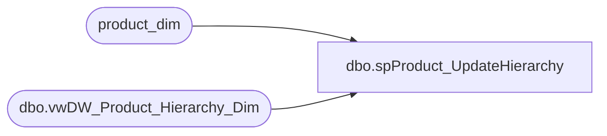

# dbo.spProduct_UpdateHierarchy

**Database:** dw  
**Server:** papamart  

## Architecture Diagram



## Table Dependencies

| Referenced Table |
|---|
| product_dim |
| dbo.vwDW_Product_Hierarchy_Dim |

## Stored Procedure Code

```sql
CREATE PROCEDURE [dbo].[spProduct_UpdateHierarchy]
-- =============================================================================================================
-- Name: spMetricsBuild
--
-- Description:	This procedure will update the product hierarchy of the items which no longer live
--				in the Merch system (and are therefore not updated)
--				This is necessary because the hierarchy must be consistant.
--
-- Input:	
--
-- Output: 
--
-- Dependencies: 
--
-- Revision History
--		Name:			Date:			Comments:
--		Gary Murrish	4/10/2012		Initial Version
-- =============================================================================================================

AS
	SET NOCOUNT ON

	UPDATE pd
	SET
		pd.subclass = sb.subclass
	  , pd.class = sb.class
	  , pd.class_code = sb.class_code
	  , pd.department = sb.department
	  , pd.department_code = sb.department_code
	  , pd.division = sb.division
	  , pd.concept = sb.concept

	--SELECT  sb.subclass AS sb
	--			, sb.class
	--			, sb.department
	--			, sb.division
	--			, sb.chain
	--			, sb.concept
	--			, pd.subclass AS curr
	--			, pd.class
	--			, pd.department
	--			, pd.division
	--			, pd.chain
	--			, pd.concept
	--			, *
	FROM
		product_dim pd WITH (NOLOCK)
		INNER JOIN bedrockdb02.me_01.dbo.vwDW_Product_Hierarchy_Dim sb WITH (NOLOCK)
			ON sb.subclass_code = pd.subclass_code
	WHERE
		sb.subclass <> pd.subclass
		OR
		sb.class <> pd.class
		OR
		sb.class_code <> pd.class_code
		OR
		sb.department <> pd.department
		OR
		sb.department_code <> pd.department_code


dbo,dt_setpropertybyid,/*
**	If the property already exists, reset the value; otherwise add property
**		id -- the id in sysobjects of the object
**		property -- the name of the property
**		value -- the text value of the property
**		lvalue -- the binary value of the property (image)
*/
create procedure dbo.dt_setpropertybyid
	@id int,
	@property varchar(64),
	@value varchar(255),
	@lvalue image
as
	set nocount on
	declare @uvalue nvarchar(255) 
	set @uvalue = convert(nvarchar(255), @value) 
	if exists (select * from dbo.dtproperties 
			where objectid=@id and property=@property)
	begin
		--
		-- bump the version count for this row as we update it
		--
		update dbo.dtproperties set value=@value, uvalue=@uvalue, lvalue=@lvalue, version=version+1
			where objectid=@id and property=@property
	end
	else
	begin
		--
		-- version count is auto-set to 0 on initial insert
		--
		insert dbo.dtproperties (property, objectid, value, uvalue, lvalue)
			values (@property, @id, @value, @uvalue, @lvalue)
	end
```

