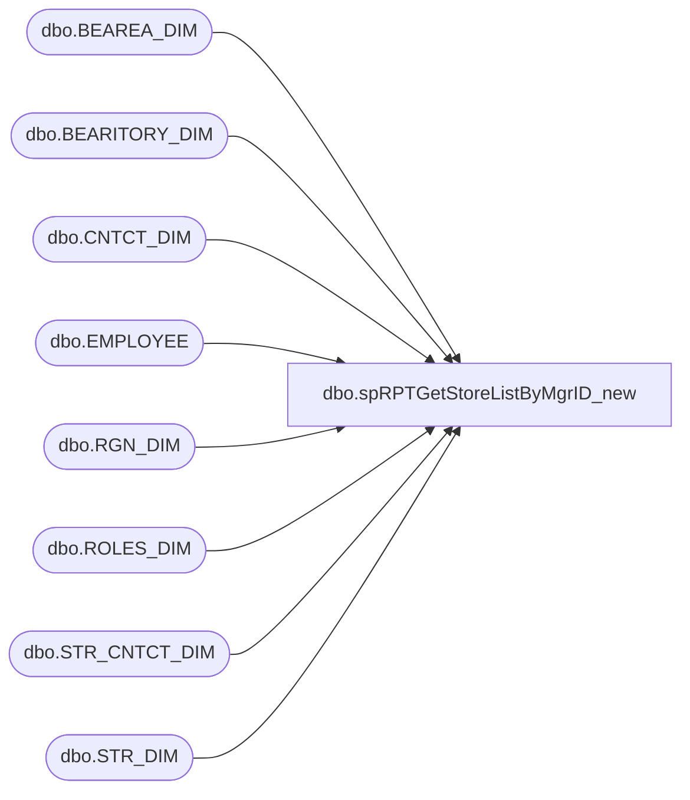

# dbo.spRPTGetStoreListByMgrID_new

**Database:** dw  
**Server:** papamart  

## Architecture Diagram



## Table Dependencies

| Referenced Table |
|---|
| dbo.BEAREA_DIM |
| dbo.BEARITORY_DIM |
| dbo.CNTCT_DIM |
| dbo.EMPLOYEE |
| dbo.RGN_DIM |
| dbo.ROLES_DIM |
| dbo.STR_CNTCT_DIM |
| dbo.STR_DIM |

## Stored Procedure Code

```sql
CREATE proc [dbo].[spRPTGetStoreListByMgrID_new]
	@ManagerUserName VARCHAR(100)

as 

--------------------------------------------------------------------------------------------------------------------------------------------------
-- Dan Tweedie -- 2018-08-10	-	Created proc to use for resume report - same as spRPTGetEmployeesByManagerID but outputs distinct store list
--------------------------------------------------------------------------------------------------------------------------------------------------

set nocount on


BEGIN
	
	SET NOCOUNT ON;
	DECLARE @ManagerEmail VARCHAR(100)
	SET @ManagerEmail = @ManagerUserName + '@buildabear.com'
	
	-- determine role and use different query to get responsible employees
	DECLARE @UseCaseName VARCHAR(100)
	DECLARE @EmpCntctID INT
	SELECT 
		@EmpCntctID = empM.CNTCT_ID
		, @UseCaseName = CASE
							WHEN rd.LWSN_CD IN ('CWM')
								THEN 'StoreManager'
							WHEN rd.LWSN_CD IN ('DIR BL')
								THEN 'BearitoryLeader'
							WHEN rd.LWSN_CD IN ('MNGNG DIR') OR rd.LWSN_CD IN ('DIR')
								THEN 'RegionalManagingDirector'
							WHEN rd.LWSN_CD IN ('SR MGR-BQ')
								THEN 'SrBQHrMgr'
							WHEN rd.LWSN_CD IN ('MGR-BQ')
								THEN 'BRHSMgr'
							ELSE 'Unknown'
						END
	FROM kodiak.babwmstrdata.dbo.CNTCT_DIM empM WITH(NOLOCK)
		INNER JOIN kodiak.babwmstrdata.dbo.ROLES_DIM rd WITH(NOLOCK)
			ON empM.ROLE_ID = rd.ROLE_ID
	WHERE empM.EMAIL = @ManagerEmail
	
	IF @ManagerUserName IN ('BenB', 'heatherv', 'KatieW', 'pattiy', 'brianb', 'dant','johne') BEGIN
		SET @UseCaseName = 'SiteAdministrator'
	END
	
	-- exclude Bear Builders
	DECLARE @RoleIDToExclude INT
	SELECT @RoleIDToExclude = rd.ROLE_ID
	FROM kodiak.babwmstrdata.dbo.ROLES_DIM rd WITH(NOLOCK)
	WHERE rd.LWSN_CD = 'BB' 

	-- only select employees who are not terminated by 9/1 of that year
	DECLARE @CutOffDate DATETIME
	--SET @CutOffDate = CAST('9/30/' + CAST(YEAR(GETDATE()) AS VARCHAR(4)) AS DATETIME)
	SET @CutOffDate = CAST('9/1/' + CAST(YEAR(GETDATE()) AS VARCHAR(4)) AS DATETIME)
	
	IF (@UseCaseName = 'StoreManager')
	BEGIN 
		SELECT distinct CAST(st.STR_NUM AS VARCHAR(10)) AS StoreNumber
		FROM kodiak.babwmstrdata.dbo.CNTCT_DIM empM WITH(NOLOCK)
			INNER JOIN kodiak.babwmstrdata.dbo.STR_CNTCT_DIM xrEmpMStr WITH(NOLOCK)
				ON xrEmpMStr.CNTCT_ID = empM.CNTCT_ID
			INNER JOIN kodiak.babwmstrdata.dbo.STR_CNTCT_DIM xrEmpStr WITH(NOLOCK)
				ON xrEmpMStr.STR_ID =  xrEmpStr.STR_ID
			INNER JOIN kodiak.babwmstrdata.dbo.STR_DIM st WITH(NOLOCK)
				ON st.STR_ID =  xrEmpStr.STR_ID
			INNER JOIN kodiak.babwmstrdata.dbo.CNTCT_DIM empW WITH(NOLOCK)
				ON xrEmpStr.CNTCT_ID = empW.CNTCT_ID
			LEFT OUTER JOIN kodiak.babwmstrdata.dbo.RGN_DIM rd WITH(NOLOCK)
				ON st.RGN_ID = rd.RGN_ID
			LEFT OUTER JOIN kodiak.babwmstrdata.dbo.CNTCT_DIM empRM WITH(NOLOCK)
				ON rd.CNTCT_ID = empRM.CNTCT_ID
			LEFT OUTER JOIN kodiak.babwmstrdata.dbo.BEARITORY_DIM BD WITH(NOLOCK)
				ON st.BEARITORY_ID =  bd.BEARITORY_ID
			LEFT OUTER JOIN kodiak.babwmstrdata.dbo.CNTCT_DIM empBL WITH(NOLOCK)
				ON BD.CNTCT_ID = empBL.CNTCT_ID
			LEFT JOIN  LAWSONSQLCLSTR1.PROD90.dbo.EMPLOYEE empLawson 
				ON empw.LWSN_CD = empLawson.EMPLOYEE
			LEFT OUTER JOIN kodiak.babwmstrdata.dbo.BEAREA_DIM bd1 
				ON ST.BEAREA_ID = bd1.BEAREA_ID
			LEFT OUTER JOIN kodiak.babwmstrdata.dbo.CNTCT_DIM empBM1 WITH(NOLOCK)
				ON BD1.CNTCT_ID = empBM1.CNTCT_ID
		WHERE empM.CNTCT_ID = @EmpCntctID
			--AND empW.ROLE_ID <> @RoleIDToExclude
			AND empW.END_DATE >= @CutOffDate
			AND empW.CRTED_ON <= @CutOffDate
	END
	ELSE IF (@UseCaseName = 'BearitoryLeader')
	BEGIN
		SELECT distinct CAST(st.STR_NUM AS VARCHAR(10)) AS StoreNumber
		FROM kodiak.babwmstrdata.dbo.CNTCT_DIM empM WITH(NOLOCK)
			INNER JOIN kodiak.babwmstrdata.dbo.BEARITORY_DIM BD WITH(NOLOCK)
				ON BD.CNTCT_ID = empM.CNTCT_ID
			INNER JOIN kodiak.babwmstrdata.dbo.STR_DIM st WITH(NOLOCK)
				ON st.BEARITORY_ID =  bd.BEARITORY_ID
			INNER JOIN kodiak.babwmstrdata.dbo.STR_CNTCT_DIM xrEmpStr WITH(NOLOCK)
				ON st.STR_ID =  xrEmpStr.STR_ID
			INNER JOIN kodiak.babwmstrdata.dbo.CNTCT_DIM empW WITH(NOLOCK)
				ON xrEmpStr.CNTCT_ID = empW.CNTCT_ID
			LEFT OUTER JOIN kodiak.babwmstrdata.dbo.RGN_DIM rd WITH(NOLOCK)
				ON st.RGN_ID = rd.RGN_ID
			LEFT OUTER JOIN kodiak.babwmstrdata.dbo.CNTCT_DIM empRM WITH(NOLOCK)
				ON rd.CNTCT_ID = empRM.CNTCT_ID
			LEFT JOIN  LAWSONSQLCLSTR1.PROD90.dbo.EMPLOYEE empLawson 
				ON empw.LWSN_CD = empLawson.EMPLOYEE
			LEFT OUTER JOIN kodiak.babwmstrdata.dbo.BEAREA_DIM bd1 
				ON ST.BEAREA_ID = bd1.BEAREA_ID
			LEFT OUTER JOIN kodiak.babwmstrdata.dbo.CNTCT_DIM empBM1 WITH(NOLOCK)
				ON BD1.CNTCT_ID = empBM1.CNTCT_ID
		WHERE empM.CNTCT_ID = @EmpCntctID
			--AND empW.ROLE_ID <> @RoleIDToExclude
			AND empW.END_DATE >= @CutOffDate
			AND empW.CRTED_ON <= @CutOffDate
	END
	ELSE IF (@UseCaseName = 'RegionalManagingDirector')
	BEGIN
		SELECT distinct CAST(st.STR_NUM AS VARCHAR(10)) AS StoreNumber
		FROM kodiak.babwmstrdata.dbo.CNTCT_DIM empM WITH(NOLOCK)
			INNER JOIN kodiak.babwmstrdata.dbo.RGN_DIM rd WITH(NOLOCK)
				ON rd.CNTCT_ID = empM.CNTCT_ID
			INNER JOIN kodiak.babwmstrdata.dbo.STR_DIM stores WITH(NOLOCK)
				ON stores.RGN_ID = rd.RGN_ID
			INNER JOIN kodiak.babwmstrdata.dbo.STR_CNTCT_DIM xrEmpStr WITH(NOLOCK)
				ON stores.STR_ID =  xrEmpStr.STR_ID
			INNER JOIN kodiak.babwmstrdata.dbo.STR_DIM st WITH(NOLOCK)
				ON st.STR_ID =  xrEmpStr.STR_ID
			INNER JOIN kodiak.babwmstrdata.dbo.CNTCT_DIM empW WITH(NOLOCK)
				ON xrEmpStr.CNTCT_ID = empW.CNTCT_ID
			LEFT OUTER JOIN kodiak.babwmstrdata.dbo.BEARITORY_DIM BD WITH(NOLOCK)
				ON st.BEARITORY_ID =  bd.BEARITORY_ID
			LEFT OUTER JOIN kodiak.babwmstrdata.dbo.CNTCT_DIM empBL WITH(NOLOCK)
				ON BD.CNTCT_ID = empBL.CNTCT_ID
			LEFT JOIN  LAWSONSQLCLSTR1.PROD90.dbo.EMPLOYEE empLawson 
				ON empw.LWSN_CD = empLawson.EMPLOYEE
			LEFT OUTER JOIN kodiak.babwmstrdata.dbo.BEAREA_DIM bd1 
				ON ST.BEAREA_ID = bd1.BEAREA_ID
			LEFT OUTER JOIN kodiak.babwmstrdata.dbo.CNTCT_DIM empBM1 WITH(NOLOCK)
				ON BD1.CNTCT_ID = empBM1.CNTCT_ID
		WHERE empM.CNTCT_ID = @EmpCntctID
			--AND empW.ROLE_ID <> @RoleIDToExclude
			AND empW.END_DATE >= @CutOffDate
			AND empW.CRTED_ON <= @CutOffDate
	END
	ELSE IF (@UseCaseName = 'SrBQHrMgr')
	BEGIN
		SELECT distinct empW.PROCESS_LEVEL AS StoreNumber
		FROM LAWSONSQLCLSTR1.PROD90.dbo.EMPLOYEE empW WITH(NOLOCK)
		WHERE empW.PROCESS_LEVEL IN ('BQ', 'BRHS')
			AND empW.DATE_HIRED <= @CutOffDate
			AND (empW.TERM_DATE >= @CutOffDate OR empW.TERM_DATE = '1753-01-01') -- LAWSON's NULL date
	END
	ELSE IF (@UseCaseName = 'BRHSMgr')
	BEGIN
		SELECT distinct empW.PROCESS_LEVEL AS StoreNumber
		FROM LAWSONSQLCLSTR1.PROD90.dbo.EMPLOYEE empW WITH(NOLOCK)
		WHERE empW.PROCESS_LEVEL IN ('BRHS')
			AND empW.DATE_HIRED <= @CutOffDate
			AND (empW.TERM_DATE >= @CutOffDate OR empW.TERM_DATE = '1753-01-01') -- LAWSON's NULL date
	END
	ELSE IF (@UseCaseName = 'SiteAdministrator')
	BEGIN
		SELECT distinct CAST(st.STR_NUM AS VARCHAR(10)) AS StoreNumber
		FROM kodiak.babwmstrdata.dbo.CNTCT_DIM empW WITH(NOLOCK)
			INNER JOIN kodiak.babwmstrdata.dbo.STR_CNTCT_DIM xrEmpStr WITH(NOLOCK)
				ON xrEmpStr.CNTCT_ID = empW.CNTCT_ID
			INNER JOIN kodiak.babwmstrdata.dbo.STR_DIM st WITH(NOLOCK)
				ON st.STR_ID =  xrEmpStr.STR_ID
			LEFT OUTER JOIN kodiak.babwmstrdata.dbo.RGN_DIM rd WITH(NOLOCK)
				ON st.RGN_ID = rd.RGN_ID
			LEFT OUTER JOIN kodiak.babwmstrdata.dbo.CNTCT_DIM empRM WITH(NOLOCK)
				ON rd.CNTCT_ID = empRM.CNTCT_ID
			LEFT OUTER JOIN kodiak.babwmstrdata.dbo.BEARITORY_DIM BD WITH(NOLOCK)
				ON st.BEARITORY_ID =  bd.BEARITORY_ID
			LEFT OUTER JOIN kodiak.babwmstrdata.dbo.CNTCT_DIM empBL WITH(NOLOCK)
				ON BD.CNTCT_ID = empBL.CNTCT_ID
			LEFT JOIN  LAWSONSQLCLSTR1.PROD90.dbo.EMPLOYEE empLawson 
				ON empw.LWSN_CD = empLawson.EMPLOYEE
			LEFT OUTER JOIN kodiak.babwmstrdata.dbo.BEAREA_DIM bd1 
				ON ST.BEAREA_ID = bd1.BEAREA_ID
			LEFT OUTER JOIN kodiak.babwmstrdata.dbo.CNTCT_DIM empBM1 WITH(NOLOCK)
				ON BD1.CNTCT_ID = empBM1.CNTCT_ID
		WHERE 1=1
			--and empW.ROLE_ID <> 2 --DanT 2018-05-08
			and EMP_STATUS not in ('A4', 'A8', 'A2') --full time BQ Employee, Fulltime BH, Store Mgrs?? --DanT 2018-05-08
			AND empW.END_DATE >= @CutOffDate
			AND empW.CRTED_ON <= @CutOffDate
			AND st.STR_OPEN_DT IS NOT NULL
			AND st.CNTRY_ID IN (1, 2, 3)
			AND CAST(empW.LWSN_CD AS INT) > 0
		UNION
		SELECT
			distinct empW.PROCESS_LEVEL AS StoreNumber
		FROM LAWSONSQLCLSTR1.PROD90.dbo.EMPLOYEE empW WITH(NOLOCK)
		WHERE empW.PROCESS_LEVEL IN ('BQ', 'BRHS')
			AND empW.DATE_HIRED <= @CutOffDate
			AND (empW.TERM_DATE >= @CutOffDate OR empW.TERM_DATE = '1753-01-01') -- LAWSON's NULL date
			and emp_status not in ('A4', 'A8', 'A2') --full time BQ Employee, Fulltime BH, Store Mgrs?? --DanT 2018-05-08
	END
	ELSE 
	BEGIN
		SELECT  '?' AS StoreNumber
			
	END

END
```

