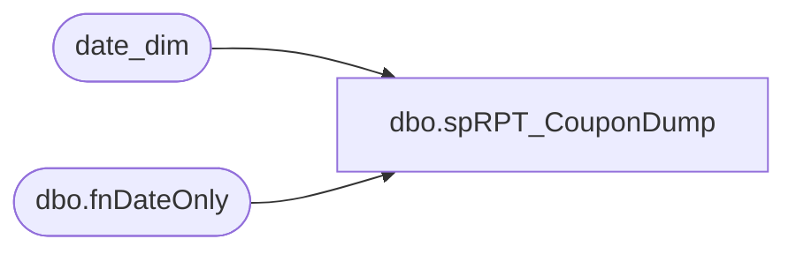

# dbo.spRPT_CouponDump

**Database:** dw  
**Server:** papamart  

## Architecture Diagram



## Table Dependencies

| Referenced Table |
|---|
| date_dim |
| dbo.fnDateOnly |

## Stored Procedure Code

```sql
-- =====================================================================================================
-- Name: spRPT_CouponDump
--
-- Description:	Generates the Data Subscription for the Coupon Dump Report
--
-- Input: None
--
-- Output: Resultset 
--			
--
-- Dependencies: None
--
-- Revision History
--		Name:			Date:			Comments:
--		Gary Murrish	2/16/2015		Added DK to Europe
--		Gary Murrish	1/5/2015		Changed LY to be 52 weeks prior
--		Gary Murrish	9/17/2014		Added Brian Popp to the distribution
--		Gary Murrish	2/14/2014		Removed MarkG and added SantiagoB to the distribution.
--		Gary Murrish	4/26/2013		Removed ChadV from the distribution and changed the dates
--										and reports to be generated per Mark Geldmacher
--		Gary Murrish	4/24/2013		Added Jack McCormick to the distribution
--		Gary Murrish	7/13/2012		Initial Release

--      Kevin Shyr      6/6/2014        change email from garymu to BIAdmin
--		Dan Tweedie		02/08/2016		Changed @ToAddresses to FinancialAnalyst@buildabear.com
--      John Eck		2/8/2018        Broke out China 
-- =====================================================================================================
CREATE PROCEDURE [dbo].[spRPT_CouponDump]
AS
BEGIN
	SET NOCOUNT ON;
	-- Get last Saturday's Date
	DECLARE @today datetime
	SET @today = GETDATE()
	DECLARE @lastSaturday datetime
	DECLARE @priorSunday datetime
	DECLARE @lastSaturdayPY datetime -- Prior Year Saturday
	DECLARE @priorSundayPY datetime -- Prior Year Sunday
	DECLARE @startOfMonth datetime
	DECLARE @startOfMonthPY datetime
	DECLARE @thisFiscalYear int
	DECLARE @thisFiscalPeriod int

	DECLARE @ToAddresses AS varchar(MAX)
	DECLARE @CCAddresses AS varchar(MAX)
	SET @ToAddresses = 'johne@buildabear.com'
	SET @CCAddresses = 'johne@buildabear.com'
	--SET @ToAddresses = 'FinancialAnalyst@buildabear.com'
	--SET @CCAddresses = 'BIAdmin@buildabear.com'
	

	SELECT
		@lastSaturday = actual_date,
		@thisFiscalYear = dd.fiscal_year,
		@thisFiscalPeriod = dd.fiscal_period
	FROM
		date_dim dd WITH (NOLOCK)
	WHERE
		actual_date BETWEEN dbo.fnDateOnly(DATEADD(DAY, -6, @today)) AND dbo.fnDateOnly(@today)
		AND day_of_week = 7

	SET @priorSunday = DATEADD(DAY, -6, @lastSaturday)

	SET @lastSaturdayPY = (SELECT
			ly.actual_date
		FROM
			date_dim ly WITH (NOLOCK)
			INNER JOIN (SELECT
					week_id - 52 AS lyWeek_ID,
					day_of_week
				FROM
					date_dim dd WITH (NOLOCK)
				WHERE
					actual_date = @lastSaturday)
			ty
				ON ly.week_id = ty.lyWeek_ID
				AND ly.day_of_week = ty.day_of_week)

	SET @priorSundayPY = (SELECT
			ly.actual_date
		FROM
			date_dim ly WITH (NOLOCK)
			INNER JOIN (SELECT
					week_id - 52 AS lyWeek_ID,
					day_of_week
				FROM
					date_dim dd WITH (NOLOCK)
				WHERE
					actual_date = @priorSunday)
			ty
				ON ly.week_id = ty.lyWeek_ID
				AND ly.day_of_week = ty.day_of_week)

	-- Get Start of Month
	SET @startOfMonth = (SELECT
			MIN(actual_date)
		FROM
			date_dim dd WITH (NOLOCK)
		WHERE
			dd.fiscal_year = @thisFiscalYear
			AND dd.fiscal_period = @thisFiscalPeriod)

	-- Get Start of Month for the Prior Year
	SET @startOfMonthPY = (SELECT
			ly.actual_date
		FROM
			date_dim ly WITH (NOLOCK)
			INNER JOIN (SELECT
					week_id - 52 AS lyWeek_ID,
					day_of_week
				FROM
					date_dim dd WITH (NOLOCK)
				WHERE
					actual_date = @startOfMonth)
			ty
				ON ly.week_id = ty.lyWeek_ID
				AND ly.day_of_week = ty.day_of_week)

	-- Generate the requests for This Year and Last Year
	SELECT
		@ToAddresses AS ToAddresses,
		@CCAddresses AS CCAddresses,
		@priorSunday AS StartDate,
		@lastSaturday AS EndDate,
		'US,CA' AS Country,
		'Coupon Dump North America Week TY ' + CONVERT(varchar(10), @lastSaturday, 120) AS Title
	UNION ALL
	SELECT
		@ToAddresses AS ToAddresses,
		@CCAddresses AS CCAddresses,
		@priorSundayPY AS StartDate,
		@lastSaturdayPY AS EndDate,
		'US,CA' AS Country,
		'Coupon Dump North America Week PY ' + CONVERT(varchar(10), @lastSaturday, 120) AS Title
	UNION ALL
	SELECT
		@ToAddresses AS ToAddresses,
		@CCAddresses AS CCAddresses,
		@startOfMonth AS StartDate,
		@lastSaturday AS EndDate,
		'US,CA' AS Country,
		'Coupon Dump North America MTD TY ' + CONVERT(varchar(10), @lastSaturday, 120) AS Title
	UNION ALL
	SELECT
		@ToAddresses AS ToAddresses,
		@CCAddresses AS CCAddresses,
		@startOfMonthPY AS StartDate,
		@lastSaturdayPY AS EndDate,
		'US,CA' AS Country,
		'Coupon Dump North America MTD PY ' + CONVERT(varchar(10), @lastSaturday, 120) AS Title
	UNION ALL
	SELECT
		@ToAddresses AS ToAddresses,
		@CCAddresses AS CCAddresses,
		@priorSunday AS StartDate,
		@lastSaturday AS EndDate,
		'UK,IE' AS Country,
		--'UK,IE,DK,CN' AS Country,
		'Coupon Dump Europe Week TY ' + CONVERT(varchar(10), @lastSaturday, 120) AS Title
	UNION ALL
	SELECT
		@ToAddresses AS ToAddresses,
		@CCAddresses AS CCAddresses,
		@priorSundayPY AS StartDate,
		@lastSaturdayPY AS EndDate,
		'UK,IE' AS Country,
		'Coupon Dump Europe Week PY ' + CONVERT(varchar(10), @lastSaturday, 120) AS Title
	UNION ALL
	SELECT
		@ToAddresses AS ToAddresses,
		@CCAddresses AS CCAddresses,
		@startOfMonth AS StartDate,
		@lastSaturday AS EndDate,
		'UK,IE' AS Country,
		'Coupon Dump Europe MTD TY ' + CONVERT(varchar(10), @lastSaturday, 120) AS Title
	UNION ALL
	SELECT
		@ToAddresses AS ToAddresses,
		@CCAddresses AS CCAddresses,
		@startOfMonthPY AS StartDate,
		@lastSaturdayPY AS EndDate,
		'UK,IE' AS Country,
		'Coupon Dump Europe MTD PY ' + CONVERT(varchar(10), @lastSaturday, 120) AS Title

	UNION ALL
	SELECT
		@ToAddresses AS ToAddresses,
		@CCAddresses AS CCAddresses,
		@priorSunday AS StartDate,
		@lastSaturday AS EndDate,
		'DK' AS Country,
		'Coupon Dump Denmark Week TY ' + CONVERT(varchar(10), @lastSaturday, 120) AS Title
	UNION ALL
	SELECT
		@ToAddresses AS ToAddresses,
		@CCAddresses AS CCAddresses,
		@priorSundayPY AS StartDate,
		@lastSaturdayPY AS EndDate,
		'DK' AS Country,
		'Coupon Dump Denmark Week PY ' + CONVERT(varchar(10), @lastSaturday, 120) AS Title
	UNION ALL
	SELECT
		@ToAddresses AS ToAddresses,
		@CCAddresses AS CCAddresses,
		@startOfMonth AS StartDate,
		@lastSaturday AS EndDate,
		'DK' AS Country,
		'Coupon Dump Denmark MTD TY ' + CONVERT(varchar(10), @lastSaturday, 120) AS Title
	UNION ALL
	SELECT
		@ToAddresses AS ToAddresses,
		@CCAddresses AS CCAddresses,
		@startOfMonthPY AS StartDate,
		@lastSaturdayPY AS EndDate,
		'DK' AS Country,
		'Coupon Dump Denmark MTD PY ' + CONVERT(varchar(10), @lastSaturday, 120) AS Title

	UNION ALL
	SELECT
		@ToAddresses AS ToAddresses,
		@CCAddresses AS CCAddresses,
		@priorSunday AS StartDate,
		@lastSaturday AS EndDate,
		'CN' AS Country,
		'Coupon Dump China Week TY ' + CONVERT(varchar(10), @lastSaturday, 120) AS Title
	UNION ALL
	SELECT
		@ToAddresses AS ToAddresses,
		@CCAddresses AS CCAddresses,
		@priorSundayPY AS StartDate,
		@lastSaturdayPY AS EndDate,
		'CN' AS Country,
		'Coupon Dump China Week PY ' + CONVERT(varchar(10), @lastSaturday, 120) AS Title
	UNION ALL
	SELECT
		@ToAddresses AS ToAddresses,
		@CCAddresses AS CCAddresses,
		@startOfMonth AS StartDate,
		@lastSaturday AS EndDate,
		'CN' AS Country,
		'Coupon Dump China MTD TY ' + CONVERT(varchar(10), @lastSaturday, 120) AS Title
	UNION ALL
	SELECT
		@ToAddresses AS ToAddresses,
		@CCAddresses AS CCAddresses,
		@startOfMonthPY AS StartDate,
		@lastSaturdayPY AS EndDate,
		'CN' AS Country,
		'Coupon Dump China MTD PY ' + CONVERT(varchar(10), @lastSaturday, 120) AS Title

END
```

