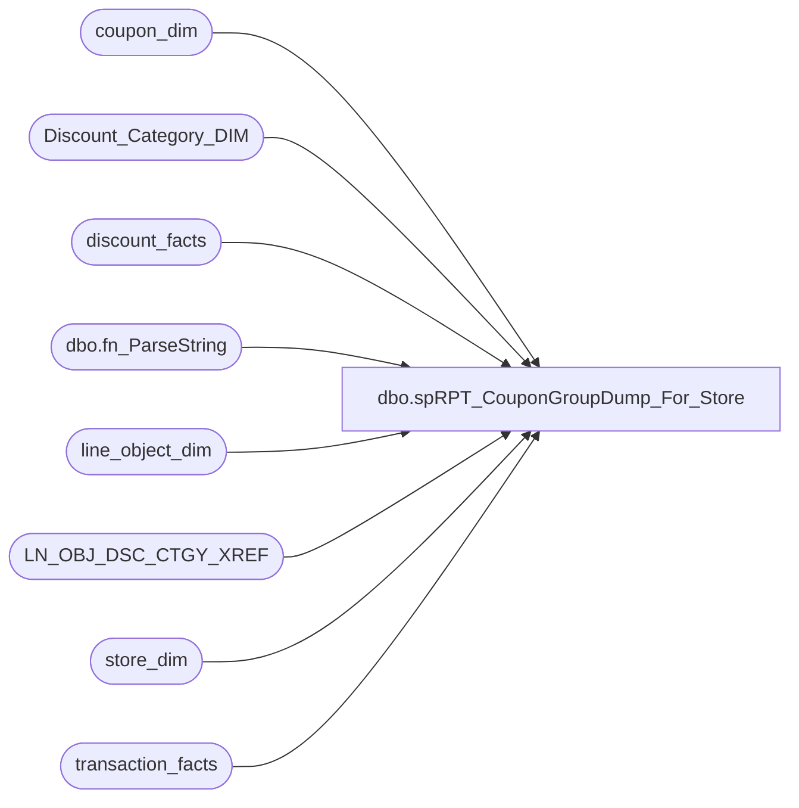

# dbo.spRPT_CouponGroupDump_For_Store

**Database:** dw  
**Server:** papamart  

## Architecture Diagram



## Table Dependencies

| Referenced Table |
|---|
| coupon_dim |
| Discount_Category_DIM |
| discount_facts |
| dbo.fn_ParseString |
| line_object_dim |
| LN_OBJ_DSC_CTGY_XREF |
| store_dim |
| transaction_facts |

## Stored Procedure Code

```sql
-- =====================================================================================================
-- Name: spRPT_CouponGroupDump_For_Store
--
-- Description:	Generates the Data for the Coupon Group Dump Report
--
-- Input: startDate_key = Starting Date Key
--			endDate_key	= Ending Date Key
--			Stores	= Comma delimited list of Store #s to extract
--
-- Output: Resultset 
--			
--
-- Dependencies: None
--
-- Revision History
--		Name:			Date:			Comments:
--		Gary Murrish	11/7/2013		Initial Release
--		Gary Murrish	2/3/2014		Changed the category to be the 'most used' category for the coupon
--		Gary Murrish	9/15/2014		Omit referenence number for SFS Certs (640)
--		Gary Murrish	12/11/2014		Changed the reference number for the 'Invalid Coupons' that are not
--										going to the G/L
--	  Dan Tweedie	11/21/2016			Altered final output SQL to correct issue causing inflated returns from transaction_facts due to the joins to #CouponSummary
-- =====================================================================================================
CREATE PROCEDURE [dbo].[spRPT_CouponGroupDump_For_Store]
	@startDate_key int,
	@endDate_key int,
	@StoreIDs varchar(255)

AS

select 
	@startDate_key = 6924,
	@endDate_key  = 6930,
	@StoreIDs = '0001'

BEGIN
	SET NOCOUNT ON;

	-- Parse the StoreIDs
	IF OBJECT_ID('tempdb..#tmpStoreIDs') IS NOT NULL
	BEGIN
		DROP TABLE #tmpStoreIDs
	END

	SELECT
		ParsedItem AS storeID
	INTO #tmpStoreIDs
	FROM
		dbo.fn_ParseString(@StoreIDs, ',')

	-- Get all of the stores for those countries
	IF OBJECT_ID('tempdb..#tmpStores') IS NOT NULL
	BEGIN
		DROP TABLE #tmpStores
	END

	SELECT
		sd.store_key
	INTO #tmpStores
	FROM
		store_dim sd WITH (NOLOCK)
		INNER JOIN #tmpStoreIDs si WITH (NOLOCK)
			ON si.StoreID = sd.store_id

	IF OBJECT_ID('tempdb..#CouponSummary') IS NOT NULL
	BEGIN
		DROP TABLE #couponSummary
	END

	SELECT
		x.transaction_id,
		x.category,
		x.coupon_key,
		x.reference_no,
		SUM(x.[Total Discount]) AS [Total Discount],
		SUM(x.[Discount Units]) AS [Discount Units]
	INTO #couponSummary
	FROM
		(SELECT
				dfint.transaction_id,
				CASE
					WHEN ISNULL(dcd.categoryType, '') = 'Up Sell' THEN 'Upsell Discount'
					WHEN ISNULL(dcd.categoryType, '') = 'Employee' THEN 'Employee Discount'
					WHEN ISNULL(dcd.channelType, '') = 'Party' THEN 'Party'
					WHEN ISNULL(dcd.categoryType, '') = 'Cub Cash' THEN 'Cub Cash'
					WHEN ISNULL(dcd.financialGroup, '') = 'Marketing' THEN 'Coupon'
					WHEN ISNULL(dcd.financialGroup, '') = 'Distro' THEN 'Promo'
					ELSE ISNULL(x.CTGY_NM, 'Unknown ' + CAST(lod.Line_Object AS varchar))
				END AS Category,
				dfint.coupon_key,
				CASE
					WHEN lod.Line_Object = 640 THEN CAST('SFS Certs' AS varchar(20))	-- Do not use reference for SFS Certs
					WHEN cd.Retail_Pro IS NULL OR
					cd.Retail_Pro <= 0 THEN CASE
						WHEN cd.categoryTypeID < 0 AND LEN(dfint.reference_no) > 0 THEN lod.Line_Object_Description
						ELSE CASE
							WHEN LEN(dfint.reference_no) > 7 THEN LEFT(dfint.reference_no, 7) + '.'
							ELSE dfint.reference_no
						END
					END
					ELSE CAST(cd.Retail_Pro AS varchar)
				END AS reference_no,
				dfint.unit_gross_amount * -1 AS [Total Discount],
				dfint.units AS [Discount Units]
			FROM
				discount_facts AS dfint WITH (NOLOCK)
				INNER JOIN line_object_dim AS lod WITH (NOLOCK)
					ON lod.Line_Object_Key = dfint.Line_Object_Key
				INNER JOIN #tmpStores s WITH (NOLOCK)
					ON dfint.store_key = s.store_key
				LEFT JOIN coupon_dim cd WITH (NOLOCK)
					ON dfint.coupon_key = cd.coupon_key
				LEFT JOIN LN_OBJ_DSC_CTGY_XREF AS x WITH (NOLOCK)
					ON x.LN_OBJ_KEY = lod.Line_Object_Key
				LEFT JOIN Discount_Category_DIM dcd WITH (NOLOCK)
					ON dfint.categoryTypeID = dcd.categoryTypeID
			WHERE
				(dfint.date_key BETWEEN @StartDate_Key AND @EndDate_Key)) x

	GROUP BY	x.transaction_id,
				x.category,
				x.coupon_key,
				x.reference_no

	-- Obtain the most popular Category for each coupon
	--	It will be ranked as 1

	IF OBJECT_ID('tempdb..#Ranked') IS NOT NULL
	BEGIN
		DROP TABLE #Ranked
	END

	SELECT
		r.reference_no,
		r.category,
		RANK() OVER (PARTITION BY r.reference_no ORDER BY CASE
			WHEN category = 'Coupon' THEN r.numRecs + 1
			ELSE r.numRecs
		END DESC) AS rank
	INTO #Ranked
	FROM
		(SELECT
				s.reference_no,
				s.category,
				COUNT(*) AS numRecs
			FROM
				#couponSummary s
			WHERE
				s.reference_no > ''
			GROUP BY	s.reference_no,
						s.category) r

	---NEW OUTPUT CODE 11/21/2016 - DAN TWEEDIE

		;with Details as
			(
				SELECT
					ISNULL(r.Category, cs.Category) AS Category,
					cs.transaction_id,
					cs.reference_no AS [Coupon Ref Num],
					MIN(ISNULL(cd.coupon_desc,'')) AS [Coupon Description],
					MIN(ISNULL(cd.start_date,'1/1/1900')) AS [Coupon Start Date],
					MIN(isnull(cd.stop_date,'1/1/1900')) AS [Coupon Stop Date],
					MIN(isnull(cd.qty_distributed,0)) AS [Coupon Qty Distributed],
					tf.GAAP_transaction_flag,
					tf.GAAP_sales_amount,
					tf.unit_discount_amount,
					SUM(cs.[Total Discount]) AS [Total Discount],
					SUM(cs.[Discount Units]) AS [Discount Units]
				from
					#couponSummary cs
				join transaction_facts tf with (nolock) on cs.transaction_id = tf.transaction_id
				left join coupon_dim cd with (nolock) on cs.coupon_key = cd.coupon_key 
				left join #Ranked r on r.reference_no = cs.reference_no AND r.rank = 1
				group by 
					ISNULL(r.Category, cs.Category),
					cs.transaction_id,
					cs.reference_no,
					tf.GAAP_transaction_flag,
					tf.GAAP_sales_amount,
					tf.unit_discount_amount

			)
		select 
			Category,
			[Coupon Ref Num],
			[Coupon Description],
			[Coupon Start Date],
			[Coupon Stop Date],
			[Coupon Qty Distributed],
			sum(GAAP_transaction_flag) as [GAAP Transactions],
			sum(GAAP_sales_amount) as [GAAP Sales] ,
			SUM(unit_discount_amount) AS [Discount UGA],
			sum([Total Discount]) as [Total Discount] ,
			sum([Discount Units]) as [Discount Units]
		from 
			Details
		group by
			Category,
			[Coupon Ref Num],
			[Coupon Description],
			[Coupon Start Date],
			[Coupon Stop Date],
			[Coupon Qty Distributed]
		order by 
			[Coupon Ref Num]

END
	
	
	--NO LONGER USED AS OF 11/21/2016 - DAN TWEEDIE
	--SELECT
	--	ISNULL(r.Category, df.Category) AS Category,
	--	df.reference_no AS [Coupon Ref Num],
	--	MIN(cd.coupon_desc) AS [Coupon Description],
	--	MIN(cd.start_date) AS [Coupon Start Date],
	--	MIN(cd.stop_date) AS [Coupon Stop Date],
	--	MIN(cd.qty_distributed) AS [Coupon Qty Distributed],
	--	SUM(tf.GAAP_transaction_flag) AS [GAAP Transactions],
	--	SUM(tf.GAAP_sales_amount) AS [GAAP Sales],
	--	SUM(tf.unit_discount_amount) AS [Discount UGA],
	--	COUNT(*) AS [No Of Trans],
	--	SUM(df.[Total Discount]) AS [Total Discount],
	--	SUM(df.[Discount Units]) AS [Discount Units]
	--FROM
	--	(SELECT
	--			*
	--		FROM
	--			#couponSummary) AS df
	--	LEFT JOIN coupon_dim AS cd WITH (NOLOCK)
	--		ON cd.coupon_key = df.coupon_key
	--	INNER JOIN Transaction_Facts AS tf WITH (NOLOCK)
	--		ON df.transaction_id = tf.transaction_id
	--	LEFT JOIN #Ranked r WITH (NOLOCK)
	--		ON r.reference_no = df.reference_no
	--		AND r.rank = 1

	--GROUP BY	ISNULL(r.Category, df.Category),
	--			df.reference_no
	--ORDER BY [Coupon Ref Num]

--END
```

