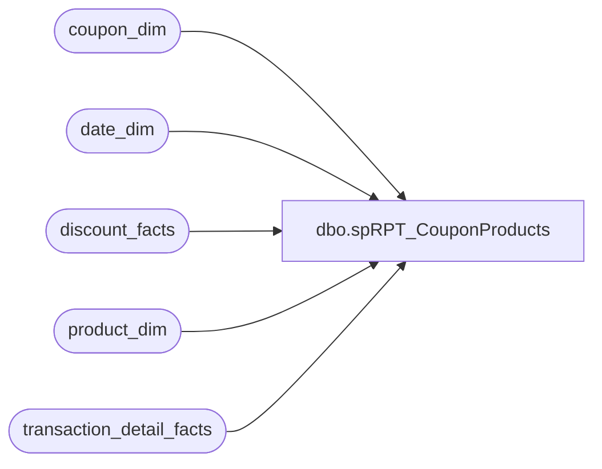

# dbo.spRPT_CouponProducts

**Database:** dw  
**Server:** papamart  

## Architecture Diagram



## Table Dependencies

| Referenced Table |
|---|
| coupon_dim |
| date_dim |
| discount_facts |
| product_dim |
| transaction_detail_facts |

## Stored Procedure Code

```sql
CREATE procedure [dbo].[spRPT_CouponProducts]
@startdate datetime
,@enddate datetime
as
/*
declare @startdate datetime
,@enddate datetime
set @startdate = '2/1/07'
set @enddate = '2/25/07'
*/
select a.fiscal_year, a.fiscal_period, a.fiscal_week, a.Retail_Pro, pd.sku, pd.product_desc, count(distinct tdf.transaction_id) as Transactions, sum(tdf.units) as Units
from transaction_detail_facts tdf
	join (	select cd.Retail_Pro, dd.fiscal_year, dd.fiscal_period, dd.fiscal_week, ds.transaction_id
			from discount_facts ds
				join date_dim dd on ds.date_key = dd.date_key
				join coupon_dim cd on ds.coupon_key = cd.coupon_key
			where dd.actual_date between @startdate and @enddate
				and cd.Retail_Pro >0
			) a on tdf.transaction_id = a.transaction_id
	join date_dim dd on tdf.date_key = dd.date_key
	join product_dim pd on tdf.product_key = pd.product_key and pd.ScorecardCategory = 'Animal'
where dd.actual_date between @startdate and @enddate
group by a.fiscal_year, a.fiscal_period, a.fiscal_week, a.Retail_Pro, pd.sku, pd.product_desc
```

