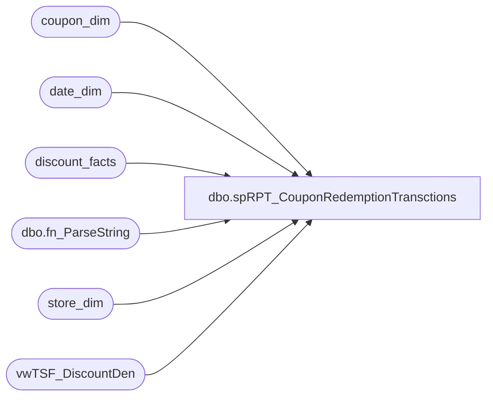

# dbo.spRPT_CouponRedemptionTransctions

**Database:** dw  
**Server:** papamart  

## Architecture Diagram



## Table Dependencies

| Referenced Table |
|---|
| coupon_dim |
| date_dim |
| discount_facts |
| dbo.fn_ParseString |
| store_dim |
| vwTSF_DiscountDen |

## Stored Procedure Code

```sql
-- =====================================================================================================
-- Name: spRPT_CouponRedemptionTransctions
--
-- Description:	Generates a dataset containing the Coupon Redemption Transaction Summary Information
--
-- Input:	fromDate - The starting date of the extract
--			thruDate - the ending date of the extract
--			CouponNumbers - a comma delimited list of the coupon numbers to be extracted
--					I.E. 97257 ,98477
--
-- Output: Resultset 
--			
--
-- Dependencies: None
--
-- Revision History
--		Name:			Date:			Comments:
--		Gary Murrish	3/8/2013		Initial Release
-- =====================================================================================================
CREATE PROCEDURE [dbo].[spRPT_CouponRedemptionTransctions]
	@fromDate AS datetime
	, @thruDate AS datetime
	, @CouponNumbers AS varchar(512)
AS
BEGIN
	SET NOCOUNT ON;

	IF OBJECT_ID('tempdb..#Coupons') IS NOT NULL
	BEGIN
		DROP TABLE #Coupons
	END

	IF OBJECT_ID('tempdb..#discounts') IS NOT NULL
	BEGIN
		DROP TABLE #discounts
	END

	-- Extract the Coupons
	SELECT
		coupon_key,
		cd.Retail_Pro,
		cd.coupon_desc,
		cd.start_date,
		cd.stop_date,
		cd.event_name,
		cd.category
	INTO #Coupons
	FROM
		(SELECT
				LTRIM(RTRIM(ParsedItem)) AS Retail_Pro
			FROM
				dbo.fn_ParseString(@CouponNumbers, ','))
		rqst
		INNER JOIN coupon_dim cd WITH (NOLOCK)
			ON rqst.Retail_Pro = cd.Retail_Pro


	-- Get the date keys
	DECLARE @fromDate_Key AS int
	DECLARE @thruDate_Key AS int
	SELECT
		@fromDate_Key = date_key
	FROM
		date_dim WITH (NOLOCK)
	WHERE
		actual_date = @fromDate
	SELECT
		@thruDate_Key = date_key
	FROM
		date_dim WITH (NOLOCK)
	WHERE
		actual_date = @thruDate

	-- Pull off all of the discounts, discrete (reference_no gives the serialized coupons weight)
	SELECT
		df.transaction_id,
		df.coupon_key,
		df.reference_no,
		SUM(df.unit_gross_amount) * -1 AS discAmount,
		COUNT(*) AS numRecs
	INTO #discounts
	FROM
		discount_facts df WITH (NOLOCK)
		INNER JOIN #Coupons c WITH (NOLOCK)
			ON df.coupon_key = c.coupon_key
	WHERE
		df.date_key BETWEEN @fromDate_Key AND @thruDate_Key
	GROUP BY	df.transaction_id,
				df.coupon_key,
				df.reference_no


	SELECT
		c.Retail_Pro,
		tf.ReceiptTotalWithoutTax,
		tf.GAAP_Sale,
		c.coupon_desc,
		d.transaction_id,
		sd.store_id,
		dd.actual_date,
		COUNT(*) AS numCoupons,
		SUM(d.discAmount) AS discountAmount
	FROM
		#discounts d
		INNER JOIN vwTSF_DiscountDen tf WITH (NOLOCK)
			ON d.transaction_id = tf.transaction_id
		INNER JOIN #Coupons c WITH (NOLOCK)
			ON d.coupon_key = c.coupon_key
		INNER JOIN store_dim sd WITH (NOLOCK)
			ON tf.store_key = sd.store_key
		INNER JOIN date_dim dd WITH (NOLOCK)
			ON tf.date_key = dd.date_key
	GROUP BY	c.Retail_Pro,
				tf.ReceiptTotalWithoutTax,
				tf.GAAP_Sale,
				c.coupon_desc,
				d.transaction_id,
				sd.store_id,
				dd.actual_date
	ORDER BY	c.Retail_Pro,
				tf.ReceiptTotalWithoutTax,
				tf.GAAP_Sale,
				c.coupon_desc,
				d.transaction_id,
				sd.store_id,
				dd.actual_date
END
```

