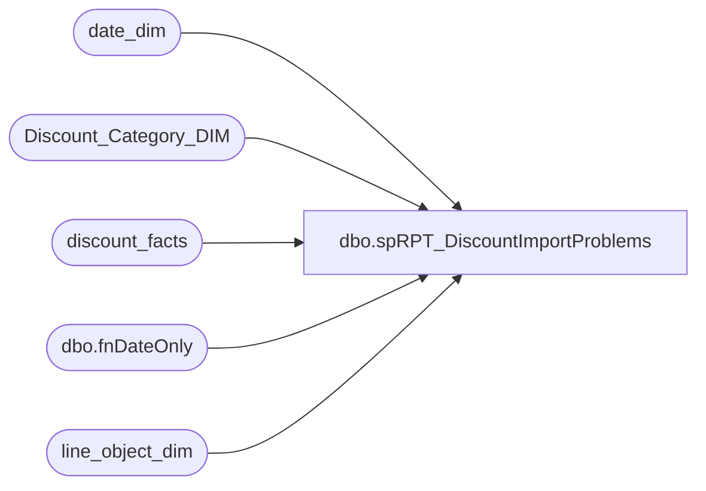

# dbo.spRPT_DiscountImportProblems

**Database:** dw  
**Server:** papamart  

## Architecture Diagram



## Table Dependencies

| Referenced Table |
|---|
| date_dim |
| Discount_Category_DIM |
| discount_facts |
| dbo.fnDateOnly |
| line_object_dim |

## Stored Procedure Code

```sql
-- =====================================================================================================
-- Name: spRPT_DiscountImportProblems
--
-- Description:	Extracts report information for the problems on importing Discount Facts
--					The report is in Discount Manager\Discount Import Problems
--
-- Input: 
--			@daysHorizon = # of Days to go back in time
--			@minProblems = Minimum number OF problems before printing the line
--			@onlyShowInvalids = Only show those problems which were flagged as "Invalid Discounts"
--							after the line object assignment
--
-- Output: Resultset 
--			
--
-- Dependencies: None
--
-- Revision History
--		Name:			Date:			Comments:
--		Gary Murrish	10/14/2013		Changed the Invalid Category Type to be Marketing/Expired because the users changed it
--		Gary Murrish	6/18/2013		Initial Release
-- =====================================================================================================
CREATE PROCEDURE [dbo].[spRPT_DiscountImportProblems]
			@daysHorizon int,
			@minProblems int,
			@onlyShowInvalids bit
AS
BEGIN
	SET NOCOUNT ON;

	DECLARE @minDate_Key int
	SELECT
		@minDate_Key = dd.date_key
	FROM
		date_dim dd WITH (NOLOCK)
	WHERE
		dd.actual_date = DATEADD(D, (-1 * @daysHorizon - 1), dbo.fnDateOnly(GETDATE()))

	-- Get the Invalid Category Type
	DECLARE @InvalidCategoryTypeID int

	SELECT
		@InvalidCategoryTypeID = dcd.categoryTypeID
	FROM
		Discount_Category_DIM dcd WITH (NOLOCK)
	WHERE
		dcd.financialGroup = 'Marketing'
		AND dcd.categoryType = 'Invalid'

	-- Get the discounts which don't match a coupon
	SELECT
		df.reference_no,
		lod.Line_Object,
		lod.Line_Object_Description,
		dcd.channelType,
		dcd.categoryType,
		COUNT(*) AS numDiscounts
	FROM
		discount_facts df WITH (NOLOCK)
		INNER JOIN line_object_dim lod WITH (NOLOCK)
			ON df.line_object_key = lod.line_object_key
		INNER JOIN Discount_Category_DIM dcd WITH (NOLOCK)
			ON df.categoryTypeID = dcd.categoryTypeID
	WHERE
		df.date_key >= @minDate_Key
		AND ISNULL(df.coupon_key,0) = 0
		AND LEN(df.reference_no) > 0
		AND
			CASE
				WHEN @onlyShowInvalids = 1 THEN CASE
					WHEN df.categoryTypeID = @InvalidCategoryTypeID OR df.categoryTypeID = -1 THEN 1
					ELSE 0
				END
				ELSE 1
			END = 1
	GROUP BY	df.reference_no,
				lod.Line_Object,
				lod.Line_Object_Description,
				dcd.channelType,
				dcd.categoryType
	HAVING COUNT(*) >= @minProblems
END
```

