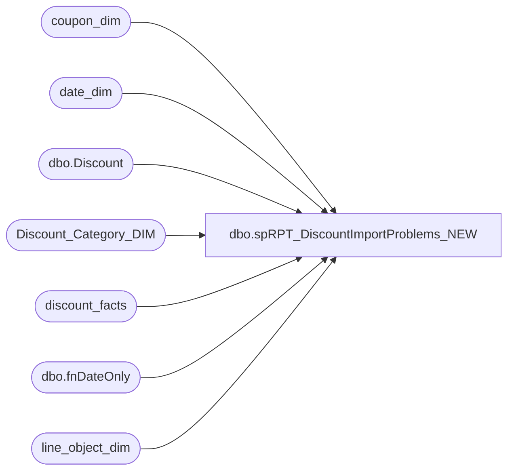

# dbo.spRPT_DiscountImportProblems_NEW

**Database:** dw  
**Server:** papamart  

## Architecture Diagram



## Table Dependencies

| Referenced Table |
|---|
| coupon_dim |
| date_dim |
| dbo.Discount |
| Discount_Category_DIM |
| discount_facts |
| dbo.fnDateOnly |
| line_object_dim |

## Stored Procedure Code

```sql
CREATE PROCEDURE [dbo].[spRPT_DiscountImportProblems_NEW]
	@daysHorizon int,
	@minProblems int,
	@onlyShowInvalids bit
AS
-- =====================================================================================================
-- Name: spRPT_DiscountImportProblems
--
-- Description:	Extracts report information for the problems on importing Discount Facts
--					The report is in Discount Manager\Discount Import Problems
--
-- Input: 
--			@daysHorizon = # of Days to go back in time
--			@minProblems = Minimum number OF problems before printing the line
--			@onlyShowInvalids = Only show those problems which were flagged as "Invalid Discounts"
--							after the line object assignment
--
-- Output: Resultset 
--			
--
-- Dependencies: None
--
-- Revision History
--		Name:			Date:			Comments:
--		Gary Murrish	6/18/2013		Initial Release
--		Gary Murrish	8/19/2013		Added additional diagnostic information
--		Gary Murrish	10/14/2013		Changed the Invalid Category Type to be Marketing/Expired because the users changed it
--		Mike Pelikan	04/29/2014		Changed DiscountMstrData linked server reference-- =====================================================================================================
BEGIN
	SET NOCOUNT ON;

	DECLARE @minDate_Key int
	SELECT
		@minDate_Key = dd.date_key
	FROM
		date_dim dd WITH (NOLOCK)
	WHERE
		dd.actual_date = DATEADD(D, (-1 * @daysHorizon - 1), dbo.fnDateOnly(GETDATE()))

	-- Get the Invalid Category Type
	DECLARE @InvalidCategoryTypeID int

	SELECT
		@InvalidCategoryTypeID = dcd.categoryTypeID
	FROM
		Discount_Category_DIM dcd WITH (NOLOCK)
	WHERE
		dcd.financialGroup = 'Marketing'
		AND dcd.categoryType = 'Invalid'

	-- Get the NA Category Type
	DECLARE @NATypeID int

	SELECT
		@NATypeID = dcd.categoryTypeID
	FROM
		Discount_Category_DIM dcd WITH (NOLOCK)
	WHERE
		dcd.channelType = 'NA'


	-- Get all of the coupons from Discount Manager...
	IF OBJECT_ID('tempdb..#tmpCoupons') IS NOT NULL
	BEGIN
		DROP TABLE #tmpCoupons
	END
	SELECT
		CAST(d.couponNumber AS varchar(20)) AS couponNumber,
		d.startDate,
		d.Title
	INTO #tmpCoupons
	FROM
		KODIAK.DiscountMstrData.dbo.Discount d

	-- Get the discounts which don't match a coupon

	IF OBJECT_ID('tempdb..#tmpInvalids') IS NOT NULL
	BEGIN
		DROP TABLE #tmpInvalids
	END

	SELECT
		x.reference_no,
		x.Line_Object,
		x.Line_Object_Description,
		x.channelType,
		x.categoryType,
		x.coupon_key,
		MIN(x.coupon_desc) AS coupon_desc,
		COUNT(*) AS numDiscounts,
		SUM(x.unit_gross_amount) AS amtDiscounts
	INTO #tmpInvalids
	FROM
		(SELECT
				CAST(LEFT(df.reference_no, 7) + CASE
					WHEN LEN(df.reference_no) > 7 THEN '...'
					ELSE ''
				END AS varchar(20)) AS reference_no,
				lod.Line_Object,
				lod.Line_Object_Description,
				dcd.channelType,
				dcd.categoryType,
				df.unit_gross_amount * -1 AS unit_gross_amount,
				df.coupon_key,
				cd.coupon_desc
			FROM
				discount_facts df WITH (NOLOCK)
				INNER JOIN line_object_dim lod WITH (NOLOCK)
					ON df.line_object_key = lod.line_object_key
				INNER JOIN Discount_Category_DIM dcd WITH (NOLOCK)
					ON df.categoryTypeID = dcd.categoryTypeID
				LEFT JOIN coupon_dim cd WITH (NOLOCK)
					ON df.coupon_key = cd.coupon_key
			WHERE
				df.date_key >= @minDate_Key
				AND df.categoryTypeID <> @NATypeID	-- These are the ones like FTD which are not considered Discounts for DM
				AND df.categoryTypeID <> -1			-- These are the ones before Discount Manager processing
				AND (ISNULL(df.coupon_key, 0) = 0
				OR df.categoryTypeID = @InvalidCategoryTypeID)
				AND LEN(df.reference_no) > 0
				AND
					CASE
						WHEN @onlyShowInvalids = 1 THEN CASE
							WHEN df.categoryTypeID = @InvalidCategoryTypeID THEN 1
							ELSE 0
						END
						ELSE 1
					END = 1) x
	GROUP BY	x.reference_no,
				x.Line_Object,
				x.Line_Object_Description,
				x.channelType,
				x.categoryType,
				x.coupon_key
	HAVING COUNT(*) >= @minProblems


	SELECT
		i.reference_no,
		i.Line_Object,
		i.Line_Object_Description,
		i.channelType,
		i.categoryType,
		i.numDiscounts,
		i.amtDiscounts,
		CASE
			WHEN c.couponNumber IS NOT NULL AND i.coupon_key > 0 THEN 'In DM, Not Approved, was in BAC'
			WHEN c.couponNumber IS NOT NULL THEN 'In DM, Not Approved, not in BAC'
			WHEN i.coupon_key > 0 THEN 'Not setup in DM, was in BAC'
			ELSE 'Truely Invalid'
		END AS reason,
		COALESCE(c.Title, i.Coupon_Desc) AS Coupon_Desc
	FROM
		#tmpInvalids i
		LEFT JOIN #tmpCoupons c WITH (NOLOCK)
			ON 1 = 1
			AND CAST(c.couponNumber AS integer) = CAST(LEFT(i.reference_no, 7) AS integer)

END
```

