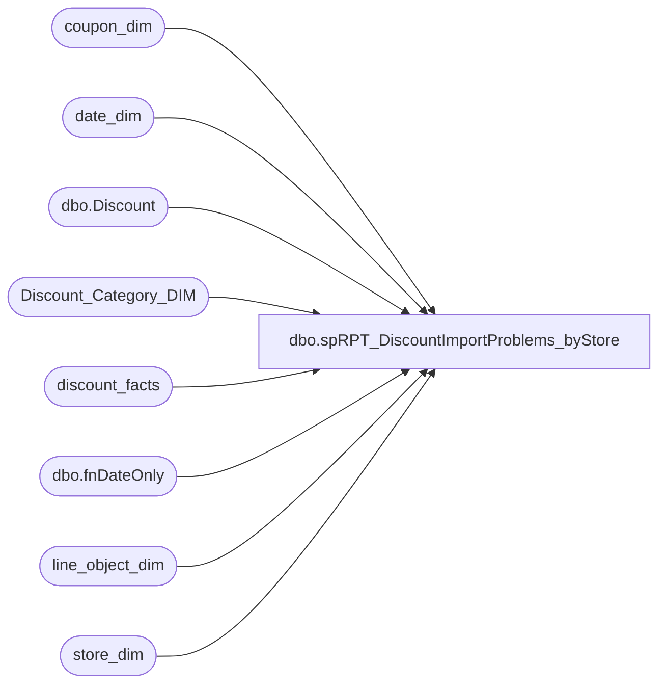

# dbo.spRPT_DiscountImportProblems_byStore

**Database:** dw  
**Server:** papamart  

## Architecture Diagram



## Table Dependencies

| Referenced Table |
|---|
| coupon_dim |
| date_dim |
| dbo.Discount |
| Discount_Category_DIM |
| discount_facts |
| dbo.fnDateOnly |
| line_object_dim |
| store_dim |

## Stored Procedure Code

```sql
CREATE PROCEDURE [dbo].[spRPT_DiscountImportProblems_byStore]
	@startDate datetime,
	@endDate datetime,
	@minProblems int
AS
-- =====================================================================================================
-- Name: spRPT_DiscountImportProblems_byStore
--
-- Description:	Extracts report information for the problems on importing Discount Facts
--					The report is in Discount Manager\Discount Import Problems By Store
--
-- Input: 
--			@startDate = Starting Date of the Analysis
--			@endDate = Ending Date of the Analysis
--			@minProblems = Minimum number OF problems before printing the line
--
-- Output: Resultset 
--			
--
-- Dependencies: None
--
-- Revision History
--		Name:			Date:			Comments:
--		Gary Murrish	10/30/2013		Changed to show all invalid and Expired Coupons regardless of why.
--		Gary Murrish	10/14/2013		Changed the Invalid Category Type to be Marketing/Expired because the users changed it
--		Gary Murrish	8/21/2013		Initial Release
--		Mike Pelikan	04/29/2014		Changed DiscountMstrData linked server reference
-- =====================================================================================================

BEGIN
	SET NOCOUNT ON;

	DECLARE	@startDate_Key int,
			@endDate_Key int
	SELECT
		@startDate_Key = date_key
	FROM
		date_dim dd WITH (NOLOCK)
	WHERE
		dd.actual_date = dbo.fnDateOnly(@startDate)

	SELECT
		@endDate_Key = date_key
	FROM
		date_dim dd WITH (NOLOCK)
	WHERE
		dd.actual_date = dbo.fnDateOnly(@endDate)

	-- Get the Invalid Category Type
	DECLARE @InvalidCategoryTypeID int

	SELECT
		@InvalidCategoryTypeID = dcd.categoryTypeID
	FROM
		Discount_Category_DIM dcd WITH (NOLOCK)
	WHERE
		dcd.financialGroup = 'Marketing'
		AND dcd.categoryType = 'Invalid'

	-- Get the Expired Category Type
	DECLARE @ExpiredCategoryTypeID int

	SELECT
		@ExpiredCategoryTypeID = dcd.categoryTypeID
	FROM
		Discount_Category_DIM dcd WITH (NOLOCK)
	WHERE
		dcd.financialGroup = 'Marketing'
		AND dcd.categoryType = 'Expired'

	-- Get the NA Category Type
	DECLARE @NATypeID int

	SELECT
		@NATypeID = dcd.categoryTypeID
	FROM
		Discount_Category_DIM dcd WITH (NOLOCK)
	WHERE
		dcd.channelType = 'NA'


	-- Get all of the coupons from Discount Manager...
	IF OBJECT_ID('tempdb..#tmpCoupons') IS NOT NULL
	BEGIN
		DROP TABLE #tmpCoupons
	END
	SELECT
		CAST(d.couponNumber AS varchar(20)) AS couponNumber,
		d.startDate,
		d.title
	INTO #tmpCoupons
	FROM
		KODIAK.DiscountMstrData.dbo.Discount d

	-- Get the discounts which don't match a coupon

	IF OBJECT_ID('tempdb..#tmpInvalids') IS NOT NULL
	BEGIN
		DROP TABLE #tmpInvalids
	END

	SELECT
		x.reference_no,
		x.Line_Object,
		x.Line_Object_Description,
		x.channelType,
		x.categoryType,
		x.coupon_key,
		x.store_key,
		x.isExpired,
		MIN(x.date_key) AS minDateKey,
		MAX(x.date_key) AS maxDateKey,
		MIN(x.START_DATE) AS START_DATE,
		MIN(x.stop_Date) AS stop_Date,
		MIN(x.coupon_desc) AS coupon_desc,
		COUNT(*) AS numDiscounts,
		SUM(x.unit_gross_amount) AS amtDiscounts
	INTO #tmpInvalids
	FROM
		(SELECT

				CAST(LEFT(ISNULL(df.reference_no, ''), 7) + CASE
					WHEN LEN(ISNULL(df.reference_no, '')) > 7 THEN '...'
					ELSE ''
				END AS varchar(20)) AS reference_no,
				lod.Line_Object,
				lod.Line_Object_Description,
				dcd.channelType,
				dcd.categoryType,
				df.unit_gross_amount * -1 AS unit_gross_amount,
				df.coupon_key,
				cd.coupon_desc,
				df.store_key,
				df.isExpired,
				df.date_key,
				cd.START_DATE,
				cd.stop_Date
			FROM
				discount_facts df WITH (NOLOCK)
				INNER JOIN line_object_dim lod WITH (NOLOCK)
					ON df.line_object_key = lod.line_object_key
				INNER JOIN Discount_Category_DIM dcd WITH (NOLOCK)
					ON CASE
						WHEN df.isExpired = 1 THEN @ExpiredCategoryTypeID
						ELSE df.categoryTypeID
					END = dcd.categoryTypeID
				LEFT JOIN coupon_dim cd WITH (NOLOCK)
					ON df.coupon_key = cd.coupon_key
			WHERE
				df.date_key BETWEEN @startDate_Key AND @endDate_Key
				AND df.categoryTypeID <> @NATypeID -- These are the ones like FTD which are not considered Discounts for DM
				AND df.categoryTypeID > 0 -- These are the ones before Discount Manager processing
				AND (
				df.categoryTypeID = @InvalidCategoryTypeID
				OR df.isExpired = 1)) x
	GROUP BY	x.reference_no,
				x.Line_Object,
				x.Line_Object_Description,
				x.channelType,
				x.categoryType,
				x.coupon_key,
				x.isExpired,
				x.store_key
	HAVING COUNT(*) >= @minProblems


	SELECT
		*
	FROM
		(SELECT
				sd.store_id,
				sd.store_name,
				sd.country,
				sd.bearritory,
				sd.region,
				i.reference_no,
				i.Line_Object,
				i.Line_Object_Description,
				i.channelType,
				i.categoryType,
				i.numDiscounts,
				i.amtDiscounts,
				ddMin.actual_date AS minActualDate,
				ddMax.actual_date AS maxActualDate,
				i.start_date,
				i.stop_date,
				CASE
					WHEN i.isExpired = 1 AND i.coupon_key > 0 THEN 'Expired'
					WHEN c.couponNumber IS NOT NULL AND i.coupon_key > 0 THEN 'In DM, Not Approved, was in BAC'
					WHEN c.couponNumber IS NOT NULL THEN 'In DM, Not Approved, not in BAC'
					WHEN i.coupon_key > 0 THEN 'Not setup in DM, was in BAC'
					ELSE 'Truely Invalid'
				END AS reason,
				COALESCE(c.title, i.Coupon_Desc) AS Coupon_Desc
			FROM
				#tmpInvalids i
				LEFT JOIN #tmpCoupons c WITH (NOLOCK)
					ON 1 = 1
					AND CAST(c.couponNumber AS integer) = CAST(LEFT(i.reference_no, 7) AS integer)
				INNER JOIN store_dim sd WITH (NOLOCK)
					ON i.store_key = sd.store_key
				LEFT JOIN date_dim ddMin WITH (NOLOCK)
					ON ddMin.date_key = i.minDateKey
				LEFT JOIN date_dim ddMax WITH (NOLOCK)
					ON ddMax.date_key = i.maxDateKey) x
--WHERE
--	x.Reason IN ('Expired', 'Truely Invalid')
END


dbo,spDW_Build_Transaction_Facts_ReloadSpecific,-- =============================================================================================================
-- Name: [dbo].[spDW_Build_Transaction_Facts_ReloadSpecific]
--
-- Description: 
-- Aggregates POS transactions sales and product group metrics by store and date into Transaction_Facts
--
--	NOTE: IF YOU CHANGE THIS, YOU WILL PROBABLY HAVE TO ALSO CHANGE vwDW_Transactions
--
-- Dependencies: 
--
-- THIS IS USED TO RELOAD SPECIFIC TRANSACTIONS.
--	BEFORE RUNNING, COPY THE GUTS FROM spDW_Build_Transaction_Facts
-- =============================================================================================================


CREATE PROC [dbo].[spDW_Build_Transaction_Facts_ReloadSpecific]
AS
	SET NOCOUNT ON;


	IF OBJECT_ID('tempdb..#tmpTrans') IS NOT NULL
	BEGIN
		DROP TABLE #tmpTrans
	END
	SELECT DISTINCT
		tdf.transaction_id
	INTO #tmpTrans
	FROM
		transaction_detail_facts tdf WITH (NOLOCK)
	WHERE
		tdf.date_key >= 6167
		AND tdf.line_object_key = 22
		AND tdf.unit_disc_amount < 0


	IF OBJECT_ID('tempdb..#tmpDiscounts') IS NOT NULL
	BEGIN
		DROP TABLE #tmpDiscounts
	END

	--	Upsell Discount is -1617
	SELECT
		df.transaction_id,
		SUM(ISNULL(df.unit_gross_amount, 0)) AS discount_amount,
		SUM(CASE
			WHEN lo.Line_Object = -1617 THEN 0
			WHEN lo.Line_Object IN (290, 295, 1841, 1842, 1843, 1846, 1849, 1860, 1600, 1610, 1611, 1615, 1618, 1630, 1636, 1641, 1642, 1643, 1646, 1649, 1802, 1803, 1806, 1809, 1830, 1187, 1199) THEN ISNULL(df.unit_gross_amount, 0)
			ELSE 0
		END) AS coupon_discount_amount,
		SUM(CASE
			WHEN lo.Line_Object = -1617 THEN 0
			WHEN lo.Line_Object IN (290, 295, 1841, 1842, 1843, 1846, 1849, 1860, 1600, 1610, 1611, 1615, 1618, 1630, 1636, 1641, 1642, 1643, 1646, 1649, 1802, 1803, 1806, 1809, 1830, 1187, 1199) THEN ISNULL(df.units, 0)
			ELSE 0
		END) AS coupon_discount_units,
		SUM(CASE
			WHEN lo.Line_Object = -1617 THEN 0
			WHEN lo.Line_Object NOT IN (290, 295, 1841, 1842, 1843, 1846, 1849, 1860, 1600, 1610, 1611, 1615, 1618, 1630, 1636, 1641, 1642, 1643, 1646, 1649, 1802, 1803, 1806, 1809, 1830, 1187, 1199) THEN ISNULL(df.unit_gross_amount, 0)
			ELSE 0
		END) AS total_discount_amount,
		SUM(CASE
			WHEN lo.Line_Object = -1617 THEN ISNULL(df.unit_gross_amount, 0)
			ELSE 0
		END) AS upsell_discount_amount
	INTO #tmpDiscounts
	FROM
		dbo.discount_facts df WITH (NOLOCK)
		INNER JOIN dbo.line_object_dim lo
			ON df.line_object_key = lo.line_object_key
		INNER JOIN #tmpTrans t
			ON df.transaction_id = t.transaction_id
	GROUP BY df.transaction_id

	IF OBJECT_ID('tempdb..#tmpTender') IS NOT NULL
	BEGIN
		DROP TABLE #tmpTender
	END

	SELECT
		tf.transaction_id,
		SUM(ISNULL(tf.tender_amt, 0)) AS tender_group_amount,
		SUM(CASE
			WHEN t.tender_code = 640 THEN ISNULL(tf.tender_amt, 0)
			ELSE 0
		END) AS reward_certificate_amount,
		SUM(CASE
			WHEN t.tender_code = 690 THEN ISNULL(tf.tender_amt, 0)
			ELSE 0
		END) AS buy_stuff_amount,
		SUM(CASE
			WHEN t.tender_code = -1 THEN ISNULL(tf.tender_amt, 0)
			ELSE 0
		END) AS tax_amount,
		SUM(CASE
			WHEN t.tender_code IN (621, 633, 640, 690) THEN ISNULL(tf.tender_amt, 0)
			ELSE 0
		END) AS redemption_amount
	INTO #tmpTender
	FROM
		dbo.tender_facts tf WITH (NOLOCK)
		INNER JOIN dbo.tender_dim t WITH (NOLOCK)
			ON t.tender_key = tf.tender_key
		INNER JOIN #tmpTrans t1
			ON tf.transaction_id = t1.transaction_id
	WHERE
		t.tender_code IN (-1, 621, 633, 640, 690)
	GROUP BY tf.transaction_id


	IF OBJECT_ID('tempdb..#tmpTDF') IS NOT NULL
	BEGIN
		DROP TABLE #tmpTDF
	END

	SELECT
		tdf.transaction_id,
		COUNT(*) AS line_count,
		SUM(ISNULL(tdf.units, 0)) AS total_units,
		SUM(ISNULL(CASE
			WHEN (tdf.unit_gross_amount > 0 AND tdf.unit_disc_amount > 0) THEN tdf.unit_gross_amount - tdf.unit_disc_amount
			WHEN (tdf.unit_gross_amount > 0 AND tdf.unit_disc_amount < 0) THEN tdf.unit_gross_amount - tdf.unit_disc_amount
			WHEN (tdf.unit_gross_amount < 0 AND tdf.unit_disc_amount > 0) THEN tdf.unit_gross_amount + tdf.unit_disc_amount
			WHEN (tdf.unit_gross_amount < 0 AND tdf.unit_disc_amount < 0) THEN tdf.unit_gross_amount - tdf.unit_disc_amount
			WHEN (tdf.unit_gross_amount = 0 AND tdf.unit_disc_amount < 0) THEN tdf.unit_gross_amount + tdf.unit_disc_amount
			WHEN (tdf.unit_gross_amount = 0 AND tdf.unit_disc_amount > 0) THEN tdf.unit_gross_amount - tdf.unit_disc_amount
			WHEN (tdf.unit_disc_amount = 0) THEN tdf.unit_gross_amount
			ELSE tdf.unit_gross_amount
		END, 0)) AS unit_net_amount,
		SUM(ISNULL(tdf.unit_gross_amount, 0)) AS unit_gross_amount,
		SUM(ISNULL(tdf.unit_disc_amount, 0)) AS unit_discount_amount,
		SUM(CASE
			WHEN lo.Line_Object IN (101, 294, 400, 401, 402, 403, 404, 410) THEN ISNULL(tdf.unit_disc_amount, 0) * CASE
				WHEN ISNULL(tdf.unit_gross_amount, 0) >= 0 THEN -1
				ELSE -1
			END
			ELSE 0
		END) AS giftcard_discount_amount,
		SUM(CASE
			WHEN lo.Line_Object IN (101, 294, 400, 401, 402, 403, 404, 410) THEN (ISNULL(tdf.unit_disc_amount, 0) - ISNULL(tdf.upsell_disc_allocated, 0)) * CASE
				WHEN ISNULL(tdf.unit_gross_amount, 0) >= 0 THEN -1
				ELSE -1
			END
			ELSE 0
		END) AS giftcard_discount_amount_Less_Upsell,
		SUM(CASE
			WHEN lo.Line_Object IN (100, 102, 103, 104) AND RIGHT(p.subclass_code, 8) NOT IN ('57-01-01') THEN ISNULL(tdf.unit_gross_amount, 0)
			ELSE 0
		END) AS merchandise_UGA,
		SUM(CASE
			WHEN lo.Line_Object IN (100, 102, 103, 104) AND RIGHT(p.subclass_code, 8) NOT IN ('57-01-01') THEN ISNULL(CASE
				WHEN (tdf.unit_gross_amount > 0 AND tdf.unit_disc_amount > 0) THEN tdf.unit_gross_amount - tdf.unit_disc_amount
				WHEN (tdf.unit_gross_amount > 0 AND tdf.unit_disc_amount < 0) THEN tdf.unit_gross_amount - tdf.unit_disc_amount
				WHEN (tdf.unit_gross_amount < 0 AND tdf.unit_disc_amount > 0) THEN tdf.unit_gross_amount + tdf.unit_disc_amount
				WHEN (tdf.unit_gross_amount < 0 AND tdf.unit_disc_amount < 0) THEN tdf.unit_gross_amount - tdf.unit_disc_amount
				WHEN (tdf.unit_gross_amount = 0 AND tdf.unit_disc_amount < 0) THEN tdf.unit_gross_amount + tdf.unit_disc_amount
				WHEN (tdf.unit_gross_amount = 0 AND tdf.unit_disc_amount > 0) THEN tdf.unit_gross_amount - tdf.unit_disc_amount
				WHEN (tdf.unit_disc_amount = 0) THEN tdf.unit_gross_amount
				ELSE tdf.unit_gross_amount
			END, 0)
			ELSE 0
		END) AS merchandise_NetAmount
		/* NOTE: Be sure to repeat the criteria for Merchandise Units and hasGAAPUnits */,
		SUM(CASE
			WHEN lo.Line_Object IN (100, 102, 103, 104) AND RIGHT(p.department_code, 2) NOT IN ('45', '46', '47', '49', '50', '51', '55', '60', '70', '75', '80', '85') AND RIGHT(p.subclass_code, 8) NOT IN ('48-06-01', '57-01-01') THEN ISNULL(tdf.units, 0)
			ELSE 0
		END) AS merchandise_units,
		SUM(CASE
			WHEN lo.Line_Object IN (100, 102, 103, 104) AND RIGHT(p.department_code, 2) NOT IN ('45', '46', '47', '49', '50', '51', '55', '60', '70', '75', '80', '85') AND RIGHT(p.subclass_code, 8) NOT IN ('48-06-01', '57-01-01') AND ISNULL(tdf.units, 0) > 0 THEN 1
			ELSE 0
		END) AS hasGAAPUnits,
		SUM(CASE
			WHEN lo.Line_Object IN (101, 292) THEN ISNULL(tdf.unit_gross_amount, 0)
			ELSE 0
		END) AS donations_UGA,
		SUM(CASE
			WHEN lo.Line_Object IN (101, 292) THEN ISNULL(tdf.units, 0)
			ELSE 0
		END) AS donations_units,
		SUM(CASE
			WHEN tdf.product_key = -18 THEN ISNULL(tdf.unit_gross_amount, 0)
			ELSE 0
		END) AS party_deposit_UGA,
		SUM(CASE
			WHEN tdf.product_key = -18 THEN ISNULL(tdf.units, 0)
			ELSE 0
		END) AS party_deposit_units,
		SUM(CASE
			WHEN lo.Line_Object IN (294, 400, 401, 402, 403, 404, 410, 1625) THEN ISNULL(tdf.unit_gross_amount, 0)
			ELSE 0
		END) AS giftcard_UGA,
		SUM(CASE
			WHEN lo.Line_Object IN (294, 400, 401, 402, 403, 404, 410, 1625) THEN ISNULL(tdf.units, 0)
			ELSE 0
		END) giftcard_units,
		SUM(ISNULL(CASE
			WHEN (RIGHT(p.department_code, 2) = '25' OR RIGHT(p.subclass_code, 2) = '25') AND LEFT(p.department_code, 5) NOT IN ('R-B-Z', 'R-B-L') THEN ISNULL(CASE
				WHEN (tdf.unit_gross_amount > 0 AND tdf.unit_disc_amount > 0) THEN tdf.unit_gross_amount - tdf.unit_disc_amount
				WHEN (tdf.unit_gross_amount > 0 AND tdf.unit_disc_amount < 0) THEN tdf.unit_gross_amount - tdf.unit_disc_amount
				WHEN (tdf.unit_gross_amount < 0 AND tdf.unit_disc_amount > 0) THEN tdf.unit_gross_amount + tdf.unit_disc_amount
				WHEN (tdf.unit_gross_amount < 0 AND tdf.unit_disc_amount < 0) THEN tdf.unit_gross_amount - tdf.unit_disc_amount
				WHEN (tdf.unit_gross_amount = 0 AND tdf.unit_disc_amount < 0) THEN tdf.unit_gross_amount + tdf.unit_disc_amount
				WHEN (tdf.unit_gross_amount = 0 AND tdf.unit_disc_amount > 0) THEN tdf.unit_gross_amount - tdf.unit_disc_amount
				WHEN (tdf.unit_disc_amount = 0) THEN tdf.unit_gross_amount
				ELSE tdf.unit_gross_amount
			END, 0)
		END, 0)) AS animal_UGA,
		SUM(CASE
			WHEN (RIGHT(p.department_code, 2) = '25' OR RIGHT(p.subclass_code, 2) = 25) AND LEFT(p.department_code, 5) NOT IN ('R-B-Z', 'R-B-L') THEN ISNULL(tdf.units, 0)
			ELSE 0
		END) AS animal_units,
		SUM(ISNULL(CASE
			WHEN RIGHT(p.department_code, 2) = '15' AND LEFT(p.department_code, 5) NOT IN ('R-B-Z', 'R-B-L') AND RIGHT(p.subclass_code, 2) <> '25' THEN ISNULL(CASE
				WHEN (tdf.unit_gross_amount > 0 AND tdf.unit_disc_amount > 0) THEN tdf.unit_gross_amount - tdf.unit_disc_amount
				WHEN (tdf.unit_gross_amount > 0 AND tdf.unit_disc_amount < 0) THEN tdf.unit_gross_amount - tdf.unit_disc_amount
				WHEN (tdf.unit_gross_amount < 0 AND tdf.unit_disc_amount > 0) THEN tdf.unit_gross_amount + tdf.unit_disc_amount
				WHEN (tdf.unit_gross_amount < 0 AND tdf.unit_disc_amount < 0) THEN tdf.unit_gross_amount - tdf.unit_disc_amount
				WHEN (tdf.unit_gross_amount = 0 AND tdf.unit_disc_amount < 0) THEN tdf.unit_gross_amount + tdf.unit_disc_amount
				WHEN (tdf.unit_gross_amount = 0 AND tdf.unit_disc_amount > 0) THEN tdf.unit_gross_amount - tdf.unit_disc_amount
				WHEN (tdf.unit_disc_amount = 0) THEN tdf.unit_gross_amount
				ELSE tdf.unit_gross_amount
			END, 0)
		END, 0)) AS footwear_UGA,
		SUM(CASE
			WHEN RIGHT(p.department_code, 2) = '15' AND LEFT(p.department_code, 5) NOT IN ('R-B-Z', 'R-B-L') AND RIGHT(p.subclass_code, 2) <> '25' THEN ISNULL(tdf.units, 0)
			ELSE 0
		END) AS footwear_units,
		SUM(ISNULL(CASE
			WHEN RIGHT(p.department_code, 2) = '05' AND LEFT(p.department_code, 5) NOT IN ('R-B-Z', 'R-B-L') AND RIGHT(p.subclass_code, 2) <> '25' THEN ISNULL(CASE
				WHEN (tdf.unit_gross_amount > 0 AND tdf.unit_disc_amount > 0) THEN tdf.unit_gross_amount - tdf.unit_disc_amount
				WHEN (tdf.unit_gross_amount > 0 AND tdf.unit_disc_amount < 0) THEN tdf.unit_gross_amount - tdf.unit_disc_amount
				WHEN (tdf.unit_gross_amount < 0 AND tdf.unit_disc_amount > 0) THEN tdf.unit_gross_amount + tdf.unit_disc_amount
				WHEN (tdf.unit_gross_amount < 0 AND tdf.unit_disc_amount < 0) THEN tdf.unit_gross_amount - tdf.unit_disc_amount
				WHEN (tdf.unit_gross_amount = 0 AND tdf.unit_disc_amount < 0) THEN tdf.unit_gross_amount + tdf.unit_disc_amount
				WHEN (tdf.unit_gross_amount = 0 AND tdf.unit_disc_amount > 0) THEN tdf.unit_gross_amount - tdf.unit_disc_amount
				WHEN (tdf.unit_disc_amount = 0) THEN tdf.unit_gross_amount
				ELSE tdf.unit_gross_amount
			END, 0)
		END, 0)) AS accessories_UGA,
		SUM(CASE
			WHEN RIGHT(p.department_code, 2) = '05' AND LEFT(p.department_code, 5) NOT IN ('R-B-Z', 'R-B-L') AND RIGHT(p.subclass_code, 2) <> '25' THEN ISNULL(tdf.units, 0)
			ELSE 0
		END) AS accessories_units,
		SUM(ISNULL(CASE
			WHEN RIGHT(p.department_code, 2) = '20' AND LEFT(p.department_code, 5) NOT IN ('R-B-Z', 'R-B-L') AND RIGHT(p.subclass_code, 2) <> '25' THEN ISNULL(CASE
				WHEN (tdf.unit_gross_amount > 0 AND tdf.unit_disc_amount > 0) THEN tdf.unit_gross_amount - tdf.unit_disc_amount
				WHEN (tdf.unit_gross_amount > 0 AND tdf.unit_disc_amount < 0) THEN tdf.unit_gross_amount - tdf.unit_disc_amount
				WHEN (tdf.unit_gross_amount < 0 AND tdf.unit_disc_amount > 0) THEN tdf.unit_gross_amount + tdf.unit_disc_amount
				WHEN (tdf.unit_gross_amount < 0 AND tdf.unit_disc_amount < 0) THEN tdf.unit_gross_amount - tdf.unit_disc_amount
				WHEN (tdf.unit_gross_amount = 0 AND tdf.unit_disc_amount < 0) THEN tdf.unit_gross_amount + tdf.unit_disc_amount
				WHEN (tdf.unit_gross_amount = 0 AND tdf.unit_disc_amount > 0) THEN tdf.unit_gross_amount - tdf.unit_disc_amount
				WHEN (tdf.unit_disc_amount = 0) THEN tdf.unit_gross_amount
				ELSE tdf.unit_gross_amount
			END, 0)
		END, 0)) AS sounds_UGA,
		SUM(CASE
			WHEN RIGHT(p.department_code, 2) = '20' AND LEFT(p.department_code, 5) NOT IN ('R-B-Z', 'R-B-L') AND RIGHT(p.subclass_code, 2) <> '25' THEN ISNULL(tdf.units, 0)
			ELSE 0
		END) AS sounds_units,
		SUM(ISNULL(CASE
			WHEN RIGHT(p.department_code, 2) = '10' AND LEFT(p.department_code, 5) NOT IN ('R-B-Z', 'R-B-L') AND RIGHT(p.subclass_code, 2) <> '25' THEN ISNULL(CASE
				WHEN (tdf.unit_gross_amount > 0 AND tdf.unit_disc_amount > 0) THEN tdf.unit_gross_amount - tdf.unit_disc_amount
				WHEN (tdf.unit_gross_amount > 0 AND tdf.unit_disc_amount < 0) THEN tdf.unit_gross_amount - tdf.unit_disc_amount
				WHEN (tdf.unit_gross_amount < 0 AND tdf.unit_disc_amount > 0) THEN tdf.unit_gross_amount + tdf.unit_disc_amount
				WHEN (tdf.unit_gross_amount < 0 AND tdf.unit_disc_amount < 0) THEN tdf.unit_gross_amount - tdf.unit_disc_amount
				WHEN (tdf.unit_gross_amount = 0 AND tdf.unit_disc_amount < 0) THEN tdf.unit_gross_amount + tdf.unit_disc_amount
				WHEN (tdf.unit_gross_amount = 0 AND tdf.unit_disc_amount > 0) THEN tdf.unit_gross_amount - tdf.unit_disc_amount
				WHEN (tdf.unit_disc_amount = 0) THEN tdf.unit_gross_amount
				ELSE tdf.unit_gross_amount
			END, 0)
		END, 0)) AS clothing_UGA,
		SUM(CASE
			WHEN RIGHT(p.department_code, 2) = '10' AND LEFT(p.department_code, 5) NOT IN ('R-B-Z', 'R-B-L') AND RIGHT(p.subclass_code, 2) <> '25' THEN ISNULL(tdf.units, 0)
			ELSE 0
		END) AS clothing_units
		-- OTHER UGA and Units are computed below
		,
		SUM(CASE
			WHEN lo.Line_Object IN (200, 203) THEN ISNULL(tdf.unit_gross_amount, 0)
			ELSE 0
		END) AS shipping_UGA,
		SUM(CASE
			WHEN lo.Line_Object IN (200, 203) THEN ISNULL(tdf.units, 0)
			ELSE 0
		END) AS shipping_units,
		SUM(CASE
			WHEN lo.Line_Object IN (202, 204, 205, 206, 296) THEN ISNULL(tdf.unit_gross_amount, 0)
			ELSE 0
		END) AS other_fees_UGA,
		SUM(CASE
			WHEN lo.Line_Object IN (202, 204, 205, 206, 296) THEN ISNULL(tdf.units, 0)
			ELSE 0
		END) AS other_fees_units,
		SUM(CASE
			WHEN lo.Line_Object = 291 THEN ISNULL(tdf.unit_gross_amount, 0)
			ELSE 0
		END) AS cub_cash_UGA,
		SUM(CASE
			WHEN lo.Line_Object = 291 THEN ISNULL(tdf.units, 0)
			ELSE 0
		END) AS cub_cash_units,
		SUM(CASE
			WHEN lo.Line_Object IN (700, 701, 710, 711, 712, 713, 714) THEN ISNULL(tdf.unit_gross_amount, 0) * -1
			ELSE 0
		END) AS paid_outs_UGA,
		SUM(CASE
			WHEN lo.Line_Object IN (700, 701, 710, 711, 712, 713, 714) THEN ISNULL(tdf.units, 0)
			ELSE 0
		END) * -1 AS paid_outs_units,
		SUM(CASE
			WHEN lo.Line_Object IN (210, 250) THEN ISNULL(tdf.unit_gross_amount, 0)
			ELSE 0
		END) AS stuffing_supplies_UGA,
		SUM(CASE
			WHEN lo.Line_Object IN (210, 250) THEN ISNULL(tdf.units, 0)
			ELSE 0
		END) AS stuffing_supplies_units,
		SUM(ISNULL(CASE
			WHEN RIGHT(p.department_code, 2) = '12' AND LEFT(p.department_code, 5) NOT IN ('R-B-Z', 'R-B-L') AND RIGHT(p.subclass_code, 2) <> '25' THEN ISNULL(CASE
				WHEN (tdf.unit_gross_amount > 0 AND tdf.unit_disc_amount > 0) THEN tdf.unit_gross_amount - tdf.unit_disc_amount
				WHEN (tdf.unit_gross_amount > 0 AND tdf.unit_disc_amount < 0) THEN tdf.unit_gross_amount - tdf.unit_disc_amount
				WHEN (tdf.unit_gross_amount < 0 AND tdf.unit_disc_amount > 0) THEN tdf.unit_gross_amount + tdf.unit_disc_amount
				WHEN (tdf.unit_gross_amount < 0 AND tdf.unit_disc_amount < 0) THEN tdf.unit_gross_amount - tdf.unit_disc_amount
				WHEN (tdf.unit_gross_amount = 0 AND tdf.unit_disc_amount < 0) THEN tdf.unit_gross_amount + tdf.unit_disc_amount
				WHEN (tdf.unit_gross_amount = 0 AND tdf.unit_disc_amount > 0) THEN tdf.unit_gross_amount - tdf.unit_disc_amount
				WHEN (tdf.unit_disc_amount = 0) THEN tdf.unit_gross_amount
				ELSE tdf.unit_gross_amount
			END, 0)
			ELSE 0
		END, 0)) AS sports_UGA,
		SUM(ISNULL(CASE
			WHEN RIGHT(p.department_code, 2) = '12' AND LEFT(p.department_code, 5) NOT IN ('R-B-Z', 'R-B-L') AND RIGHT(p.subclass_code, 2) <> '25' THEN ISNULL(tdf.units, 0)
			ELSE 0
		END, 0)) AS sports_units,
		SUM(ISNULL(CASE
			WHEN RIGHT(p.department_code, 2) = '30' AND LEFT(p.department_code, 5) NOT IN ('R-B-Z', 'R-B-L') AND RIGHT(p.subclass_code, 2) <> '25' THEN ISNULL(tdf.unit_gross_amount, 0)
			ELSE 0
		END, 0)) AS prestuffed_UGA,
		SUM(ISNULL(CASE
			WHEN RIGHT(p.department_code, 2) = '30' AND LEFT(p.department_code, 5) NOT IN ('R-B-Z', 'R-B-L') AND RIGHT(p.subclass_code, 2) <> '25' THEN ISNULL(tdf.units, 0)
			ELSE 0
		END, 0)) AS prestuffed_units,
		SUM(CASE
			WHEN tdf.product_key = -18 OR lo.line_object_key IS NOT NULL THEN ISNULL(tdf.unit_gross_amount, 0) + ISNULL(tdf.vat_tax_amount, 0)
			ELSE 0
		END) AS trans_detail_amount --used for calc later
	--, max(df.discount_amount) AS discount_amount_calc --used for calc later
	--, max(tender.tender_group_amount) AS tender_group_amount --used for calc later
	INTO #tmpTDF
	FROM
		dbo.transaction_detail_facts tdf WITH (NOLOCK)
		INNER JOIN #tmpTrans stg
			ON --load only transactions added or updated in tdf
			tdf.transaction_id = stg.transaction_id
		LEFT OUTER JOIN dbo.line_object_dim lo WITH (NOLOCK)
			ON lo.line_object_key = tdf.line_object_key
		LEFT OUTER JOIN dbo.product_dim p WITH (NOLOCK)
			ON p.product_key = tdf.product_key
	WHERE
		tdf.transaction_line_seq > 0
	--		AND tdf.date_key BETWEEN @begin_date_key AND @end_date_key
	GROUP BY tdf.transaction_id

	BEGIN TRANSACTION
		DELETE dbo.Transaction_Facts
		WHERE transaction_id IN (SELECT
					transaction_id
				FROM
					#tmpTrans)
	COMMIT TRANSACTION

	BEGIN TRANSACTION
		INSERT Transaction_Facts
			(	transaction_id,
				store_key,
				date_key,
				time_key,
				transaction_type_key,
				currency_key,
				transaction_key,
				transaction_no,
				register_no,
				line_count,
				Party_Flag,
				GAAP_transaction_flag,
				donation_only_flag,
				giftcard_only_flag,
				party_deposit_only_flag,
				GAAP_Sales_Amount,
				net_sales_amount,
				total_units,
				unit_net_amount,
				unit_gross_amount,
				reward_certificate_amount,
				buy_stuff_amount,
				tax_amount,
				redemption_amount,
				unit_discount_amount,
				coupon_discount_amount,
				coupon_discount_units,
				giftcard_discount_amount,
				total_discount_amount,
				receipt_total_amount,
				Merchandise_UGA,
				merchandise_units,
				Donations_UGA,
				donations_units,
				Party_Deposit_UGA,
				party_deposit_units,
				giftcard_UGA,
				giftcard_units,
				Animal_UGA,
				animal_units,
				Non_Animal_UGA,
				non_animal_units,
				Footwear_UGA,
				footwear_units,
				Accessories_UGA,
				accessories_units,
				Sounds_UGA,
				sounds_units,
				Clothing_UGA,
				clothing_units,
				Other_UGA,
				other_units,
				Shipping_UGA,
				shipping_units,
				Other_Fees_UGA,
				other_fees_units,
				Cub_Cash_UGA,
				cub_cash_units,
				paid_outs_UGA,
				paid_outs_units,
				stuffing_supplies_UGA,
				stuffing_supplies_units,
				sports_UGA,
				sports_units,
				Prestuffed_UGA,
				prestuffed_units,
				Upsell_Discount_Amount,
				fin_GAAP_sales_amount,
				cashier_key)

			SELECT
				t.transaction_id,
				ath.store_key,
				ath.date_key,
				ath.time_key,
				ISNULL(ttd.transaction_key, 0) AS transaction_type_key,
				ath.currency_key,
				CAST(ath.transaction_id AS varchar) + '-' + CAST(ath.store_key AS varchar) + '-' + CAST(ath.date_key AS varchar) AS transaction_key,
				ath.transaction_no,
				ath.register_no,
				ISNULL(cte.line_count, 0),
				CASE
					WHEN ath.party_y_n = 'y' THEN 1
					ELSE 0
				END AS party_flag,
				CASE
					WHEN cte.hasGAAPUnits > 0 THEN 1
					ELSE 0
				END AS GAAP_transaction_flag,
				CASE
					WHEN cte.Merchandise_UGA = 0 AND cte.Donations_UGA <> 0 AND cte.giftcard_UGA = 0 AND cte.Party_Deposit_UGA = 0 THEN 1
					ELSE 0
				END AS donation_only_flag,
				CASE
					WHEN cte.Merchandise_UGA = 0 AND cte.Donations_UGA = 0 AND cte.giftcard_UGA <> 0 AND cte.Party_Deposit_UGA = 0 THEN 1
					ELSE 0
				END AS giftcard_only_flag,
				CASE
					WHEN cte.Merchandise_UGA = 0 AND cte.Donations_UGA = 0 AND cte.giftcard_UGA = 0 AND cte.Party_Deposit_UGA <> 0 THEN 1
					ELSE 0
				END AS party_deposit_only_flag,
				ISNULL(cte.Merchandise_UGA, 0)
				+ ISNULL(df.coupon_discount_amount, 0)
				+ ISNULL(df.total_discount_amount, 0)
				- ISNULL(cte.giftcard_discount_amount, 0)
				+ ISNULL(cte.Cub_Cash_UGA, 0)
				+ ISNULL(tender.reward_certificate_amount, 0)
				+ ISNULL(tender.buy_stuff_amount, 0)
				+ ISNULL(cte.Shipping_UGA, 0)
				+ ISNULL(cte.Other_Fees_UGA, 0)
				+ ISNULL(cte.stuffing_supplies_UGA, 0) AS GAAP_sales_amount,
				ISNULL(cte.Merchandise_UGA, 0) + ISNULL(df.coupon_discount_amount, 0) + ISNULL(df.total_discount_amount, 0) + ISNULL(tender.redemption_amount, 0) + ISNULL(cte.giftcard_UGA, 0) + ISNULL(cte.Cub_Cash_UGA, 0) + ISNULL(cte.Party_Deposit_UGA, 0) + ISNULL(cte.Shipping_UGA, 0) + ISNULL(cte.Other_Fees_UGA, 0) + ISNULL(cte.stuffing_supplies_UGA, 0) AS net_sales_amount,
				ISNULL(cte.total_units, 0),
				ISNULL(cte.unit_net_amount, 0),
				ISNULL(cte.unit_gross_amount, 0),
				ISNULL(tender.reward_certificate_amount, 0),
				ISNULL(tender.buy_stuff_amount, 0),
				ISNULL(tender.tax_amount, 0),
				ISNULL(tender.redemption_amount, 0),
				ISNULL(cte.unit_discount_amount, 0),
				ISNULL(df.coupon_discount_amount, 0),
				ISNULL(df.coupon_discount_units, 0),
				ISNULL(cte.giftcard_discount_amount, 0),
				ISNULL(df.total_discount_amount, 0),
				(ISNULL(cte.Merchandise_UGA, 0) + ISNULL(cte.giftcard_UGA, 0) + ISNULL(cte.Donations_UGA, 0) + ISNULL(cte.stuffing_supplies_UGA, 0) + ISNULL(df.coupon_discount_amount, 0) + ISNULL(df.total_discount_amount, 0) + ISNULL(cte.Party_Deposit_UGA, 0) + ISNULL(tender.tax_amount, 0) + ISNULL(tender.redemption_amount, 0) + ISNULL(cte.Shipping_UGA, 0) + ISNULL(cte.Other_Fees_UGA, 0)) AS receipt_total_amount,
				ISNULL(cte.Merchandise_UGA, 0),
				ISNULL(cte.merchandise_units, 0),
				ISNULL(cte.Donations_UGA, 0),
				ISNULL(cte.donations_units, 0),
				ISNULL(cte.Party_Deposit_UGA, 0),
				ISNULL(cte.party_deposit_units, 0),
				ISNULL(cte.giftcard_UGA, 0),
				ISNULL(cte.giftcard_units, 0),
				ISNULL(cte.Animal_UGA, 0),
				ISNULL(cte.animal_units, 0),
				ISNULL(merchandise_NetAmount, 0) - ISNULL(Animal_UGA, 0) AS non_animal_UGA,
				ISNULL(merchandise_units, 0) - ISNULL(animal_units, 0) AS non_animal_units,
				ISNULL(cte.Footwear_UGA, 0),
				ISNULL(cte.footwear_units, 0),
				ISNULL(cte.Accessories_UGA, 0),
				ISNULL(cte.accessories_units, 0),
				ISNULL(cte.Sounds_UGA, 0),
				ISNULL(cte.sounds_units, 0),
				ISNULL(cte.Clothing_UGA, 0),
				ISNULL(cte.clothing_units, 0),
				(ISNULL(merchandise_NetAmount, 0) - ISNULL(cte.Animal_UGA, 0) - ISNULL(Accessories_UGA, 0)
				- ISNULL(Clothing_UGA, 0) - ISNULL(Footwear_UGA, 0) - ISNULL(Sounds_UGA, 0) - ISNULL(sports_UGA, 0)) AS other_UGA,
				(ISNULL(merchandise_units, 0) - ISNULL(animal_units, 0) - ISNULL(accessories_units, 0)
				- ISNULL(clothing_units, 0) - ISNULL(footwear_units, 0) - ISNULL(sounds_units, 0) - ISNULL(sports_units, 0)) AS other_units,
				ISNULL(cte.Shipping_UGA, 0),
				ISNULL(cte.shipping_units, 0),
				ISNULL(cte.Other_Fees_UGA, 0),
				ISNULL(cte.other_fees_units, 0),
				ISNULL(cte.Cub_Cash_UGA, 0),
				ISNULL(cte.cub_cash_units, 0),
				ISNULL(cte.paid_outs_UGA, 0),
				ISNULL(cte.paid_outs_units, 0),
				ISNULL(cte.stuffing_supplies_UGA, 0),
				ISNULL(cte.stuffing_supplies_units, 0),
				ISNULL(cte.sports_UGA, 0),
				ISNULL(cte.sports_units, 0),
				ISNULL(cte.Prestuffed_UGA, 0),
				ISNULL(cte.prestuffed_units, 0),
				ISNULL(df.Upsell_Discount_Amount, 0),
				ISNULL(cte.Merchandise_UGA, 0) + ISNULL(df.coupon_discount_amount, 0) + ISNULL(df.total_discount_amount, 0)
				- ISNULL(cte.giftcard_discount_amount_Less_Upsell, 0) + ISNULL(cte.Cub_Cash_UGA, 0)
				+ ISNULL(tender.reward_certificate_amount, 0) + ISNULL(tender.buy_stuff_amount, 0)
				+ ISNULL(cte.Shipping_UGA, 0) + ISNULL(cte.Other_Fees_UGA, 0)
				+ ISNULL(cte.stuffing_supplies_UGA, 0) + ISNULL(df.Upsell_Discount_Amount, 0) AS fin_GAAP_sales_amount,
				ath.cashier_key
			FROM
				#tmpTrans t WITH (NOLOCK)
				INNER JOIN DWStaging.dbo.aw_Transaction_Header ath WITH (NOLOCK)
					ON t.transaction_id = ath.transaction_id
					LEFT JOIN #tmpTDF cte WITH (NOLOCK)
						ON cte.transaction_id = t.transaction_id
					LEFT OUTER JOIN #tmpDiscounts df
						ON df.transaction_id = t.transaction_id
					LEFT OUTER JOIN #tmpTender tender
						ON t.transaction_id = tender.transaction_id
					LEFT JOIN Transaction_Type_Dim ttd WITH (NOLOCK)
						ON ath.transaction_type = ttd.transaction_type

	COMMIT TRANSACTION

	SELECT
		giftcard_discount_amount
	FROM
		#tmpTDF t
```

