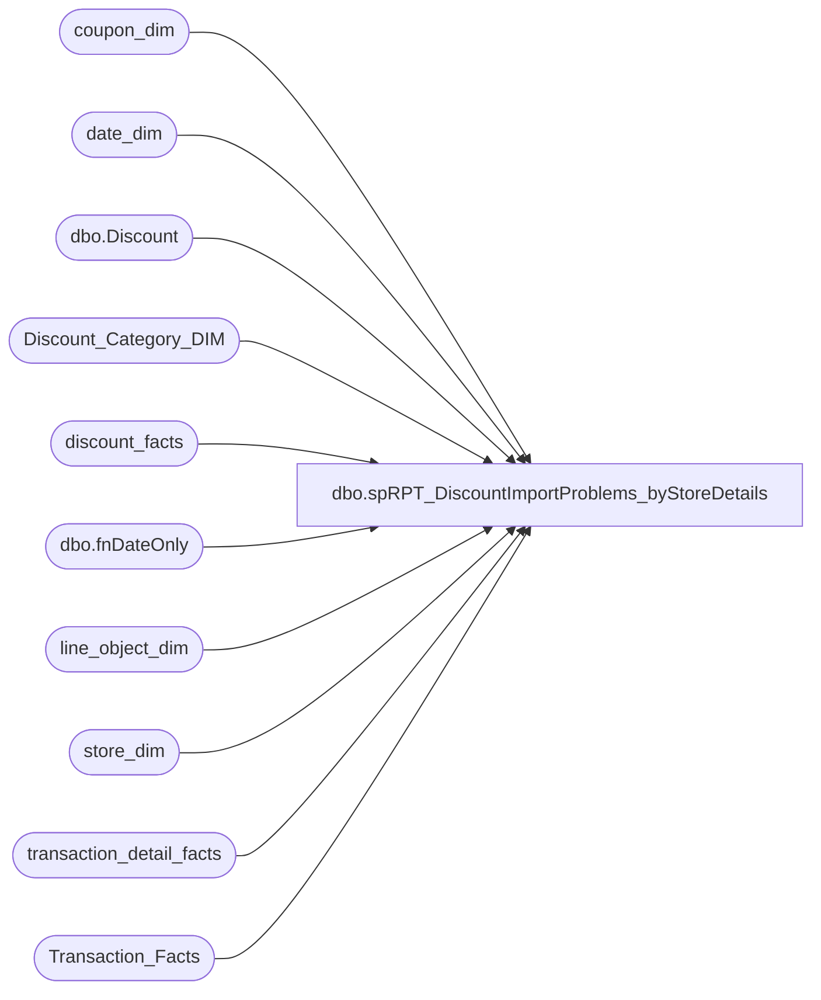

# dbo.spRPT_DiscountImportProblems_byStoreDetails

**Database:** dw  
**Server:** papamart  

## Architecture Diagram



## Table Dependencies

| Referenced Table |
|---|
| coupon_dim |
| date_dim |
| dbo.Discount |
| Discount_Category_DIM |
| discount_facts |
| dbo.fnDateOnly |
| line_object_dim |
| store_dim |
| transaction_detail_facts |
| Transaction_Facts |

## Stored Procedure Code

```sql
CREATE PROCEDURE [dbo].[spRPT_DiscountImportProblems_byStoreDetails]
	@startDate datetime,
	@endDate datetime
AS
-- =====================================================================================================
-- Name: spRPT_DiscountImportProblems_byStoreDetails
--
-- Description:	Extracts report information for the problems on importing Discount Facts
--					The report is in Discount Manager\Discount Import Problems By Store Details
--
-- Input: 
--			@startDate = Starting Date of the Analysis
--			@endDate = Ending Date of the Analysis
--
-- Output: Resultset 
--			
--
-- Dependencies: None
--
-- Revision History
--		Name:			Date:			Comments:
--		Gary Murrish	10/30/2013		Changed to show all invalid and Expired Coupons regardless of why.
--		Gary Murrish	10/14/2013		Changed the Invalid Category Type to be Marketing/Expired because the users changed it
--		Gary Murrish	8/21/2013		Initial Release
--		Mike Pelikan	2/21/2015		changed linked server to KODIAK
-- =====================================================================================================

BEGIN
	SET NOCOUNT ON;

	DECLARE	@startDate_Key int,
			@endDate_Key int
	SELECT
		@startDate_Key = date_key
	FROM
		date_dim dd WITH (NOLOCK)
	WHERE
		dd.actual_date = dbo.fnDateOnly(@startDate)

	SELECT
		@endDate_Key = date_key
	FROM
		date_dim dd WITH (NOLOCK)
	WHERE
		dd.actual_date = dbo.fnDateOnly(@endDate)

	-- Get the Invalid Category Type
	DECLARE @InvalidCategoryTypeID int

	SELECT
		@InvalidCategoryTypeID = dcd.categoryTypeID
	FROM
		Discount_Category_DIM dcd WITH (NOLOCK)
	WHERE
		dcd.financialGroup = 'Marketing'
		AND dcd.categoryType = 'Invalid'

	-- Get the Expired Category Type
	DECLARE @ExpiredCategoryTypeID int

	SELECT
		@ExpiredCategoryTypeID = dcd.categoryTypeID
	FROM
		Discount_Category_DIM dcd WITH (NOLOCK)
	WHERE
		dcd.financialGroup = 'Marketing'
		AND dcd.categoryType = 'Expired'

	-- Get the NA Category Type
	DECLARE @NATypeID int

	SELECT
		@NATypeID = dcd.categoryTypeID
	FROM
		Discount_Category_DIM dcd WITH (NOLOCK)
	WHERE
		dcd.channelType = 'NA'


	-- Get all of the coupons from Discount Manager...
	IF OBJECT_ID('tempdb..#tmpCoupons') IS NOT NULL
	BEGIN
		DROP TABLE #tmpCoupons
	END
	SELECT
		CAST(d.couponNumber AS varchar(20)) AS couponNumber,
		d.startDate,
		d.title
	INTO #tmpCoupons
	FROM
		KODIAK.DiscountMstrData.dbo.Discount d

	-- Get the discounts which don't match a coupon

	IF OBJECT_ID('tempdb..#tmpInvalids') IS NOT NULL
	BEGIN
		DROP TABLE #tmpInvalids
	END

	SELECT
		x.reference_no,
		x.Line_Object,
		x.Line_Object_Description,
		x.channelType,
		x.categoryType,
		x.coupon_key,
		x.store_key,
		x.isExpired,
		MIN(x.date_key) AS minDateKey,
		MAX(x.date_key) AS maxDateKey,
		MIN(x.START_DATE) AS START_DATE,
		MIN(x.stop_Date) AS stop_Date,
		MIN(x.coupon_desc) AS coupon_desc,
		COUNT(*) AS numDiscounts,
		SUM(x.unit_gross_amount) AS amtDiscounts,
		x.transaction_no,
		x.register_no,
		x.transaction_id
	INTO #tmpInvalids
	FROM
		(SELECT
				CAST(LEFT(df.reference_no, 7) + CASE
					WHEN LEN(df.reference_no) > 7 THEN '...'
					ELSE ''
				END AS varchar(20)) AS reference_no,
				lod.Line_Object,
				lod.Line_Object_Description,
				dcd.channelType,
				dcd.categoryType,
				df.unit_gross_amount * -1 AS unit_gross_amount,
				df.coupon_key,
				cd.coupon_desc,
				df.store_key,
				df.isExpired,
				df.date_key,
				cd.START_DATE,
				cd.stop_Date,
				tf.register_no,
				tf.transaction_no,
				tf.transaction_id
			FROM
				discount_facts df WITH (NOLOCK)
				INNER JOIN line_object_dim lod WITH (NOLOCK)
					ON df.line_object_key = lod.line_object_key
				INNER JOIN Discount_Category_DIM dcd WITH (NOLOCK)
					ON CASE
						WHEN df.isExpired = 1 THEN @ExpiredCategoryTypeID
						ELSE df.categoryTypeID
					END = dcd.categoryTypeID
				LEFT JOIN coupon_dim cd WITH (NOLOCK)
					ON df.coupon_key = cd.coupon_key
				INNER JOIN Transaction_Facts tf WITH (NOLOCK)
					ON df.transaction_id = tf.transaction_id
			WHERE
				df.date_key BETWEEN @startDate_Key AND @endDate_Key
				AND df.categoryTypeID <> @NATypeID -- These are the ones like FTD which are not considered Discounts for DM
				AND df.categoryTypeID > 0 -- These are the ones before Discount Manager processing
				AND (
				df.categoryTypeID = @InvalidCategoryTypeID
				OR df.isExpired = 1)) x
	GROUP BY	x.reference_no,
				x.Line_Object,
				x.Line_Object_Description,
				x.channelType,
				x.categoryType,
				x.coupon_key,
				x.isExpired,
				x.store_key,
				x.transaction_no,
				x.register_no,
				x.transaction_id

	-- Get the cashiers
	IF OBJECT_ID('tempdb..#tmpCashier') IS NOT NULL
	BEGIN
		DROP TABLE #tmpCashier
	END

	SELECT
		i.transaction_id,
		MIN(tdf.cashier_id) AS Cashier
	INTO #tmpCashier
	FROM
		#tmpInvalids i WITH (NOLOCK)
		INNER JOIN transaction_detail_facts tdf WITH (NOLOCK)
			ON i.transaction_id = tdf.transaction_id
	WHERE
		tdf.cashier_id > 0

	GROUP BY i.transaction_id

	SELECT
		*
	FROM
		(SELECT
				sd.store_id,
				sd.store_name,
				sd.country,
				sd.bearritory,
				sd.region,
				i.reference_no,
				i.Line_Object,
				i.Line_Object_Description,
				i.channelType,
				i.categoryType,
				i.numDiscounts,
				i.amtDiscounts,
				ddMin.actual_date AS minActualDate,
				ddMax.actual_date AS maxActualDate,
				i.start_date,
				i.stop_date,
				CASE
					WHEN i.isExpired = 1 AND i.coupon_key > 0 THEN 'Expired'
					WHEN c.couponNumber IS NOT NULL AND i.coupon_key > 0 THEN 'In DM, Not Approved, was in BAC'
					WHEN c.couponNumber IS NOT NULL THEN 'In DM, Not Approved, not in BAC'
					WHEN i.coupon_key > 0 THEN 'Not setup in DM, was in BAC'
					ELSE 'Truely Invalid'
				END AS reason,
				COALESCE(c.title, i.Coupon_Desc) AS Coupon_Desc,
				i.transaction_no,
				i.register_no,
				c1.Cashier
			FROM
				#tmpInvalids i
				LEFT JOIN #tmpCoupons c WITH (NOLOCK)
					ON 1 = 1
					AND CAST(c.couponNumber AS integer) = CAST(LEFT(i.reference_no, 7) AS integer)
				INNER JOIN store_dim sd WITH (NOLOCK)
					ON i.store_key = sd.store_key
				LEFT JOIN date_dim ddMin WITH (NOLOCK)
					ON ddMin.date_key = i.minDateKey
				LEFT JOIN date_dim ddMax WITH (NOLOCK)
					ON ddMax.date_key = i.maxDateKey
				LEFT JOIN #tmpCashier c1 WITH (NOLOCK)
					ON i.transaction_id = c1.transaction_id) x

END
```

